# 00 ES6 教程

ES6， 全称 ECMAScript 6.0 ，是 JavaScript 的下一个版本标准，2015.06 发版。

ES6 主要是为了解决 ES5 的先天不足，比如 JavaScript 里并没有类的概念，但是目前浏览器的 JavaScript 是 ES5 版本，大多数高版本的浏览器也支持 ES6，不过只实现了 ES6 的部分特性和功能。

[1.1 ES6 教程  菜鸟教程](https://www.runoob.com/w3cnote/es6-tutorial.html)


​	

---

​	

​	

# 01 js面向对象学习目标

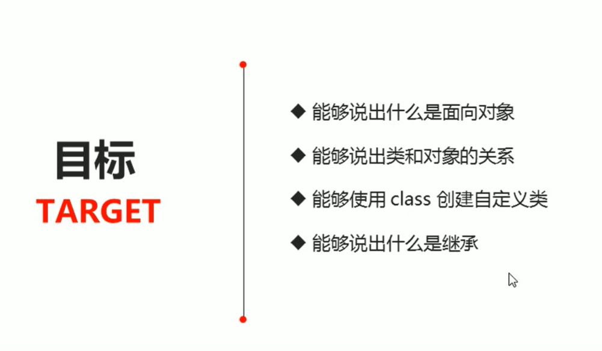

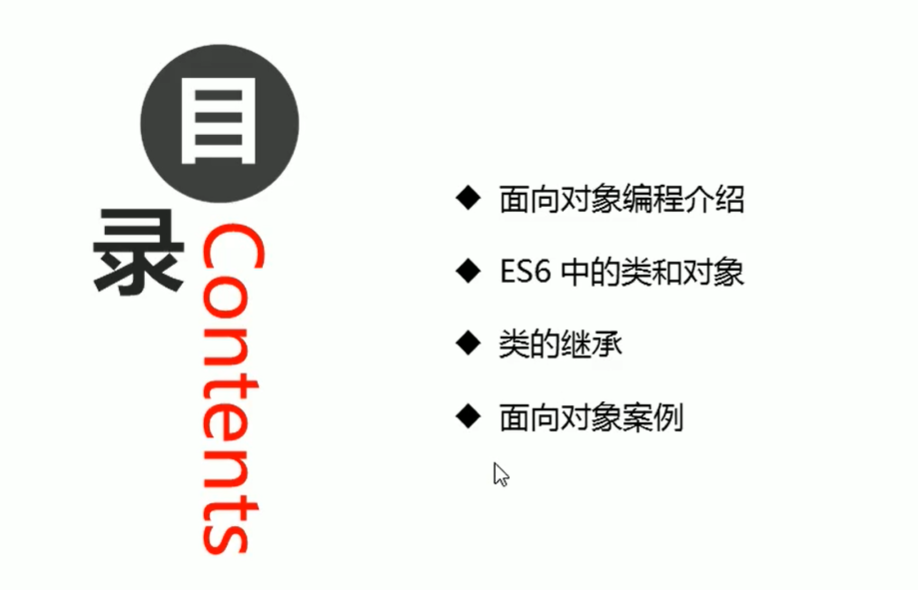

​	

​	

# 02 js面向对象编程介绍

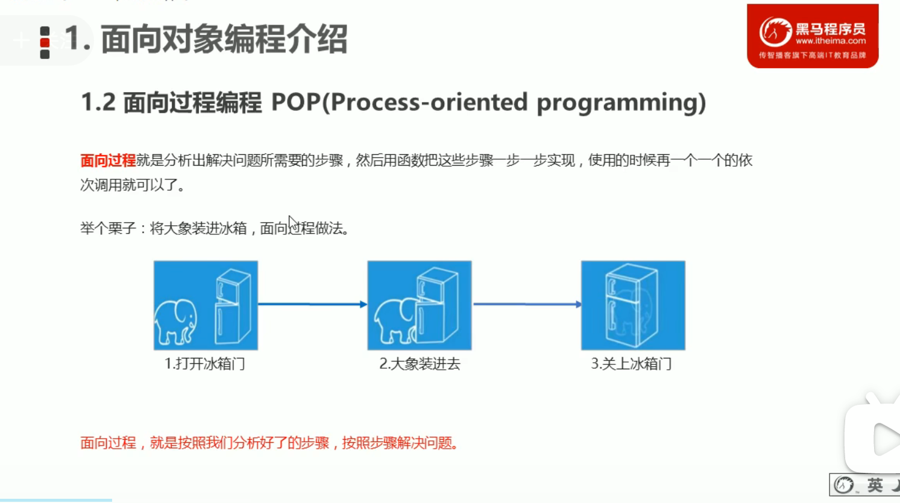

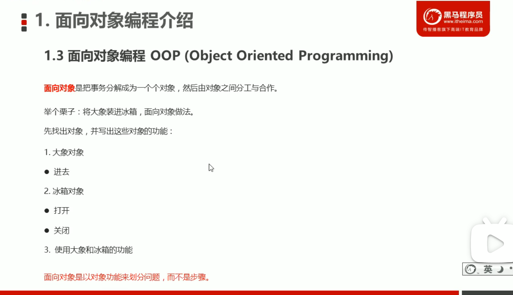

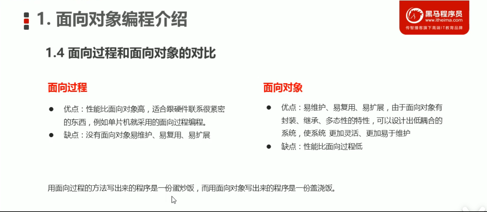

​	

​	

# 03 ES6中的类和对象

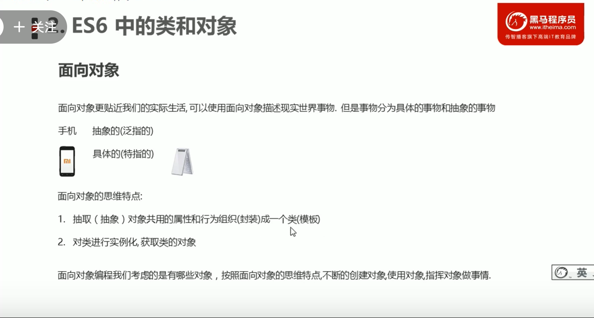

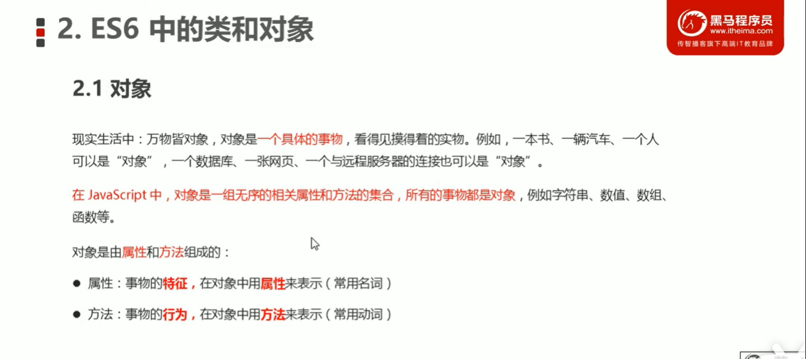

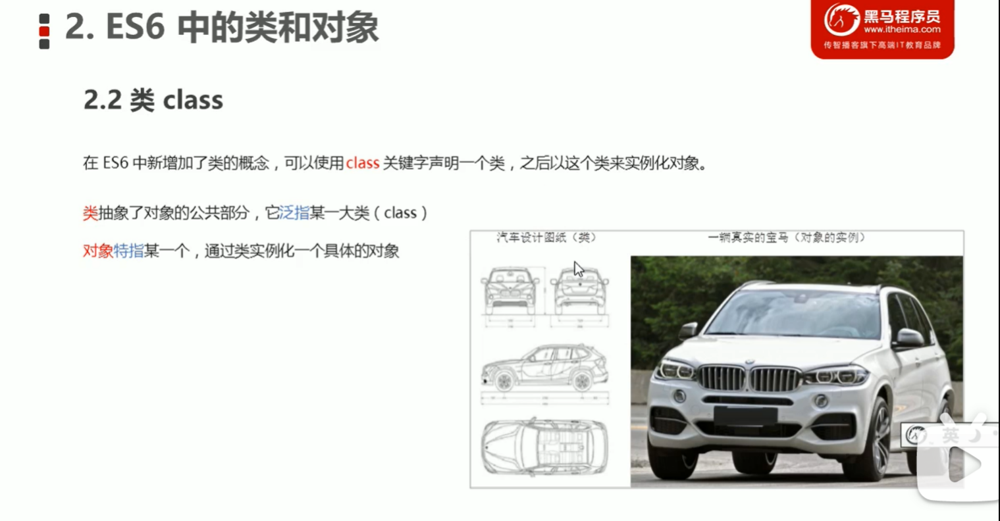

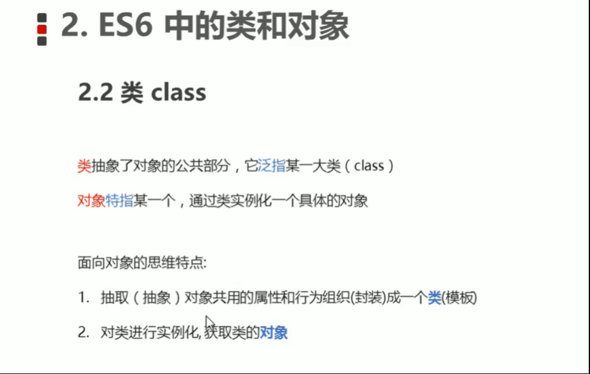

​	

​	

# 04 创建类

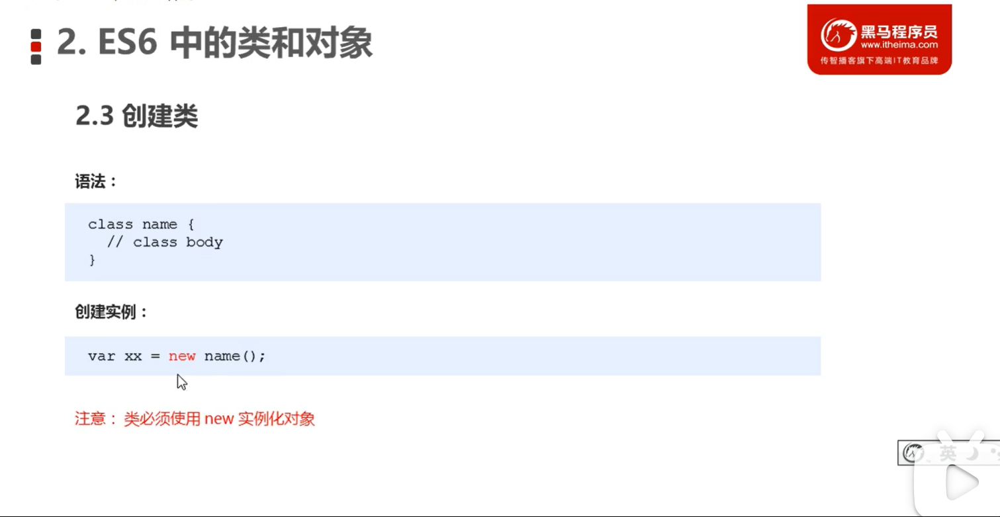

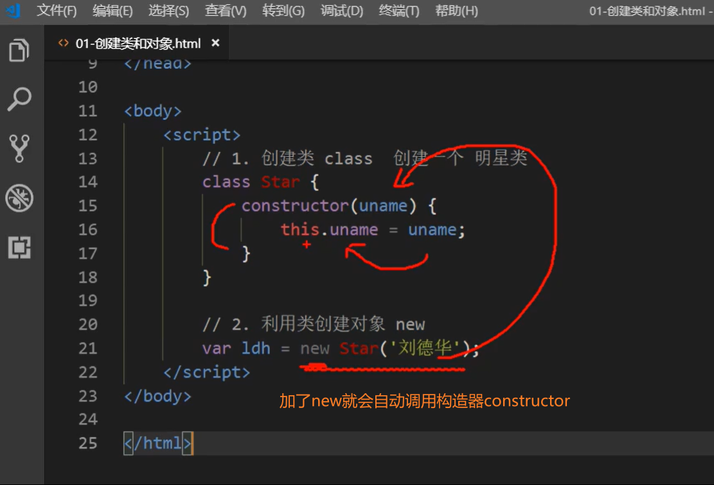

​	

**01_创建类和对象.html**

```html
<!DOCTYPE html>
<html lang="en">
  <head>
    <meta charset="UTF-8" />
    <title>Document</title>
    <script>
      //1.创建类 class 创建一个明星类
      class Star {
        constructor(uname, age) {
          this.uname = uname;
          this.age = age;
        }
      }

      //2.利用类创建对象 new
      var ldh = new Star("刘德华", 18);
      var zxy = new Star("张学友", 20);
      console.log(ldh.uname);
      console.log(zxy.uname);
      console.log(ldh);
      console.log(zxy);

      /* 
        1 通过class 关键字创建类 类名我们还是习惯性定义首字母大写
        2 类里面有个constructor 函数 可以接收传递过来的参数 同时返回实例对象
        3 constructor 函数 只要 new 生成实例时 就会自动调用这个函数 如果我们不写这个函数
            类也会自动生成这个构造函数
        4 生成实例 new 不能省略
        5 最后注意语法规范 创建类 类名后面不要加小括号() 
            生成实例 类名后面加小括号() 
            构造函数不需要加function
      */
    </script>
  </head>
  <body></body>
</html>

```

​	

​	

# 05 类中添加方法

在我们的类中 所有的函数之间不能加逗号连接 这样也省事~

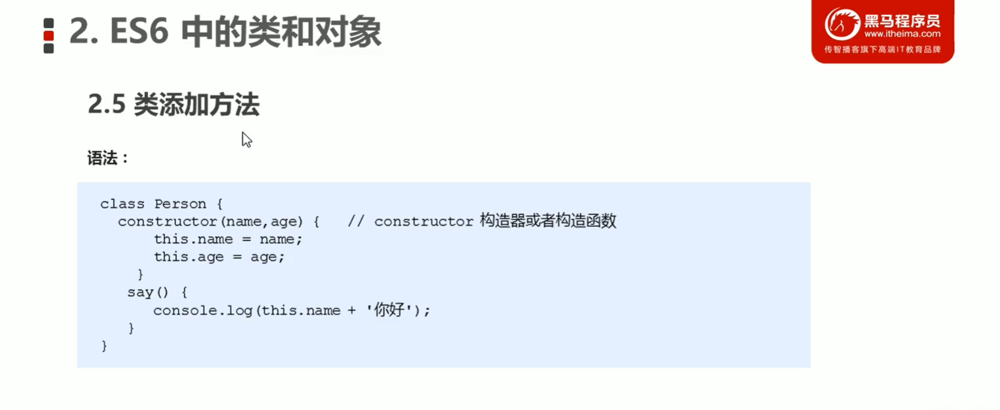

​	

**01_创建类和对象.html**

```html
<!DOCTYPE html>
<html lang="en">
  <head>
    <meta charset="UTF-8" />
    <title>Document</title>
    <script>
      //1.创建类 class 创建一个明星类
      class Star {
        constructor(uname, age) {
          this.uname = uname;
          this.age = age;
        }

        //在类中创建方法 不需要加 function
        sing(song) {
          // console.log('sing a song');
          console.log(this.uname + " 教你唱 " + song);
        }
      }

      //2.利用类创建对象 new
      var ldh = new Star("刘德华", 18);
      var zxy = new Star("张学友", 20);
      //   console.log(ldh.uname);
      //   console.log(zxy.uname);
      //   console.log(ldh);
      //   console.log(zxy);

      // 1 我们类里面所有的函数不需要写function
      // 2 多个函数方法之间不需要添加逗号分隔
      ldh.sing("不得不爱");
      zxy.sing("这就是爱");

      /* 
        1 通过class 关键字创建类 类名我们还是习惯性定义首字母大写
        2 类里面有个constructor 函数 可以接收传递过来的参数 同时返回实例对象
        3 constructor 函数 只要 new 生成实例时 就会自动调用这个函数 如果我们不写这个函数
            类也会自动生成这个构造函数
        4 生成实例 new 不能省略
        5 最后注意语法规范 创建类 类名后面不要加小括号() 
            生成实例 类名后面加小括号() 
            构造函数不需要加function
      */
    </script>
  </head>
  <body></body>
</html>

```

​	

​	

# 06 类的继承

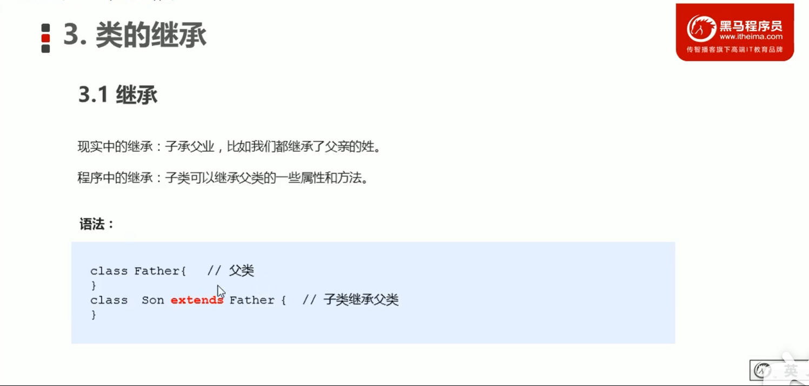

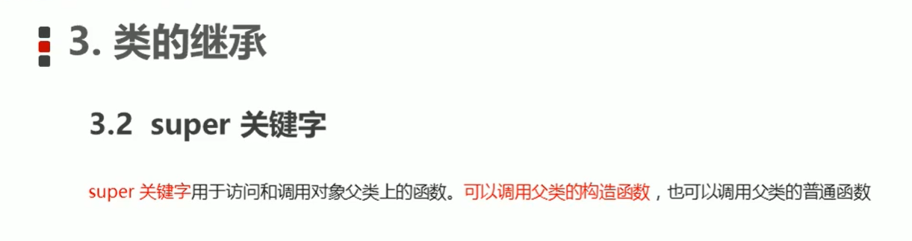

​	

**03_类的继承.html**

```html
<!DOCTYPE html>
<html lang="en">
  <head>
    <meta charset="UTF-8" />
    <title>Document</title>
    <script>
      // 1 类的继承
      // class Father {
      //   constructor() {}
      //   money() {
      //     console.log(100);
      //   }
      // }
      // class Son extends Father {}
      // var son = new Son();
      // son.money();

      class Father {
        constructor(x, y) {
          this.x = x;
          this.y = y;
        }
        sum() {
          console.log(this.x + this.y);
        }
      }
      class Son extends Father {
        constructor(x, y) {
          // this.x = x;
          // this.y = y;

          super(x, y); //调用了父类中的构造函数
        }
      }
      var son = new Son(11, 2);
      son.sum();
      /*       
      如果Son类里有自己的构造函数
      那么new对象传入参数就不会去到父类Father那里了 son执行sum()也就得不到想要的结果
      因为sum相加的是传入Father父类的参数 通过son调取的是子类的参数

      【解决】调用super()方法 本可以使传入子类构造函数的参数传入到父类的构造函数
      */
    </script>
  </head>
  <body></body>
</html>

```

​	

​	

# 07 super关键字

​	

**04_super关键字调用父类普通函数.html**

```html
<!DOCTYPE html>
<html lang="en">
  <head>
    <meta charset="UTF-8" />
    <title>Document</title>
    <script>
      //04_super关键字调用父类普通函数
      class Father {
        say() {
          return "我是爸爸";
        }
      }
      class Son extends Father {
        say() {
          //   console.log("我是儿子");
          console.log(super.say() + "的儿子");
          //super.say() 就是调用父类中的普通函数 say()
        }
      }
      var son = new Son();
      son.say();
      /* 
        就近原则
            1 继承中 如果实例化子类输出一个方法 先看子类有没有这个方法 如果有就先执行子类的
            2 继承中 如果子类里面没有 就去查找父类有没有这个方法 如果有 就执行父类的这个方法
      */
    </script>
  </head>
  <body></body>
</html>

```

​	

​	

# 08 子类继承父类方法

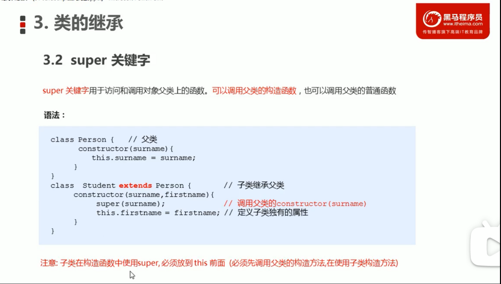

​	

**05_子类继承父类方法同时扩展自己方法.html**

```html
<!DOCTYPE html>
<html lang="en">
  <head>
    <meta charset="UTF-8" />
    <title>Document</title>
    <script>
      //父类有加法方法
      class Father {
        constructor(x, y) {
          this.x = x;
          this.y = y;
        }
        sum() {
          console.log(this.x + this.y);
        }
      }
      //子类继承父类加法方法 同时 扩展减法方法
      class Son extends Father {
        constructor(x, y) {
          //利用super 调用父类的构造函数
          //super 必须在子类this之前调用
          super(x, y);
          this.x = x;
          this.y = y;
        }
        subtract() {
          console.log(this.x - this.y);
        }
      }
      var son = new Son(5, 3);
      son.subtract();
      son.sum();
    </script>
  </head>
  <body></body>
</html>

```

​	

​	

# 09 ES6中的类和对象三个注意点 ①

# 10 ES6中的类和对象三个注意点 ②

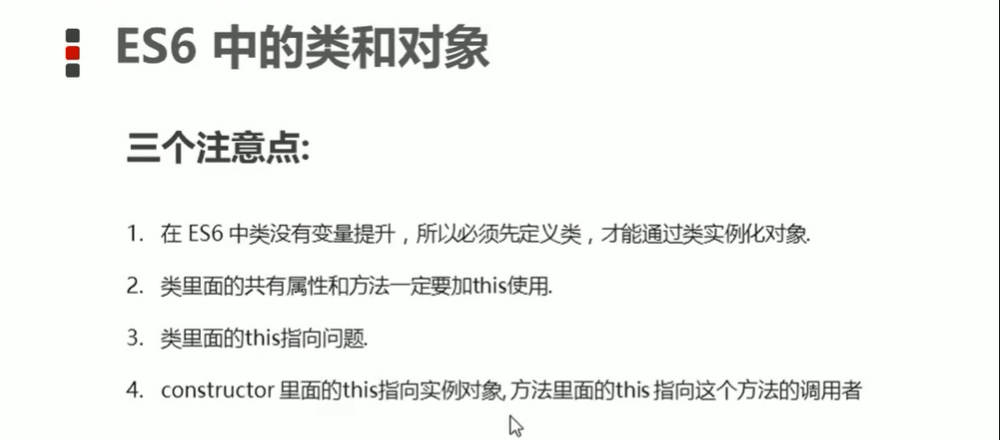

​	

**06_使用类的注意事项.html**

```html
<!DOCTYPE html>
<html lang="en">
  <head>
    <meta charset="UTF-8" />
    <title>Document</title>
  </head>
  <body>
    <button>点击</button>
    <script>
      var that, _that;
      class Star {
        constructor(uname, age) {
          that = this;
          console.log(this);
          this.uname = uname;
          this.age = age;
          //   this.sing();
          /* 
              同样构造函数里面也没有sing()参数
              所以要用this.sing() 标注是下面定义的sing()
            */

          this.btn = document.querySelector("button");
          this.btn.onclick = this.sing;
          /* 
            这里不是this.sing() 
              是因为我们想要点击后再执行 加了()会立刻执行
          */
        }
        sing() {
          //   console.log(uname);    //sing()里面没有uname 要写成this.name 才是正确的
          //   console.log(this.uname); //而button是没有uname这个属性的 所以结果是undefined

          //这个sing方法里面的this 指向的是btn 这个按钮 因为这个按钮调用了这个函数
          console.log("sing()结果来啦：" + this); //输出的是btn
          console.log(that.uname); //that里面存储的是constructor里面的this  sing()存储的是btn的this
          /* 
            先将ldh的this变量赋值给一个全局变量
            当我们调用button按钮时 即使this对象已经改变
            我们也还是可以输出ldh的this对象值
          */
        }
        dance() {
          //这个dance里面的this 指向的是实例对象 ldh 因为ldh 调用了这个函数
          _that = this;
          console.log(this);
        }
      }

      var ldh = new Star("刘德华");
      console.log(that === ldh);
      ldh.dance();
      console.log(_that === ldh);
      //   ldh.sing();

      /* 
              1 在ES6中 类没有变量提升（即按上往下一次执行代码）所以必须先定义类 才能通过类实例化对象
  
              2 类里面的共有的属性和方法一定要加this使用
          */
    </script>
  </body>
</html>

```

​	

​	

# 11 案例 tab栏切换01

对页面布局的介绍

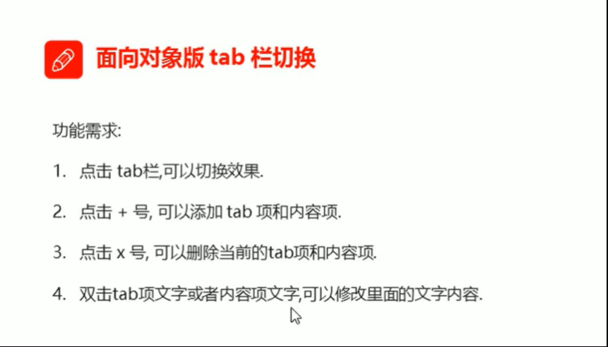

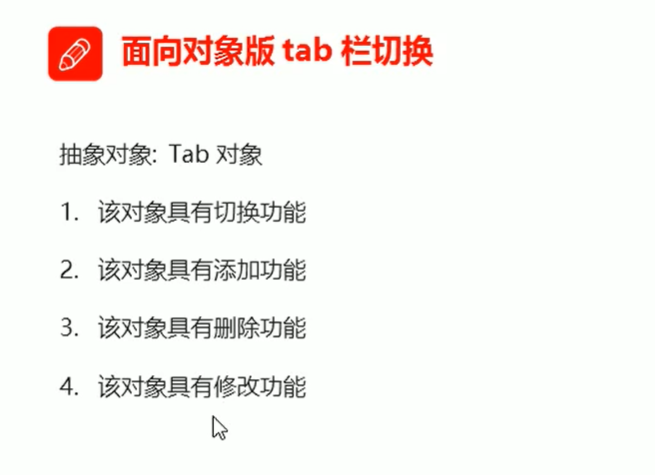

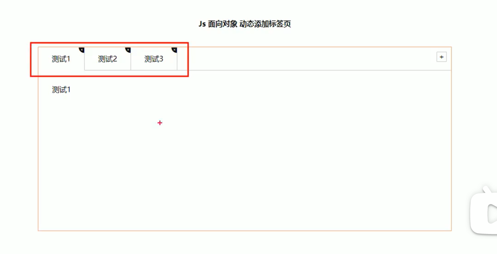

​	

# 12 案例 tab栏切换02

做前期的准备工作 创建类的属性方法 初始化

​	

# 13 案例 tab栏切换03

- liactive是将tab标签变成选中的样式 

- conactive是显示选中标签的内容
- toggleTab的this没有sections属性

设置tab标签页选中的样式 和 绑定点击标签页显示相应的内容

​	

# 14 案例 tab栏切换04

​	

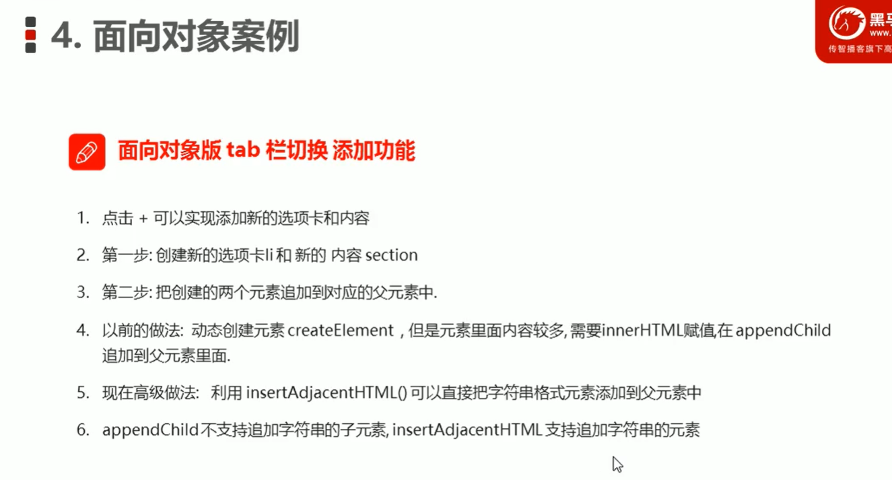

学习了addTab() 添加功能

​	

# 15 案例 tab栏切换05

完善添加功能 让添加的标签页对应其新增的内容 进一步完成添加的功能

​	

# 16 案例 tab栏切换06

解决后添加的标签页没有绑定点击事件

​	

# 17 案例 tab栏切换07

​	

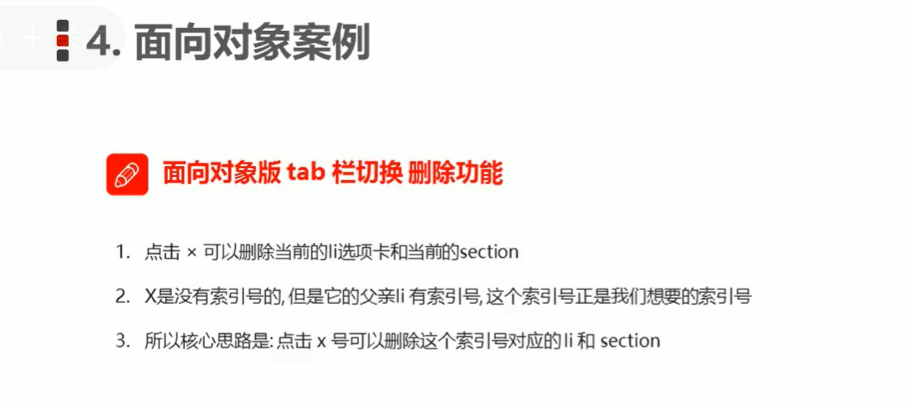

学习删除事件  修复了删除事件的两个bug

​	

# 18 案例 tab栏切换08

优化删除事件 删除标签页后 可以让显示删除标签页的上一个标签，让用户体验更好一点

​	

# 19 案例 tab栏切换09

【优化】 当我们删除的不是选中状态的li 的时候 原来的选中状态li保持不变

​	

# 20 案例 tab栏切换10

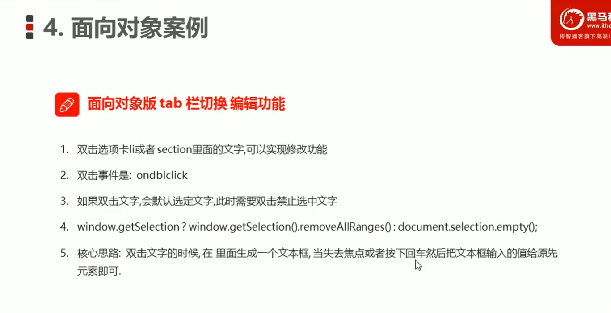

代码正确 但无法运行效果 估计是样式出了问题 但没有源码 实现不出

先放着 没所谓

​	

# 21 案例 tab栏切换11

【优化】双击文本时可以让他选中里面的文字内容

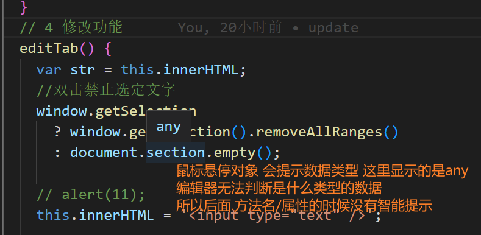

​	

# 22 案例 tab栏切换12

【优化】绑定enter键，当编辑标签完内容时可按enter键失去焦点，完成输入编辑内容

​	

### tab栏制作—代码部分

##### 07_tab.htm

```html
<!DOCTYPE html>
<html lang="en">
  <head>
    <meta charset="UTF-8" />
    <title>面向对象 Tab</title>

    <style>
      /* * {
        border: 1px solid yellowgreen;
      } */
      /* .icon-guanbi {
        border: 1px solid rgb(255, 0, 0);
        width: 8px;
        height: 10px;
        background-color: red;
        display: block;
        margin-right: 0px;
      } */
      body {
        width: 1180px;
      }
      .tabsbox {
        border: 1px solid red;
        height: 400px;
      }
      h4 {
        text-align: center;
      }
      .firstnav li {
        margin: 0px;
        padding: 0px;
        text-decoration: none;
        display: block;
        float: left;
        margin-right: 20px;
        border: 1px solid red;
        line-height: 40px;
        /* width: 60px;
        height: 40px; */
        text-align: center;
      }
      .tabadd {
        float: right;
        width: 25px;
        height: 23px;
        border: 5px solid peachpuff;
        margin-right: 20px;
      }
      .tabadd:hover {
        background-color: rgb(157, 215, 242);
      }
      .tabadd span {
        display: block;
        float: right;
        margin-right: 6px;
        /* border: 5px solid peachpuff; */
        line-height: 23px;
      }
      .tabscon {
        margin-top: 80px;
        /* height: 65px; */
        border: 7px pink solid;
        overflow: hidden;
      }
      .conactive {
        /* margin-left: 0;
        margin-top: 0; */
        /* position: absolute; */

        border: 10px rgb(25, 148, 25) solid;
        overflow: hidden;
      }
      section {
        border: 10px rgb(189, 115, 238) solid;
        display: inline-block;
        margin: 30px;
      }

      .liactive {
        background-color: skyblue;
      }
      /* .liactive span {
        display: block;
        width: 50px;
        border: 1px solid rgb(255, 0, 0);
        margin-left: 0px;
      } */
    </style>
  </head>
  <body>
    <main>
      <h4>JS 面向对象 动态添加标签页</h4>
      <div class="tabsbox" id="tab">
        <!-- tab 标签 -->
        <nav class="firstnav">
          <ul>
            <li class="liactive">
              <span>测试1</span>
              <span class="icon-guanbi">X</span>
            </li>
            <li>
              <span>测试2</span>
              <span class="icon-guanbi">X</span>
            </li>
            <li>
              <span>测试3</span>
              <span class="icon-guanbi">X</span>
            </li>
          </ul>
          <div class="tabadd">
            <span>+</span>
          </div>
        </nav>

        <!-- tab 内容 -->
        <div class="tabscon">
          <section class="conactive">测试1</section>
          <section>测试2</section>
          <section>测试3</section>
        </div>
      </div>
    </main>
    <script src="js/tab.js"></script>
  </body>
</html>

```

​	

##### tab.js

```js
var that;

class Tab {
  constructor(id) {
    that = this;
    //获取元素
    this.main = document.querySelector(id);
    this.add = this.main.querySelector(".tabadd");
    // li的父元素
    this.ul = this.main.querySelector(".firstnav ul:first-child");
    //section 父元素
    this.fsection = this.main.querySelector(".tabscon");

    this.init();
    /* 
        放构造函数里就不用自己手动调用了new一个对象的时候就会调用
    */
  }

  init() {
    this.updateNode();
    //init 初始化操作让相关的元素绑定事件
    this.add.onclick = this.addTab;
    for (var i = 0; i < this.lis.length; i++) {
      this.lis[i].index = i;
      //   this.lis[i].onclick = function () {
      //     console.log(this.index);
      //   };
      this.lis[i].onclick = this.toggleTab;
      this.remove[i].onclick = this.removeTab;
      this.spans[i].ondblclick = this.editTab;
      this.sections[i].ondblclick = this.editTab;
    }
  }
  //获取所有的小li 和 section
  //因为我们动态添加元素 需要重新获取对应的元素
  updateNode() {
    this.lis = this.main.querySelectorAll("li");
    this.sections = this.main.querySelectorAll("section");
    this.remove = this.main.querySelectorAll(".icon-guanbi");
    this.spans = this.main.querySelectorAll(".firstnav li span:first-child");
  }
  // 1 切换功能
  toggleTab() {
    // console.log(this,index);
    that.clearClass();
    this.className = "liactive";
    // this.sections[this.index].className="conactive";  //toggleTab中的this没有sections属性
    that.sections[this.index].className = "conactive";
    //liactive是将tab标签变成选中的样式
    // conactive是显示选中标签的内容
  }
  //清除所有li 和section 的类
  clearClass() {
    //让没被选中标签不要显示其内容
    for (var i = 0; i < this.lis.length; i++) {
      this.lis[i].className = "";
      this.sections[i].className = "";
    }
  }
  // 2 添加功能
  addTab() {
    // alert(11);
    that.clearClass();
    // 1 创建li元素和section元素
    var random = Math.random();
    var li =
      '<li class="liactive"><span>选项卡</span><span class="icon-guanbi">X</span></li>';
    var section = '<section class="conactive">测试' + random + "</section>";
    // 2 把这两个元素追加到对应的父元素里面
    that.ul.insertAdjacentHTML("beforeend", li); //注意这里是that
    that.fsection.insertAdjacentHTML("beforeend", section);
    that.init();
  }
  // 3 删除功能
  removeTab(e) {
    e.stopPropagation(); //阻止冒泡 防止触发li 的切换点击事件
    var index = this.parentNode.index; //让它直接对应父亲li的索引就好了
    // console.log(index);
    //根据索引号删除对应的li 和section  remove()方法可以直接删除指定的元素
    that.lis[index].remove();
    that.sections[index].remove();
    that.init();
    // 【优化】 当我们删除的不是选中状态的li 的时候 原来的选中状态li保持不变
    if (document.querySelector(".liactive")) return;

    //当我们删除了选中状态的这个li的时候 让它的前一个li处于选定状态
    index--;
    //手动调用我们的点击事件 不需要鼠标触发
    that.lis[index] && that.lis[index].click();
    //这一步是因为当页面只剩最后一个的时候
    // 直接执行 that.lis[index].click(); 会报错 因为没有哪个点击事件的索引值为-1
    //所以要做一个判断 判断索引值是否存在 存在则执行that.lis[index].click();让它的前一个li处于选定状态
  }
  // 4 修改功能
  editTab() {
    var str = this.innerHTML;
    //双击禁止选定文字
    window.getSelection
      ? window.getSelection().removeAllRanges()
      : document.section.empty();
    /* 
        鼠标悬停对象 会提示数据类型 这里显示的是any 
        编辑器无法判断是什么类型的数据 
        所以后面.方法名/属性的时候没有智能提示
      */

    // alert(11);
    this.innerHTML = '<input type="text" />';

    var input = this.children[0];
    //这里指的第一个汉字应该是第一个span 每个li标签的第一个span标签

    input.value = str;
    input.select(); //文本框里面的文字处于选定状态
    //当我们离开文本框就把文本框里面的值给span
    input.onblur = function () {
      this.parentNode.innerHTML = this.value;
    };
    //按下回车也可以把文本框里面的值给span
    input.onkeyup = function (e) {
      if (e.keyCode === 13) {
        //手动调用表单失去焦点事件 不需要鼠标离开操作
        this.blur();
      }
    };
  }
}

// var tab=new Tab("#tab");
// tab.init();
new Tab("#tab");

```

​	

​	

# 01 构造函数和原型学习目标


