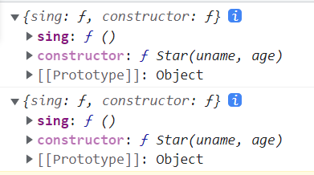
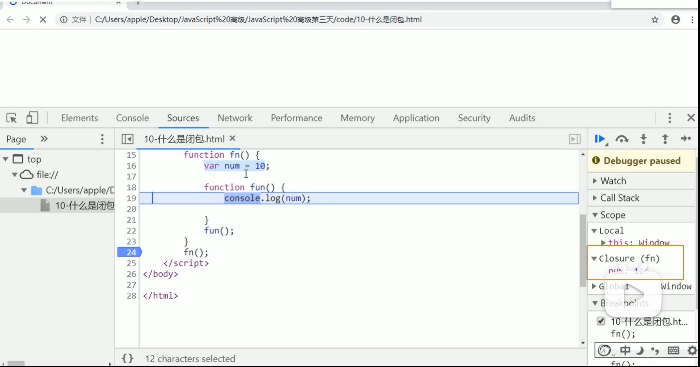
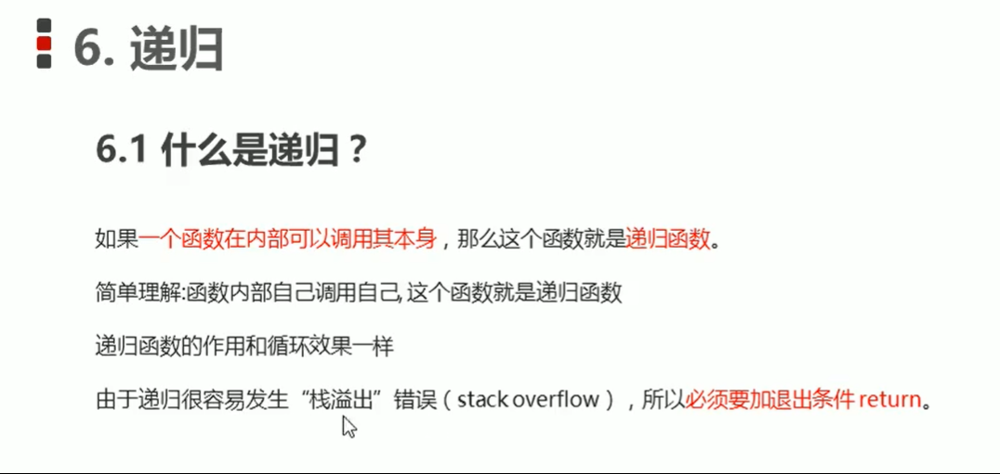
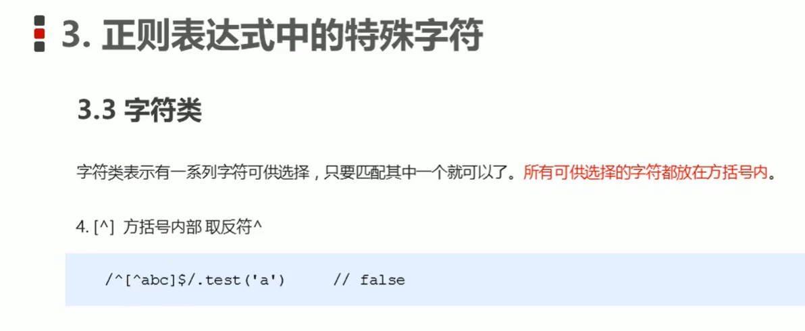

# 00 ES6 教程

ES6， 全称 ECMAScript 6.0 ，是 JavaScript 的下一个版本标准，2015.06 发版。

ES6 主要是为了解决 ES5 的先天不足，比如 JavaScript 里并没有类的概念，但是目前浏览器的 JavaScript 是 ES5 版本，大多数高版本的浏览器也支持 ES6，不过只实现了 ES6 的部分特性和功能。

[1.1 ES6 教程  菜鸟教程](https://www.runoob.com/w3cnote/es6-tutorial.html)


​	

---

​	

​	

# 01 js面向对象学习目标


​	

​	

# 02 js面向对象编程介绍


​	

​	

# 03 ES6中的类和对象


​	

​	

# 04 创建类


​	

**01_创建类和对象.html**

```html
<!DOCTYPE html>
<html lang="en">
  <head>
    <meta charset="UTF-8" />
    <title>Document</title>
    <script>
      //1.创建类 class 创建一个明星类
      class Star {
        constructor(uname, age) {
          this.uname = uname;
          this.age = age;
        }
      }

      //2.利用类创建对象 new
      var ldh = new Star("刘德华", 18);
      var zxy = new Star("张学友", 20);
      console.log(ldh.uname);
      console.log(zxy.uname);
      console.log(ldh);
      console.log(zxy);

      /* 
        1 通过class 关键字创建类 类名我们还是习惯性定义首字母大写
        2 类里面有个constructor 函数 可以接收传递过来的参数 同时返回实例对象
        3 constructor 函数 只要 new 生成实例时 就会自动调用这个函数 如果我们不写这个函数
            类也会自动生成这个构造函数
        4 生成实例 new 不能省略
        5 最后注意语法规范 创建类 类名后面不要加小括号() 
            生成实例 类名后面加小括号() 
            构造函数不需要加function
      */
    </script>
  </head>
  <body></body>
</html>

```

​	

​	

# 05 类中添加方法

在我们的类中 所有的函数之间不能加逗号连接 这样也省事~


​	

**01_创建类和对象.html**

```html
<!DOCTYPE html>
<html lang="en">
  <head>
    <meta charset="UTF-8" />
    <title>Document</title>
    <script>
      //1.创建类 class 创建一个明星类
      class Star {
        constructor(uname, age) {
          this.uname = uname;
          this.age = age;
        }

        //在类中创建方法 不需要加 function
        sing(song) {
          // console.log('sing a song');
          console.log(this.uname + " 教你唱 " + song);
        }
      }

      //2.利用类创建对象 new
      var ldh = new Star("刘德华", 18);
      var zxy = new Star("张学友", 20);
      //   console.log(ldh.uname);
      //   console.log(zxy.uname);
      //   console.log(ldh);
      //   console.log(zxy);

      // 1 我们类里面所有的函数不需要写function
      // 2 多个函数方法之间不需要添加逗号分隔
      ldh.sing("不得不爱");
      zxy.sing("这就是爱");

      /* 
        1 通过class 关键字创建类 类名我们还是习惯性定义首字母大写
        2 类里面有个constructor 函数 可以接收传递过来的参数 同时返回实例对象
        3 constructor 函数 只要 new 生成实例时 就会自动调用这个函数 如果我们不写这个函数
            类也会自动生成这个构造函数
        4 生成实例 new 不能省略
        5 最后注意语法规范 创建类 类名后面不要加小括号() 
            生成实例 类名后面加小括号() 
            构造函数不需要加function
      */
    </script>
  </head>
  <body></body>
</html>

```

​	

​	

# 06 类的继承


​	

**03_类的继承.html**

```html
<!DOCTYPE html>
<html lang="en">
  <head>
    <meta charset="UTF-8" />
    <title>Document</title>
    <script>
      // 1 类的继承
      // class Father {
      //   constructor() {}
      //   money() {
      //     console.log(100);
      //   }
      // }
      // class Son extends Father {}
      // var son = new Son();
      // son.money();

      class Father {
        constructor(x, y) {
          this.x = x;
          this.y = y;
        }
        sum() {
          console.log(this.x + this.y);
        }
      }
      class Son extends Father {
        constructor(x, y) {
          // this.x = x;
          // this.y = y;

          super(x, y); //调用了父类中的构造函数
        }
      }
      var son = new Son(11, 2);
      son.sum();
      /*       
      如果Son类里有自己的构造函数
      那么new对象传入参数就不会去到父类Father那里了 son执行sum()也就得不到想要的结果
      因为sum相加的是传入Father父类的参数 通过son调取的是子类的参数

      【解决】调用super()方法 本可以使传入子类构造函数的参数传入到父类的构造函数
      */
    </script>
  </head>
  <body></body>
</html>

```

​	

​	

# 07 super关键字

​	

**04_super关键字调用父类普通函数.html**

```html
<!DOCTYPE html>
<html lang="en">
  <head>
    <meta charset="UTF-8" />
    <title>Document</title>
    <script>
      //04_super关键字调用父类普通函数
      class Father {
        say() {
          return "我是爸爸";
        }
      }
      class Son extends Father {
        say() {
          //   console.log("我是儿子");
          console.log(super.say() + "的儿子");
          //super.say() 就是调用父类中的普通函数 say()
        }
      }
      var son = new Son();
      son.say();
      /* 
        就近原则
            1 继承中 如果实例化子类输出一个方法 先看子类有没有这个方法 如果有就先执行子类的
            2 继承中 如果子类里面没有 就去查找父类有没有这个方法 如果有 就执行父类的这个方法
      */
    </script>
  </head>
  <body></body>
</html>

```

​	

​	

# 08 子类继承父类方法


​	

**05_子类继承父类方法同时扩展自己方法.html**

```html
<!DOCTYPE html>
<html lang="en">
  <head>
    <meta charset="UTF-8" />
    <title>Document</title>
    <script>
      //父类有加法方法
      class Father {
        constructor(x, y) {
          this.x = x;
          this.y = y;
        }
        sum() {
          console.log(this.x + this.y);
        }
      }
      //子类继承父类加法方法 同时 扩展减法方法
      class Son extends Father {
        constructor(x, y) {
          //利用super 调用父类的构造函数
          //super 必须在子类this之前调用
          super(x, y);
          this.x = x;
          this.y = y;
        }
        subtract() {
          console.log(this.x - this.y);
        }
      }
      var son = new Son(5, 3);
      son.subtract();
      son.sum();
    </script>
  </head>
  <body></body>
</html>

```

​	

​	

# 09 ES6中的类和对象三个注意点 ①

# 10 ES6中的类和对象三个注意点 ②


​	

**06_使用类的注意事项.html**

```html
<!DOCTYPE html>
<html lang="en">
  <head>
    <meta charset="UTF-8" />
    <title>Document</title>
  </head>
  <body>
    <button>点击</button>
    <script>
      var that, _that;
      class Star {
        constructor(uname, age) {
          that = this;
          console.log(this);
          this.uname = uname;
          this.age = age;
          //   this.sing();
          /* 
              同样构造函数里面也没有sing()参数
              所以要用this.sing() 标注是下面定义的sing()
            */

          this.btn = document.querySelector("button");
          this.btn.onclick = this.sing;
          /* 
            这里不是this.sing() 
              是因为我们想要点击后再执行 加了()会立刻执行
          */
        }
        sing() {
          //   console.log(uname);    //sing()里面没有uname 要写成this.name 才是正确的
          //   console.log(this.uname); //而button是没有uname这个属性的 所以结果是undefined

          //这个sing方法里面的this 指向的是btn 这个按钮 因为这个按钮调用了这个函数
          console.log("sing()结果来啦：" + this); //输出的是btn
          console.log(that.uname); //that里面存储的是constructor里面的this  sing()存储的是btn的this
          /* 
            先将ldh的this变量赋值给一个全局变量
            当我们调用button按钮时 即使this对象已经改变
            我们也还是可以输出ldh的this对象值
          */
        }
        dance() {
          //这个dance里面的this 指向的是实例对象 ldh 因为ldh 调用了这个函数
          _that = this;
          console.log(this);
        }
      }

      var ldh = new Star("刘德华");
      console.log(that === ldh);
      ldh.dance();
      console.log(_that === ldh);
      //   ldh.sing();

      /* 
              1 在ES6中 类没有变量提升（即按上往下一次执行代码）所以必须先定义类 才能通过类实例化对象
  
              2 类里面的共有的属性和方法一定要加this使用
          */
    </script>
  </body>
</html>

```

​	

​	

# 11 案例 tab栏切换01

对页面布局的介绍


​	

# 12 案例 tab栏切换02

做前期的准备工作 创建类的属性方法 初始化

​	

# 13 案例 tab栏切换03

- liactive是将tab标签变成选中的样式 

- conactive是显示选中标签的内容
- toggleTab的this没有sections属性

设置tab标签页选中的样式 和 绑定点击标签页显示相应的内容

​	

# 14 案例 tab栏切换04

​	


学习了addTab() 添加功能

​	

# 15 案例 tab栏切换05

完善添加功能 让添加的标签页对应其新增的内容 进一步完成添加的功能

​	

# 16 案例 tab栏切换06

解决后添加的标签页没有绑定点击事件

​	

# 17 案例 tab栏切换07

​	


学习删除事件  修复了删除事件的两个bug

​	

# 18 案例 tab栏切换08

优化删除事件 删除标签页后 可以让显示删除标签页的上一个标签，让用户体验更好一点

​	

# 19 案例 tab栏切换09

【优化】 当我们删除的不是选中状态的li 的时候 原来的选中状态li保持不变

​	

# 20 案例 tab栏切换10


代码正确 但无法运行效果 估计是样式出了问题 但没有源码 实现不出

先放着 没所谓

​	

# 21 案例 tab栏切换11

【优化】双击文本时可以让他选中里面的文字内容


​	

# 22 案例 tab栏切换12

【优化】绑定enter键，当编辑标签完内容时可按enter键失去焦点，完成输入编辑内容

​	

### tab栏制作—代码部分

##### 07_tab.htm

```html
<!DOCTYPE html>
<html lang="en">
  <head>
    <meta charset="UTF-8" />
    <title>面向对象 Tab</title>

    <style>
      /* * {
        border: 1px solid yellowgreen;
      } */
      /* .icon-guanbi {
        border: 1px solid rgb(255, 0, 0);
        width: 8px;
        height: 10px;
        background-color: red;
        display: block;
        margin-right: 0px;
      } */
      body {
        width: 1180px;
      }
      .tabsbox {
        border: 1px solid red;
        height: 400px;
      }
      h4 {
        text-align: center;
      }
      .firstnav li {
        margin: 0px;
        padding: 0px;
        text-decoration: none;
        display: block;
        float: left;
        margin-right: 20px;
        border: 1px solid red;
        line-height: 40px;
        /* width: 60px;
        height: 40px; */
        text-align: center;
      }
      .tabadd {
        float: right;
        width: 25px;
        height: 23px;
        border: 5px solid peachpuff;
        margin-right: 20px;
      }
      .tabadd:hover {
        background-color: rgb(157, 215, 242);
      }
      .tabadd span {
        display: block;
        float: right;
        margin-right: 6px;
        /* border: 5px solid peachpuff; */
        line-height: 23px;
      }
      .tabscon {
        margin-top: 80px;
        /* height: 65px; */
        border: 7px pink solid;
        overflow: hidden;
      }
      .conactive {
        /* margin-left: 0;
        margin-top: 0; */
        /* position: absolute; */

        border: 10px rgb(25, 148, 25) solid;
        overflow: hidden;
      }
      section {
        border: 10px rgb(189, 115, 238) solid;
        display: inline-block;
        margin: 30px;
      }

      .liactive {
        background-color: skyblue;
      }
      /* .liactive span {
        display: block;
        width: 50px;
        border: 1px solid rgb(255, 0, 0);
        margin-left: 0px;
      } */
    </style>
  </head>
  <body>
    <main>
      <h4>JS 面向对象 动态添加标签页</h4>
      <div class="tabsbox" id="tab">
        <!-- tab 标签 -->
        <nav class="firstnav">
          <ul>
            <li class="liactive">
              <span>测试1</span>
              <span class="icon-guanbi">X</span>
            </li>
            <li>
              <span>测试2</span>
              <span class="icon-guanbi">X</span>
            </li>
            <li>
              <span>测试3</span>
              <span class="icon-guanbi">X</span>
            </li>
          </ul>
          <div class="tabadd">
            <span>+</span>
          </div>
        </nav>

        <!-- tab 内容 -->
        <div class="tabscon">
          <section class="conactive">测试1</section>
          <section>测试2</section>
          <section>测试3</section>
        </div>
      </div>
    </main>
    <script src="js/tab.js"></script>
  </body>
</html>

```

​	

##### tab.js

```js
var that;

class Tab {
  constructor(id) {
    that = this;
    //获取元素
    this.main = document.querySelector(id);
    this.add = this.main.querySelector(".tabadd");
    // li的父元素
    this.ul = this.main.querySelector(".firstnav ul:first-child");
    //section 父元素
    this.fsection = this.main.querySelector(".tabscon");

    this.init();
    /* 
        放构造函数里就不用自己手动调用了new一个对象的时候就会调用
    */
  }

  init() {
    this.updateNode();
    //init 初始化操作让相关的元素绑定事件
    this.add.onclick = this.addTab;
    for (var i = 0; i < this.lis.length; i++) {
      this.lis[i].index = i;
      //   this.lis[i].onclick = function () {
      //     console.log(this.index);
      //   };
      this.lis[i].onclick = this.toggleTab;
      this.remove[i].onclick = this.removeTab;
      this.spans[i].ondblclick = this.editTab;
      this.sections[i].ondblclick = this.editTab;
    }
  }
  //获取所有的小li 和 section
  //因为我们动态添加元素 需要重新获取对应的元素
  updateNode() {
    this.lis = this.main.querySelectorAll("li");
    this.sections = this.main.querySelectorAll("section");
    this.remove = this.main.querySelectorAll(".icon-guanbi");
    this.spans = this.main.querySelectorAll(".firstnav li span:first-child");
  }
  // 1 切换功能
  toggleTab() {
    // console.log(this,index);
    that.clearClass();
    this.className = "liactive";
    // this.sections[this.index].className="conactive";  //toggleTab中的this没有sections属性
    that.sections[this.index].className = "conactive";
    //liactive是将tab标签变成选中的样式
    // conactive是显示选中标签的内容
  }
  //清除所有li 和section 的类
  clearClass() {
    //让没被选中标签不要显示其内容
    for (var i = 0; i < this.lis.length; i++) {
      this.lis[i].className = "";
      this.sections[i].className = "";
    }
  }
  // 2 添加功能
  addTab() {
    // alert(11);
    that.clearClass();
    // 1 创建li元素和section元素
    var random = Math.random();
    var li =
      '<li class="liactive"><span>选项卡</span><span class="icon-guanbi">X</span></li>';
    var section = '<section class="conactive">测试' + random + "</section>";
    // 2 把这两个元素追加到对应的父元素里面
    that.ul.insertAdjacentHTML("beforeend", li); //注意这里是that
    that.fsection.insertAdjacentHTML("beforeend", section);
    that.init();
  }
  // 3 删除功能
  removeTab(e) {
    e.stopPropagation(); //阻止冒泡 防止触发li 的切换点击事件
    var index = this.parentNode.index; //让它直接对应父亲li的索引就好了
    // console.log(index);
    //根据索引号删除对应的li 和section  remove()方法可以直接删除指定的元素
    that.lis[index].remove();
    that.sections[index].remove();
    that.init();
    // 【优化】 当我们删除的不是选中状态的li 的时候 原来的选中状态li保持不变
    if (document.querySelector(".liactive")) return;

    //当我们删除了选中状态的这个li的时候 让它的前一个li处于选定状态
    index--;
    //手动调用我们的点击事件 不需要鼠标触发
    that.lis[index] && that.lis[index].click();
    //这一步是因为当页面只剩最后一个的时候
    // 直接执行 that.lis[index].click(); 会报错 因为没有哪个点击事件的索引值为-1
    //所以要做一个判断 判断索引值是否存在 存在则执行that.lis[index].click();让它的前一个li处于选定状态
  }
  // 4 修改功能
  editTab() {
    var str = this.innerHTML;
    //双击禁止选定文字
    window.getSelection
      ? window.getSelection().removeAllRanges()
      : document.section.empty();
    /* 
        鼠标悬停对象 会提示数据类型 这里显示的是any 
        编辑器无法判断是什么类型的数据 
        所以后面.方法名/属性的时候没有智能提示
      */

    // alert(11);
    this.innerHTML = '<input type="text" />';

    var input = this.children[0];
    //这里指的第一个汉字应该是第一个span 每个li标签的第一个span标签

    input.value = str;
    input.select(); //文本框里面的文字处于选定状态
    //当我们离开文本框就把文本框里面的值给span
    input.onblur = function () {
      this.parentNode.innerHTML = this.value;
    };
    //按下回车也可以把文本框里面的值给span
    input.onkeyup = function (e) {
      if (e.keyCode === 13) {
        //手动调用表单失去焦点事件 不需要鼠标离开操作
        this.blur();
      }
    };
  }
}

// var tab=new Tab("#tab");
// tab.init();
new Tab("#tab");

```

​	

​	

# 01 构造函数和原型学习目标


​	

​	

# 02 构造函数和原型概述


​	

**08_利用构造函数创建对象.html**

```html
<!DOCTYPE html>
<html lang="en">
  <head>
    <meta charset="UTF-8" />
    <meta http-equiv="X-UA-Compatible" content="IE=edge" />
    <meta name="viewport" content="width=device-width, initial-scale=1.0" />
    <title>Document</title>
  </head>
  <script>
    //1.利用 new Object() 创建对象
    var obj1 = new Object();

    //2.利用 对象字面量 创建对象
    var obj2 = {};

    //3 利用构造函数创建对象
    function Star(uname, age) {
      this.uname = uname;
      this.age = age;
      this.sing = function () {
        console.log("我会唱歌");
      };
    }

    var ldh = new Star("刘德华", 18);
    var zxy = new Star("张学友", 19);
    console.log(ldh);
    ldh.sing();
  </script>
  <body></body>
</html>

```

​	

​	

# 03 构造函数


​	

**09_静态成员和实例成员.html**

```html
<!DOCTYPE html>
<html lang="en">
  <head>
    <meta charset="UTF-8" />
    <meta http-equiv="X-UA-Compatible" content="IE=edge" />
    <meta name="viewport" content="width=device-width, initial-scale=1.0" />
    <title>Document</title>
  </head>
  <body>
    <script>
      //构造函数中的属性和方法我们成为成员 成员可以添加
      function Star(uname, age) {
        this.uname = uname;
        this.age = age;
        this.sing = function () {
          console.log("我会唱歌");
        };
      }
      var ldh = new Star("刘德华", 18);
      //1.实例成员就是构造函数内部通过this添加的成员 uname age sing 就是实例成员
      // 实例成员只能通过实例化对象来访问
      console.log(ldh.uname);
      ldh.sing();
      console.log(Star.uname); //不可以通过构造函数来访问实例成员

      //2.静态成员 再构造函数本身上添加的成员 sex 就是静态成员
      Star.sex = "男";
      //静态成员只能通过构造函数来访问
      console.log(Star.sex);
      console.log(ldh.sex); //不能通过对象来访问
    </script>
  </body>
</html>

```

​	

​	

# 04 原型


​	

**10_原型.html**

```html
<!DOCTYPE html>
<html lang="en">
  <head>
    <meta charset="UTF-8" />
    <meta http-equiv="X-UA-Compatible" content="IE=edge" />
    <meta name="viewport" content="width=device-width, initial-scale=1.0" />
    <title>Document</title>
  </head>
  <body>
    <script>
      // 1 构造函数的问题
      function Star(uname, age) {
        this.uname = uname;
        this.age = age;
        // this.sing = function () {
        //   console.log("我会唱歌");
        // };
      }
      Star.prototype.sing = function () {
        console.log("我会唱歌");
      };

      var ldh = new Star("刘德华", 18);
      var zxy = new Star("张学友", 19);
      console.log(ldh.sing === zxy.sing);

      console.dir(Star);
      //   console.dir()是在控制台中查看指定 JavaScript 对象的所有属性的方法，开发人员可以通过它轻松获取对象的属性。
      console.log(Star);

      ldh.sing();
      zxy.sing();
      //2 一般情况下 我们的公共属性定义到构造函数里面 公共的方法我们放到原型对象身上
    </script>
  </body>
</html>

```

​	

​	

# 05 对象原型


​	

**11_对象原型__proto__.html**

```html
<!DOCTYPE html>
<html lang="en">
  <head>
    <meta charset="UTF-8" />
    <meta http-equiv="X-UA-Compatible" content="IE=edge" />
    <meta name="viewport" content="width=device-width, initial-scale=1.0" />
    <title>Document</title>
  </head>
  <body>
    <script>
      function Star(uname, age) {
        this.uname = uname;
        this.age = age;
      }
      Star.prototype.sing = function () {
        console.log("我会唱歌");
      };

      var ldh = new Star("刘德华", 18);
      var zxy = new Star("张学友", 19);
      ldh.sing();
      console.log(ldh); //对象身上系统自己添加一个__proto__ 指向我们构造函数的原型对象 prototype
      console.log(ldh.__proto__ === Star.prototype); //true

      /* 
        方法的查找规则：首先，先看ldh对象身上是否有sing方法 如果有就执行这个对象上的sing
        如果没有sing这个方法 因为有__proto__ 的存在 就去构造函数原型对象prototype身上去查找sing这个方法
      */
    </script>
  </body>
</html>

```

​	

​	

# 06 constructor构造函数


​	

```html
    <script>
      function Star(uname, age) {
        this.uname = uname;
        this.age = age;
      }
      Star.prototype.sing = function () {
        console.log("我会唱歌");
      };

      var ldh = new Star("刘德华", 18);//{sing: ƒ, constructor: ƒ}
      var zxy = new Star("张学友", 19);//{sing: ƒ, constructor: ƒ}
      console.log(Star.prototype);
      console.log(ldh.__proto__);
    </script>
```

​	



可以看出 prototype 和 __ proto__ 都没什么属性方法 最开始只有一个constructor属性 所以给它俩用字面量赋值的话 再重新手动添加后constructor也就圆满了

​	

```html
console.log(Star.prototype.constructor);
console.log(ldh.__proto__.constructor);
```


​	

**12_对象原型constructor.html**

```html
<!DOCTYPE html>
<html lang="en">
  <head>
    <meta charset="UTF-8" />
    <meta http-equiv="X-UA-Compatible" content="IE=edge" />
    <meta name="viewport" content="width=device-width, initial-scale=1.0" />
    <title>Document</title>
  </head>
  <body>
    <script>
      function Star(uname, age) {
        this.uname = uname;
        this.age = age;
      }

      //很多情况下 我们需要手动的利用constructor这个属性指回 原来的构造函数
      //   Star.prototype.sing = function () {
      //     console.log("我会唱歌");
      //   };
      //   Star.prototype.movie = function () {
      //     console.log("我会演电影");
      //   };
      Star.prototype = {
        /* 
        用一个字面量重新赋值prototype
            这么写的好处是 比较方便观看
            但有一个注意点
                这里将prototype重新赋值了 会把原有的constructor属性覆盖掉
                只剩下赋值的东西了 如果我们要这么写 需要手动添加constructor属性回去

            属性. 中的 . 是访问或添加新属性/方法
        */

        /* 
        如果我们修改了原来的原型对象 给原型对象赋值的是一个对象 
        则必须手动的利用constructor 指回原来的构造函数
       */
        constructor: Star,

        sing: function () {
          console.log("我会唱歌");
        },
        movie: function () {
          console.log("我会演电影");
        },
      };

      var ldh = new Star("刘德华", 18);
      var zxy = new Star("张学友", 19);
      console.log(Star.prototype); //{sing: ƒ, constructor: ƒ}
      console.log(ldh.__proto__); //{sing: ƒ, constructor: ƒ}
      console.log(Star.prototype.constructor);
      console.log(ldh.__proto__.constructor);
    </script>
  </body>
</html>

```

​	

​	

# 07 构造函数、实例、原型对象的关系


ldh.__ proto__ 指向Star原型对象prototype

​	

​	

# 08 原型链


看__ proto__是谁的 看他对应的constructor指向谁

​	

**13_原型链.html**

```html
<!DOCTYPE html>
<html lang="en">
  <head>
    <meta charset="UTF-8" />
    <meta http-equiv="X-UA-Compatible" content="IE=edge" />
    <meta name="viewport" content="width=device-width, initial-scale=1.0" />
    <title>Document</title>
  </head>
  <body>
    <script>
      function Star(uname, age) {
        this.uname = uname;
        this.age = age;
      }
      Star.prototype.sing = function () {
        console.log("我会唱歌");
      };

      var ldh = new Star("刘德华", 18);
      // 1.只要是对象有__proto__ 原型 指向原型对象
      console.log(Star.prototype);
      console.log(Star.prototype.__proto__); //constructor: ƒ Object() 控制台消息可知 指向大写的Object
      //我们可以来对此做一个比较判断
      // 看__proto__是谁的 看他对应的constructor指向谁
      console.log(Star.prototype.__proto__ === Object.prototype); // true
      // 2.我们Star原型对象里面的__proto__ 原型指向的是 Object.prototype
    </script>
  </body>
</html>

```

​	

​	

# 09 js的成员查找机制


​	

​	

# 10 原型对象this指向

不管是构造函数中的this还是原型对象中的this  指向的都是实例对象

​	

**15_原型对象中this指向.html**

```html
<!DOCTYPE html>
<html lang="en">
  <head>
    <meta charset="UTF-8" />
    <meta http-equiv="X-UA-Compatible" content="IE=edge" />
    <meta name="viewport" content="width=device-width, initial-scale=1.0" />
    <title>Document</title>
  </head>
  <body>
    <script>
      function Star(uname, age) {
        this.uname = uname;
        this.age = age;
      }
      var that;
      Star.prototype.sing = function () {
        console.log("我会唱歌");
        that = this;
      };
      var ldh = new Star("刘德华", 18);
      // 1.在构造函数中 里面this指向的是对象实例 ldh
      ldh.sing();
      console.log(that === ldh); // true

      // 2.原型对象函数里面的this 指向的是 实例对象 ldh
    </script>
  </body>
</html>

```

​	

​	

# 11 扩展内置对象

> js不允许对Array构造函数的 prototype属性进行赋值覆盖


​	

**16_扩展内置对象方法.html**

```html
<!DOCTYPE html>
<html lang="en">
  <head>
    <meta charset="UTF-8" />
    <meta http-equiv="X-UA-Compatible" content="IE=edge" />
    <meta name="viewport" content="width=device-width, initial-scale=1.0" />
    <title>Document</title>
  </head>
  <body>
    <script>
      // 原型对象的应用 扩展内置对象方法
      console.log(Array.prototype);
      Array.prototype.sum = function () {
        var sum = 0;
        for (var i = 0; i < this.length; i++) {
          sum += this[i];
        }
        return sum;
      };
      //   Array.prototype = {
      //     sum: function () {
      //       for (var i = 0; i < this.length; i++) {
      //         sum += this[i];
      //       }
      //       return sum;
      //       //输出结果
      //       //16_扩展内置对象方法.html:29 Uncaught TypeError
      //       //   : arr.sum is not a function
      //     },
      //   };

      /* 
        js不允许对Array构造函数的prototype属性进行赋值覆盖
    */
      var arr = [1, 2, 3];
      console.log(arr.sum());
      //   console.log(Array.prototype);
      var arr1 = new Array(11, 22, 33);
      console.log(arr1.sum());
    </script>
  </body>
</html>

```

​	

​	

# 12 继承call()


​	

**17_call方法.html**

```html
<!DOCTYPE html>
<html lang="en">
  <head>
    <meta charset="UTF-8" />
    <meta http-equiv="X-UA-Compatible" content="IE=edge" />
    <meta name="viewport" content="width=device-width, initial-scale=1.0" />
    <title>Document</title>
  </head>
  <body>
    <script>
      // call 方法
      function fn(x, y) {
        console.log("我想喝手磨咖啡");
        console.log(this);
        console.log(x + y);
      }
      var o = {
        name: "andy",
      };

      // 1.call() 可以调用函数
      fn();
      fn.call();

      // 2.call() 可以改变这个函数的this指向 此时这个函数的this 就指向了o这个对象
      //   fn.call(o);
      fn.call(o, 1, 2);
    </script>
  </body>
</html>

```

​	

​	

# 13 借用构造函数继承父类型属性


​	

**18_借用父构造函数继承属性.html**

```html
<!DOCTYPE html>
<html lang="en">
  <head>
    <meta charset="UTF-8" />
    <meta http-equiv="X-UA-Compatible" content="IE=edge" />
    <meta name="viewport" content="width=device-width, initial-scale=1.0" />
    <title>Document</title>
  </head>
  <body>
    <script>
      //借用父构造函数继承属性
      // 1.父构造函数
      function Father(uname, age) {
        // this 指向父构造函数的对象实例
        this.uname = uname;
        this.age = age;
      }
      // 2.子构造函数
      function Son(uname, age, score) {
        //this 指向子构造函数的对象实例
        Father.call(this, uname, age);
        this.score = score;
      }
      var son = new Son("刘德华", 18, 100);
      console.log(son);

      /* 
            将Father中的this更换为Son this
            借助Father 中的语句完成自己的this赋值
        */
    </script>
  </body>
</html>

```

​	

​	

# 14 借用构造函数继承父类型方法 01

# 15 借用构造函数继承父类型方法 02


​	


​	

**19_借用原型对象继承方法.html**

```html
<!DOCTYPE html>
<html lang="en">
  <head>
    <meta charset="UTF-8" />
    <meta http-equiv="X-UA-Compatible" content="IE=edge" />
    <meta name="viewport" content="width=device-width, initial-scale=1.0" />
    <title>Document</title>
  </head>
  <body>
    <script>
      //借用父构造函数继承属性
      // 1.父构造函数
      function Father(uname, age) {
        // this 指向父构造函数的对象实例
        this.uname = uname;
        this.age = age;
      }
      Father.prototype.money = function () {
        console.log(100000);
      };
      // 2.子构造函数
      function Son(uname, age, score) {
        //this 指向子构造函数的对象实例
        Father.call(this, uname, age);
        this.score = score;
      }

      // Son.prototype = Father.prototype;
      //这样直接赋值会有问题 如果修改了子原型对象 父原型对象也会跟着一起变化

      Son.prototype = new Father(); //这一步很关键！
      //如果利用对象的形式修改了原型对象 别忘了利用constructor指回原来的构造函数
      Son.prototype.constructor = Son;

      //这个是子构造函数专门的方法
      Son.prototype.exam = function () {
        console.log("孩子要考试");
      };
      var son = new Son("刘德华", 18, 100);
      // console.log(son);

      /* 
            将Father中的this更换为Son this
            借助Father 中的语句完成自己的this赋值
        */

      console.log(son);
      console.log(Father.prototype);
      console.log(Son.prototype.constructor);
    </script>
  </body>
</html>

```

​	

​	

# 16 ES5中的新增方法


​	

**20_forEach方法.html**

```html
<!DOCTYPE html>
<html lang="en">
  <head>
    <meta charset="UTF-8" />
    <meta http-equiv="X-UA-Compatible" content="IE=edge" />
    <meta name="viewport" content="width=device-width, initial-scale=1.0" />
    <title>Document</title>
  </head>
  <body>
    <script>
      //forEach 贴袋（遍历）数组
      var arr = [1, 2, 3];
      var sum = 0;
      arr.forEach(function (value, index, array) {
        console.log("每个数组元素" + value);
        console.log("每个数组元素的索引号" + index);
        console.log("数组本身" + array);
        sum += value;
      });
      console.log(sum);
    </script>
  </body>
</html>

```

​	

​	

# 17 数组方法


​	

**21_fifter筛选数组.html**

```html
<!DOCTYPE html>
<html lang="en">
  <head>
    <meta charset="UTF-8" />
    <meta http-equiv="X-UA-Compatible" content="IE=edge" />
    <meta name="viewport" content="width=device-width, initial-scale=1.0" />
    <title>Document</title>
  </head>
  <body>
    <script>
      //filter 筛选数组
      var arr = [12, 66, 4, 88, 3, 7];

      //filter是返回一个新数组 需要定义一个变量来接收
      var newArr = arr.filter(function (value, index) {
        // return value >= 20;
        return value % 2 === 0;
      });
      console.log(newArr);
    </script>
  </body>
</html>

```

​	

​	

# 18 数组方法some()


跟前面两个数组方法一样 都有三个形参，不过没有用到的话 不写也没有关系

​	

**22_some查找数组中是否有满足条件的元素.html**

```html
<!DOCTYPE html>
<html lang="en">
  <head>
    <meta charset="UTF-8" />
    <meta http-equiv="X-UA-Compatible" content="IE=edge" />
    <meta name="viewport" content="width=device-width, initial-scale=1.0" />
    <title>Document</title>
  </head>
  <body>
    <script>
      // some 查找数组中是否有满足条件的元素
      var arr = [10, 30, 4];
      var flag = arr.some(function (value) {
        //后面还有两个形参 不过没用到也可以不用写
        // return value >= 20;
        return value < 3;
      });
      console.log(flag);
      var arr1 = ["purple", "pink", "blue"];
      var flag1 = arr1.some(function (value) {
        return value == "pink";
      });
      console.log(flag1);
      /* 
        1 filter 是查找满足条件的元素 返回的是一个数组 而且是把所有满足条件的元素返回回来
        2 some 是查找满足条件的元素是否存在 返回的是一个布尔值 如果查找到第一个满足条件的元素就终止循环
      */
    </script>
  </body>
</html>

```

​	

​	

# 19 案例 查询商品01


将数据渲染到页面中（forEach）

​	

# 20 案例 查询商品02

# 21 案例 查询商品03

根据价格显示数据（filter）

​	

# 22 案例 查询商品04

根据商品名称显示数据（some）

​	

**23_利用数组新增方法操作数据.html**

```html
<!DOCTYPE html>
<html lang="en">
  <head>
    <meta charset="UTF-8" />
    <meta http-equiv="X-UA-Compatible" content="IE=edge" />
    <meta name="viewport" content="width=device-width, initial-scale=1.0" />
    <title>Document</title>
    <style>
      /* * {
        border: 1px pink solid;
      } */

      table {
        margin: 50px;
      }

      th {
        display: inline-block;
        margin: 20px;
      }
      td {
        display: inline-block;
        margin-left: 20px;
        margin-right: 40px;
      }

      table,
      tr,
      th,
      td {
        border: 1px solid black;
        border-collapse: collapse;
        /* 
        【问题】
        1.table标签中只设置tr样式 没有显示其样式效果

        【解决】
        border-collapse: collapse; 是给table的
        table标签样式没有设置collapse table tr无法显示border样式

        当我们写一个完整的表格我们可以发现，单元格与单元格之间是有一定的间隙的。
        边框是一个完整的线条，但是，现在一个完整的tr是由于多个td组合在一起得到的
        这就是的无法给tr设置边框了

        1.给table的css添加属性：border-collapse: collapse;
            边框不合并的表格 行,列，行组是不具有border属性的  
            因为每一个元素都有自己独立的边框 border属性便失效了

            border-collapse
            border-collapse CSS 属性是用来决定表格的边框是分开的还是合并的。
            在分隔模式下，相邻的单元格都拥有独立的边框。在合并模式下，相邻单元格共享边框。
         */
      }

      table tr {
        border: 5px solid pink;
      }
    </style>
  </head>
  <body>
    <center>
      <div class="search">
        按照价格查询：<input type="text" class="start" /> -
        <input type="text" class="end" />
        <button class="search-price">搜索</button> 按照商品名称查询：
        <input type="text" class="product" />
        <button class="search-pro">查询</button>
      </div>
      <table>
        <thead>
          <tr>
            <th>id</th>
            <th>产品名称</th>
            <th>价格</th>
          </tr>
        </thead>
        <tbody>
          <!-- 
                第一步 把tbody的所有内容都给删掉 通过js来渲染 重新加载到页面中去
            -->
          <!-- <tr>
            <td>1</td>
            <td>小米</td>
            <td>3999</td>
          </tr>
          <tr>
            <td>2</td>
            <td>oppo</td>
            <td>999</td>
          </tr>
          <tr>
            <td>3</td>
            <td>荣耀</td>
            <td>1299</td>
          </tr>
          <tr>
            <td>4</td>
            <td>华为</td>
            <td>1999</td>
          </tr> -->
        </tbody>
      </table>
    </center>
    <script>
      //利用新增数组方法操作数据
      var data = [
        {
          id: 1,
          pname: "小米",
          price: 3999,
        },
        {
          id: 2,
          pname: "oppo",
          price: 999,
        },
        {
          id: 3,
          pname: "荣耀",
          price: 1299,
        },
        {
          id: 4,
          pname: "华为",
          price: 1999,
        },
      ];
      // 1.获取相应的元素
      var tbody = document.querySelector("tbody");
      var search_price = document.querySelector(".search-price");
      var start = document.querySelector(".start");
      var end = document.querySelector(".end");
      var product = document.querySelector(".product");
      var search_pro = document.querySelector(".search-pro");
      //这里有点粗心导致小错误 变量名是不可以用- 符号的 所以改成下划线
      //而class属性是可以有- 进行连接的 因为是字符串 都可以用
      //要注意的是 变量名用_ class属性可能用- 别只是复制粘贴忘了修改

      setData(data);
      // 2.把数据渲染到页面中
      function setData(mydata) {
        //先清空原来tbody 里面的数据
        tbody.innerHTML = "";
        mydata.forEach(function (value) {
          // console.log(value);
          var tr = document.createElement("tr");
          tr.innerHTML =
            "<td>" +
            value.id +
            "</td><td>" +
            value.pname +
            "</td><td>" +
            value.price +
            "</td>";
          tbody.appendChild(tr);
        });
      }
      // 3.根据价格查询商品
      // 当我们点击了按钮 就可以根据我们的商品价格去筛选数组里面的对象
      search_price.addEventListener("click", function () {
        // alert(11);
        var newData = data.filter(function (value) {
          return value.price >= start.value && value.price <= end.value;
        });
        console.log(newData);
        //把筛选完之后的对象渲染到页面中
        setData(newData);
      });
      // 4.根据商品名称查找商品
      // 如果查询数组中唯一的元素 用some方法更合适 因为它找到这个元素 就不再进行循环 效率更高
      search_pro.addEventListener("click", function () {
        var arr = [];
        data.some(function (value) {
          if (value.pname === product.value) {
            // console.log(value);
            arr.push(value);
            return true; //return 后面必须写true
            //return false是取消默认行为
          }
        });
        //把拿到的数据渲染到页面中
        setData(arr);
      });

      var d = new Date();
      console.log(d);
    </script>
  </body>
</html>

```

​	

​	

# 23 案例 查询商品05

**24_forEach和some区别.html**

```html
<!DOCTYPE html>
<html lang="en">
  <head>
    <meta charset="UTF-8" />
    <meta http-equiv="X-UA-Compatible" content="IE=edge" />
    <meta name="viewport" content="width=device-width, initial-scale=1.0" />
    <title>Document</title>
  </head>
  <body>
    <script>
      var arr = ["red", "green", "blue", "pink"];
      //1. forEach迭代 遍历
      arr.forEach(function (value) {
        if (value == "green") {
          console.log("找到了该元素");
          return true; // 在forEach里面 return 不会终止迭代
        }
        console.log(11);
      });

      // 如果查询数组中唯一的元素 用some方法更合适
      arr.some(function (value) {
        if (value == "green") {
          console.log("找到了该元素");
          return true; // 在some里面 遇到 return true 就是终止遍历 迭代效率更高
        }
        console.log(12);
      });
      arr.filter(function (value) {
        if (value == "green") {
          console.log("找到了该元素");
          return true; // 在filter里面 return 不会终止迭代
        }
        console.log(13);
      });
    </script>
  </body>
</html>

```

​	

​	

# 24 字符串方法


​	

**25_trim方法去除两侧空格.html**

```html
<!DOCTYPE html>
<html lang="en">
  <head>
    <meta charset="UTF-8" />
    <meta http-equiv="X-UA-Compatible" content="IE=edge" />
    <meta name="viewport" content="width=device-width, initial-scale=1.0" />
    <title>Document</title>
  </head>
  <body>
    <input type="text" /><button>点击</button>
    <div></div>
    <script>
      // trim 方法去除字符串两侧空格
      var str = "    an  dy    ";
      console.log(str);
      var str1 = str.trim();
      console.log(str1);
      var input = document.querySelector("input");
      var btn = document.querySelector("button");
      var div = document.querySelector("div");
      btn.onclick = function () {
        // if (input.value.trim() === "") {
        //   alert("请输入内容");
        // } else {
        //   //就是来到else里 为什么下面语句要加trim()呢？
        //   //因为if只是排除掉空串 还有另一种可能是非空串但开头或结尾有空格
        //   //   这种空格可能是无效的 不小心输入的 但也会被计入输入字符串的总长度里
        //   console.log(input.value.trim()); //完美剔除掉前后的空格符
        //   console.log(input.value.trim().length);

        //   div.innerHTML = input.value;
        // }

        //我们可以用一个变量来承接
        var str = input.value.trim();
        if (str === "") {
          alert("请输入内容");
        } else {
          console.log(str); //完美剔除掉前后的空格符
          console.log(str.length);

          div.innerHTML = str;
        }
      };
    </script>
  </body>
</html>

```

​	

​	

# 25 对象方法 01


​	

**26_Object.keys遍历对象属性.html**

```html
<!DOCTYPE html>
<html lang="en">
  <head>
    <meta charset="UTF-8" />
    <meta http-equiv="X-UA-Compatible" content="IE=edge" />
    <meta name="viewport" content="width=device-width, initial-scale=1.0" />
    <title>Document</title>
  </head>
  <body>
    <script>
      // 用于获取对象自身所有的属性
      var obj = {
        id: 1,
        pname: "小米",
        price: 1999,
        num: 2000,
      };
      var arr = Object.keys(obj);
      console.log(arr);
      arr.forEach(function (value) {
        console.log(value);
      });
    </script>
  </body>
</html>

```

​	

​	

# 26 对象方法 02


​	

**27_Object.defineProperty方法.html**

```html
<!DOCTYPE html>
<html lang="en">
  <head>
    <meta charset="UTF-8" />
    <meta http-equiv="X-UA-Compatible" content="IE=edge" />
    <meta name="viewport" content="width=device-width, initial-scale=1.0" />
    <title>Document</title>
  </head>
  <body>
    <script>
      var obj = {
        id: 1,
        pname: "小米",
        price: 1999,
      };
      // 1.以前的对象添加和修改属性的方式
      obj.num = 1000;
      obj.price = 99;
      console.log(obj);

      // 2.Object.defineProperty() 定义新属性或修改原有的属性
      Object.defineProperty(obj, "num", {
        //第三个属性要以对象的形式 因为它内置有4个属性可以修改
        value: 1000,
      });
      console.log(obj);
      Object.defineProperty(obj, "price", {
        value: 9.9,
      });
      console.log(obj);
      Object.defineProperty(obj, "id", {
        //如果值为false 不允许修改这个属性值 默认值也是false
        writable: false,
        // writable: true,
      });
      obj.id = 2;
      console.log(obj);
    </script>
  </body>
</html>

```

​	

​	

# 27 对象方法 03

**27_Object.defineProperty方法.html**

```html
<!DOCTYPE html>
<html lang="en">
  <head>
    <meta charset="UTF-8" />
    <meta http-equiv="X-UA-Compatible" content="IE=edge" />
    <meta name="viewport" content="width=device-width, initial-scale=1.0" />
    <title>Document</title>
  </head>
  <body>
    <script>
      var obj = {
        id: 1,
        pname: "小米6",
        price: 1999,
      };

      // 1.以前的对象添加和修改属性的方式
      obj.num = 1000;
      obj.price = 99;
      console.log(obj);

      // 2.Object.defineProperty() 定义新属性或修改原有的属性
      Object.defineProperty(obj, "num", {
        //第三个属性要以对象的形式 因为它内置有4个属性可以修改
        value: 1000,
      });
      //   console.log(obj);
      Object.defineProperty(obj, "price", {
        value: 9.9,
      });
      //   console.log(obj);
      Object.defineProperty(obj, "id", {
        //如果值为false 不允许修改这个属性值 默认值也是false
        writable: false,
        // writable: true,
      });
      obj.id = 2;
      //   console.log(obj);
      Object.defineProperty(obj, "address", {
        value: "中国台湾！",
        // 如果值为false 不允许修改这个属性值 默认值也是false
        writable: false,
        //enumerable 如果值为false 则不允许遍历 默认的值是 false
        enumerable: false,
        // configurable 如果为false 则不允许删除这个属性 不允许再调用一次Object.defineProperty修改4个参数里面的特性 默认为false
        configurable: false,
      });
      console.log(obj);
      console.log(Object.keys(obj));
      /* 
        通过defineProperty添加的属性 默认不让遍历和修改值和删除
        同时congigurable 如果是false 下面无法再通过defineProperty
        修改同一对象属性的四大特性
      */
      delete obj.address;
      console.log(obj);
      delete obj.pname;
      console.log(obj);

      /* 
      修改任意参数都会报错：27_Object.defineProperty方法.html:60 Uncaught TypeError: Cannot redefine property: address
         at Function.defineProperty (<anonymous>)
          at 27_Object.defineProperty方法.html:60:14
      */

      //   Object.defineProperty(obj, "address", {
      //     value: "中国台湾！",
      //     // 如果值为false 不允许修改这个属性值 默认值也是false
      //     writable: false,
      //     //enumerable 如果值为false 则不允许遍历 默认的值是 false
      //     enumerable: false,
      //     // configurable 如果为false 则不允许删除这个属性 不允许再修改第三个参数里面的特性 默认为false
      //     configurable: false,
      //   });
      console.log(obj.address);
    </script>
  </body>
</html>

```

​	

​	

# 01 函数进阶学习目标


​	

​	

# 02 函数的定义


​	

**28_函数的定义和调用方式.html**

```html
<!DOCTYPE html>
<html lang="en">
  <head>
    <meta charset="UTF-8" />
    <meta http-equiv="X-UA-Compatible" content="IE=edge" />
    <meta name="viewport" content="width=device-width, initial-scale=1.0" />
    <title>Document</title>
  </head>
  <body>
    <script>
      // 函数的定义方式

      //1.自定义函数（命名函数）
      function fn() {}

      //2.函数表达式（匿名函数）
      var fun = function () {};

      //3.利用 new Function("参数1","参数2",...,"函数体");
      //    所有参数的书写都要以字符串的形式
      var f = new Function("a", "b", "console.log(a + b);");
      f(1, 2);

      //4.所有函数都是Function的实例对象
      console.dir(f);

      //5. 函数也属于对象
      console.log(f instanceof Object); //true
    </script>
  </body>
</html>

```

​	

​	

# 03 函数的调用


​	

**29_函数的调用方式.html**

```html
<!DOCTYPE html>
<html lang="en">
  <head>
    <meta charset="UTF-8" />
    <meta http-equiv="X-UA-Compatible" content="IE=edge" />
    <meta name="viewport" content="width=device-width, initial-scale=1.0" />
    <title>Document</title>
  </head>
  <body>
    <script>
      //函数的调用方式

      //1.普通函数
      function fn() {
        console.log("hello");
      }
      fn();
      fn.call();

      //2.对象的方法
      var o = {
        sayHi: function () {
          console.log("hello");
        },
      };
      o.sayHi();

      //3.构造函数
      function Star() {}
      new Star();

      //4.绑定事件函数
      btn.onclick = function () {}; //点击了按钮就可以调用这个函数

      //5.定时器函数
      setInterval(function () {}, 1000); //这个函数是定时器自动1秒钟调用一次

      //6.立即执行函数
      (function () {
        console.log("hello");
      })();
      //立即执行函数是自动调用 解释到该函数时便会直接调用运行
    </script>
  </body>
</html>

```

​	

​	

# 04 this指向问题


​	

**30_this的指向.html**

```html
<!DOCTYPE html>
<html lang="en">
  <head>
    <meta charset="UTF-8" />
    <meta http-equiv="X-UA-Compatible" content="IE=edge" />
    <meta name="viewport" content="width=device-width, initial-scale=1.0" />
    <title>Document</title>
  </head>
  <body>
    <button>点击</button>
    <script>
      //函数的不同调用方式决定了this的指向不同

      //1.普通函数 this 指向window
      function fn() {
        console.log("普通函数的this" + this);
      }
      fn();
      // fn.call();

      //2.对象的方法 this 指向的是对象 o
      var o = {
        sayHi: function () {
          console.log("对象方法的this" + this);
        },
      };
      o.sayHi();

      //3.构造函数 this 指向 ldh 这个实例对象 原型对象里面的this 指向的也是 ldh这个实例对象
      function Star() {}
      Star.prototype.sing = function () {
        console.log("构造函数的this" + this);
      }; //注意是sing 不是sing()
      var ldh = new Star();

      ldh.sing();

      //4.绑定事件函数 this 指向的是函数的调用者 btn这个按钮对象
      var btn = document.querySelector("button");
      btn.onclick = function () {
        console.log("绑定事件函数的this" + this);
      }; //点击了按钮就可以调用这个函数

      //5.定时器函数
      setInterval(function () {
        console.log("定时器的this" + this);
      }, 1000); //这个函数是定时器自动1秒钟调用一次

      //6.立即执行函数
      (function () {
        console.log("立即执行函数的this" + this);
      })();
      //立即执行函数是自动调用 解释到该函数时便会直接调用运行
    </script>
  </body>
</html>

```

​	

​	

# 05 函数内this的指向


​	

**31_改变函数内this指向.html**

```html
<!DOCTYPE html>
<html lang="en">
  <head>
    <meta charset="UTF-8" />
    <meta http-equiv="X-UA-Compatible" content="IE=edge" />
    <meta name="viewport" content="width=device-width, initial-scale=1.0" />
    <title>Document</title>
  </head>
  <body>
    <script>
      // 改变函数内this指向 js提供了三种方法 call() apply() bind()

      //1.call()
      var o = {
        name: "andy",
      };

      function fn(a, b) {
        console.log(this);
        console.log(a + b);
      }
      fn.call(o, 1, 2);
      //call 第一个可以调用函数 第二个可以改变函数内的this 指向
      //call 的主要作用可以实现继承
      function Father(uname, age, sex) {
        this.uname = uname;
        this.age = age;
        this.sex = sex;
      }

      function Son(uname, age, sex) {
        Father.call(this, uname, age, sex);
      }
      var son = new Son("刘德华", 18, "男");
      console.log(son);
    </script>
  </body>
</html>

```

​	

​	

# 06 改变函数内this的指向


​	

**32_改变函数内this指向apply方法.html**

```html
<!DOCTYPE html>
<html lang="en">
  <head>
    <meta charset="UTF-8" />
    <meta http-equiv="X-UA-Compatible" content="IE=edge" />
    <meta name="viewport" content="width=device-width, initial-scale=1.0" />
    <title>Document</title>
  </head>
  <body>
    <script>
      // 改变函数内this指向 js提供了三种方法 call() apply() bind()

      //2.  apply() 应用 运用的意思
      var o = {
        name: "andy",
      };

      function fn(arr) {
        console.log(this);
        console.log(arr);
      }
      fn.apply(o, ["pink"]);
      //1. 也是调用函数 第二个可以改变内部的this指向
      //2. 但是她的参数必须是数组（伪数组）
      //3. apply 的主要应用 比如说我们可以利用 apply 借助于数学内置对象求数组最大值
      //Math.max()
      var arr = [1, 66, 3, 99, 4];
      //   var max = Math.max.apply(null, arr);
      //第一个参数直接写null不太合适 还是写调用者的this 也就是Math比较好
      var max = Math.max.apply(Math, arr);
      var min = Math.min.apply(Math, arr);
      console.log(max, min);
    </script>
  </body>
</html>

```

​	

​	

# 07 bind方法 01


​	

**33_改变函数内this指向bind方法.html**

```html
<!DOCTYPE html>
<html lang="en">
  <head>
    <meta charset="UTF-8" />
    <meta http-equiv="X-UA-Compatible" content="IE=edge" />
    <meta name="viewport" content="width=device-width, initial-scale=1.0" />
    <title>Document</title>
  </head>
  <body>
    <script>
      // 改变函数内this指向 js提供了三种方法 call() apply() bind()

      //3.bind() 绑定 捆绑的意思
      var o = {
        name: "andy",
      };
      function fn(a, b) {
        console.log(this);
        console.log(a + b);
      }
      var f = fn.bind(o, 1, 2);
      f();
      //1.不会调用原来的函数 可以改变原来函数内部的this 指向
      //2.返回的是原函数改变this之后产生的新函数
    </script>
  </body>
</html>

```

​	

​	

# 08 bind方法 02

bind()是我们日常使用最多的 比call和apply多

​	

**33_改变函数内this指向bind方法.html**

```html
<!DOCTYPE html>
<html lang="en">
  <head>
    <meta charset="UTF-8" />
    <meta http-equiv="X-UA-Compatible" content="IE=edge" />
    <meta name="viewport" content="width=device-width, initial-scale=1.0" />
    <title>Document</title>
  </head>
  <body>
    <button>按钮</button>
    <button>按钮</button>
    <button>按钮</button>
    <script>
      // 改变函数内this指向 js提供了三种方法 call() apply() bind()

      //3.bind() 绑定 捆绑的意思
      var o = {
        name: "andy",
      };
      function fn(a, b) {
        console.log(this);
        console.log(a + b);
      }
      var f = fn.bind(o, 1, 2);
      f();
      //1.不会调用原来的函数 可以改变原来函数内部的this 指向
      //2.返回的是原函数改变this之后产生的新函数
      //3.如果有的函数我们不需要立即调用 但是又想改变这个函数内部的this指向此时用bind
      //4.我们有一个按钮 当我们点击了之后 就禁用这个按钮 3秒钟之后开启这个按钮

      //单个按钮的情况
      //   var btn = document.querySelector("button");
      //   btn.onclick = function () {
      //     this.disabled = true; //这个this 指向的是 btn 这个按钮
      //     // var that =this;  //可以用一个变量来存储btn的this 但这样不够方便
      //     setTimeout(
      //       function () {
      //         // that.disabled=false; //定时器函数里面的this 指向的是window
      //         this.disabled = false; //此时定时器函数里面的this 指向的是btn
      //       }.bind(this),
      //       3000
      //     ); //this 指向的是btn 这个对象
      //   };

      // 多个按钮的情况 用for循环遍历获取
      var btns = document.querySelectorAll("button");
      //【注意】获取同一标签 多个标签(按钮)用querySelectorAll 单个标签(按钮)用querySelector

      for (var i = 0; i < btns.length; i++) {
        btns[i].onclick = function () {
          this.disabled = true;
          //   console.log("已点击");
          setTimeout(
            function () {
              this.disabled = false;
            }.bind(this),
            2000
          );
        };
      }
    </script>
  </body>
</html>

```

​	

​	

# 09 call apply bind 总结


​	

​	

# 10 严格模式


​	

**34_开启严格模式.html**

```html
<!DOCTYPE html>
<html lang="en">
  <head>
    <meta charset="UTF-8" />
    <meta http-equiv="X-UA-Compatible" content="IE=edge" />
    <meta name="viewport" content="width=device-width, initial-scale=1.0" />
    <title>Document</title>
  </head>
  <body>
    <!-- 为整个脚本（script标签）开启严格模式 -->
    <script>
      "use strict";
      // 下面的js代码就会按照严格模式执行代码
    </script>
    <script>
      (function () {
        "use strict";
      })();
    </script>
    <!-- 为某个函数开启严格模式 -->
    <script>
      // 此时只是给fn函数开启严格模式
      function fn() {
        "use strict";
        // 下面的代码按照严格模式执行
      }

      function fun() {
        // 里面的还是按照普通模式执行
      }
    </script>
  </body>
</html>

```

​	

​	

# 11 严格模式中的变化


​	

**35_严格模式的变化.html**

```html
<!DOCTYPE html>
<html lang="en">
  <head>
    <meta charset="UTF-8" />
    <meta http-equiv="X-UA-Compatible" content="IE=edge" />
    <meta name="viewport" content="width=device-width, initial-scale=1.0" />
    <title>Document</title>
  </head>
  <body>
    <script>
      "use strict";
      // 1 我们的变量名必须先声明再使用
      // num=10;
      // console.log(num);
      // var num=10;
      // console.log(num);

      // 2 我们不能随意删除已经声明好的变量
      // delete num;

      //   3 严格模式下全局作用域中函数的 this 是 undefined
      //   function fn() {
      //     console.log(this); //undefined
      //   }
      //   fn();

      // 4 严格模式下 如果 构造函数不加new调用 this 指向的是undefined 如果给它赋值 则会报错
      //   function Star() {
      //     this.sex = "男";
      //   }
      //   //   Star();
      //   var ldh = new Star();
      //   console.log(ldh.sex);

      // 5 定时器 this 还是指向 window
      //   setTimeout(function () {
      //     console.log(this);
      //   }, 2000);

      //   a = 1;
      //   a = 2;
      // 6 严格模式下函数里面的函数不允许有重名
      //   function fn(a, a) {
      //     console.log(a + a);
      //   }
      //   fn(1, 2);
    </script>
  </body>
</html>

```

​	

​	

# 12 高阶函数


满足以上两个条件任意一个 就是高阶函数

其实就是嵌套函数

​	

**36_高阶函数-函数可以作为参数传递.html**

```html
<!DOCTYPE html>
<html lang="en">
  <head>
    <meta charset="UTF-8" />
    <meta http-equiv="X-UA-Compatible" content="IE=edge" />
    <meta name="viewport" content="width=device-width, initial-scale=1.0" />
    <title>Document</title>

    <style>
      div {
        position: absolute;
        width: 100px;
        height: 100px;
        background-color: pink;
      }
    </style>
  </head>
  <body>
    <div></div>
    <!-- 
        jQuery CDN来源
        https://www.runoob.com/jquery/jquery-install.html

        
        什么是 jQuery ？

            jQuery 是一个 JavaScript 函数库。

            jQuery 是一个轻量级的"写的少，做的多"的 JavaScript 库。

            jQuery 库包含以下功能：

            HTML 元素选取
            HTML 元素操作
            CSS 操作
            HTML 事件函数
            JavaScript 特效和动画
            HTML DOM 遍历和修改
            AJAX
            Utilities
            提示： 除此之外，jQuery 还提供了大量的插件。
     -->
    <script src="https://apps.bdimg.com/libs/jquery/2.1.4/jquery.min.js"></script>
    <script>
      //高阶函数- 函数可以作为参数传递
      function fn(a, b, callback) {
        console.log(a + b);
        callback && callback();
      }
      fn(1, 2, function () {
        console.log("我是最后调用的");
      });

      setTimeout(function () {
        $("div").animate(
          {
            left: 500,
          },
          function () {
            $("div").css("backgroundColor", "skyblue");
          }
        );
      }, 2000);
      //   $("div").animate(
      //     {
      //       left: 500,
      //     },
      //     function () {
      //       $("div").css("backgroundColor", "purple");
      //     }
      //   );
    </script>
  </body>
</html>

```

```API
jQuery CDN来源
https://www.runoob.com/jquery/jquery-install.html
```


​	

# 13 闭包

js中 闭包和异步被称为两大难点

scope 作用域的意思




满分理解闭包：

> 一个作用域可以访问另一个函数作用域的局部变量，就有闭包的产生，而被访问的局部变量所在的函数，就是闭包函数

​	

**37_什么是闭包.html**

```html
<!DOCTYPE html>
<html lang="en">
  <head>
    <meta charset="UTF-8" />
    <meta http-equiv="X-UA-Compatible" content="IE=edge" />
    <meta name="viewport" content="width=device-width, initial-scale=1.0" />
    <title>Document</title>
  </head>
  <body>
    <script>
      /* 
        闭包（closure）现象：指一个作用域有权访问另一个函数作用域中的变量
        闭包：我们fun 这个函数作用域 访问了另外一个函数fn 里面的局部变量 num
        */
      function fn() {
        var num = 10;
        function fun() {
          console.log(num);
        }
        fun();
      }
      fn();
    </script>
  </body>
</html>

```

​	

​	

# 14 闭包的作用

​	

**38_闭包的作用.html**

```html
<!DOCTYPE html>
<html lang="en">
  <head>
    <meta charset="UTF-8" />
    <meta http-equiv="X-UA-Compatible" content="IE=edge" />
    <meta name="viewport" content="width=device-width, initial-scale=1.0" />
    <title>Document</title>
  </head>
  <body>
    <script>
      /* 
        闭包（closure）现象：指一个作用域有权访问另一个函数作用域中的变量
        我们fn 外面的作用域可以访问fn内部的局部变量
        闭包的主要作用：延伸了变量的作用范围
        */
      function fn() {
        var num = 10;
        // function fun() {
        //   console.log(num);
        // }
        // return fun;
        return function () {
          console.log(num);
        };
      }
      var f = fn();
      f();
      /* 
        类似于
        var f = function fun(){
            console.log(num);
        }
        var f = function (){
            console.log(num);
        }
      */
    </script>
  </body>
</html>

```

​	

​	

# 15 闭包的案例 01


​	

**39_闭包应用-点击li输出索引号.html**

```html
<!DOCTYPE html>
<html lang="en">
  <head>
    <meta charset="UTF-8" />
    <meta http-equiv="X-UA-Compatible" content="IE=edge" />
    <meta name="viewport" content="width=device-width, initial-scale=1.0" />
    <title>Document</title>
  </head>
  <body>
    <ul class="nav">
      <li>榴莲</li>
      <li>臭豆腐</li>
      <li>鲱鱼罐头</li>
      <li>大猪蹄子</li>
    </ul>
    <script>
      // 闭包应用-点击li输出当前li的索引号
      // 1.我们可以利用动态添加属性的方式
      var lis = document.querySelector(".nav").querySelectorAll("li");
      //   for (var i = 0; i < lis.length; i++) {
      //     lis[i].index = i;
      //     lis[i].onclick = function () {
      //       //   console.log(i);
      //       console.log(this.index);
      //     };
      //   }

      // 2.利用闭包的方式得到当前小li的索引号
      for (var i = 0; i < lis.length; i++) {
        // 利用for循环创建了4个立即执行函数
        // 立即执行函数也称为小闭包 因为立即执行函数里面的任何一个函数都可以使用它的 i 这个变量
        (function (i) {
          //   console.log(i);
          lis[i].onclick = function () {
            console.log(i);
          };
        })(i); //实参传给形参
      }
      /* 
        for循环是同步操作 onclick是异步操作
        所以没加立即执行函数前 点击事件得到的 i = 4
        因为onclick里的输出语句是在点击后才执行

        而加了立即执行函数后（也变成了一个闭包）
        for循环和onclick同步进行 得到的 i 值是遍历过程值
        不再是for循环条件终止时的值

        
        闭包有坏处 因为延长了变量的生命周期 没有及时销毁 存在内存泄漏的问题 
        就像点击事件 在点击结束以前 变量都一直在不能被销毁
        而且像做上面这种循环注册点击事件 使用 小闭包匿名函数 会额外开辟很多内存空间
        每一次for遍历都会开辟一个匿名函数（上面例子） 在数量上来的时候 容易造成内存泄漏 

        当然 闭包也有好处 有些场景就必须得需要闭包来解决（Google一下）
      */
    </script>
  </body>
</html>

```

​	

​	

# 16 闭包的案例 02

**setTimeout-异步函数**

```html
    <script>
      // 40_闭包应用-3秒钟之后 打印所有li元素的内容
      var lis = document.querySelector(".nav").querySelectorAll("li");

      setTimeout(() => {
        console.log("this is the first message");
      }, 5000);
      setTimeout(() => {
        console.log("this is the second message");
      }, 3000);
      setTimeout(() => {
        console.log("this is the third message");
      }, 1000);

      // Output:

      // this is the third message  27 line
      // this is the second message 24 line
      // this is the first message  21 line
      //因为是异步函数 所以三个定时器之间互不干扰 不用等待上面代码执行完 再执行下面的
    </script>
```


​	

**40_闭包应用-定时器中的闭包.html**

```html
<!DOCTYPE html>
<html lang="en">
  <head>
    <meta charset="UTF-8" />
    <meta http-equiv="X-UA-Compatible" content="IE=edge" />
    <meta name="viewport" content="width=device-width, initial-scale=1.0" />
    <title>Document</title>
  </head>
  <body>
    <ul class="nav">
      <li>榴莲</li>
      <li>臭豆腐</li>
      <li>鲱鱼罐头</li>
      <li>大猪蹄子</li>
    </ul>
    <script>
      // 40_闭包应用-3秒钟之后 打印所有li元素的内容
      var lis = document.querySelector(".nav").querySelectorAll("li");
      for (var i = 0; i < lis.length; i++) {
        // setTimeout(function () {
        //   console.log(lis[i].innerHTML);
        // }, 3000);
        /*
              setTimeout函数属于异步任务 for循环为同步任务
              即使时间间隔为0ms，也要等到for循环执行完再执行
              setTimeout 而这时候的 i 已经等于4了 超过最大索引值 所以报错
          */

        (function (i) {
          setTimeout(function () {
            console.log(lis[i].innerHTML);
          }, 3000);
        })(i);
        //只要是在立即执行函数里的函数 都可以使用立即执行函数的变量
      }
    </script>
    <script>
      setTimeout(() => {
        console.log("this is the first message");
      }, 5000);
      setTimeout(() => {
        console.log("this is the second message");
      }, 3000);
      setTimeout(() => {
        console.log("this is the third message");
      }, 1000);

      // Output:

      // this is the third message  27 line
      // this is the second message 24 line
      // this is the first message  21 line
      //因为是异步函数 所以三个定时器之间互不干扰 不用等待上面代码执行完 再执行下面的
    </script>
  </body>
</html>

```

​	

​	

# 17 闭包的案例 03


**41_闭包应用-打车价格.html**

```html
<!DOCTYPE html>
<html lang="en">
  <head>
    <meta charset="UTF-8" />
    <meta http-equiv="X-UA-Compatible" content="IE=edge" />
    <meta name="viewport" content="width=device-width, initial-scale=1.0" />
    <title>Document</title>
  </head>
  <body>
    <script>
      /*
        闭包应用-计算打车价格
        打车起步价13（3公里内） 之后每多一公里增加5块钱 用户输入公里数就可以计算打车价格
        如果有拥堵情况 总价格多收取10快钱拥堵费
          */
      //   function fn() {}
      //   fn();
      var car = (function (n) {
        var start = 13; //起步价 局部变量
        var total = 0; //总价   局部变量
        return {
          //正常的总价
          price: function (n) {
            if (n <= 3) {
              total = start;
            } else {
              total = start + (n - 3) * 5;
            }
            return total;
          },
          yd: function (flag) {
            return flag ? total + 10 : total;
          }, //拥堵之后的费用
        };
      })();
      console.log(car.price(5)); //23
      console.log(car.yd(true)); //33

      console.log(car.price(1)); //13
      console.log(car.yd(false)); //13
    </script>
  </body>
</html>

```

​	

​	

# 18 思考题

立即执行函数指向window

**42_思考题.html**

```html
<!DOCTYPE html>
<html lang="en">
  <head>
    <meta charset="UTF-8" />
    <meta http-equiv="X-UA-Compatible" content="IE=edge" />
    <meta name="viewport" content="width=device-width, initial-scale=1.0" />
    <title>Document</title>
  </head>
  <body>
    <script>
      // 思考题 1
      var name = "The Window";
      var object = {
        name: "My Object",
        getNameFunc: function () {
          return function () {
            return this.name;
            //没有闭包产生
          };
        },
      };
      //   console.log(object.getNameFunc()()); //The Window
      //   var f = object.getNameFunc();
      //   //类似于
      //   var f = function () {
      //     return this.name;
      //   };
      //   f();
      /* 
        object.getNameFunc()() 
            第一个括号() 是获取getNameFunc里的function () {
                                                return this.name;
                                            };

            第二个括号() 是执行嵌套的function 获取this.name
       */

      //思考题2
      var name = "The Window";
      var object = {
        name: "My Object",
        getNameFunc: function () {
          var that = this;
          return function () {
            return that.name;
            //有闭包产生
          };
        },
      };
      console.log(object.getNameFunc()()); //My Object
      //   var f = object.getNameFunc();
      //类似于
      //   var f = function () {
      //     return that.name;
      //   };
      //   f();
    </script>
  </body>
</html>

```

​	

​	

# 19 递归



​	

**43_什么是递归函数.html**

```html
<!DOCTYPE html>
<html lang="en">
  <head>
    <meta charset="UTF-8" />
    <meta http-equiv="X-UA-Compatible" content="IE=edge" />
    <meta name="viewport" content="width=device-width, initial-scale=1.0" />
    <title>Document</title>
  </head>
  <body>
    <script>
      //递归函数：函数内部自己调用自己 这个函数就是递归函数
      var num = 1;

      function fn() {
        console.log("我要打印6句话");
        if (num == 6) {
          return; //递归里面必须加退出条件
        }
        num++;
        fn();
      }
      fn();
    </script>
  </body>
</html>

```

​	

​	

# 20 利用递归求数学题 01


​	

​	

# 21 利用递归求数学题 02


​	

​	

# 22 利用递归遍历数据 01

​	

**44_利用递归遍历数据.html**

```html
<!DOCTYPE html>
<html lang="en">
  <head>
    <meta charset="UTF-8" />
    <meta http-equiv="X-UA-Compatible" content="IE=edge" />
    <meta name="viewport" content="width=device-width, initial-scale=1.0" />
    <title>Document</title>
  </head>
  <body>
    <script>
      var data = [
        {
          id: 1,
          name: "家电",
          goods: [
            {
              id: 11,
              gname: "冰箱",
            },
            {
              id: 12,
              gname: "洗衣机",
            },
          ],
        },
        {
          id: 2,
          name: "服饰",
        },
      ];
      // 我们需要做输入id号 就可以返回的数据对象
      // 1 利用 forEach 去遍历里面的每一个对象
      function getID(json, id) {
        json.forEach(function (item) {
          // 遍历外层数组
          // console.log(item);  //2个数组元素
          if (item.id == id) {
            console.log(item);
            // 2 我们想要得到里层的数据 11 12 可以利用递归函数
            // 里面应该有goods这个数组并且数组的长度不为0
          } else if (item.goods && item.goods.length > 0) {
            //遍历里层数组
            getID(item.goods, id);
          }

          /* 
            这里不用加退出条件 是因为forEach遍历完了 也就退出递归了
                */
        });
      }
      getID(data, 1);
      getID(data, 2);
      getID(data, 11);
    </script>
  </body>
</html>

```

​	

​	

# 23 利用递归遍历数据 02

​	

**44_利用递归遍历数据.html**

```html
<!DOCTYPE html>
<html lang="en">
  <head>
    <meta charset="UTF-8" />
    <meta http-equiv="X-UA-Compatible" content="IE=edge" />
    <meta name="viewport" content="width=device-width, initial-scale=1.0" />
    <title>Document</title>
  </head>
  <body>
    <script>
      var data = [
        {
          id: 1,
          name: "家电",
          goods: [
            {
              id: 11,
              gname: "冰箱",
              goods: [
                {
                  id: 111,
                  gname: "海尔",
                },
                {
                  id: 112,
                  gname: "美的",
                },
              ],
            },
            {
              id: 12,
              gname: "洗衣机",
            },
          ],
        },
        {
          id: 2,
          name: "服饰",
        },
      ];
      // 我们需要做输入id号 就可以返回的数据对象
      // 1 利用 forEach 去遍历里面的每一个对象
      function getID(json, id) {
        var o = {};
        json.forEach(function (item) {
          // 遍历外层数组
          // console.log(item);  //2个数组元素
          if (item.id == id) {
            // console.log(item);
            o = item;
            return item;
            // 2 我们想要得到里层的数据 11 12 可以利用递归函数
            // 里面应该有goods这个数组并且数组的长度不为0
          } else if (item.goods && item.goods.length > 0) {
            //遍历里层数组
            o = getID(item.goods, id);
          }

          /* 
            这里不用加退出条件 是因为forEach遍历完了 也就退出递归了
                */
        });
        return o;

        /* 
            解决一下疑惑：为什么 return item; 后还会执行 return o; ？
                shab吧 这两个return处在不同的两个函数中 当然会执行这两个return阿
                    看走眼以为是在同一个函数中 经过调试后发现原来是在不同的函数 一直理解不了同一函数执行两次return 醉~
        */
      }
      console.log(getID(data, 1));
      console.log(getID(data, 2));
      console.log(getID(data, 11));
      console.log(getID(data, 12));
      console.log(getID(data, 111));
    </script>
  </body>
</html>

```

​	

​	

# 24 浅拷贝和深拷贝 01


浅拷贝：里层的对象信息拷贝过去的只是地址

二者共享同一块内存

​	

**45_深拷贝和浅拷贝.html**

```html
<!DOCTYPE html>
<html lang="en">
  <head>
    <meta charset="UTF-8" />
    <meta http-equiv="X-UA-Compatible" content="IE=edge" />
    <meta name="viewport" content="width=device-width, initial-scale=1.0" />
    <title>Document</title>
  </head>
  <body>
    <script>
      //浅拷贝只是拷贝一层 更深层次对象级别的只拷贝引用
      //深拷贝拷贝多层 每一级别的数据都会拷贝
      var obj = {
        id: 1,
        name: "andy",
        msg: {
          age: 18,
        },
      };
      var o = {};
      //   for (var k in obj) {
      //     //k 是属性名  obj[k] 属性值
      //     o[k] = obj[k];
      //   }
      //   console.log(o);
      //   o.msg.age = 20;
      //   console.log(obj);

      Object.assign(o, obj); //Object.assign() 做的是浅拷贝操作
      console.log(o);
      o.msg.age = 20;
      console.log(obj);
    </script>
  </body>
</html>

```

​	

​	

# 25 浅拷贝和深拷贝 02


​	

**46_深拷贝和浅拷贝.html**

```html
<!DOCTYPE html>
<html lang="en">
  <head>
    <meta charset="UTF-8" />
    <meta http-equiv="X-UA-Compatible" content="IE=edge" />
    <meta name="viewport" content="width=device-width, initial-scale=1.0" />
    <title>Document</title>
  </head>
  <body>
    <script>
      //浅拷贝只是拷贝一层 更深层次对象级别的只拷贝引用
      //深拷贝拷贝多层 每一级别的数据都会拷贝
      var obj = {
        id: 1,
        name: "andy",
        msg: {
          age: 18,
        },
        color: ["pink", "red"],
      };
      var o = {};

      //封装函数
      function deepCopy(newobj, oldobj) {
        for (var k in oldobj) {
          //判断我们的属性值属于那种数据类型
          // 1.获取属性值 oldobj[k]
          var item = oldobj[k];
          // 2.判断这个值是否是数组
          /* 
           这里判断条件 把Array写在Object前面的原因是
            Array也是Object 所以先写Object就检测不到数组了
            毕竟数组字面量是 []，而对象是 {}
          */
          if (item instanceof Array) {
            newobj[k] = [];
            deepCopy(newobj[k], item); //再来一轮内层遍历
          } else if (item instanceof Object) {
            // 3 判断这个值是否是对象
            newobj[k] = {};
            deepCopy(newobj[k], item);
          } else {
            // 4 属于简单数据类型
            newobj[k] = item;
          }
        }
      }
      deepCopy(o, obj);
      // console.log(JSON.stringify(o));//这叫做一次快照，或者叫序列化
      // 解决输出结果不正确的情况
      console.log(o);

      var arr = [];
      console.log(arr instanceof Object); // true 验证数组是对象

      o.msg.age = 20;
      console.log(obj);

      // var obj_test = {
      //   name: 1,
      // };
      // console.log(obj_test);
      // obj_test.name = 2;
      // console.log(obj_test);
      /* 
      问题描述：
        想问一下 为什么我后面对 对象的属性值做出修改 会影响到前面的输出语句？

        控制台I/O延迟 （异步化）解决
          ① 通过控制台断点调试 看其监视表达式
          ② 把对象序列化到一个字符串中 以强制执行一次 "快照" 
              比如通过 JSON.stringify(..)
      */
    </script>
  </body>
</html>

```

​	

​	

# 01 正则表达式学习目标


​	

​	

# 02 正则表达式概述


​	

​	

# 03 正则表达式在js中的使用


​	

​	

# 04 正则表达式中的特殊字符 01


​	

​	

# 05 正则表达式中的特殊字符 02


​	

​	

# 06 正则表达式中的特殊字符 03





​	

​	

# 07 正则表达式中量词符 01


​	

​	

# 08 正则表达式中量词符 02


​	

​	

# 09 案例：用户名验证

