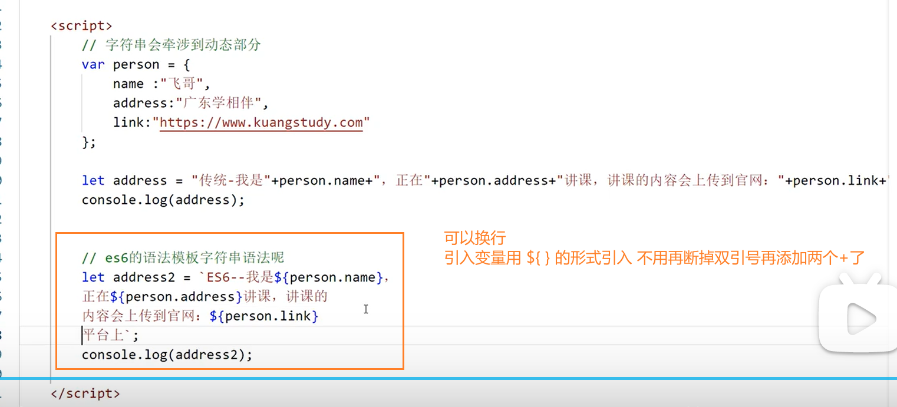

# 07 ES6 概述


​	

​	

# 08 ES6 let和const的认识


​	

​	

# 09 ES6 let和const和var的区别


​	

​	

# 10 ES6 模板字符串




​	

​	

# 11 ES6 默认参数


可以给形参设定默认值

​	

​	

# 12 ES6 箭头函数 


​	

**49-箭头函数.html**

```html
<!DOCTYPE html>
<html lang="en">
  <head>
    <meta charset="UTF-8" />
    <meta http-equiv="X-UA-Compatible" content="IE=edge" />
    <meta name="viewport" content="width=device-width, initial-scale=1.0" />
    <title>49-箭头函数</title>
  </head>
  <body>
    <script>
      //箭头函数 - 重点（在未来的项目开发中：比如小程序，uniapp，一些常见的脚手架大量使用）
      var sum = function (a, b) {
        return a + b;
      };

      // 箭头函数 - 改进1
      var sum = (a, b) => {
        return a + b;
      };

      // 箭头函数 - 改进2
      var sum = (a, b) => a + b;

      /* 
            通过上面的例子你找到什么规律
                1：去掉function
                2：在括号后面加箭头
                3: 如果逻辑代码仅有return可以直接省去 （如果你是逻辑体 你就不能省略）比如sum2
                4: 如果参数只有一个 可以把括号也省去（如果有多个参数就不能省去）

      */
      var sum2 = (a, b) => {
        var num = a + b;
        return num;
      };

      //   var sum = (a, b) => a + b;
      var arr = [1, 2, 3, 4, 5, 6];
      //   原始写法
      //   var newarr = arr.map(function (obj) {
      //     return obj * 2;
      //   });

      // 箭头函数
      var newarr = arr.map((obj) => obj * 2); //obj的括号可以省去不写
      console.log(newarr);

      //   也要懂得如何还原
      var minu = (a, b, c) => a - b - c;
      //   var result = minu(5, 2, 1);
      //   console.log(result);
      var minus = function (a, b, c) {
        return a - b - c;
      };
    </script>
  </body>
</html>

```

​	

​	

# 13 ES6 对象初始化简写及案例分析

**50-对象简写.html**

```html
<!DOCTYPE html>
<html lang="en">
  <head>
    <meta charset="UTF-8" />
    <meta http-equiv="X-UA-Compatible" content="IE=edge" />
    <meta name="viewport" content="width=device-width, initial-scale=1.0" />
    <title>13 ES6 对象初始化简写及案例分析</title>
    <script src="https://cdn.bootcdn.net/ajax/libs/jquery/3.4.1/jquery.js"></script>
  </head>
  <body>
    <form action="">
      <p>账号：<input type="text" id="account" /></p>
      <p>密码：<input type="text" id="account" /></p>
      <p><input type="button" value="登录" id="loginbtn" /></p>
    </form>
    <script>
      let info = {
        title: "广东学相伴",
        link: "https://www.kuangstudey.com",
        go: function () {
          console.log("我骑着小蓝车来公司上班");
        },
      };

      //es6简写
      var title = "广东学相伴";
      var link = "https://www.kuangstudey.com";
      let info2 = {
        title,
        link,
        go() {
          console.log("我骑着小蓝车来公司上班");
        },
      };

      //   console.log(info2);
      //   console.log(info2.title);
      //   console.log(info2.link);
      //   info2.go();
    </script>

    <script>
      // document.getElementById("loginbtn").onclick=function(){};
      //   js中的 $ 是 document.getElementById 的简写
      $("#loginbtn").on("click", function () {
        var account = $("#account").val();
        var password = $("password").val();
        // 对象简写的应用场景
        // var params={account:account,password:password};
        var params = { account, password }; // 属性名和属性值相同 属性值可以省略不写 ES6特性
        // 执行异步请求
        $.ajax({
          type: "post",
          // data:{
          //     account:account,
          //     password:password,
          // },
          url: "xxx",
          data: params,
          //   success: function () {},
          success() {}, //新语法里 function可以去掉
        });
      });
    </script>
  </body>
</html>

```

​	

​	

# 14 ES6 对象解构

**51-对象解构.html**

```html
<!DOCTYPE html>
<html lang="en">
  <head>
    <meta charset="UTF-8" />
    <meta http-equiv="X-UA-Compatible" content="IE=edge" />
    <meta name="viewport" content="width=device-width, initial-scale=1.0" />
    <title>51-对象解构</title>
  </head>
  <body>
    <script>
      /*
            对象是key:value存在 获取对象属性和方法有两种
            1: 通过 .
            2: 通过 []
        */
      var title = "广东学相伴";
      var link = "https://www.kuangstudey.com";
      let info2 = {
        title,
        link,
        go() {
          console.log("我骑着小蓝车来公司上班");
        },
      };

      // 通过.的方式
      console.log(info2.title);
      console.log(info2.link);
      info2.go();

      //通过[]的方式
      console.log(info2["title"]);
      console.log(info2["link"]);
      info2["go"]();

      // es6对象结构 - 其实就快速获取属性和方法的方式一种形式
      var { title, link, go } = info2;
      // 还原代码
      // 快速把下面两行代码糅合成上面一行代码
      var title = info2.title;
      var link = info2.link;
      console.log(title, link);
      go();

      /* 
        js 为什么对象取值要提供两种方式?
        总结： 点和中括号方式的区别
            1.点方法后面跟的必须是一个指定的属性名称，中括号里面可以是变量
            2.中括号里面的属性可以是数字，点方法后面的属性名不能是数字
            3.动态为对象添加属性是，只能用中括号
      */
    </script>
  </body>
</html>

```

​	

​	

# 15 ES6 对象传播操作符

**52-对象传播操作符.html**

```html
<!DOCTYPE html>
<html lang="en">
  <head>
    <meta charset="UTF-8" />
    <meta http-equiv="X-UA-Compatible" content="IE=edge" />
    <meta name="viewport" content="width=device-width, initial-scale=1.0" />
    <title>52-对象传播操作符</title>
  </head>
  <body>
    <script>
      // 对象传播操作符 ...
      var person = {
        name: "学相伴",
        address: "广东",
        link: "https//www.kuangstydy.com",
        phone: 1234567,
        go() {
          console.log("开始上班了");
        },
      };

      // 解构出来
      var { name, address, ...person2 } = person;
      console.log(name);
      console.log(address);
      console.log(person2);

      /* 
        ... 是对象传播操作符 因为name和address被解构出来
            所以不会被传播 剩余的会被传播进person2
      */
    </script>
  </body>
</html>

```

​	

​	

# 16 ES6 对象传播操作符案例分析


​	

​	

# 17 ES6 数组Map

**53-数组map.html**

```html
<!DOCTYPE html>
<html lang="en">
  <head>
    <meta charset="UTF-8" />
    <meta http-equiv="X-UA-Compatible" content="IE=edge" />
    <meta name="viewport" content="width=device-width, initial-scale=1.0" />
    <title>53-数组map</title>
  </head>
  <body>
    <script>
      // 要对arr数组每个元素*2
      let arr = [1, 2, 3, 4, 5, 6, 7];
      // 传统的方式
      let newarr = [];
      for (var i = 0; i < arr.length; i++) {
        newarr.push(arr[i] * 2);
      }
      console.log(newarr);

      // map -- 自带的循环 并且会把处理的值回填对应的位置
      //   var newarr2 = arr.map(function (ele) {
      //     return ele * 2;
      //   });
      //   var newarr2 = arr.map((ele) => ele * 2);
      //   console.log(newarr2);
      //   console.log(newarr); // 自身数组会被影响 发生改变

      // map处理对象的数据
      var users = [
        { age: 10, name: "小学" },
        { age: 12, name: "xiao'xiang" },
        { age: 15, name: "小班" },
      ];
      //   var newusers = users.map(function (ele) {
      //     ele.age += 1;
      //     return ele;
      //   });

      //   这就是最简便的写法
      var newusers = users.map((ele) => {
        ele.age += 1;
        ele.check = true; //这样可以为每一个元素对象添加一个check属性
        return ele;
      });
      console.log(newusers);
      /* 
        map会遍历数组 然后将元素处理完回填到原来位置
        可以打印输出一下arr看原数组有没有被修改
      */
    </script>
  </body>
</html>

```

​	

​	

# 18 ES6 数组Reduce


​	

​	

# 19 ES6 Nodejs的小结


这是在终端的界面

还有就是js的格式后缀不用写 运行53.js 直接写 `node 53` 就好了

he's'z'de'f'se