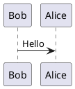
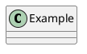
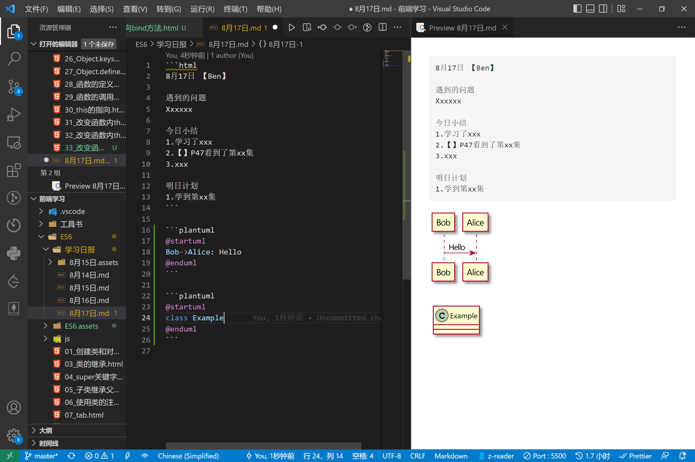
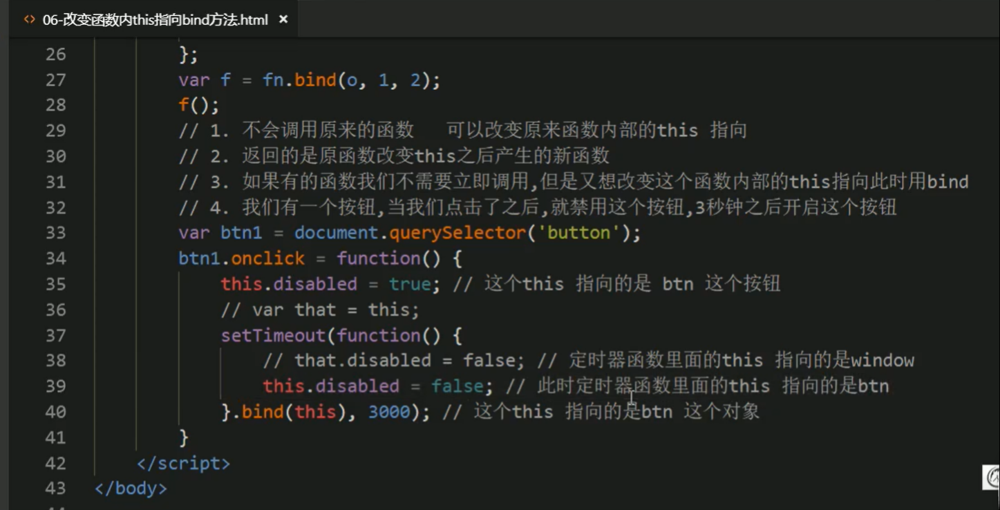

```html
8月17日 【Ben】 

遇到的问题 
状态低迷的3天 效率只有之前的50%
明天（第6天）结束原先计划3天的ES6课程学习

今日小结 
1.【ES6】学习了对象方法、函数、this指向问题(call apply bind)、严格模式、闭包 
2.【ES6】P47看到了P64
3.【注意】获取同一标签 多个标签(按钮)用querySelectorAll 单个标签(按钮)用querySelector

明日计划 
1.【ES6】学到P89，通关ES6！
2.入门vue 
```





​	

markdown里画UML 强的一批🔥🔥



​	

bind() 使用场景一：




