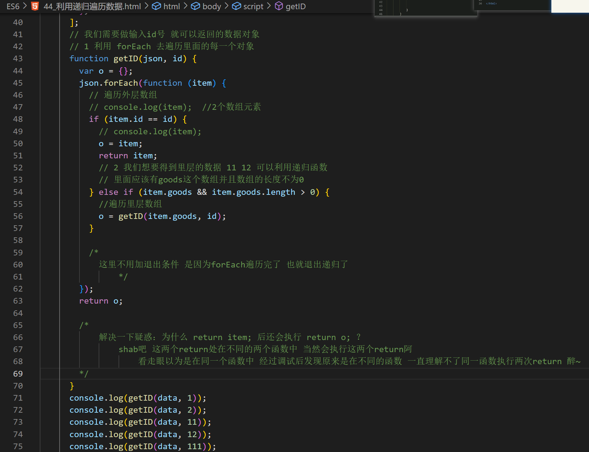
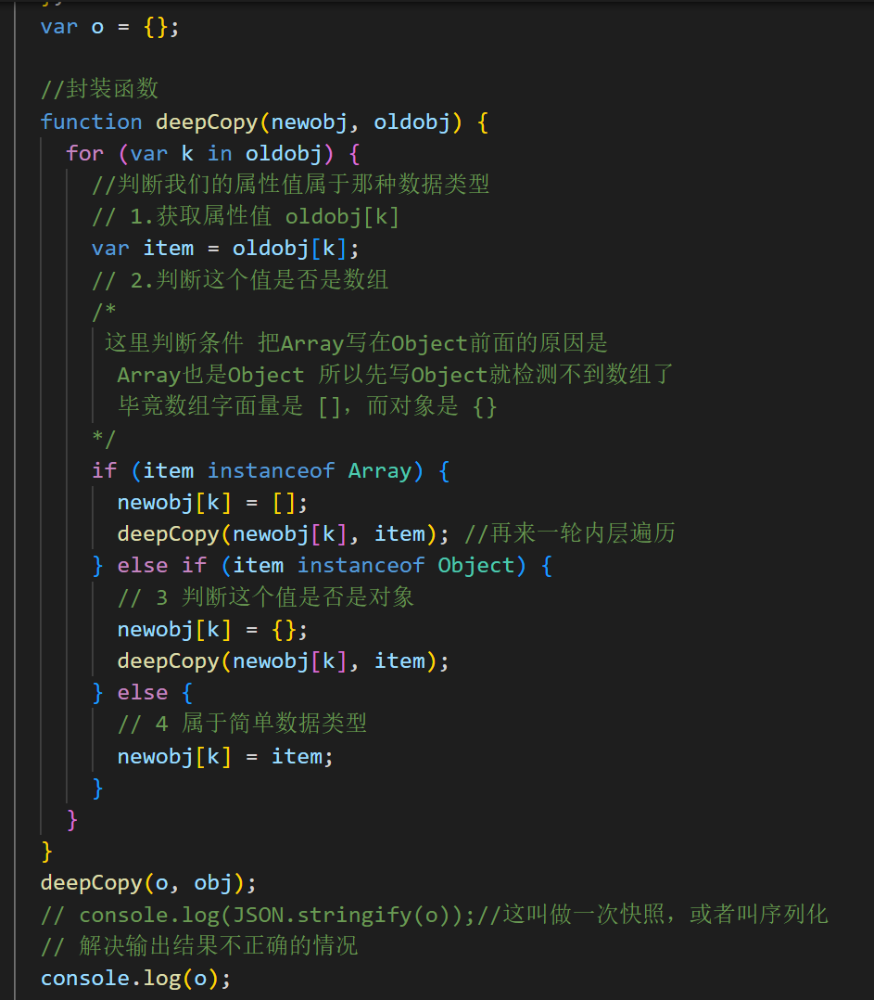
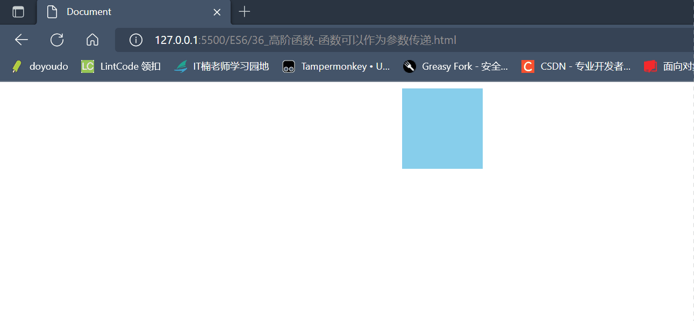

```html
8月18日 【Ben】

遇到的问题
【问题】
1.【递归】解决一下疑惑：为什么 return item; 后还会执行 return o;？
2.创建对象 先对 对象的属性值做出修改 为什么会影响到前面的输出语句？

【解决】
1.醉了 这两个return处在不同的两个函数中 当然会执行这两个return 阿 看走眼以为是在同一个函数中 
	经过调试后发现原来是在不同的函数 一直理解不了同一函数为什么可以执行两次return..
2.控制台I/O延迟 （异步化）解决
① 通过控制台断点调试 看其监视表达式
② 把对象序列化到一个字符串中 以强制执行一次 "快照" 
	比如通过 JSON.stringify(..)

今日小结
1.【ES6】学习了xxx
2.【ES6】P65看到了第xx集
3.setTimeout 是一个异步执行函数
异步函数与异步函数之间的执行互不干扰
同步函数与异步函数之间的执行需等同步函数执行完再执行异步函数
例如一个for循环里放置一个setTimeout(),不管setTimeout定时几秒(包括0ms)，都需要等到for循环遍历完再执行setTimeout函数，
那么此时setTimeout获取for的i变量 值将会等于length 比最大索引值多1

4.jQuery  Javascript第三方函数库
菜鸟教程：https://www.runoob.com/jquery/jquery-tutorial.html
下载链接与在线CDN：https://www.runoob.com/jquery/jquery-install.html
以Staticfile CDN为例：
    Staticfile CDN:
    <head>
    <script src="https://cdn.staticfile.org/jquery/1.10.2/jquery.min.js">
    </script>
    </head>

明日计划
1.学到第xx集
```

​	

> 人理解递推 神理解递归



​	



​	

jQuery js第三方函数库

