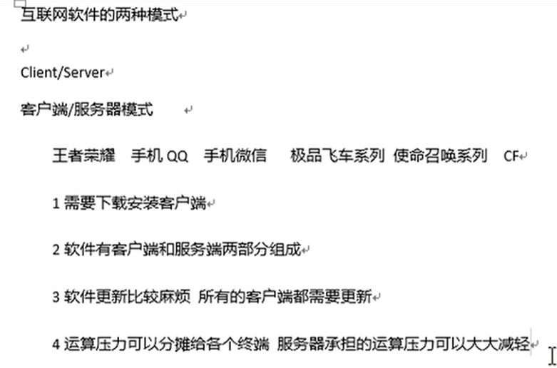
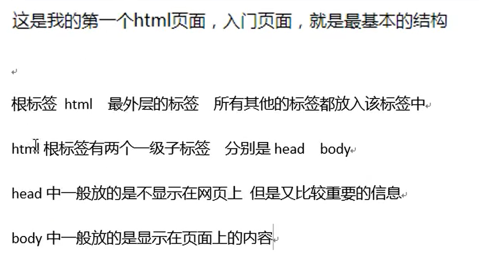

# 01_HTML_CS和BS模式





架构师决定用CS模式或BS模式

​	


# 02_HTML_互联网三大基石


# 03_HTML_HTML简介


安全卫士垃圾清理的上网残留垃圾清理文件的产生：浏览器从对应URL服务器获取的HTML文件下载缓存到本地的文件，可进行清理


用HTML语言可以做网页


# 04_HTML_HTML




```html
<html>
    <!-- 最基本的标签，所有标签应该放在html标签当中 -->
    <!-- 头标签<head></head>    体标签<body></body> -->
    <head>
        <!-- 不显示在网页上，但是又比较重要的信息 -->
        <title>第一个小网页</title>
    </head>

    <body>
        hello world！
    </body>
</html>
```


# 06_HTML_Hbuilder的简单操作


# 07_HTML_乱码问题


打开协议的变化，导致了乱码


GBK是国标码

UTF-8除了中文字符集还包括一些国际的通用字符

GBK是字符集，UTF-8也是字符集，乱码产生原因就是在这


使用字符集不一致是产生乱码的原因之一（编辑器使用的字符集和浏览器使用的字符集不一致）


单标签只有开头没有结尾 <meta charset="utf-8" /> ，告诉浏览器以UTF-8字符集解析文字

```html
<html>
  <!-- 最基本的标签，所有标签应该放在html标签当中 -->
  <!-- 头标签<head></head>    体标签<body></body> -->

  <head>
    <!-- 告诉浏览器以UTF-8字符集解析文字 -->
    <meta charset="utf-8" />
    <!-- 不显示在网页上，但是又比较重要的信息 -->
    <title>第一个小网页</title>
  </head>

  <body>
    <br />
    hello world！HTML!
    <h1>舒舒</h1>
    在vs code编辑的html文件，保存即可在已打开的浏览器中自动刷新
  </body>
</html>
```

HBuilder中通过指定浏览器运行文件不好使的话要改一下运行配置，确保运行配置是正确的浏览器.exe

meta标签和title标签谁在前谁在后没所谓

> meta 元标签，定义一些当前网页的特殊属性，通过meta标签的属性来定义页面的特征
>
> <标签名 属性1=‘ ’  属性2=‘ ’></标签名>
>
> charset属性 定义当前页面的字符集 告诉浏览器以什么字符集解析当前页面
>
> name属性 一般用于定义当前网页的一些简单描述 便于在搜索引擎上根据描述搜索到当前网页

char：字符 

set：集合

charset：字符集

```html
<html>
  <!-- 最基本的标签，所有标签应该放在html标签当中 -->
  <!-- 头标签<head></head>    体标签<body></body> -->

  <head>
    <!-- 告诉浏览器以UTF-8字符集解析文字 -->
    <meta charset="utf-8" />
    <meta name="keywords" content="尚学堂,北京尚学堂" />
    <meta name="author" content="舒舒" />
    <meta name="description" content="潮汕牛肉丸yyds！" />

    <!-- 在**秒后 对网页进行刷新 -->
    <!-- <meta http-equiv="refresh" content="5;http://www.baidu.com" /> -->	<!-- 这个好好玩 -->

    <!-- alt+shift+⬆/⬇，复制上一行代码到下一行 -->
    <!-- 
        keywords    关键字 
        author      作者
        description 描述 一段陈述文字，描述当前网页
        refresh 重新刷新 真好玩！
        属性不加双引号，如上面的name属性，但属性的值要加双引号/单引号，不过要前后统一
    -->

    <!-- 不显示在网页上，但是又比较重要的信息 -->

    <!-- 
        link 学习 CSS样式的 引入外部CSS样式文件
        script 学习 js 脚本语言 引入脚本语言文件
     -->
    <link rel="stylesheet" href="style.css" />
    <script></script>

    <title>第一个小网页</title>
  </head>

  <body bgcolor="gold">
    <!-- 
        bgcolor：background color 背景色 
        很多标签都会有属性，不是只有meta有
        但某些特定属性只能在特定标签上使用
    -->

    <br />
    hello world！HTML!
    <h1>舒舒</h1>
    在vs code编辑的html文件，保存即可在已打开的浏览器中自动刷新
  </body>
</html>

```


# 00_HTML_回顾


# ---

# 01_HTML_专业词汇介绍


标签和属性是不区分大小写的，一般都是小写


元素里还包含着子元素

```html
<html>
  <head>
    <meta charset="utf-8" />
  </head>
  <body>
    <!-- 单标签 -->
    <hr color="Light purple" />
    <hr color="purple" />
    <hr color="pink" size="100" />
    <!-- 
        默认居中，可通过align修改对齐方式
        size是修改高度，width是宽度 
    -->
    <hr width="200px" color="green" align="center" />
    <!-- width还可以这么写，XX% 用%来显示占比 -->
    <hr width="53%" color="red" align="left" />
    <!--宽200个像素-->
    <!-- px是像素的意思 -->
    <!-- 属性只能写在开头标签，不能写在结尾标签 -->
    w3school 学前端的
    <br />
    <br />
    <font color="indigo">舒舒</font>
  </body>
</html>
```


# 02_HTML_段落和格式化标签


标题会自己独占一行，同样HTML页面的标题最多有6级


**段落标签**

```html
<html>
  <head></head>
  <body>
    <h1>舒舒</h1>
    <h2>舒舒</h2>
    <h3>舒舒</h3>
    <h4>舒舒</h4>
    <h5>舒舒</h5>
    <h6>舒舒</h6>
    <br />

    <!-- 
        h*是标题标签，*={1、2、3、4、5、6}
        最多只有六级标题 
        标题的文字会独占一行
        br是换行标签
        p是段落标签，被p标签包裹的文字就是独立的一个段落 段落内部手动换行 段落与段落之间是自动换行的
        用p标签的话，段落之间会自动填充一个br
        br标签放哪就在哪换行
    -->
    <p>舒舒</p>
    <!-- <br /> -->
    <p>是陈舒舒呀！</p>
    <p>
      你可以理解为它是由“区块” + “链”组 成，这条链 接串联起了一个个区块。<br />
      即使分布形式上
      和传统数据库有所不同，其本质功能也是用于承载信息流，每一条信息流都是以数据记录为基本单位来存储的。区块和区块之间通过广播的方式进行通信，那么通信的目的又是什么呢？没错，一切都是为了交易。
      <br />
      作者：敖丙 链接：https://zhuanlan.zhihu.com/p/544022672 来源：知乎
      著作权归作者所有。商业转载请联系作者获得授权，非商业转载请注明出处。
    </p>
  </body>
</html>
```


格式化标签

```html
<html>
  <head></head>
  <body>
    舒舒
    <b>舒舒</b>
    <small>舒舒</small>
    <big>舒舒</big>
    <em>舒舒</em>
    <i>舒舒</i>
    <!-- 着重标签em和斜体标签i的效果一样 -->
    <br />
    <br />
    <strong>舒舒</strong> <br />
    <!-- 加重标签strong和粗体标签b效果一样 -->
    log<sub>2</sub><sup>n</sup> <br />
    舒舒 |
    <ins>舒舒</ins> <br />
    <!-- 回车会有一个空格符 -->
    <del>舒舒</del> <br />
    <br />
    <h1>
      <i><b>舒舒</b></i>
    </h1>

    <font color="pink"> <b>舒舒</b> 舒舒 <i>舒舒</i></font>
    <!-- 标签可以嵌套使用，同时使用 -->
    <!-- font是字体设定 -->
  </body>
</html>

```

https://www.w3school.com.cn/html/html_formatting.asp

> 回车会有一个空格符


# 03_HTML_字符实体和特殊符号


图片来源：https://www.w3school.com.cn/html/html_entities.asp

特殊符号：https://www.w3school.com.cn/html/html_symbols.asp

emoji符号：https://www.w3school.com.cn/html/html_emoji.asp

```html
<html>
  <head></head>
  <body>
    <!-- 转义字符实体 -->
    &lt;br / &gt;
    <br />
    &lt; br / &gt;
    <br />
    &lt;br /&gt;
    <!-- 最后这一种是标准的 
        &lt;br /&gt;       <br />
    -->
    <br />
    <br />
    <!-- 
        对于HTML有特殊含义的符号
        想以普通文本的形式展现出来
        那么就需要使用字符实体进行转义处理 
    -->
    <!-- 
        空格转义 &nbsp; 
        没有转义的话，多个空格也只显示一个空格
    -->
    舒&nbsp;&nbsp;&nbsp;&nbsp;&nbsp;&nbsp;舒 <br />
    舒 舒 <br />
    舒 舒
    <br />
    <!-- &符号可以再转义 -->
    &lt;<br />
    &amp;lt;

    <!-- 
        其他特殊符号
        对于HTML没有特殊含义
        但又不好打出来的符号
     -->
    <h1>我的第一个 Emoji</h1>
    <p>&#128512;</p>
  </body>
</html>

```

要打什么特殊符号可以找上面链接


# 04_HTML_超链接标签

```html
<html>
  <head></head>
  <body>
    <!-- 
        超链接标签 a 标签
        可以给文字，图片，音乐 其他标签添加超链接功能
        a 标签默认会改变字体颜色 同时添加下划线
        href 属性 设置连接的地址 可以是网络路径 也可以是我们本地的资源
        target 设置 连接的打开方式
            _blank新建一页打开
            _self当前页打开
    -->
    <a href="https://www.baidu.com/" target="_blank">百度一下</a>
    <br />
    <a href="https://www.baidu.com/" target="_self">百度一下</a>
    <a href="00_第一个网页.html">我自己的网页</a>
    <hr />
    <!-- 超链接完成锚点位置 -->
    <a name="top">顶部</a> <a href="#middle">跳转至中部</a>
    <!-- href后面的#是跳转网页内部的位置信息的 -->
    <!-- br*100 + tab 实现快速完成100次换行操作 tab是智能操作 -->
    <br /><br /><br /><br /><br /><br /><br /><br /><br /><br /><br /><br /><br /><br /><br /><br /><br /><br /><br /><br /><br /><br /><br /><br /><br /><br /><br /><br /><br /><br /><br /><br /><br /><br /><br /><br /><br /><br /><br /><br /><br /><br /><br /><br /><br /><br /><br /><br /><br /><br /><br /><br /><br /><br /><br /><br /><br /><br /><br /><br /><br /><br /><br /><br /><br /><br /><br /><br /><br /><br /><br /><br /><br /><br /><br /><br /><br /><br /><br /><br /><br /><br /><br /><br /><br /><br /><br /><br /><br /><br /><br /><br /><br /><br /><br /><br /><br /><br /><br /><br />
    <!-- 设置一个锚节点 为了位置跳转 -->
    <a name="middle">中部</a> <a href="#bottom">跳转至底部</a>
    <!-- 注意name前加 # -->
    <br /><br /><br /><br /><br /><br /><br /><br /><br /><br /><br /><br /><br /><br /><br /><br /><br /><br /><br /><br /><br /><br /><br /><br /><br /><br /><br /><br /><br /><br /><br /><br /><br /><br /><br /><br /><br /><br /><br /><br /><br /><br /><br /><br /><br /><br /><br /><br /><br /><br /><br /><br /><br /><br /><br /><br /><br /><br /><br /><br /><br /><br /><br /><br /><br /><br /><br /><br /><br /><br /><br /><br /><br /><br /><br /><br /><br /><br /><br /><br /><br /><br /><br /><br /><br /><br /><br /><br /><br /><br /><br /><br /><br /><br /><br /><br /><br /><br /><br /><br />
    <a name="bottom">底部</a> <a href="#top">跳转至顶部</a>
  </body>
</html>

```


# 05

# 06_HTML_音频和视频标签


上图知识点要知道！


```html
<html>
  <head></head>
  <body>
    <!-- 
        图片 img 
        src source 图片的资源路径
        src 可以是本地资源也可以是网路资源
        因为img文件夹和05_HTML_多媒体标签.html是同一路径下的 写相对路径就ok了
        width 和 height 分别控制 宽度 和 高度
        title 鼠标悬停于图片之上时 显示的文字
        alt 图片加载失败 显示的文字 图片不存在时替换图片的文字
    -->
    
    

    <!-- 给图片加一个超链接 -->
    <br />
    <a href="https://www.jd.com/">
      
      
    </a>
    <hr />
    <hr />
    <hr />
    <hr />
    <hr />
    <!-- 
        音频 
        audio 
        src 音频文件的路径
        controls 页面上显示 功能控件
        autoplay自动播放
        loop循环播放 方向键可控制前进和后退(默认移动单位为2s) 空格可以暂停和播放
    -->
    <!-- 同级文件目录才能用相对路径 -->
    <audio
      src="audio/阳光宅男.mp3"
      controls="controls"
      autoplay="autoplay"
      loop="loop"
    ></audio>
    <br />
    <!-- 
        加control才能显示控件
        如果属性名和属性值是一样的，那么只写属性名就好了 
        不支持文件才会显示下面文字
    -->
    <audio controls="controls">
      <source src="audio/Lil Ghost小鬼 - 别叫我达芬奇 (Punk Version).mp3" />
      你的浏览器不支持该类型文件
    </audio>
    <br />
    <audio src="audio/Smyang Piano - Euphoria.mp3" controls loop></audio>

    <!-- 
        视频 video 
        跟audio是一个道理的
        controls和loop是键值一样的，写属性名就行
    -->
    <video src="video/跳舞ing.mp4" controls loop></video>
    <video src="video/跳舞ing.mp4" width="50%" controls loop></video>
    <!-- 
        视频控件默认的width占比不是100%
        多个控件都是可以同时播放进行的
    -->
  </body>
</html>

```


# 07_HTML_有序和无序列表


```html
<html>
  <head></head>
  <body>
    尚学堂在线课程
    <!-- 
        有序列表
        order List  >>> ol
        列表项
        list item   >>> li
        利用type属性可以自定义列表的排序项是1234还是abcd还是古罗马数字 
        
        type="1"    阿拉伯数字
        type="a"    小写英文字母
        type="A"    大写英文字母
        type="i"    小写罗马数字
        type="I"    大写罗马数字
    -->
    <ol type="1">
      <li>Java</li>
      <li>python</li>
      <li>AI</li>
      <li>大数据</li>
      <li>前端</li>
    </ol>
    <!-- 
        无序列表
        uorder List >>> ul
        列表项
        list item   >>> li 

        type="circle"   空心圆
        type="disc"     实心圆
        type="square"   实心方块

     -->
    尚学堂在线课程尚学堂在线课程
    <ul type="circle">
      <li>Java</li>
      <li>python</li>
      <li>AI</li>
      <li>大数据</li>
      <li>前端</li>
    </ul>
  </body>
</html>
```


# 08_HTML_定义列表


```html
<html>
  <head></head>
  <body>
    <!-- 
        定义列表
        definition List dl
        dl
            dt  一般用于存放图片
            dd  一般用于存放文字
        一般都是按如下模板使用
    -->
    <dl style="border: 1px solid red; width: 350px">
      <dt>
        <a href="https://item.jd.com/100033393446.html" target="_blank">
          
        </a>
      </dt>
      <dd>
        <font color="red">&yen;<big>24969.00</big></font>
        <a href="https://item.jd.com/100033393446.html" target="_blank">
          <p>
            <font color="red">外星人</font>ALIENWARE x15R2
            15.6英寸高端游戏本12代i7 32G 1T RTX3070Ti QHD
          </p>
        </a>
      </dd>
    </dl>
  </body>
</html>
```


# 09_HTML_table_tr_td标签

表格标签


table包含tr包含td

```html
<html>
  <head></head>
  <body>
    <!-- 
          border            边界
          cellspacing       单元格间距
          cellpadding       细胞（单元格）内部缝隙的距离
       -->
    <table
      align="center"
      width="50%"
      border="1px"
      cellspacing="0px"
      cellpadding="1px"
    >
      <tr>
        <td>姓名</td>
        <td>年龄</td>
        <td>班级</td>
        <td>分数</td>
      </tr>
      <tr>
        <td>陈奕迅</td>
        <td>21</td>
        <td>计科二班</td>
        <td>99</td>
      </tr>
      <tr>
        <td>邓子林</td>
        <td>21</td>
        <td>计科一班</td>
        <td>6</td>
      </tr>
    </table>
  </body>
</html>

```


# 10_HTML_thead_tfoot_tbody_th


```html
<html>
  <head></head>
  <body>
    <!-- 
          border            边界
          cellspacing       单元格间距
          cellpadding       细胞（单元格）内部缝隙的距离
          th 相当于 是自带加粗和居中效果的 td
          thead 表头
          tbody 表体    如果不写，浏览器会自动给我们添加
          tfoot 表尾
       -->
    <table
      align="center"
      width="50%"
      border="1px"
      cellspacing="0px"
      cellpadding="1px"
    >
      <thead bgcolor="greenyellow">
        <tr>
          <th>姓名</th>
          <th>年龄</th>
          <th>班级</th>
          <th>分数</th>
        </tr>
      </thead>
      <tbody bgcolor="lightgray">
        <tr>
          <td>陈奕迅</td>
          <td>21</td>
          <td>计科二班</td>
          <td>99</td>
        </tr>
        <tr bgcolor="beige">
          <td>邓子林</td>
          <td>21</td>
          <td>计科一班</td>
          <td>6</td>
        </tr>
      </tbody>
      <tfoot bgcolor="lightcoral">
        <tr>
          <td>总人数</td>
          <td>2</td>
          <td>总分数</td>
          <td>105</td>
        </tr>
        <tr>
          <td>及格人数</td>
          <td>1</td>
          <td>高分人数</td>
          <td>1</td>
        </tr>
      </tfoot>
    </table>
  </body>
</html>

```


# 11_HTML_表格的跨行和跨列


可以这么快速建表，按`Tab`快捷键智能填充


下面两个 <td></td>被挤出去了，不想要删掉就好了


它是这么占位置的，跨行后记得删除不需要的单元格


```html
<html>
  <head></head>
  <body>
    <table border="1px" cellspacing="0px" width="30%" align="center">
      <tr>
        <!-- 
              column 列
              span   区间
              colspan 横向跨几个格（列）[表格横向跨列]
              tr    table row
              rowspan   表格纵向跨行
           -->
        <td colspan="3" align="center">学生成绩单</td>
        <!-- <th colspan="3">学生成绩单</th> -->
        <!-- <td></td>
        <td></td> -->
      </tr>
      <tr>
        <td>姓名</td>
        <td>科目</td>
        <td>分数</td>
      </tr>
      <tr>
        <td rowspan="2">舒舒</td>
        <td>西语</td>
        <td>100</td>
      </tr>
      <tr>
        <!-- <td>舒舒</td> -->
        <td>高数</td>
        <td>99</td>
      </tr>
      <tr>
        <td rowspan="2">凯茵</td>
        <td>经济学</td>
        <td>100</td>
      </tr>
      <tr>
        <!-- <td>凯茵</td> -->
        <td>高数</td>
        <td>99</td>
      </tr>
    </table>
  </body>
</html>

```


# 12_HTML_表格的嵌套

```html
<html>
  <head></head>
  <body>
    <table border="1px" cellspacing="0px" width="30%" align="center">
      <tr>
        <th colspan="3">学生成绩单</th>
        <!-- <th></th>
        <th></th> -->
      </tr>
      <tr>
        <td>姓名</td>
        <td>学科</td>
        <td>分数</td>
        <!-- <td colspan="2" rowspan="5">科目</td> -->
        <!-- <td colspan="2" rowspan="5"></td> -->
        <!-- <td>分数</td> -->
      </tr>
      <tr>
        <td rowspan="2">舒舒</td>
        <td colspan="2" rowspan="4">
          <table border="1px" cellspacing="0px" width="100%">
            <!-- 这里width="100%"的意思是占这个td单元格的100%，不是整个网页的100% -->

            <tr>
              <td>西语</td>
              <td>100</td>
            </tr>
            <tr>
              <td>高数</td>
              <td>99</td>
            </tr>
            <tr>
              <td>经济学</td>
              <td>100</td>
            </tr>
            <tr>
              <td>高数</td>
              <td>99</td>
            </tr>
          </table>
        </td>
        <!-- <td>西语</td> -->
        <!-- <td>100</td> -->
      </tr>
      <tr>
        <!-- <td>舒舒</td> -->
        <!-- <td>高数</td> -->
        <!-- <td>99</td> -->
      </tr>
      <tr>
        <td rowspan="2">凯茵</td>
        <!-- <td>经济学</td> -->
        <!-- <td>100</td> -->
      </tr>
      <tr>
        <!-- <td>凯茵</td> -->
        <!-- <td>高数</td> -->
        <!-- <td>99</td> -->
      </tr>
    </table>
  </body>
</html>

```


# 00_HTML_回顾


# 01_HTML_输入标签

---

相对路径和绝对路径的斜杆

- 相对路径 /
- 绝对路径 \

---

```html
<html>
  <head></head>
  <body>
    <!-- 
        input标签中，type属性决定了输入框的类型
        radio 单选框
        checkbox 复选框
        如果需要让多个单选框有互斥效果 那么需要给多个单选框添加name属性 并且name属性的值是相同的
        通过checked 属性控制其中的某一个选项被选中
        checked的属性名和属性值相同，所以属性值可以默认不写
        如果写了多个checked，默认最后一个生效，写多个checked本身就是不合理的
     -->
    账号: <input type="text" /><br />
    密码: <input type="password" /> <br />
    性别:
    <input type="radio" name="gender" checked />男
    <input type="radio" name="gender" />女 <br />

    <!-- 
      即使添加了name属性，还是可以复选，不像radio单选框只能选择其一 
      checked属性依旧适用
    -->
    爱好: <input type="checkbox" />篮球 <input type="checkbox" />足球
    <input type="checkbox" />桌球 <input type="checkbox" />网球
    <input type="checkbox" />羽毛球 <input type="checkbox" />玻璃球
    <br />
    请选择文件 <input type="file" /><br />
    <!-- text属性只能在一行上输入文字信息（单行输入），width和height自定义不了大小 -->
    个人简介:
    <!-- 不能再用文本框了，要用文本域 -->
    <!-- <textarea name="" id="" cols="30" rows="10"></textarea> -->
    <textarea style="width: 40%; height: 200px">请介绍一下你自己</textarea>
    <br />
    籍贯:
    <!-- 
      下拉框 select option 
      selected 表示它是默认最开始被选择的选项
      multiple 下拉框全部显示 这个并不常用，了解即可
    -->
    <select name="" id="" multiple>
      <option value="">吉林</option>
      <option value="">黑龙江</option>
      <option value="">辽宁</option>
      <option value="" selected>-请选择省份-</option>
    </select>
  </body>
</html>

```


# 02_HTML_输入标签练习


```html
<html>
  <head></head>
  <body>
    <!-- table表格是有换行效果的，不用加br -->
    <table width="30%" align="center" border="1px" cellspacing="0px">
      <tr>
        <td>账号:</td>
        <td><input type="text" /></td>
      </tr>
      <tr>
        <td>密码:</td>
        <td><input type="password" /></td>
      </tr>
      <tr>
        <td>性别:</td>
        <td>
          <input type="radio" name="gender" checked />男
          <input type="radio" name="gender" />女
        </td>
      </tr>
      <tr>
        <td>爱好:</td>
        <td>
          <input type="checkbox" />篮球 <input type="checkbox" />足球
          <input type="checkbox" />桌球 <input type="checkbox" />网球
          <input type="checkbox" />羽毛球 <input type="checkbox" />玻璃球
        </td>
      </tr>
      <tr>
        <td>请选择文件</td>
        <td><input type="file" /></td>
      </tr>
      <tr>
        <td>个人简介:</td>
        <td>
          <textarea style="width: 40%; height: 200px">
请介绍一下你自己</textarea
          >
        </td>
      </tr>
      <tr>
        <td>籍贯:</td>
        <td>
          <select name="" id="" multiple>
            <option value="">吉林</option>
            <option value="">黑龙江</option>
            <option value="">辽宁</option>
            <option value="" selected>-请选择省份-</option>
          </select>
        </td>
      </tr>
    </table>

    <!-- 
        input标签中，type属性决定了输入框的类型
        radio 单选框
        checkbox 复选框
        如果需要让多个单选框有互斥效果 那么需要给多个单选框添加name属性 并且name属性的值是相同的
        通过checked 属性控制其中的某一个选项被选中
        checked的属性名和属性值相同，所以属性值可以默认不写
        如果写了多个checked，默认最后一个生效，写多个checked本身就是不合理的
     -->

    <!-- 
      即使添加了name属性，还是可以复选，不像radio单选框只能选择其一 
      checked属性依旧适用
    -->

    <!-- text属性只能在一行上输入文字信息（单行输入），width和height自定义不了大小 -->

    <!-- 不能再用文本框了，要用文本域 -->
    <!-- <textarea name="" id="" cols="30" rows="10"></textarea> -->

    <!-- 
      下拉框 select option 
      selected 表示它是默认最开始被选择的选项
      multiple 下拉框全部显示 这个并不常用，了解即可
    -->
  </body>
</html>

```


