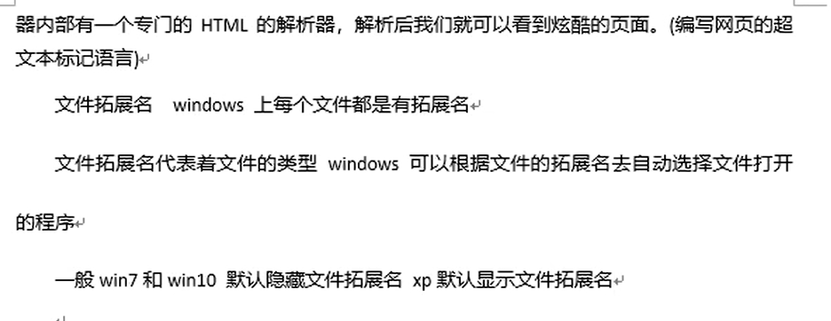
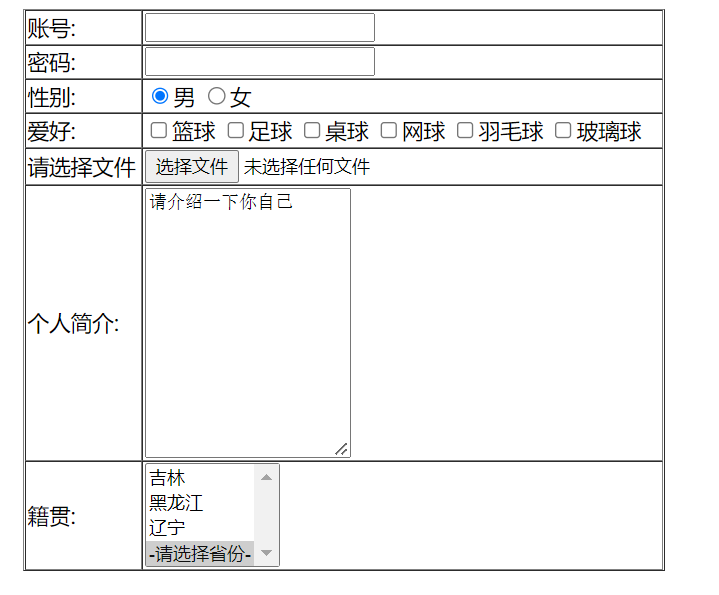
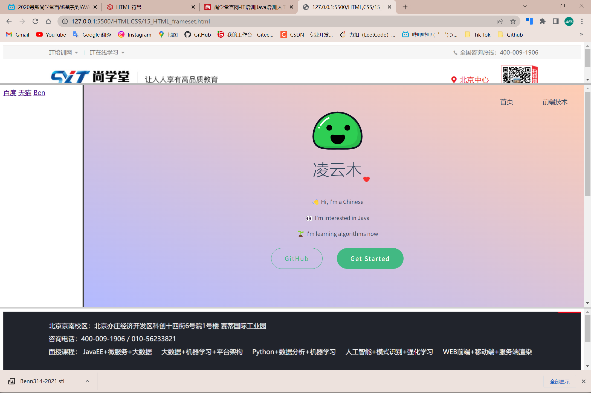
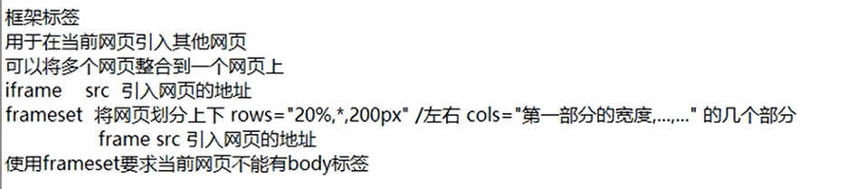
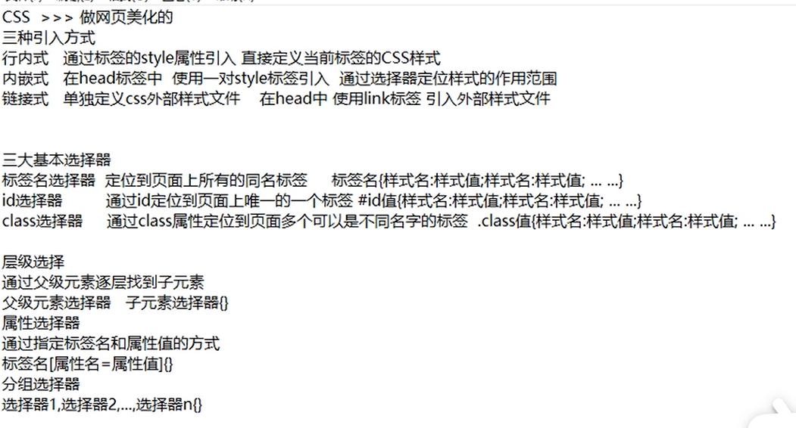
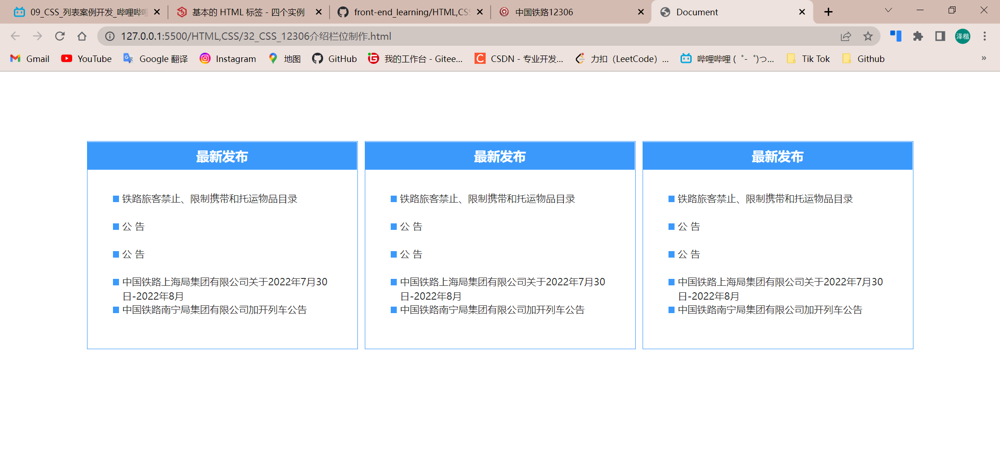
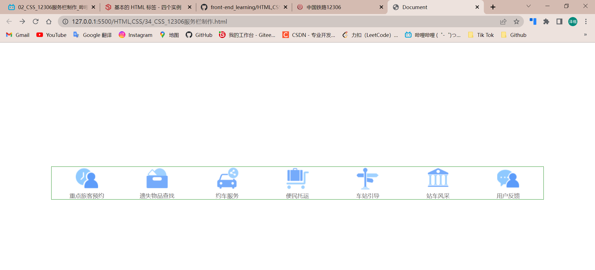

# 01_HTML_CS和BS模式

​	


架构师决定用CS模式或BS模式

​	

​	

# 02_HTML_互联网三大基石


# 03_HTML_HTML简介


​	

安全卫士垃圾清理的上网残留垃圾清理文件的产生：浏览器从对应URL服务器获取的HTML文件下载缓存到本地的文件，可进行清理

​	


用HTML语言可以做网页




​	

# 04_HTML_HTML


​	

```html
<html>
    <!-- 最基本的标签，所有标签应该放在html标签当中 -->
    <!-- 头标签<head></head>    体标签<body></body> -->
    <head>
        <!-- 不显示在网页上，但是又比较重要的信息 -->
        <title>第一个小网页</title>
    </head>

    <body>
        hello world！
    </body>
</html>
```

​	

# 06_HTML_Hbuilder的简单操作

​	


​	

# 07_HTML_乱码问题

​	

打开协议的变化，导致了乱码


GBK是国标码

UTF-8除了中文字符集还包括一些国际的通用字符

GBK是字符集，UTF-8也是字符集，乱码产生原因就是在这


使用字符集不一致是产生乱码的原因之一（编辑器使用的字符集和浏览器使用的字符集不一致）

​	

单标签只有开头没有结尾 <meta charset="utf-8" /> ，告诉浏览器以UTF-8字符集解析文字

```html
<html>
  <!-- 最基本的标签，所有标签应该放在html标签当中 -->
  <!-- 头标签<head></head>    体标签<body></body> -->

  <head>
    <!-- 告诉浏览器以UTF-8字符集解析文字 -->
    <meta charset="utf-8" />
    <!-- 不显示在网页上，但是又比较重要的信息 -->
    <title>第一个小网页</title>
  </head>

  <body>
    <br />
    hello world！HTML!
    <h1>舒舒</h1>
    在vs code编辑的html文件，保存即可在已打开的浏览器中自动刷新
  </body>
</html>
```

HBuilder中通过指定浏览器运行文件不好使的话要改一下运行配置，确保运行配置是正确的浏览器.exe

meta标签和title标签谁在前谁在后没所谓

> meta 元标签，定义一些当前网页的特殊属性，通过meta标签的属性来定义页面的特征
>
> <标签名 属性1=‘ ’  属性2=‘ ’></标签名>
>
> charset属性 定义当前页面的字符集 告诉浏览器以什么字符集解析当前页面
>
> name属性 一般用于定义当前网页的一些简单描述 便于在搜索引擎上根据描述搜索到当前网页

char：字符 

set：集合

charset：字符集

​	

**00_第一个网页.html**

```html
<html>
  <!-- 最基本的标签，所有标签应该放在html标签当中 -->
  <!-- 头标签<head></head>    体标签<body></body> -->

  <head>
    <!-- 告诉浏览器以UTF-8字符集解析文字 -->
    <meta charset="utf-8" />
    <meta name="keywords" content="尚学堂,北京尚学堂" />
    <meta name="author" content="舒舒" />
    <meta name="description" content="潮汕牛肉丸yyds！" />

    <!-- 在**秒后 对网页进行刷新 -->
    <!-- <meta http-equiv="refresh" content="5;http://www.baidu.com" /> -->	<!-- 这个好好玩 -->

    <!-- alt+shift+⬆/⬇，复制上一行代码到下一行 -->
    <!-- 
        keywords    关键字 
        author      作者
        description 描述 一段陈述文字，描述当前网页
        refresh 重新刷新 真好玩！
        属性不加双引号，如上面的name属性，但属性的值要加双引号/单引号，不过要前后统一
    -->

    <!-- 不显示在网页上，但是又比较重要的信息 -->

    <!-- 
        link 学习 CSS样式的 引入外部CSS样式文件
        script 学习 js 脚本语言 引入脚本语言文件
     -->
    <link rel="stylesheet" href="style.css" />
    <script></script>

    <title>第一个小网页</title>
  </head>

  <body bgcolor="gold">
    <!-- 
        bgcolor：background color 背景色 
        很多标签都会有属性，不是只有meta有
        但某些特定属性只能在特定标签上使用
    -->

    <br />
    hello world！HTML!
    <h1>舒舒</h1>
    在vs code编辑的html文件，保存即可在已打开的浏览器中自动刷新
  </body>
</html>

```

​	

# 00_HTML_回顾


# ---

# 01_HTML_专业词汇介绍


标签和属性是不区分大小写的，一般都是小写

​	


元素里还包含着子元素

​	

**00_Day02_HTML.html**

```html
<html>
  <head>
    <meta charset="utf-8" />
  </head>
  <body>
    <!-- 单标签 -->
    <hr color="Light purple" />
    <hr color="purple" />
    <hr color="pink" size="100" />
    <!-- 
        默认居中，可通过align修改对齐方式
        size是修改高度，width是宽度 
    -->
    <hr width="200px" color="green" align="center" />
    <!-- width还可以这么写，XX% 用%来显示占比 -->
    <hr width="53%" color="red" align="left" />
    <!--宽200个像素-->
    <!-- px是像素的意思 -->
    <!-- 属性只能写在开头标签，不能写在结尾标签 -->
    w3school 学前端的
    <br />
    <br />
    <font color="indigo">舒舒</font>
  </body>
</html>
```

​	

# 02_HTML_段落和格式化标签


标题会自己独占一行，同样HTML页面的标题最多有6级


​	

**01_HTML_段落标签.html**

```html
<html>
  <head></head>
  <body>
    <h1>舒舒</h1>
    <h2>舒舒</h2>
    <h3>舒舒</h3>
    <h4>舒舒</h4>
    <h5>舒舒</h5>
    <h6>舒舒</h6>
    <br />

    <!-- 
        h*是标题标签，*={1、2、3、4、5、6}
        最多只有六级标题 
        标题的文字会独占一行
        br是换行标签
        p是段落标签，被p标签包裹的文字就是独立的一个段落 段落内部手动换行 段落与段落之间是自动换行的
        用p标签的话，段落之间会自动填充一个br
        br标签放哪就在哪换行
    -->
    <p>舒舒</p>
    <!-- <br /> -->
    <p>是陈舒舒呀！</p>
    <p>
      你可以理解为它是由“区块” + “链”组 成，这条链 接串联起了一个个区块。<br />
      即使分布形式上
      和传统数据库有所不同，其本质功能也是用于承载信息流，每一条信息流都是以数据记录为基本单位来存储的。区块和区块之间通过广播的方式进行通信，那么通信的目的又是什么呢？没错，一切都是为了交易。
      <br />
      作者：敖丙 链接：https://zhuanlan.zhihu.com/p/544022672 来源：知乎
      著作权归作者所有。商业转载请联系作者获得授权，非商业转载请注明出处。
    </p>
  </body>
</html>
```

​	

**02_HTML_格式化标签.html**

```html
<html>
  <head></head>
  <body>
    舒舒
    <b>舒舒</b>
    <small>舒舒</small>
    <big>舒舒</big>
    <em>舒舒</em>
    <i>舒舒</i>
    <!-- 着重标签em和斜体标签i的效果一样 -->
    <br />
    <br />
    <strong>舒舒</strong> <br />
    <!-- 加重标签strong和粗体标签b效果一样 -->
    log<sub>2</sub><sup>n</sup> <br />
    舒舒 |
    <ins>舒舒</ins> <br />
    <!-- 回车会有一个空格符 -->
    <del>舒舒</del> <br />
    <br />
    <h1>
      <i><b>舒舒</b></i>
    </h1>

    <font color="pink"> <b>舒舒</b> 舒舒 <i>舒舒</i></font>
    <!-- 标签可以嵌套使用，同时使用 -->
    <!-- font是字体设定 -->
  </body>
</html>

```

https://www.w3school.com.cn/html/html_formatting.asp

> 回车会有一个空格符


​	

# 03_HTML_字符实体和特殊符号

​	


图片来源：https://www.w3school.com.cn/html/html_entities.asp

特殊符号：https://www.w3school.com.cn/html/html_symbols.asp

emoji符号：https://www.w3school.com.cn/html/html_emoji.asp

​	

**03_HTML_字符实体.html**

```html
<html>
  <head></head>
  <body>
    <!-- 转义字符实体 -->
    &lt;br / &gt;
    <br />
    &lt; br / &gt;
    <br />
    &lt;br /&gt;
    <!-- 最后这一种是标准的 
        &lt;br /&gt;       <br />
    -->
    <br />
    <br />
    <!-- 
        对于HTML有特殊含义的符号
        想以普通文本的形式展现出来
        那么就需要使用字符实体进行转义处理 
    -->
    <!-- 
        空格转义 &nbsp; 
        没有转义的话，多个空格也只显示一个空格
    -->
    舒&nbsp;&nbsp;&nbsp;&nbsp;&nbsp;&nbsp;舒 <br />
    舒 舒 <br />
    舒 舒
    <br />
    <!-- &符号可以再转义 -->
    &lt;<br />
    &amp;lt;

    <!-- 
        其他特殊符号
        对于HTML没有特殊含义
        但又不好打出来的符号
     -->
    <h1>我的第一个 Emoji</h1>
    <p>&#128512;</p>
  </body>
</html>

```

要打什么特殊符号可以找上面链接

​	

# 04_HTML_超链接标签

​	

**04_HTML_超链接标签.html**

```html
<html>
  <head></head>
  <body>
    <!-- 
        超链接标签 a 标签
        可以给文字，图片，音乐 其他标签添加超链接功能
        a 标签默认会改变字体颜色 同时添加下划线
        href 属性 设置连接的地址 可以是网络路径 也可以是我们本地的资源
        target 设置 连接的打开方式
            _blank新建一页打开
            _self当前页打开
    -->
    <a href="https://www.baidu.com/" target="_blank">百度一下</a>
    <br />
    <a href="https://www.baidu.com/" target="_self">百度一下</a>
    <a href="00_第一个网页.html">我自己的网页</a>
    <hr />
    <!-- 超链接完成锚点位置 -->
    <a name="top">顶部</a> <a href="#middle">跳转至中部</a>
    <!-- href后面的#是跳转网页内部的位置信息的 -->
    <!-- br*100 + tab 实现快速完成100次换行操作 tab是智能操作 -->
    <br /><br /><br /><br /><br /><br /><br /><br /><br /><br /><br /><br /><br /><br /><br /><br /><br /><br /><br /><br /><br /><br /><br /><br /><br /><br /><br /><br /><br /><br /><br /><br /><br /><br /><br /><br /><br /><br /><br /><br /><br /><br /><br /><br /><br /><br /><br /><br /><br /><br /><br /><br /><br /><br /><br /><br /><br /><br /><br /><br /><br /><br /><br /><br /><br /><br /><br /><br /><br /><br /><br /><br /><br /><br /><br /><br /><br /><br /><br /><br /><br /><br /><br /><br /><br /><br /><br /><br /><br /><br /><br /><br /><br /><br /><br /><br /><br /><br /><br /><br />
    <!-- 设置一个锚节点 为了位置跳转 -->
    <a name="middle">中部</a> <a href="#bottom">跳转至底部</a>
    <!-- 注意name前加 # -->
    <br /><br /><br /><br /><br /><br /><br /><br /><br /><br /><br /><br /><br /><br /><br /><br /><br /><br /><br /><br /><br /><br /><br /><br /><br /><br /><br /><br /><br /><br /><br /><br /><br /><br /><br /><br /><br /><br /><br /><br /><br /><br /><br /><br /><br /><br /><br /><br /><br /><br /><br /><br /><br /><br /><br /><br /><br /><br /><br /><br /><br /><br /><br /><br /><br /><br /><br /><br /><br /><br /><br /><br /><br /><br /><br /><br /><br /><br /><br /><br /><br /><br /><br /><br /><br /><br /><br /><br /><br /><br /><br /><br /><br /><br /><br /><br /><br /><br /><br /><br />
    <a name="bottom">底部</a> <a href="#top">跳转至顶部</a>
  </body>
</html>

```

​	

# 05

# 06_HTML_音频和视频标签


上图知识点要知道！

​	


​	

**05_HTML_多媒体标签.html**

```html
<html>
  <head></head>
  <body>
    <!-- 
        图片 img 
        src source 图片的资源路径
        src 可以是本地资源也可以是网路资源
        因为img文件夹和05_HTML_多媒体标签.html是同一路径下的 写相对路径就ok了
        width 和 height 分别控制 宽度 和 高度
        title 鼠标悬停于图片之上时 显示的文字
        alt 图片加载失败 显示的文字 图片不存在时替换图片的文字
    -->
    
    

    <!-- 给图片加一个超链接 -->
    <br />
    <a href="https://www.jd.com/">
      
      
    </a>
    <hr />
    <hr />
    <hr />
    <hr />
    <hr />
    <!-- 
        音频 
        audio 
        src 音频文件的路径
        controls 页面上显示 功能控件
        autoplay自动播放
        loop循环播放 方向键可控制前进和后退(默认移动单位为2s) 空格可以暂停和播放
    -->
    <!-- 同级文件目录才能用相对路径 -->
    <audio
      src="audio/阳光宅男.mp3"
      controls="controls"
      autoplay="autoplay"
      loop="loop"
    ></audio>
    <br />
    <!-- 
        加control才能显示控件
        如果属性名和属性值是一样的，那么只写属性名就好了 
        不支持文件才会显示下面文字
    -->
    <audio controls="controls">
      <source src="audio/Lil Ghost小鬼 - 别叫我达芬奇 (Punk Version).mp3" />
      你的浏览器不支持该类型文件
    </audio>
    <br />
    <audio src="audio/Smyang Piano - Euphoria.mp3" controls loop></audio>

    <!-- 
        视频 video 
        跟audio是一个道理的
        controls和loop是键值一样的，写属性名就行
    -->
    <video src="video/跳舞ing.mp4" controls loop></video>
    <video src="video/跳舞ing.mp4" width="50%" controls loop></video>
    <!-- 
        视频控件默认的width占比不是100%
        多个控件都是可以同时播放进行的
    -->
  </body>
</html>

```

​	

​	

# 07_HTML_有序和无序列表

​	

**06_HTML_列表标签.html**

```html
<html>
  <head></head>
  <body>
    尚学堂在线课程
    <!-- 
        有序列表
        order List  >>> ol
        列表项
        list item   >>> li
        利用type属性可以自定义列表的排序项是1234还是abcd还是古罗马数字 
        
        type="1"    阿拉伯数字
        type="a"    小写英文字母
        type="A"    大写英文字母
        type="i"    小写罗马数字
        type="I"    大写罗马数字
    -->
    <ol type="1">
      <li>Java</li>
      <li>python</li>
      <li>AI</li>
      <li>大数据</li>
      <li>前端</li>
    </ol>
    <!-- 
        无序列表
        uorder List >>> ul
        列表项
        list item   >>> li 

        type="circle"   空心圆
        type="disc"     实心圆
        type="square"   实心方块

     -->
    尚学堂在线课程尚学堂在线课程
    <ul type="circle">
      <li>Java</li>
      <li>python</li>
      <li>AI</li>
      <li>大数据</li>
      <li>前端</li>
    </ul>
  </body>
</html>
```

​	

# 08_HTML_定义列表

​	

**07_HTML_定义列表.html**

```html
<html>
  <head></head>
  <body>
    <!-- 
        定义列表
        definition List dl
        dl
            dt  一般用于存放图片
            dd  一般用于存放文字
        一般都是按如下模板使用
    -->
    <dl style="border: 1px solid red; width: 350px">
      <dt>
        <a href="https://item.jd.com/100033393446.html" target="_blank">
          
        </a>
      </dt>
      <dd>
        <font color="red">&yen;<big>24969.00</big></font>
        <a href="https://item.jd.com/100033393446.html" target="_blank">
          <p>
            <font color="red">外星人</font>ALIENWARE x15R2
            15.6英寸高端游戏本12代i7 32G 1T RTX3070Ti QHD
          </p>
        </a>
      </dd>
    </dl>
  </body>
</html>
```

​	

# 09_HTML_table_tr_td标签

表格标签


table包含tr包含td

​	

**08_HTML_表格标签.html**

```html
<html>
  <head></head>
  <body>
    <!-- 
          border            边界
          cellspacing       单元格间距
          cellpadding       细胞（单元格）内部缝隙的距离
       -->
    <table
      align="center"
      width="50%"
      border="1px"
      cellspacing="0px"
      cellpadding="1px"
    >
      <tr>
        <td>姓名</td>
        <td>年龄</td>
        <td>班级</td>
        <td>分数</td>
      </tr>
      <tr>
        <td>陈奕迅</td>
        <td>21</td>
        <td>计科二班</td>
        <td>99</td>
      </tr>
      <tr>
        <td>邓子林</td>
        <td>21</td>
        <td>计科一班</td>
        <td>6</td>
      </tr>
    </table>
  </body>
</html>

```

​	

# 10_HTML_thead_tfoot_tbody_th


​	

**08_HTML_表格标签.html**

```html
<html>
  <head></head>
  <body>
    <!-- 
          border            边界
          cellspacing       单元格间距
          cellpadding       细胞（单元格）内部缝隙的距离
          th 相当于 是自带加粗和居中效果的 td
          thead 表头
          tbody 表体    如果不写，浏览器会自动给我们添加
          tfoot 表尾
       -->
    <table
      align="center"
      width="50%"
      border="1px"
      cellspacing="0px"
      cellpadding="1px"
    >
      <thead bgcolor="greenyellow">
        <tr>
          <th>姓名</th>
          <th>年龄</th>
          <th>班级</th>
          <th>分数</th>
        </tr>
      </thead>
      <tbody bgcolor="lightgray">
        <tr>
          <td>陈奕迅</td>
          <td>21</td>
          <td>计科二班</td>
          <td>99</td>
        </tr>
        <tr bgcolor="beige">
          <td>邓子林</td>
          <td>21</td>
          <td>计科一班</td>
          <td>6</td>
        </tr>
      </tbody>
      <tfoot bgcolor="lightcoral">
        <tr>
          <td>总人数</td>
          <td>2</td>
          <td>总分数</td>
          <td>105</td>
        </tr>
        <tr>
          <td>及格人数</td>
          <td>1</td>
          <td>高分人数</td>
          <td>1</td>
        </tr>
      </tfoot>
    </table>
  </body>
</html>

```

​	

# 11_HTML_表格的跨行和跨列

​	


可以这么快速建表，按`Tab`快捷键智能填充


下面两个 <td></td>被挤出去了，不想要删掉就好了


它是这么占位置的，跨行后记得删除不需要的单元格

​	

**09_HTML_表格的跨行和跨列.html**

```html
<html>
  <head></head>
  <body>
    <table border="1px" cellspacing="0px" width="30%" align="center">
      <tr>
        <!-- 
              column 列
              span   区间
              colspan 横向跨几个格（列）[表格横向跨列]
              tr    table row
              rowspan   表格纵向跨行
           -->
        <td colspan="3" align="center">学生成绩单</td>
        <!-- <th colspan="3">学生成绩单</th> -->
        <!-- <td></td>
        <td></td> -->
      </tr>
      <tr>
        <td>姓名</td>
        <td>科目</td>
        <td>分数</td>
      </tr>
      <tr>
        <td rowspan="2">舒舒</td>
        <td>西语</td>
        <td>100</td>
      </tr>
      <tr>
        <!-- <td>舒舒</td> -->
        <td>高数</td>
        <td>99</td>
      </tr>
      <tr>
        <td rowspan="2">凯茵</td>
        <td>经济学</td>
        <td>100</td>
      </tr>
      <tr>
        <!-- <td>凯茵</td> -->
        <td>高数</td>
        <td>99</td>
      </tr>
    </table>
  </body>
</html>

```


# 12_HTML_表格的嵌套

​	

**10_HTML_表格的嵌套.html**

```html
<html>
  <head></head>
  <body>
    <table border="1px" cellspacing="0px" width="30%" align="center">
      <tr>
        <th colspan="3">学生成绩单</th>
        <!-- <th></th>
        <th></th> -->
      </tr>
      <tr>
        <td>姓名</td>
        <td>学科</td>
        <td>分数</td>
        <!-- <td colspan="2" rowspan="5">科目</td> -->
        <!-- <td colspan="2" rowspan="5"></td> -->
        <!-- <td>分数</td> -->
      </tr>
      <tr>
        <td rowspan="2">舒舒</td>
        <td colspan="2" rowspan="4">
          <table border="1px" cellspacing="0px" width="100%">
            <!-- 这里width="100%"的意思是占这个td单元格的100%，不是整个网页的100% -->

            <tr>
              <td>西语</td>
              <td>100</td>
            </tr>
            <tr>
              <td>高数</td>
              <td>99</td>
            </tr>
            <tr>
              <td>经济学</td>
              <td>100</td>
            </tr>
            <tr>
              <td>高数</td>
              <td>99</td>
            </tr>
          </table>
        </td>
        <!-- <td>西语</td> -->
        <!-- <td>100</td> -->
      </tr>
      <tr>
        <!-- <td>舒舒</td> -->
        <!-- <td>高数</td> -->
        <!-- <td>99</td> -->
      </tr>
      <tr>
        <td rowspan="2">凯茵</td>
        <!-- <td>经济学</td> -->
        <!-- <td>100</td> -->
      </tr>
      <tr>
        <!-- <td>凯茵</td> -->
        <!-- <td>高数</td> -->
        <!-- <td>99</td> -->
      </tr>
    </table>
  </body>
</html>

```

​	


​	

# 00_HTML_回顾

​	


​	

​	

# 01_HTML_输入标签

---

相对路径和绝对路径的斜杆

- 相对路径 /
- 绝对路径 \

---

**11_HTML_输入标签.html**

```html
<html>
  <head></head>
  <body>
    <!-- 
        input标签中，type属性决定了输入框的类型
        radio 单选框
        checkbox 复选框
        如果需要让多个单选框有互斥效果 那么需要给多个单选框添加name属性 并且name属性的值是相同的
        通过checked 属性控制其中的某一个选项被选中
        checked的属性名和属性值相同，所以属性值可以默认不写
        如果写了多个checked，默认最后一个生效，写多个checked本身就是不合理的
     -->
    账号: <input type="text" /><br />
    密码: <input type="password" /> <br />
    性别:
    <input type="radio" name="gender" checked />男
    <input type="radio" name="gender" />女 <br />

    <!-- 
      即使添加了name属性，还是可以复选，不像radio单选框只能选择其一 
      checked属性依旧适用
    -->
    爱好: <input type="checkbox" />篮球 <input type="checkbox" />足球
    <input type="checkbox" />桌球 <input type="checkbox" />网球
    <input type="checkbox" />羽毛球 <input type="checkbox" />玻璃球
    <br />
    请选择文件 <input type="file" /><br />
    <!-- text属性只能在一行上输入文字信息（单行输入），width和height自定义不了大小 -->
    个人简介:
    <!-- 不能再用文本框了，要用文本域 -->
    <!-- <textarea name="" id="" cols="30" rows="10"></textarea> -->
    <textarea style="width: 40%; height: 200px">请介绍一下你自己</textarea>
    <br />
    籍贯:
    <!-- 
      下拉框 select option 
      selected 表示它是默认最开始被选择的选项
      multiple 下拉框全部显示 这个并不常用，了解即可
    -->
    <select name="" id="" multiple>
      <option value="">吉林</option>
      <option value="">黑龙江</option>
      <option value="">辽宁</option>
      <option value="" selected>-请选择省份-</option>
    </select>
  </body>
</html>

```

​	

​	

# 02_HTML_输入标签练习

​	

**12_HTML_输入标签练习.html**

```html
<html>
  <head></head>
  <body>
    <!-- table表格是有换行效果的，不用加br -->
    <table width="30%" align="center" border="1px" cellspacing="0px">
      <tr>
        <td>账号:</td>
        <td><input type="text" /></td>
      </tr>
      <tr>
        <td>密码:</td>
        <td><input type="password" /></td>
      </tr>
      <tr>
        <td>性别:</td>
        <td>
          <input type="radio" name="gender" checked />男
          <input type="radio" name="gender" />女
        </td>
      </tr>
      <tr>
        <td>爱好:</td>
        <td>
          <input type="checkbox" />篮球 <input type="checkbox" />足球
          <input type="checkbox" />桌球 <input type="checkbox" />网球
          <input type="checkbox" />羽毛球 <input type="checkbox" />玻璃球
        </td>
      </tr>
      <tr>
        <td>请选择文件</td>
        <td><input type="file" /></td>
      </tr>
      <tr>
        <td>个人简介:</td>
        <td>
          <textarea style="width: 40%; height: 200px">
请介绍一下你自己</textarea
          >
        </td>
      </tr>
      <tr>
        <td>籍贯:</td>
        <td>
          <select name="" id="" multiple>
            <option value="">吉林</option>
            <option value="">黑龙江</option>
            <option value="">辽宁</option>
            <option value="" selected>-请选择省份-</option>
          </select>
        </td>
      </tr>
    </table>

    <!-- 
        input标签中，type属性决定了输入框的类型
        radio 单选框
        checkbox 复选框
        如果需要让多个单选框有互斥效果 那么需要给多个单选框添加name属性 并且name属性的值是相同的
        通过checked 属性控制其中的某一个选项被选中
        checked的属性名和属性值相同，所以属性值可以默认不写
        如果写了多个checked，默认最后一个生效，写多个checked本身就是不合理的
     -->

    <!-- 
      即使添加了name属性，还是可以复选，不像radio单选框只能选择其一 
      checked属性依旧适用
    -->

    <!-- text属性只能在一行上输入文字信息（单行输入），width和height自定义不了大小 -->

    <!-- 不能再用文本框了，要用文本域 -->
    <!-- <textarea name="" id="" cols="30" rows="10"></textarea> -->

    <!-- 
      下拉框 select option 
      selected 表示它是默认最开始被选择的选项
      multiple 下拉框全部显示 这个并不常用，了解即可
    -->
  </body>
</html>

```

​	



​	

# 03_HTML_form表单1


​	

**13_HTML_form表单1.html**

```html
<html>
  <head></head>
  <body>
    <!-- 
        form标签是可以使浏览器输入的信息提交到后台的标签 
        action放我们自己服务器的地址

        1 使用 form标签 包裹数据提交的范围
        2 通过action属性 确定数据要提交的地址
        3 通过method属性确定提交的方式

            get方式
            1 数据通过地址栏传递 地址栏有长度限制 传递的数据量有限 
            2 地址栏只能放文字 get方式只能提交文本类型的数据 不能上次文件
            3 数据显示在地址栏上 数据相对不安全

            post 方式提交
            1 数据不通过地址栏 单独打成数据包发送 数据包的大小一般认为没有限制 传输的 数据量大
            2 数据包可以放文字 也可以放文件 可以上传文件
            3 数据不显示在地址栏上 数据相对安全

        4 准备一个提交按钮 
            不能是button button只是一个简单的按钮 不具备提交功能
            应该用submit submit具备提交数据的功能
            submit 必须在form表单内部 标志提交 的是当前所在的表单

        5 给需要提交数据的输入框添加 name 和 value 属性
            name属性是给数据起名字的 为了让后台区分不同数据的含义
            一般name值起个username（用户名）/account（账号）就可以了 其他的也行

     -->
    <!-- 为了方便还是把它改成get ，把post方式注释了-->
    <form action="https://www.baidu.com/" method="get">
      <!-- <form action="https://www.baidu.com/" method="post"> -->
      <!-- 
        value属性其实就是输入框上我们实际输入的值
        没添加name属性的话它是提交失败的
       -->
      账号: <input type="text" name="username" value="1234" /><br />
      密码: <input type="password" name="pwd" /> <br />
      性别:
      <input type="radio" name="gender" checked />男
      <input type="radio" name="gender" />女 <br />

      爱好: <input type="checkbox" />篮球 <input type="checkbox" />足球
      <input type="checkbox" />桌球 <input type="checkbox" />网球
      <input type="checkbox" />羽毛球 <input type="checkbox" />玻璃球
      <br />
      请选择文件 <input type="file" /><br />
      个人简介:
      <textarea style="width: 40%; height: 200px">请介绍一下你自己</textarea>
      <br />
      籍贯:
      <select name="" id="" multiple>
        <option value="">吉林</option>
        <option value="">黑龙江</option>
        <option value="">辽宁</option>
        <option value="" selected>-请选择省份-</option>
      </select>
      <br />
      <br />
      <!-- button 按钮 -->
      <!-- <input type="button" value="提交" /> -->
      <input type="submit" value="提交" />
    </form>
  </body>
</html>

```

​	

即使访问网页不存在，但仍能看post方式提交的信息


​	

​	

# 04_HTML_form表单2

地址栏结构：https://www.baidu.com/?username=1234&pwd=123&gender=on

- https://www.baidu.com/	服务器地址
- ?     代表数据的开始
- 数据名+数据值 中间 & 连接

​	

**13_HTML_form表单1.html**

```html
<html>
  <head></head>
  <body>
    <!-- 
        form标签是可以使浏览器输入的信息提交到后台的标签 
        action放我们自己服务器的地址

        1 使用 form标签 包裹数据提交的范围
        2 通过action属性 确定数据要提交的地址
        3 通过method属性确定提交的方式

            get方式
            1 数据通过地址栏传递 地址栏有长度限制 传递的数据量有限 
            2 地址栏只能放文字 get方式只能提交文本类型的数据 不能上次文件
            3 数据显示在地址栏上 数据相对不安全

            post 方式提交
            1 数据不通过地址栏 单独打成数据包发送 数据包的大小一般认为没有限制 传输的 数据量大
            2 数据包可以放文字 也可以放文件 可以上传文件
            3 数据不显示在地址栏上 数据相对安全

        4 准备一个提交按钮 
            不能是button button只是一个简单的按钮 不具备提交功能
            应该用submit submit具备提交数据的功能
            submit 必须在form表单内部 标志提交 的是当前所在的表单

        5 给需要提交数据的输入框添加 name 和 value 属性
            name属性是给数据起名字的 为了让后台区分不同数据的含义
            一般name值起个username（用户名）/account（账号）就可以了 其他的也行
            value用于定义提交的数据

            不是标签包含 name 和 value 属性就可以提交，需要是有输入框的
            像下面的段落标签就提交不了，因为没有输入框

        提交按钮需在form表单之内

        
     -->
    <!-- 为了方便还是把它改成get ，把post方式注释了-->
    <form action="https://www.baidu.com/" method="get">
      <!-- <form action="https://www.baidu.com/" method="post"> -->
      <!-- 
        value属性其实就是输入框上我们实际输入的值
        没添加name属性的话它是提交失败的
       -->
      账号: <input type="text" name="username" value="1234" /><br />
      密码: <input type="password" name="pwd" /> <br />
      性别:
      <!-- 
        后面的男和女跟前面的标签没有联系，相当于是提示而已 
        在标签里不写value值的话，提交的gender信息都是 gender=on，
        后台服务器无法区分是勾选男单选框还是女单选框
        用中文可能出现乱码问题，我们也可以用 1代表男 0代表女 来代替中文
    -->
      <input type="radio" name="gender" value="男" checked />男
      <input type="radio" name="gender" value="女" />女 <br />

      爱好:
      <input type="checkbox" name="hobby" value="1" />篮球
      <input type="checkbox" name="hobby" value="2" />足球
      <input type="checkbox" name="hobby" value="3" />桌球
      <input type="checkbox" name="hobby" value="4" />网球
      <input type="checkbox" name="hobby" value="5" />羽毛球
      <input type="checkbox" name="hobby" value="6" />玻璃球
      <br />

      请选择文件
      <!-- 
        后续文件上传再处理 
        某些标签需要自己指定value值，某些标签不用自己指定
    -->
      <input type="file" /><br />

      个人简介:
      <!-- 这里value不写是因为写在双标签中间了 -->
      <textarea style="width: 40%; height: 200px" name="intro">
请介绍一下你自己</textarea
      >
      <br />
      籍贯:
      <!-- 这里比较特殊，select标签中只放name属性，value值放在option标签中 -->
      <select name="pro" multiple>
        <option value="jl">吉林</option>
        <option value="hlj">黑龙江</option>
        <option value="ln">辽宁</option>
        <option value="0" selected>-请选择省份-</option>
      </select>
      <br />
      <br />
      <p name="pname" value="pvalue">这里是一个段落</p>
      <!-- button 按钮 -->
      <!-- <input type="button" value="提交" /> -->
      <input type="submit" value="提交" />
      <input type="reset" value="清空" />
    </form>
  </body>
</html>

```

​	

**提交前**


**提交后**


地址栏上显示的数据

https://www.baidu.com/?username=1234&pwd=12&gender=%E7%94%B7&hobby=1&hobby=6&intro=%E6%98%AF%E9%99%88%E8%88%92%E8%88%92%E5%91%80%EF%BC%81&pro=hlj

​	

# 05_HTML_iframe标签

框架标签

> 作用：将多个不同的页面组织后显示在同一个页面上

​	

**iframe标签**

可以在当前网页上引入其他的网页


​	

**14_HTML_iframe.html**

```html
<html>
  <head></head>
  <body>
    <!-- <iframe src="" frameborder="0"></iframe> -->
    <!-- 
        因为浏览器的height理论上是可以无限延伸的 
        如果用百分比来表示height失效的话
        用px像素点来表示就行
        但我这里碰巧height用百分比% 可以表示
        2022.07.28 iframe标签访问
        https://baidu.com 和 https://jd.com
        被拒绝访问

        iframe标签可以访问网络文件和本地文件
        iframe不会单独占一行，都调成50%一行不能俩文件的原因是
        中间还有边线（界）什么的，加起来超过100%，调成都是49%就可以了
    -->
    <iframe
      width="50%"
      height="50%"
      src="https://benn314.github.io/#/"
    ></iframe>
    <iframe
      width="50%"
      height="50%"
      src="13_HTML_form表单1.html"
      name="ifr"
    ></iframe>
    <!-- 注意这里写本地文件，因为同一层级才能写相对路径 -->
    <iframe
      width="50%"
      height="50%"
      src="C:\Users\小楷\Desktop\完结篇\12a04c90b5001178681e37b9d64a30d.jpg"
    ></iframe>
    <a href="http://www.baidu.com">百度</a>
    <a href="http://www.taobao.com" target="ifr">淘宝</a>
  </body>
</html>

```

​	

​	

# 06_HTML_frameset标签

​	

**15_HTML_frameset.html**

```html
<html>
  <head></head>
  <!-- <body> -->
  <!-- 
        rows 例如下面是3行 
        有frameset标签不能有body标签 不然不显示
    -->
  <!-- <frameset rows="100px,*,150px">
        <frame src="top.html">
        <frame src="https://www.taobao.com/">
        <frame src="bottom.html">
    </frameset> -->

  <!-- 
        有几个cols就是分成几列
     -->
  <!-- <frameset cols="200px,200px,*"> 
    <frame src="13_HTML_form表单1.html">
    <frame src="14_HTML_iframe.html">
    <frame src="http://www.taobao.com">
  </frameset> -->
    <frameset rows="100px,*,150px">
        <frame src="top.html">
            <!-- 相当于嵌套进来 -->
        <frameset cols="200px,*"> 
            <frame src="left.html">
            <frame src="http://www.taobao.com" name="right">
        </frameset>
        <frame src="bottom.html">
    </frameset>
  <!-- </body> -->
</html>

```

​	

**left.html**

```html
<html>
  <head></head>
  <body>
    <!-- name 和 target 结合着用 -->
    <a href="http://www.baidu.com" target="right">百度</a>
    <a href="http://www.tianmao.com" target="right">天猫</a>
    <a href="https://benn314.github.io/#/" target="right">Ben</a>
  </body>
</html>

```

​	

**top.html**

```html
<html>
  <head></head>
  <body>
    
  </body>
</html>

```

​	

**bottom.html**

```html
<html>
  <head></head>
  <body>
    
  </body>
</html>

```

​	



​	

​	

# 07_HTML_span和div


​	

**16_HTML_span和div.html**

```html
<html>
  <head></head>
  <body>
    <p>
      <!-- 
        span是行内标签，加了不会换行 
        这里代码块的回车换行，显示效果是增加一空格距离
        table标签虽然也可以做网页布局，但没div标签灵活，
            一小点改动可能导致全部都改动（table标签）
        
    -->
      <span style="color: aqua">是陈舒舒呀！</span>
      <span style="color: yellowgreen">是王凯茵呀！</span>
      <span style="color: cadetblue">是王冠映呀！</span>
    </p>
    <div style="border: 1px red solid; width: 200px; height: 200px">
      是我自己啦~
    </div>
  </body>
</html>

```

​	


​	

# 08_CSS_三种引入方式


  

​	

**17_CSS_引入方式.html**

```html
<html>
  <head>
    <title></title>
    <style>
      /* 选择器 */
      /**/
      span {
        font-size: 20px;
        color: rgb(43, 255, 0);
        background-color: azure;
        font-family: "楷体";
      }
    </style>
    <!-- 
        stylesheet 样式表 
        链接式
    -->
    <link rel="stylesheet" href="css/mycss.css" />
  </head>
  <body>
    <!-- 
        1 行内式引入
        借助标签的style属性引入
        style属性中的值 语法为 样式名:样式值; 样式名:样式值;......
        
        2 内嵌式
        将CSS样式的代码 抽取出来 通过选择器确定样式作用的范围
        在head标签中 使用一对style标签 定义css样式
        在style标签中 注释写法 /*   */  写成 < !-- -- > 会报错 

            优点：减少相同代码的编写量 减少代码的维护工作量

        3 链接式
        行内式只能将样式作用于当前标签
        内嵌式可以将样式作用于多个标签 不能作用于其他网页
        链接式可以将样式的作用范围扩大多个不同网页
        链接式可以将CSS代码放入独立的.css文件中 可以使当前页面更加简洁
        每一个需要引入样式的HTML 在head标签中使用link标签引入css文件即可
    
        4 当三种引入方式同时作用于同一个标签 如果样式有冲突 谁的优先级更高
            优先级原则 就近原则
            当行内式引入的优先级是最高的，因为谁也没它离目的标签更近

        项目开发经常使用的是链接式的引入，把样式代码写入css文件，采用链接引入
        避免代码冗余度高
    -->

    <span
      style="
        font-size: 20px;
        color: darkgoldenrod;
        background-color: rgb(64, 226, 226);
      "
    >
      欢迎来到哈哈哈队伍
    </span>
    <br />
    <span>欢迎来到哈哈哈队伍</span>
    <br />
    <span>欢迎来到哈哈哈队伍</span>
    <br />
    <span>欢迎来到哈哈哈队伍</span>
  </body>
</html>

```

​	

**mycss.css**

```css
/* 
    在html加style标签是为了告诉浏览器这一段是css代码 
    现在在css文件中进行编写 自然就不用style标签啦
*/

span {
  font-size: 20px;
  color: rgb(131, 222, 113);
  background-color: azure;
}

```

​	

# 09_CSS_三大基本选择器

​	

style属性是CSS的样式属性，所以style属性内的注释形式是 /* */

行内式引入用的少，内嵌式用的多些

​	

**18_CSS_三大基本选择器.html**

```html
<html>
  <head>
    <style>
      /*
        就算是后台人员也要熟练使用的三大选择器
        1 标签名选择器（元素选择器）
        2 id选择器
        3 类选择器
        */

      /*
        标签名选择器
            给页面所有同名的标签定义样式的选择器
            语法 标签名(样式)
        */
      span {
        background-color: skyblue;
        font-size: 40px;
        font-family: "楷体";
        color: olivedrab;
      }
      /*
        id选择器
        一般body中的任何一个标签都有id属性
        id属性的值一般在同一个网页上是不允许有重复值
        id属性一般用于帮助我们定位到页面上唯一的一个标签
        id属性值命名有规则
            不能有空格和一些特殊符号 特殊符号中仅可以使用 _ 和 $
            不推荐 $ 会和后面js框架的jQuery命名冲突
            不能以数字为开头
            推荐写法 英文字母开头 数字放在后面
        
        语法：#id值{样式}

        dotted 点虚线
      */
      #p1 {
        border: 1px dotted blue;
        background-color: gray;
        color: aqua;
        width: 180px;
        height: 60px;
      }

      /*
        类选择器
        一般body中的所有标签都有class属性
        多个不同的标签可以有相同的class属性值
        通过标签的class属性确定样式的作用范围
        语法 .class属性值{样式}

        超链接 href="#" 意思是访问当前网页
            text-decoration: none; 代表什么文本装饰都没有，
            超链接文本就会去除下划线
      */
      .c1 {
        background-color: beige;
        font-size: 50px;
        font-family: "宋体";
        color: black;
        text-decoration: none;
      }
    </style>
  </head>
  <body>
    <span id="s1">今天心情有点不好</span>
    <br />
    <span id="s2">今天心情有点不好</span>
    <p id="p1">今天心情有点不好</p>
    <p id="p2">今天心情有点不好</p>
    <!-- id名相同虽然也好使，但极其不推荐这么做 -->
    <p id="p3" class="c1">今天心情有点不好</p>
    <h1 id="ha" class="c1">今天心情有点不好</h1>
    <!-- id名和标签名相同虽然也没事，但能不同就尽量不同吧 -->
    <a href="#" class="c1">我跳转我自己</a>
  </body>
</html>

```

​	


​	

​	

# 10_CSS_其它选择器

​	

**19_CSS_其他选择器.html**

```html
<html>
  <head>
    <style>
      /*
        层级选择器
        通过层级关系定位样式的作用范围
        p span{} 范围覆盖p标签中的span标签 无论第几级子标签
        层级选择器的每个层级的确定可以是标签名 id class
      */
      p font span {
        color: rgb(51, 153, 237);
      }

      #p1 .s1 {
        color: rgb(1, 61, 63);
      }
      /*
        属性选择器
        根据标签的某个属性的特定属性值确定样式的作用范围
      */

      /*两种写法*/
      input[type="password"] {
        width: 300px;
        height: 40px;
      }
      .i[type="password"] {
        width: 300px;
        height: 80px;
      }

      /*
        分组选择器
        可以将多个不同层级关系 不同class属性 id 标签名同时使用相同的样式效果
        用 , 表示关系与 & 来建立分组信息
      */
      h1,
      .ch,
      .s2,
      #pa {
        color: cornflowerblue;
      }
    </style>
  </head>
  <body>
    <span>舒舒</span>
    <p id="p1">
      <span class="s1">舒舒</span>
      <font><span>舒舒</span></font>
    </p>

    <input class="i" type="text" />
    <input class="i" type="password" />
    <input class="i" type="password" />
    <input class="i" type="password" />
    <input type="password" />

    <h1 id="ha">凯茵当然是我妹啦</h1>
    <h2 class="ch">凯茵当然是我妹啦</h2>
    <span class="s2">凯茵当然是我妹啦</span>
    <p id="pa">凯茵当然是我妹啦</p>
  </body>
</html>

```

​	


​	

​	

# 11_CSS_伪类选择器

> CSS 伪类用于向某些选择器添加特殊效果

​	

**什么是伪类？**

伪类用于定义元素的特殊状态。

例如，它可以用于：

- 设置鼠标悬停在元素上时的样式
- 为已访问和未访问链接设置不同的样式
- 设置元素获得焦点时的样式

​	

**语法**

伪类的语法：

```css
selector:pseudo-class {
  property: value;
}
/*
	property 属性
	pseudo	 伪装;假冒
*/
```

​	

**锚伪类**

链接能够以不同的方式显示：

**实例**

```css
/* 未访问的链接 */
a:link {
  color: #FF0000;
}

/* 已访问的链接 */
a:visited {
  color: #00FF00;
}

/* 鼠标悬停链接 */
a:hover {
  color: #FF00FF;
}

/* 已选择的链接 */
a:active {
  color: #0000FF;
}
```

[亲自试一试](https://www.w3school.com.cn/tiy/t.asp?f=css_link_1)

**注意：**`a:hover` 必须在 CSS 定义中的 `a:link` 和 `a:visited` 之后，才能生效！`a:active` 必须在 CSS 定义中的 `a:hover` 之后才能生效！伪类名称对大小写不敏感。

​	


​	

**20_CSS_伪类选择器.html**

```html
<html>
  <head>
    <style>
      /*
        hover   鼠标悬停链接
        
        除此之外，还有3个状态可以定义一下
        link    未访问的链接
        visited 已访问的链接
        active  已选择的链接    鼠标悬停按住不放

        伪类选择器可以四个同时使用
        也可以单个使用
        如果四个同时使用 要注意顺序

        **注意：**`a:hover` 必须在 CSS 定义中的 `a:link` 和 `a:visited` 之后，
        才能生效！`a:active` 必须在 CSS 定义中的 `a:hover` 之后才能生效！
        伪类名称对大小写不敏感。
        */
      a:link {
        color: black;
        text-decoration: none;
      }
      a:visited {
        color: darkgray;
      }
      a:hover {
        color: yellowgreen;
      }
      a:active {
        color: darkred;
      }
      div {
        border: 1px double green;
        width: 100px;
        height: 100px;
        background-color: lightyellow;
      }
      div:hover {
        background-color: yellowgreen;
      }
    </style>
  </head>
  <body>
    <!-- 
        由于浏览器会记录历史信息
        刚打开html文件时，超链接文字为蓝色，点击后无论如何刷新
        超链接文字都会变成紫色
        但如果鼠标点击按住超链接文字，它会变成红色，
        鼠标悬停的话，无状态发生 所以总共有三种状态

        ctrl+shift+del 清除历史记录
            这样超链接文字就会又变回蓝色了
    -->
    <a href="http://www.baidu.com">百度</a>
    <div></div>
  </body>
</html>

```

​	


​	

# 00_CSS_回顾

​	





CSS	练习的时候可以用内嵌式 实际开发用链接




​	

​	

# 01_CSS_盒子模型内边距


什么是网页的布局

房子  >>>  格局

网页  >>>  格局	（网页内容的主体规划）

- 所需技术

  - 盒子模型	>>>	标签和标签存在包含关系时 位置的调整

  - 浮动	>>>	多个块标签处于同一行的位置处理问题

  - 定位	>>>	块标签在页面指定位置的处理问题

​	


​	

```html
<html>
  <head>
    <style>
      /*
        border: double    是双边线的意思
                groove    凹槽线
        padding 内边距
            内边距 内部元素距离当前块元素边界的距离
        */
      #div1 {
        border: 1px groove red;
        width: 400px;
        height: 400px;
        padding: 100px; /*同时设置了4个内边距*/
      }
    </style>
  </head>
  <body>
    <!-- div标签内部什么标签都可以放 -->
    <div id="div1">舒舒</div>
  </body>
</html>
```


此时， 因为程序内部的 `width` 和 `height` 是已经写死了，所以不会占用内部空间	所以块标签会放大，向外扩展

​	

```css
/*设置上下内边距为50px  左右内边距为100px*/
padding: 50px 100px;	/*结果大小变为 width:600px height:500px*/
```


padding的值设置顺序默认为：**顺时针方向**

​	

可以在浏览器F12进入开发者工具中的查看器里查看


margin	页边空白

​	

**21_CSS_盒子模型.html**

```html
<html>
  <head>
    <style>
      /*
        border: double    是双边线的意思
                groove    凹槽线
        padding 内边距
            内边距 内部元素距离当前块元素边界的距离
        */
      #div1 {
        border: 1px groove red;
        width: 400px;
        height: 400px;
        padding: 100px; /*同时设置了4个上下左右的内边距都是100px*/
        /*设置上下内边距为50px  左右内边距为100px*/
        padding: 50px 100px; /*结果大小变为 width:600px height:500px*/
        /*设置逆时针方向的四个内边距*/
        padding: 10px 20px 30px 40px;
        /*也可以分别单独设置4个内边距*/
        padding-top: 10px;
        padding-right: 20px;
        padding-bottom: 30px;
        padding-left: 40px;
      }
    </style>
  </head>
  <body>
    <!-- div标签内部什么标签都可以放 -->
    <div id="div1">舒舒</div>
  </body>
</html>

```

​	

​	

# 02_CSS_盒子模型外边距

> margin: 200px;	/* 验证设置当前模块上下左右四个外边距都是200px	*/


​	

**22_CSS_盒子模型外边距.html**

```html
<html>
  <head>
    <style>
      #div1 {
        border: 1px solid red;
        background-color: darkcyan;
        width: 300px;
        height: 300px;
        /*
            padding 内边距
            margin 外边距 当前块标签外部的和父级块标签之间的距离
        */
        margin: 200px; /*设置当前模块上下左右四个外边距都是200px 验证一下 下边距和右边距也是200px*/
        margin: 50px 100px;
        margin: 10px 20px 30px 40px; /*顺时针设置外边距*/
        /*单独设置*/
        margin-top: 10px;
        margin-right: 20px;
        margin-bottom: 30px;
        margin-left: 40px;
      }
    </style>
  </head>
  <body>
    <div id="div1"></div>
    舒舒
  </body>
</html>

```

​	


​	


**23_CSS_外边距设置居中.html**

```html
<html>
  <head>
    <style>
      .outerdiv {
        width: 400px;
        height: 400px;
        border: 1px solid red;
        /*调整外边盒子的内边距*/
        /*padding-top: 20px;
        padding-left: 20px;*/
        /*
            设置内边距不会侵占内部空间，而是会向外扩张
            所以外边界大小变为420px 420px
            auto    自动平均分配
            左右能auto实现居中 而上下不能
                原因：网页理论上下是无限长的 所以上下实现居中只能自己手动调整
        */
        /*设置横向居中*/
        margin: 0px auto;
      }
      .innerdiv {
        width: 200px;
        height: 200px;
        border: 1px solid green;
        /*调整内部盒子的外边距*/
        margin-top: 20px;
        margin-left: 20px;
        /*外边界大小不变 400px 400px*/
        /*设置横向居中*/
        margin: 0px auto;
      }
    </style>
  </head>
  <body>
    <div class="outerdiv">
      <div class="innerdiv"><center>你好呀</center></div>
    </div>
  </body>
</html>

```

​	


​	

​	

# 03_CSS_行内元素和块元素的转换

​	

**24_CSS_块元素的转换.html**

```html
<html>
  <head>
    <style>
      .div1 {
        width: 200px;
        height: 200px;
        background-color: lightyellow;
        border: 1px solid lightcoral;
      }
      .s1 {
        /*
            行内元素设置宽和高未必有效
            块元素设置宽和高一定有效
        */
        width: 100px;
        height: 100px;
        background-color: greenyellow;
        border: 1px solid blue;
        display: block;
        /*
            span是行内元素
            行内元素没有盒子模型
            行内元素没有办法设置内边距和外边距特征
            只有块标签才有盒子模型 才可以设置内边距和外边距
            如果一个行内标签 非要使用盒子模型 那么可以将行内元素转换为块元素
            display block 行内转换为块  inline 块转换为行内
        */
        margin-top: 20px;
      }
    </style>
  </head>
  <body>
    <div class="div1">
      <span class="s1">舒舒</span>
    </div>
  </body>
</html>

```

​	


# 04_CSS_盒子模型总结


**25_CSS_盒子模型总结.html**

```html
<!DOCTYPE html>
<html>
  <head>
    <meta charset="UTF-8" />
    <title>Document</title>
    <style>
      #d1 {
        /*
            width   宽度 内部的容量横向为 **像素
            height  高度 内部的容量纵向为 **像素
            盒子模型无论是内边距还是外边距的调整都不会影响块标签内部的容量
        */
        width: 200px;
        height: 200px;
        background-color: yellow;
        border: 20px solid green;
        /*通过运行可知，加上边线后，总大小变成240px 240px*/
        /*padding: 20px;*/
      }
      #d2 {
        width: 100px;
        height: 100px;
        background-color: green;
        margin-top: 20px;
        /*
            外边距会侵占空间
            内边距不会侵占空间
        */
      }
    </style>
  </head>
  <body>
    <div id="d1">
      <div id="d2">舒舒</div>
    </div>
  </body>
</html>

```

​	


​	

# 05_CSS_浮动

> 总结：浮动 可以让多个块标签处于同一行 不同转换成行内元素 宽和高以及盒子模型的特征得以保留

​	

**26_CSS_浮动.html**

```html
<!DOCTYPE html>
<html>
  <head>
    <meta charset="UTF-8" />
    <title>Document</title>
    <style>
      #outerdiv {
        width: 850px;
        height: 500px;
        border: 1px solid black;
        margin: auto;
      }
      .d1,
      .d2,
      .d3 {
        width: 200px;
        height: 200px;
        /*display: inline;    转换成行内元素，则width和height不生效了*/
        /*display: inline-block; /*转换成行内块就可以完美解决了*/
        margin-right: 40px;
      }
      .d1 {
        background-color: yellow;
        float: right;
        /*
            块标签向右上角浮动 
            浮动会继续保留块标签原有的特征
            浮动 使块标签往顶漂浮

            总结：浮动 可以让多个块标签处于同一行 不同转换成行内元素
                    宽和高以及盒子模型的特征得以保留
        */
      }
      .d2 {
        background-color: green;
        float: left;
      }
      .d3 {
        background-color: aqua;
        float: right;
      }
    </style>
  </head>
  <body>
    <div id="outerdiv">
      <div class="d1">1</div>
      <div class="d2">2</div>
      <div class="d3">3</div>
    </div>
  </body>
</html>

```

​	


​	

# 06_CSS_浮动案例

​	

**27_CSS_12306广告栏位.html**

```html
<!DOCTYPE html>
<html>
  <head>
    <meta charset="UTF-8" />
    <title>Document</title>
    <style>
      /*
        如果块内的其他标签大小超过块的边界，则不会被束缚在块里面
        否则由块决定位置所在
      */
      .ad {
        width: 1190px;
        height: 340px;
        /*border: 1px solid red;*/
        margin: auto;
      }
      .ad_item {
        width: 590px;
        height: 160px;
        /*border: 1px solid red;*/
        float: left;
      }
      .ad_item img {
        width: 590px;
        height: 160px;
      }
      #ad1,
      #ad3 {
        margin-right: 10px;
      }
      #ad1,
      #ad2 {
        margin-bottom: 20px;
      }
    </style>
  </head>
  <body>
    <!-- 
        img标签是行内元素
        图片不立即显示原因：图片如果是网络图片的话，可能需要时间加载出来
     -->
    <div class="ad">
      <div id="ad1" class="ad_item">
        <a href="https://cx.12306.cn/tlcx/index.html" target="_blank">
          
        </a>
      </div>

      <div id="ad2" class="ad_item">
        <a href="https://exservice.12306.cn/excater/index.html" target="_blank">
          
        </a>
      </div>

      <div id="ad3" class="ad_item">
        <a
          href="https://kyfw.12306.cn/otn/view/my_insurance.html"
          target="_blank"
        >
          
        </a>
      </div>

      <div id="ad4" class="ad_item">
        <a
          href="https://kyfw.12306.cn/otn/view/commutation_index.html"
          target="_blank"
        >
          
        </a>
      </div>
    </div>
  </body>
</html>

```

​	


​	

# 07_CSS_定位

​	

```html
<!DOCTYPE html>
<html>
  <head>
    <meta charset="UTF-8" />
    <title>Document</title>
    <style>
      /*
            定位 只改变自身位置 对其他元素无影响
            元素位置扫描是自上而下的，第一个点被占了就到下一个点
                没被占就定位在那里了
        */
      .div1 {
        height: 200px;
        width: 200px;
        background-color: gray;
        /* 
            定位 绝对定位
            当位置改变 该位置的坐标原点就会被释放 
                后续的其他标签就可以占用该位置
        */
        position: absolute;
        /*位置值*/
        top: 200px;
        left: 300px;
      }
      .div2 {
        height: 200px;
        width: 200px;
        background-color: burlywood;
        position: absolute;
        /*位置值*/
        top: 200px;
        left: 300px;
        /*两个块标签如果位置相同，后面的会覆盖住前面的，并不是消失了*/
      }
    </style>
  </head>
  <body>
    <div class="div1">1</div>
    <div class="div2">2</div>
  </body>
</html>
```

​	


​	


**绝对定位**

```html
<!DOCTYPE html>
<html>
  <head>
    <meta charset="UTF-8" />
    <title>Document</title>
    <style>
      /*
            定位 只改变自身位置 对其他元素无影响
            元素位置扫描是自上而下的，第一个点被占了就到下一个点
                没被占就定位在那里了
        */
      .div1 {
        height: 200px;
        width: 200px;
        background-color: gray;
        /* 
            定位 绝对定位
            当位置改变 该位置的坐标原点就会被释放 
                后续的其他标签就可以占用该位置
        */
        position: absolute;
        /*位置值*/
        top: 200px;
        left: 300px;
      }
      .div2 {
        height: 200px;
        width: 200px;
        background-color: burlywood;
      }
    </style>
  </head>
  <body>
    <div class="div1">1</div>
    <div class="div2">2</div>
  </body>
</html>

```


令第21行代码 `position: absolute;`	>>>	`position: relative;`	绝对定位	更换为	相对定位

​	


1的方块还是在左上角，占用着位置，只不过显示的位置相对自己原来位置显示

​	

**源码**

**28_CSS_绝对定位.html**

```html
<!DOCTYPE html>
<html>
  <head>
    <meta charset="UTF-8" />
    <title>Document</title>
    <style>
      /*
            定位 只改变自身位置 对其他元素无影响
            元素位置扫描是自上而下的，第一个点被占了就到下一个点
                没被占就定位在那里了
        */
      .div1 {
        height: 200px;
        width: 200px;
        background-color: gray;
        /* 
            定位 绝对定位
            当位置改变 该位置的坐标原点就会被释放 
                后续的其他标签就可以占用该位置
        */
        position: absolute;
        /*位置值*/
        top: 200px;
        left: 300px;
      }
      .div2 {
        height: 200px;
        width: 200px;
        background-color: burlywood;
        position: absolute;
        /*位置值*/
        top: 400px;
        left: 500px;
        /*两个块标签如果位置相同，后面的会覆盖住前面的，并不是消失了*/
      }
    </style>
  </head>
  <body>
    <div class="div1">1</div>
    <div class="div2">2</div>
  </body>
</html>

```

​	


​	

**29_CSS_相对定位.html**

```html
<!DOCTYPE html>
<html>
  <head>
    <meta charset="UTF-8" />
    <title>Document</title>
    <style>
      .div1 {
        height: 200px;
        width: 200px;
        background-color: gray;
        /*
            相对定位 相对于原来的位置
            当位置发生改变了 不会释放原来的位置 其他标签不能占用原来的位置
        */
        position: relative;
        /*位置值*/
        top: 200px;
        left: 300px;
      }
      .div2 {
        height: 200px;
        width: 200px;
        background-color: burlywood;
      }
    </style>
  </head>
  <body>
    <div class="div1">1</div>
    <div class="div2">2</div>
  </body>
</html>

```

​	


**30_CSS_相对浏览器窗口定位.html**

```html
<!DOCTYPE html>
<html>
  <head>
    <meta charset="UTF-8" />
    <title>Document</title>
    <style>
      .div1 {
        height: 200px;
        width: 200px;
        background-color: gray;
        /*
            相对浏览器窗口定位
            绝对定位是根据网页的点来定位的
            相对浏览器定位是根据整个浏览器界面的点来定位的
            所以相对浏览器定位使用用来放置广告位
        */
        position: fixed;
        /*位置值*/
        top: 200px;
        left: 300px;
      }
      .div2 {
        height: 200px;
        width: 200px;
        background-color: burlywood;
      }
      .div3 {
        height: 200px;
        width: 200px;
        background-color: aquamarine;
        position: relative;
        top: 100px;
        left: 200px;
        /*
            除了相对浏览器定位是根据整个浏览器窗口来定位的，
                剩下的相对定位和绝对定位都是根据网页大小来定位的
        */
      }
    </style>
  </head>
  <body>
    <div class="div1">1</div>
    <div class="div2">2</div>
    <div class="div3">3</div>
    <br /><br /><br /><br /><br /><br /><br /><br /><br /><br /><br /><br /><br /><br /><br /><br /><br /><br /><br /><br /><br /><br /><br /><br /><br /><br /><br /><br /><br /><br /><br /><br /><br /><br /><br /><br /><br /><br /><br /><br /><br /><br /><br /><br /><br /><br /><br /><br /><br /><br /><br /><br /><br /><br /><br /><br /><br /><br /><br /><br /><br /><br /><br /><br /><br /><br /><br /><br /><br /><br /><br /><br /><br /><br /><br /><br /><br /><br /><br /><br /><br /><br /><br /><br /><br /><br /><br /><br /><br /><br /><br /><br /><br /><br /><br /><br /><br /><br /><br /><br />
  </body>
</html>

```

​	


# 08_CSS_定位案例

​	

```html
犯了一个小错误
关于相对浏览器定位设置后滚轮条不出现的原因
	把上面两段br标签误放入外面的div标签中了
	导致 页面和外div标签范围一样大 所以滚轮条不出现
【注】以后碰到类似问题可以检查标签的包含关系是否正确
        除了相对浏览器定位（锁定、钉住的作用）是根据整个浏览器窗口来定位的，
       		 剩下的相对定位和绝对定位都是根据网页大小来定位的（固定位置）
```

​	

**31_CSS_12306提示栏.html**

```html
<!DOCTYPE html>
<html>
  <head>
    <meta charset="UTF-8" />
    <title>Document</title>
    <style>
      .note {
        height: 396px;
        width: 50px;
        /*border: 1px solid green;*/
        position: fixed;
        right: 0px;
        top: 150px;
      }
      .note_item1,
      .note_item2 {
        width: 50px;
        /*border: 1px solid red;*/
      }
      .note_item1 {
        height: 86px;
        margin-bottom: 5px;
      }
      .note_item2 {
        height: 123px;
      }
    </style>
  </head>
  <body>
    舒舒
    <div class="note">
      <div class="note_item1">
        
      </div>
      <div class="note_item1">
        
      </div>
      <div class="note_item1">
        
      </div>
      <div class="note_item2">
        
      </div>
    </div>
    <br /><br /><br /><br /><br /><br /><br /><br /><br /><br /><br /><br /><br /><br /><br /><br /><br /><br /><br /><br /><br /><br /><br /><br /><br /><br /><br /><br /><br /><br />
    舒舒
    <br /><br /><br /><br /><br /><br /><br /><br /><br /><br /><br /><br /><br /><br /><br /><br /><br /><br /><br /><br /><br /><br /><br /><br /><br /><br /><br /><br /><br /><br />
    舒舒
    <!-- 
        犯了一个小错误
        关于相对浏览器定位设置后滚轮条不出现的原因
            把上面两段br标签误放入外面的div标签中了
            导致 页面和外div标签范围一样大 所以滚轮条不出现
        【注】以后碰到类似问题可以检查标签的包含关系是否正确
     -->
  </body>
</html>

```

​	


​	

# 09_CSS_列表案例开发

​	

**32_CSS_12306介绍栏位制作.html**

```html
<!DOCTYPE html>
<html>
  <head>
    <meta charset="UTF-8" />
    <title>Document</title>
    <style>
      /* * 选中body中的所有标签*/
      * {
        /*border: 1px solid orangered;*/
        margin: 0px;
        padding: 0px;
      }
      .introduce {
        width: 388px;
        height: 298px;
        border: 1px solid rgb(59, 153, 252);
        float: left;
      }
      .introduce h3 {
        height: 40px;
        background-color: rgb(59, 153, 252);
        color: white;
        text-align: center;
        line-height: 40px; /*行高40个像素，这样就可以基于上下左右居中了*/
      }
      .introduce ul {
        margin-left: 50px;
        margin-top: 30px;
      }
      .introduce a {
        text-decoration: none;
        font-size: 14px;
        color: rgb(51, 51, 51);
      }
      .introduce li {
        height: 40px;
        list-style: none;
        list-style-image: url(img/蓝色小方块.png);
      }
      .introduce a:hover {
        color: black;
      }
      .outerintroduce {
        width: 1190px;
        height: 300px;
        /*border: 1px solid green;*/
        margin: auto;
        margin-top: 100px;
      }
      #in1,
      #in2 {
        margin-right: 10px;
      }
    </style>
  </head>
  <body>
    <div class="outerintroduce">
      <div class="introduce" id="in1">
        <h3>最新发布</h3>
        <ul>
          <li><a href="">铁路旅客禁止、限制携带和托运物品目录</a></li>
          <li><a href="">公 告</a></li>
          <li><a href="">公 告</a></li>
          <li>
            <a href="">中国铁路上海局集团有限公司关于2022年7月30日-2022年8月</a>
          </li>
          <li><a href="">中国铁路南宁局集团有限公司加开列车公告</a></li>
        </ul>
      </div>

      <div class="introduce" id="in2">
        <h3>最新发布</h3>
        <ul>
          <li><a href="">铁路旅客禁止、限制携带和托运物品目录</a></li>
          <li><a href="">公 告</a></li>
          <li><a href="">公 告</a></li>
          <li>
            <a href="">中国铁路上海局集团有限公司关于2022年7月30日-2022年8月</a>
          </li>
          <li><a href="">中国铁路南宁局集团有限公司加开列车公告</a></li>
        </ul>
      </div>

      <div class="introduce">
        <h3>最新发布</h3>
        <ul>
          <li><a href="">铁路旅客禁止、限制携带和托运物品目录</a></li>
          <li><a href="">公 告</a></li>
          <li><a href="">公 告</a></li>
          <li>
            <a href="">中国铁路上海局集团有限公司关于2022年7月30日-2022年8月</a>
          </li>
          <li><a href="">中国铁路南宁局集团有限公司加开列车公告</a></li>
        </ul>
      </div>
    </div>
  </body>
</html>

```

​	



​	

# 00_CSS_回顾

​	


​	

​	

# 01_CSS_12306导航栏制作

​	

**33_CSS_12306导航栏制作.html**

```html
<!DOCTYPE html>
<html>
  <head>
    <meta charset="UTF-8" />
    <title>Document</title>
    <style>
      * {
        border: 0px;
        margin: 0px;
        padding: 0px;
      }
      .navi {
        /*border: 1px solid red;*/
        height: 40px;
        background-color: #3b99fc;
      }
      .navi .navi_item,
      .navi_item1 {
        /*border: 1px solid green;*/
        width: 145px;
        height: 40px;
        float: left;
        list-style: none;
        text-align: center; /*设置文本左右居中*/
        line-height: 40px; /*设置文本行高跟外边框一样高，文本自然就上下居中了*/
        color: white;
      }
      .navi ul {
        width: 1160px;
        height: 40px;
        /*border: 1px solid yellow;*/
        margin: auto;
      }
      .navi .navi_item:hover {
        background-color: #3685ec;
      }
      .navi .navi_item1 {
        background-color: #2676e3;
      }
      .navi ul li {
        font-size: 14px;
      }
    </style>
  </head>
  <body>
    <!-- navi 导航栏的缩写 -->
    <div class="navi">
      <ul>
        <li class="navi_item1"><span>首页</span></li>
        <li class="navi_item"><span>车票&nbsp;&nbsp;&or;</span></li>
        <li class="navi_item"><span>团购服务&nbsp;&nbsp;&or;</span></li>
        <li class="navi_item"><span>会员服务&nbsp;&nbsp;&or;</span></li>
        <li class="navi_item"><span>站车服务&nbsp;&nbsp;&or;</span></li>
        <li class="navi_item"><span>商旅服务&nbsp;&nbsp;&or;</span></li>
        <li class="navi_item"><span>出行指南&nbsp;&nbsp;&or;</span></li>
        <li class="navi_item"><span>信息查询&nbsp;&nbsp;&or;</span></li>
      </ul>
    </div>
  </body>
</html>

```

​	


​	

# 02_CSS_12306服务栏制作

​	

**34_CSS_12306服务栏制作.html**

```html
<!DOCTYPE html>
<html>
  <head>
    <meta charset="UTF-8" />
    <title>Document</title>
    <style>
      * {
        /*border: 1px solid green;*/
        margin: 0%;
        padding: 0%;
      }
      .service_item {
        width: 170px;
        height: 78px;
        /*border: 1px solid green;*/
        float: left;
      }
      .service_item dt {
        text-align: center;
      }
      .service_item dd {
        text-align: center;
      }
      /*
        目前已知的居中方式有两种
            ① 行内元素 text-align: center;
            ② 块元素 margin:auto; (水平居中)
                    line-height = 块高 ; (上下居中)
      */
      .service_item a {
        /*是a超链接产生的下划线 所以是去a的text-decoration 而不是font标签的*/
        text-decoration: none;
      }
      .service_item font {
        font-size: 14px;
        color: rgb(94, 94, 94);
      }
      #service {
        width: 1190px;
        height: 78px;
        margin: auto;
        border: 1px solid green;
        margin-top: 300px;
      }
    </style>
  </head>
  <body>
    <div id="service">
      <dl class="service_item">
        <dd>
          <a href="https://kyfw.12306.cn/otn/view/icentre_qxyyInfo.html">
            
          </a>
        </dd>
        <dt>
          <a href="https://kyfw.12306.cn/otn/view/icentre_qxyyInfo.html">
            <font>重点旅客预约</font>
          </a>
        </dt>
      </dl>

      <dl class="service_item">
        <dd>
          <a href="https://kyfw.12306.cn/otn/view/icentre_qxyyInfo.html">
            
          </a>
        </dd>
        <dt>
          <a href="https://kyfw.12306.cn/otn/view/icentre_qxyyInfo.html">
            <font>遗失物品查找</font>
          </a>
        </dt>
      </dl>

      <dl class="service_item">
        <dd>
          <a href="https://kyfw.12306.cn/otn/view/icentre_qxyyInfo.html">
            
          </a>
        </dd>
        <dt>
          <a href="https://kyfw.12306.cn/otn/view/icentre_qxyyInfo.html">
            <font>约车服务</font>
          </a>
        </dt>
      </dl>

      <dl class="service_item">
        <dd>
          <a href="https://kyfw.12306.cn/otn/view/icentre_qxyyInfo.html">
            
          </a>
        </dd>
        <dt>
          <a href="https://kyfw.12306.cn/otn/view/icentre_qxyyInfo.html">
            <font>便民托运</font>
          </a>
        </dt>
      </dl>

      <dl class="service_item">
        <dd>
          <a href="https://kyfw.12306.cn/otn/view/icentre_qxyyInfo.html">
            
          </a>
        </dd>
        <dt>
          <a href="https://kyfw.12306.cn/otn/view/icentre_qxyyInfo.html">
            <font>车站引导</font>
          </a>
        </dt>
      </dl>

      <dl class="service_item">
        <dd>
          <a href="https://kyfw.12306.cn/otn/view/icentre_qxyyInfo.html">
            
          </a>
        </dd>
        <dt>
          <a href="https://kyfw.12306.cn/otn/view/icentre_qxyyInfo.html">
            <font>站车风采</font>
          </a>
        </dt>
      </dl>

      <dl class="service_item">
        <dd>
          <a href="https://kyfw.12306.cn/otn/view/icentre_qxyyInfo.html">
            
          </a>
        </dd>
        <dt>
          <a href="https://kyfw.12306.cn/otn/view/icentre_qxyyInfo.html">
            <font>用户反馈</font>
          </a>
        </dt>
      </dl>
    </div>
  </body>
</html>

```

​	



# 03_CSS_网页整合

​	

**12306.css**

```html
  /* 
    路径问题（蓝色小方块.png图片不显示问题）
    相对路径 相对于当前文件本身的路径
    HTML,CSS/css
    HTML,CSS/css/img/蓝色小方块.png 该路径不存在
    HTML,CSS/css/../img/蓝色小方块.png  路径存在 css 和 .. 相互抵消
    HTML,CSS/img/蓝色小方块.png
    .. 向上一层目录（文件夹）
  */
【解决】
	原：list-style-image: url(img/蓝色小方块.png);
	改：list-style-image: url(../img/蓝色小方块.png);
```

​	

**35_CSS_整合网页.html**

```html
<!DOCTYPE html>
<html lang="en">
  <head>
    <meta charset="UTF-8" />
    <title>Document</title>
    <!-- 引入css样式表 -->
    <link rel="stylesheet" href="css/12306.css" />
  </head>
  <body>
    <!-- 导航栏 -->
    <div class="navi">
      <ul>
        <li class="navi_item1"><span>首页</span></li>
        <li class="navi_item"><span>车票&nbsp;&nbsp;&or;</span></li>
        <li class="navi_item"><span>团购服务&nbsp;&nbsp;&or;</span></li>
        <li class="navi_item"><span>会员服务&nbsp;&nbsp;&or;</span></li>
        <li class="navi_item"><span>站车服务&nbsp;&nbsp;&or;</span></li>
        <li class="navi_item"><span>商旅服务&nbsp;&nbsp;&or;</span></li>
        <li class="navi_item"><span>出行指南&nbsp;&nbsp;&or;</span></li>
        <li class="navi_item"><span>信息查询&nbsp;&nbsp;&or;</span></li>
      </ul>
    </div>

    <!-- 服务栏 -->
    <div id="service">
      <dl class="service_item">
        <dd>
          <a href="https://kyfw.12306.cn/otn/view/icentre_qxyyInfo.html">
            
          </a>
        </dd>
        <dt>
          <a href="https://kyfw.12306.cn/otn/view/icentre_qxyyInfo.html">
            <font>重点旅客预约</font>
          </a>
        </dt>
      </dl>

      <dl class="service_item">
        <dd>
          <a href="https://kyfw.12306.cn/otn/view/icentre_qxyyInfo.html">
            
          </a>
        </dd>
        <dt>
          <a href="https://kyfw.12306.cn/otn/view/icentre_qxyyInfo.html">
            <font>遗失物品查找</font>
          </a>
        </dt>
      </dl>

      <dl class="service_item">
        <dd>
          <a href="https://kyfw.12306.cn/otn/view/icentre_qxyyInfo.html">
            
          </a>
        </dd>
        <dt>
          <a href="https://kyfw.12306.cn/otn/view/icentre_qxyyInfo.html">
            <font>约车服务</font>
          </a>
        </dt>
      </dl>

      <dl class="service_item">
        <dd>
          <a href="https://kyfw.12306.cn/otn/view/icentre_qxyyInfo.html">
            
          </a>
        </dd>
        <dt>
          <a href="https://kyfw.12306.cn/otn/view/icentre_qxyyInfo.html">
            <font>便民托运</font>
          </a>
        </dt>
      </dl>

      <dl class="service_item">
        <dd>
          <a href="https://kyfw.12306.cn/otn/view/icentre_qxyyInfo.html">
            
          </a>
        </dd>
        <dt>
          <a href="https://kyfw.12306.cn/otn/view/icentre_qxyyInfo.html">
            <font>车站引导</font>
          </a>
        </dt>
      </dl>

      <dl class="service_item">
        <dd>
          <a href="https://kyfw.12306.cn/otn/view/icentre_qxyyInfo.html">
            
          </a>
        </dd>
        <dt>
          <a href="https://kyfw.12306.cn/otn/view/icentre_qxyyInfo.html">
            <font>站车风采</font>
          </a>
        </dt>
      </dl>

      <dl class="service_item">
        <dd>
          <a href="https://kyfw.12306.cn/otn/view/icentre_qxyyInfo.html">
            
          </a>
        </dd>
        <dt>
          <a href="https://kyfw.12306.cn/otn/view/icentre_qxyyInfo.html">
            <font>用户反馈</font>
          </a>
        </dt>
      </dl>
    </div>

    <br />
    <br />
    <br />
    <br />
    <!-- 广告栏 -->
    <!-- 
        img标签是行内元素
        图片不立即显示原因：图片如果是网络图片的话，可能需要时间加载出来
     -->
    <div class="ad">
      <div id="ad1" class="ad_item">
        <a href="https://cx.12306.cn/tlcx/index.html" target="_blank">
          
        </a>
      </div>

      <div id="ad2" class="ad_item">
        <a href="https://exservice.12306.cn/excater/index.html" target="_blank">
          
        </a>
      </div>

      <div id="ad3" class="ad_item">
        <a
          href="https://kyfw.12306.cn/otn/view/my_insurance.html"
          target="_blank"
        >
          
        </a>
      </div>

      <div id="ad4" class="ad_item">
        <a
          href="https://kyfw.12306.cn/otn/view/commutation_index.html"
          target="_blank"
        >
          
        </a>
      </div>
    </div>

    <br />
    <!-- 旅游栏 -->
    <div id="travel">
      <dl class="travel_item">
        <a
          href="https://travel.12306.cn/portal/travel/detail/ff80808157df83c2016446ba8bc313cd"
        >
          <dd>
            
          </dd>
          <dt>
            <p>"环西部火车游"嘉敦5日游</p>
            <span><font>&yen;</font> 2260</span>
          </dt>
        </a>
      </dl>

      <dl class="travel_item">
        <a
          href="https://travel.12306.cn/portal/travel/detail/ff80808157df83c2016446ba8bc313cd"
        >
          <dd>
            
          </dd>
          <dt>
            <p>"环西部火车游"嘉敦5日游</p>
            <span><font>&yen;</font> 2260</span>
          </dt>
        </a>
      </dl>

      <dl class="travel_item">
        <a
          href="https://travel.12306.cn/portal/travel/detail/ff80808157df83c2016446ba8bc313cd"
        >
          <dd>
            
          </dd>
          <dt>
            <p>"环西部火车游"嘉敦5日游</p>
            <span><font>&yen;</font> 2260</span>
          </dt>
        </a>
      </dl>

      <dl class="travel_item">
        <a
          href="https://travel.12306.cn/portal/travel/detail/ff80808157df83c2016446ba8bc313cd"
        >
          <dd>
            
          </dd>
          <dt>
            <p>"环西部火车游"嘉敦5日游</p>
            <span><font>&yen;</font> 2260</span>
          </dt>
        </a>
      </dl>

      <dl class="travel_item">
        <a
          href="https://travel.12306.cn/portal/travel/detail/ff80808157df83c2016446ba8bc313cd"
        >
          <dd>
            
          </dd>
          <dt>
            <p>"环西部火车游"嘉敦5日游</p>
            <span><font>&yen;</font> 2260</span>
          </dt>
        </a>
      </dl>

      <dl class="travel_item">
        <a
          href="https://travel.12306.cn/portal/travel/detail/ff80808157df83c2016446ba8bc313cd"
        >
          <dd>
            
          </dd>
          <dt>
            <p>"环西部火车游"嘉敦5日游</p>
            <span><font>&yen;</font> 2260</span>
          </dt>
        </a>
      </dl>

      <dl class="travel_item">
        <a
          href="https://travel.12306.cn/portal/travel/detail/ff80808157df83c2016446ba8bc313cd"
        >
          <dd>
            
          </dd>
          <dt>
            <p>"环西部火车游"嘉敦5日游</p>
            <span><font>&yen;</font> 2260</span>
          </dt>
        </a>
      </dl>

      <dl class="travel_item">
        <a
          href="https://travel.12306.cn/portal/travel/detail/ff80808157df83c2016446ba8bc313cd"
        >
          <dd>
            
          </dd>
          <dt>
            <p>"环西部火车游"嘉敦5日游</p>
            <span><font>&yen;</font> 2260</span>
          </dt>
        </a>
      </dl>
    </div>

    <br />
    <br />
    <!-- 介绍栏 -->
    <div class="outerintroduce">
      <div class="introduce" id="in1">
        <h3>最新发布</h3>
        <ul>
          <li><a href="">铁路旅客禁止、限制携带和托运物品目录</a></li>
          <li><a href="">公 告</a></li>
          <li><a href="">公 告</a></li>
          <li>
            <a href="">中国铁路上海局集团有限公司关于2022年7月30日-2022年8月</a>
          </li>
          <li><a href="">中国铁路南宁局集团有限公司加开列车公告</a></li>
        </ul>
      </div>

      <div class="introduce" id="in2">
        <h3>最新发布</h3>
        <ul>
          <li><a href="">铁路旅客禁止、限制携带和托运物品目录</a></li>
          <li><a href="">公 告</a></li>
          <li><a href="">公 告</a></li>
          <li>
            <a href="">中国铁路上海局集团有限公司关于2022年7月30日-2022年8月</a>
          </li>
          <li><a href="">中国铁路南宁局集团有限公司加开列车公告</a></li>
        </ul>
      </div>

      <div class="introduce">
        <h3>最新发布</h3>
        <ul>
          <li><a href="">铁路旅客禁止、限制携带和托运物品目录</a></li>
          <li><a href="">公 告</a></li>
          <li><a href="">公 告</a></li>
          <li>
            <a href="">中国铁路上海局集团有限公司关于2022年7月30日-2022年8月</a>
          </li>
          <li><a href="">中国铁路南宁局集团有限公司加开列车公告</a></li>
        </ul>
      </div>
    </div>

    <!-- 提示栏 -->
    <div class="note">
      <div class="note_item1">
        
      </div>
      <div class="note_item1">
        
      </div>
      <div class="note_item1">
        
      </div>
      <div class="note_item2">
        
      </div>
    </div>
  </body>
</html>

```

​	

**12306.css**

```css
/* -------------导航栏样式------------------ */
* {
  border: 0px;
  margin: 0px;
  padding: 0px;
}
.navi {
  /*border: 1px solid red;*/
  height: 40px;
  background-color: #3b99fc;
}
.navi .navi_item,
.navi_item1 {
  /*border: 1px solid green;*/
  width: 145px;
  height: 40px;
  float: left;
  list-style: none;
  text-align: center; /*设置文本左右居中*/
  line-height: 40px; /*设置文本行高跟外边框一样高，文本自然就上下居中了*/
  color: white;
}
.navi ul {
  width: 1160px;
  height: 40px;
  /*border: 1px solid yellow;*/
  margin: auto;
}
.navi .navi_item:hover {
  background-color: #3685ec;
}
.navi .navi_item1 {
  background-color: #2676e3;
}
.navi ul li {
  font-size: 14px;
}

/* -----------------服务栏样式-------------------- */
/* 初始化的样式留一份就好了，在上面 */
.service_item {
  width: 170px;
  height: 78px;
  /*border: 1px solid green;*/
  float: left;
}
.service_item dt {
  text-align: center;
}
.service_item dd {
  text-align: center;
}
/*
    目前已知的居中方式有两种
        ① 行内元素 text-align: center;
        ② 块元素 margin:auto; (水平居中)
                line-height = 块高 ; (上下居中)
  */
.service_item a {
  /*是a超链接产生的下划线 所以是去a的text-decoration 而不是font标签的*/
  text-decoration: none;
}
.service_item font {
  font-size: 14px;
  color: rgb(94, 94, 94);
}
#service {
  width: 1190px;
  height: 78px;
  margin: auto;
  /*border: 1px solid green;*/
  margin-top: 300px;
}

/* --------------旅游栏样式---------------------- */
.travel_item {
  width: 288px;
  height: 242px;
  border: 1px solid gray;
  float: left;
  margin: 5px;
}
.travel_item a {
  text-decoration: none;
}
.travel_item p {
  color: black;
  font-size: 14px;
  line-height: 40px;
}
.travel_item p:hover {
  color: rgb(59, 153, 252);
}
.travel_item span {
  color: #ff8201;
  font-size: 20px;
}
.travel_item font {
  font-size: 14px;
}
.travel_item dt {
  /*注意这里设置的是文字的内边距 不是设置像div块的内边距*/
  padding-left: 10px;
  /*margin-left: 10px;*/
}
#travel {
  width: 1200px;
  height: 508px;
  /*border: 1px solid green;*/
  margin: auto;
  margin-top: 50px; /*对外div大小无影响 对外扩展*/
  /*padding-top: 50px;*/ /*用padding会导致外div的高度变长 对内扩展*/
}

/* ---------------介绍栏样式------------------------ */
.introduce {
  width: 388px;
  height: 298px;
  border: 1px solid rgb(59, 153, 252);
  float: left;
}
.introduce h3 {
  height: 40px;
  background-color: rgb(59, 153, 252);
  color: white;
  text-align: center;
  line-height: 40px; /*行高40个像素，这样就可以基于上下左右居中了*/
}
.introduce ul {
  margin-left: 50px;
  margin-top: 30px;
}
.introduce a {
  text-decoration: none;
  font-size: 14px;
  color: rgb(51, 51, 51);
}
.introduce li {
  height: 40px;
  list-style: none;
  /* 
    路径问题（蓝色小方块.png图片不显示问题）
    相对路径 相对于当前文件本身的路径
    HTML,CSS/css
    HTML,CSS/css/img/蓝色小方块.png 该路径不存在
    HTML,CSS/css/../img/蓝色小方块.png  路径存在 css 和 .. 相互抵消
    HTML,CSS/img/蓝色小方块.png
    .. 向上一层目录（文件夹）
  */
  list-style-image: url(../img/蓝色小方块.png);
}
.introduce a:hover {
  color: black;
}
.outerintroduce {
  width: 1190px;
  height: 300px;
  /*border: 1px solid green;*/
  margin: auto;
  margin-top: 20px;
}
#in1,
#in2 {
  margin-right: 10px;
}

/* -------------提示栏样式--------------------------- */
.note {
  height: 396px;
  width: 50px;
  /*border: 1px solid green;*/
  position: fixed;
  right: 0px;
  top: 150px;
}
.note_item1,
.note_item2 {
  width: 50px;
  /*border: 1px solid red;*/
}
.note_item1 {
  height: 86px;
  margin-bottom: 5px;
}
.note_item2 {
  height: 123px;
}

/* -------------广告栏样式-------------------- */
/*
        如果块内的其他标签大小超过块的边界，则不会被束缚在块里面
        否则由块决定位置所在
      */
.ad {
  width: 1190px;
  height: 340px;
  /*border: 1px solid red;*/
  margin: auto;
}
.ad_item {
  width: 590px;
  height: 160px;
  /*border: 1px solid red;*/
  float: left;
}
.ad_item img {
  width: 590px;
  height: 160px;
}
#ad1,
#ad3 {
  margin-right: 10px;
}
#ad1,
#ad2 {
  margin-bottom: 20px;
}

```

​	


​	

**完整版（含12306导航栏、服务栏、介绍栏、提示栏、旅游栏）**


​	

​	

# 04_CSS_12306旅游栏位制作


**36_CSS_旅游栏制作.html**

```html
<!DOCTYPE html>
<html>
  <head>
    <meta charset="UTF-8" />
    <title>Document</title>
    <style>
      * {
        /*border: 1px solid red;*/
        margin: 0%;
        padding: 0%;
      }
      .travel_item {
        width: 288px;
        height: 242px;
        border: 1px solid gray;
        float: left;
        margin: 5px;
      }
      .travel_item a {
        text-decoration: none;
      }
      .travel_item p {
        color: black;
        font-size: 14px;
        line-height: 40px;
      }
      .travel_item p:hover {
        color: rgb(59, 153, 252);
      }
      .travel_item span {
        color: #ff8201;
        font-size: 20px;
      }
      .travel_item font {
        font-size: 14px;
      }
      .travel_item dt {
        /*注意这里设置的是文字的内边距 不是设置像div块的内边距*/
        padding-left: 10px;
        /*margin-left: 10px;*/
      }
      #travel {
        width: 1200px;
        height: 508px;
        /*border: 1px solid green;*/
        margin: auto;
        margin-top: 50px; /*对外div大小无影响 对外扩展*/
        /*padding-top: 50px;*/ /*用padding会导致外div的高度变长 对内扩展*/
      }
    </style>
  </head>
  <body>
    <div id="travel">
      <dl class="travel_item">
        <a
          href="https://travel.12306.cn/portal/travel/detail/ff80808157df83c2016446ba8bc313cd"
        >
          <dd>
            
          </dd>
          <dt>
            <p>"环西部火车游"嘉敦5日游</p>
            <span><font>&yen;</font> 2260</span>
          </dt>
        </a>
      </dl>

      <dl class="travel_item">
        <a
          href="https://travel.12306.cn/portal/travel/detail/ff80808157df83c2016446ba8bc313cd"
        >
          <dd>
            
          </dd>
          <dt>
            <p>"环西部火车游"嘉敦5日游</p>
            <span><font>&yen;</font> 2260</span>
          </dt>
        </a>
      </dl>

      <dl class="travel_item">
        <a
          href="https://travel.12306.cn/portal/travel/detail/ff80808157df83c2016446ba8bc313cd"
        >
          <dd>
            
          </dd>
          <dt>
            <p>"环西部火车游"嘉敦5日游</p>
            <span><font>&yen;</font> 2260</span>
          </dt>
        </a>
      </dl>

      <dl class="travel_item">
        <a
          href="https://travel.12306.cn/portal/travel/detail/ff80808157df83c2016446ba8bc313cd"
        >
          <dd>
            
          </dd>
          <dt>
            <p>"环西部火车游"嘉敦5日游</p>
            <span><font>&yen;</font> 2260</span>
          </dt>
        </a>
      </dl>

      <dl class="travel_item">
        <a
          href="https://travel.12306.cn/portal/travel/detail/ff80808157df83c2016446ba8bc313cd"
        >
          <dd>
            
          </dd>
          <dt>
            <p>"环西部火车游"嘉敦5日游</p>
            <span><font>&yen;</font> 2260</span>
          </dt>
        </a>
      </dl>

      <dl class="travel_item">
        <a
          href="https://travel.12306.cn/portal/travel/detail/ff80808157df83c2016446ba8bc313cd"
        >
          <dd>
            
          </dd>
          <dt>
            <p>"环西部火车游"嘉敦5日游</p>
            <span><font>&yen;</font> 2260</span>
          </dt>
        </a>
      </dl>

      <dl class="travel_item">
        <a
          href="https://travel.12306.cn/portal/travel/detail/ff80808157df83c2016446ba8bc313cd"
        >
          <dd>
            
          </dd>
          <dt>
            <p>"环西部火车游"嘉敦5日游</p>
            <span><font>&yen;</font> 2260</span>
          </dt>
        </a>
      </dl>

      <dl class="travel_item">
        <a
          href="https://travel.12306.cn/portal/travel/detail/ff80808157df83c2016446ba8bc313cd"
        >
          <dd>
            
          </dd>
          <dt>
            <p>"环西部火车游"嘉敦5日游</p>
            <span><font>&yen;</font> 2260</span>
          </dt>
        </a>
      </dl>
    </div>
  </body>
</html>

```

​	


