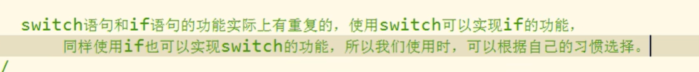

# 01_JS基础_JS简介

Java	一门编程语言

Script 脚本

Java 和 JavaScript 没啥关系

​	


​	


Chrome的v8引擎是所有浏览器引擎里对JS的实现支持最好最快的

不同浏览器用的引擎是不同的

​	

ECMAScript是标准	JavaScript是实现	这两个有等价关系


​	


DOM 和 BOM 都是提供一组对象来让我们操作浏览器

​	


​	

**JS 特点**


​	

解释型语言 

> 不用编译 写完可以直接运行	
>
> JavaScript跟python一样同解释型语言

​	

动态语言

> 对变量类型比较任意，不用定义变量类型，可以保存任何类型的变量值

​	

JS 也是面向对象语言

​	

​	

# 02_JS基础_JS的HelloWorld

​	

```html
【问题】 HTML style标签 注释样式为 <!-- --> 而不是 /* */ ？
【解决】找一下自己有没有安装jinja插件，将其禁用，就好了
		jinja一个模板插件 改变了原本vscode的注释样式

ctrl /			行注释
alt shift A		块注释
```

​	

**00_JS基础_HelloWorld.html**

```html
<!DOCTYPE html>
<html>
  <head>
    <meta charset="UTF-8" />
    <title>Document</title>
    <!-- 
        JS代码需要编写到script标签中 
            <script type="text/javascript"></script>
            <script></script>
            这两个等效 不写type属性 默认值也是type="text/javascript"
    -->
    <script>
      /*
        控制浏览器弹出一个警告框
        alert   警告
        alert("这是我的第一行JS代码"); 
      */

      /*
        让计算机在页面中输出一个内容
        document.write()    向body里输出一个内容
        document.write("看我出不出来就完事儿了");
      */

      /*
        向控制台输出一个内容
        console.log()   向控制台输出一个内容
        console.log("是陈舒舒呀！");
      */

      //自顶向下依次执行
      alert("这是我的第一行JS代码");
      document.write("看我出不出来就完事儿了");
      console.log("是陈舒舒呀！");
    </script>
    <style>
      /* <!--  -->   alt shift a
        <!--  -->   ctrl / */
      /*  */
    </style>
  </head>
  <body></body>
</html>

```

​	


​	

# 03_JS基础_js编写位置

​	

**01_JS基础_代码编写位置.html**

```html
<!DOCTYPE html>
<html>
  <head>
    <meta charset="UTF-8" />
    <title>Document</title>
    <!-- 
        可以将js代码编写到外部js文件中 然后通过script标签引入 
        写到外部文件中可以在不同的页面中同时引用 也可以利用到浏览器的缓存机制   推荐使用的方式
    -->
    <script src="js/script.js">
      /*
          script标签一旦用于引入外部文件了 就不能在编写代码了 即使编写了浏览器也会忽略
          如果需要 则可以再创建一个新的script标签用于编写内部代码
      */
      //   alert("我是内部的JS代码");   //引入外部js文件，所以失效了
    </script>
    <!-- 
        可以将js代码编写到script标签
        <script>
        alert("我是舒舒小可爱！");
        </script> 
    -->
    <script>
      alert("我是内部的JS代码"); //成功 代码自上而下执行
    </script>
  </head>
  <body>
    <!-- 
        可以将js代码编写到标签的onclick属性中 
        当我们点击按钮时 js代码才会执行
        onclick 鼠标单击
        属性值外面有双引号的，里面嵌套用单引号

        虽然可以写在标签的属性中 但是他们属于结构与行为耦合 不方便维护 所以不推荐使用
        这种形式也会用到 但不多
    -->
    <button onclick="alert('讨厌！');">点我一下</button>

    <!-- 
        可以将js代码写在超链接的href属性中
            这样当我们点击超链接时 会执行js代码
     -->
    <a href="javascript:alert('凯茵小可爱！😜');">你也点我一下</a>
    <a href="javascript:;">你也点我一下</a>
  </body>
</html>

```

​	


​	

​	

# 04_JS基础_基本语法

​	

**02_JS基础_基本语法.html**

```html
<!DOCTYPE html>
<html>
  <head>
    <meta charset="UTF-8" />
    <title>Document</title>
    <script>
      /* 
        多行注释
        JS注释
        多行注释 注释中的内容不会执行 但可以在源代码查看
        */
      // 单行注释  可以通过注释对代码进行简单的调试

      /* 
        1.JS中严格区分大小写
        2.JS中每一条语句以 分号; 结尾
            如果不写分号 浏览器会自动添加 但是会消耗资源
                而且有些时候 浏览器会加错分号 所以在开发中分号必须写
        3.JS中会忽略多个空格和换行 所以我们可以利用空格和换行对代码进行格式化
      */
    </script>
  </head>
  <body></body>
</html>

```

​	

# 05_JS基础_字面量和变量

​	

**03_JS基础_字面量和变量.html**

```html
<!DOCTYPE html>
<html>
  <head>
    <meta charset="UTF-8" />
    <title>Document</title>
    <script>
      /* 
        字面量 都是一些不可改变的值 也就是常量
            比如 1 2 3 4 5......
            字面量都是可以直接使用的 但是我们一般都不会直接使用字面量

        变量 可以用来保存字面量 而且变量的值可以任意改变的
            变量更加方便我们使用 所以在开发中都是通过变量去保存一个字面量
            而很少直接使用字面量

       */

      // 声明变量
      //在js中使用var关键字来声明一个变量
      var a;
      a = 123;
      console.log("a = " + a);
    </script>
  </head>
  <body></body>
</html>

```

​	

​	

# 06_JS基础_标识符

​	

**04_JS基础_标识符.html**

```html
<!DOCTYPE html>
<html lang="en">
  <head>
    <meta charset="UTF-8" />
    <title>Document</title>
    <script>
      /* 
        标识符
            在JS中所有的可以由我们自主命名的都可以称为是标识符
            例如 变量名 函数名 属性名都属于标识符
            命名一个标识符时需要遵守如下的规则：
                1.标识符中可以含有字母、数字、_ 、$
                2.标识符不嫩以数字开头
                3.标识符不能是ES中的关键字或保留字
                4.标识符一般都采用驼峰命名法
                    首字母小写 每个单词的开头字母大写 其余字母小写

            JS底层保存标识符实际上是采用的Unicode编码
                所以理论上讲 所有utf-8中含有的内容都可以作为标识符
        */
      var a_1_$ = 123;
      console.log(a_1_$);

      var 舒舒 = 101; //能这么命名 但千万别这么用
      console.log(舒舒);
    </script>
  </head>
  <body></body>
</html>

```

​	

​	

# 07_JS基础_字符串

​	

**05_JS基础_数据类型.html**

```html
<!DOCTYPE html>
<html lang="en">
  <head>
    <meta charset="UTF-8" />
    <title>Document</title>
    <script>
      var a = 123;
      /*
        JS的语法跟C和JAVA像 谁跟C都像 主要是JS跟Java像
        数据类型指的是字面量的类型
        在JS中一共有六种数据类型
            String      字符串
            Number      数值
            Boolean     布尔值
            Null        空值
            Underfined  未定义
            Object      对象

        除了Object属于引用数据类型 其他都是基本数据类型

      */

      /*
        String字符串
            在JS中字符串需要使用引号引起来
            使用 双引号 单引号 都可以 但是不要混着用
            引号不能嵌套 双引号不能放双引号 单引号不能放单引号

            \" 表示 "
            \' 表示 '
            \n 换行
            \t 制表符 Tab
            \\ 表示 \
      */
      var str = "hello";
      console.log(str);
      var str1 = "我说：'舒舒小可爱'",
        str2 = '我说："凯茵小可爱"'; //谁（单引号/双引号）嵌套谁（单引号/双引号）都可以

      console.log(str1 + "\n" + str2);

      /*
        在字符串中我们可以使用 \ 作为转义字符
            当表示一些特殊符号是可以使用 \ 进行
      */
      str3 = '我说："舒舒小可爱"';
      console.log(str3);

      str4 = "\\\\"; //俩 \ 表示一个\    第一个 \ 是转义
      console.log("\n" + str4);
    </script>
  </head>
  <body></body>
</html>

```

​	


​	

​	

# 08_JS基础_Number

​	

**06_JS基础_Number.html**

```html
<!DOCTYPE html>
<html lang="en">
  <head>
    <meta charset="UTF-8" />
    <title>Document</title>
    <script>
      /* 
            在JS中所有的数值都是Number类型
            包括整数和浮点数

            整数和浮点数都是Number类型
        */
      var a = 123;
      var b = "123";
      console.log(a);
      console.log(b);
      //输出结果都是123 但本质数据类型不同

      /* 
        可以使用一个运算符typeof
            来检查一个变量的类型
        语法：typeof 变量
        检查字符串时 会返回String
        检查数值时 会返回number
      */
      console.log(typeof a); //number
      console.log(typeof b); //String

      //   console.log(); 本身就自带换行
      //    JS中可以表示的数字的最大值 Number.MAX_VALUE
      //打印输出比最大值还大的值 输出到控制台的结果是 Infinity 表示正无穷
      // -Infinity  负无穷
      //使用typeof检查Infinity也会返回Number
      console.log(Number.MAX_VALUE); //Number的最大值为：2^1024（1.7976931348623157e+308）

      a = "abc" * "bcd";
      console.log(a); //NaN 不是数字
      //NaN 是一个特殊的数字 表示Not A Number

      a = NaN;
      console.log(a + "\t" + typeof a); // a的数据类型还是number
      // 使用typeof检查NaN也会返回number

      a = Number.MIN_VALUE;
      console.log(a); //5e-324 = 2^(-1074)  表示0以上的最小值
      //Number.MIN_VALUE 大于0的最小值

      /* 
        在JS中整数的运算基本可以保证精确
        如果使用JS进行浮点运算 可能得到一个不精确的结果
        所以千万不要使用JS进行对精确度要求比较高的运算
      */
      var c = 0.1 + 0.2;
      console.log(c); //0.30000000000000004
    </script>
  </head>
  <body></body>
</html>

```


​	

# 09_JS基础_布尔值


​	

# 10_JS基础_Null和Undefined

​	

**08_JS基础_Null和Undefined.html**

```html
<!DOCTYPE html>
<html lang="en">
  <head>
    <meta charset="UTF-8" />
    <title>Document</title>
    <script>
      /* 
        Null（空值）类型的值只有一个 就是null
        null这个值专门用来表示一个为空的对象
        使用typeof检查一个null值时 会返回object

        Undefined（未定义）类型的值只有一个 就是undefined
            当声明一个变量 但是并不给变量赋值时 它的值就是Undefined
            使用typeof检查一个undefined时也会返回undefined
        */
      var a = null;
      console.log(typeof a); //object

      var b;
      var c = undefined;
      console.log(b + " " + c); //undefined undefined
    </script>
  </head>
  <body></body>
</html>

```

​	

​	

# 11_JS基础_强制类型转换—String

​	

**09_JS基础_强制类型转换.html**

```html
<!DOCTYPE html>
<html lang="en">
  <head>
    <meta charset="UTF-8" />
    <title>Document</title>
  </head>
  <script>
    /* 
        强制类型转换
            指将一个数据类型强制转换为其他的数据类型
            类型转换主要指 将其他的数据类型 转换为 String Number Boolean
    */

    /*
        将其他数据类型转换成String
        方式一：
            调用被转换数据类型的toString()方法
            该方法不会影响到原变量 它会将转换的结果返回
            但是注意：null和undefined这两个值没有toString()方法，
                如果调用它们的方法 会报错

        方式二：
            调用String()函数 并将被转换的数据作为参数传递给函数
            使用String()函数做强制类型转换时
                对于Number和Boolean实际上就是调用的toString()方法
                但是对于null和undefined 就不会调用toString()方法
                    它会将null 直接转换为 "null"
                    将undefined 直接转换为 "undefined"
    */
    var a = 123;
    console.log(typeof a + "  " + a); //number  123
    a.toString();
    console.log(typeof a + "  " + a); //number  123 结果还是没变
    var b = a.toString();
    console.log(typeof b + "  " + b); //string  123 需要一个新变量来承接 成功返回String

    //如果想直接改变a的数据类型 拿a承接就行啦
    a = a.toString();
    console.log(typeof a + "  " + a); //string  123

    a = null;
    // a = a.toString();
    // console.log(typeof a);  //error

    a = undefined;
    // a = a.toString();
    // console.log(typeof a);  //error
    // console.log(a);

    a = 123;
    console.log(typeof a);
    console.log(a);

    //调用String()函数 来将a转换成字符串
    // String(a);  //这么写 a还是number 要重新赋值
    a = null;
    a = undefined;
    a = true;
    a = String(a);

    console.log(typeof a);
    console.log(a);
  </script>
  <body></body>
</html>

```

​	

​	

# 12_JS基础_强制类型转换—Number


​	**10_JS基础_转换为Number.html**

```html
<!DOCTYPE html>
<html lang="en">
  <head>
    <meta charset="UTF-8" />
    <title>Document</title>
    <script>
      /* 
            将其他的数据类型转换成Number
            转换方式一：
                使用Number()函数
                    字符串 --> 数字
                        1.如果是纯数字的字符串 则直接将转换成数字
                        2.如果字符串中有非数字的内容 则转换成NaN
                        3.如果字符串是一个空串或者是一个全是空格的字符串 则转换为0
                    
                    布尔 --> 数字
                        true 转成1
                        false 转成0
                    Null 转成数字  0
                    undefined 转换数字 NaN

            转换方式二：
                这种方式专门用来对付字符串
                parseInt() 把一个字符串转换为一个整数
                parseFloat() 把一个字符串转换为一个浮点数
        */

      var a = "10abc";
      a = ""; //number  0
      a = "        "; ////number  0
      a = true; //number  1
      a = false; //number  0
      a = null; //number  0
      a = undefined; //number  NaN

      //调用Number()函数来讲a转换为Number类型
      a = Number(a);

      a = "1234px123"; //number  1234
      a = "123.456"; //number  123
      //调用parseInt()函数将a转换为Number
      /* 
        parseInt()可以将一个字符串中的有效的整数内容取出去
            然后转换为Number（从左往右 碰到非数字则停止提取）
      */
      a = parseInt(a);

      /* 
        parseFloat()作用和parseInt()类似 不同的是它可以获得有效的小数
      */
      a = "123.456px";
      a = parseFloat(a); //number  123.456

      /* 
        如果对非String使用parseInt()或parseFloat()
            它会先将其转换为String 然后再操作
      */
      a = true;
      a = parseInt(a); //number  NaN
      //等同于 a = parseInt("true");

      //可以用parseInt()这么取整
      a = 123.456;
      a = parseInt(a); //number  123

      console.log(typeof a + "  " + a); // number  NaN    NaN 属于Number数据类型
    </script>
  </head>
  <body></body>
</html>

```

​	

​	

# 13_JS基础_其他进制的数字

​	

**11_JS基础_其他的进制的数字.html**

```html
<!DOCTYPE html>
<html lang="en">
  <head>
    <meta charset="UTF-8" />
    <title>Document</title>
    <script>
      var a = 123;
      /* 
            在js中 如果需要表示16进制的数字 则需要以0x开头
                8进制以0开头
                如果要表示2进制的数字 则需要以0b开头
                    但是 不是所有的浏览器都支持
        */
      //十六进制
      a = 0x10; //16

      //八进制
      a = 070; //56

      //二进制
      a = 0b10; //2

      //Google Chrome是当作10进制解析
      //像"070"这种字符串 有些浏览器会当成8进制解析 有些当成10进制解析
      a = "070";
      //可以在parseInt()中传递第二个参数，来指定数字的进制
      a = parseInt(a, 8);
      console.log(a); //无论几进制 输出都以10进制输出
    </script>
  </head>
  <body></body>
</html>

```

​	

​	

# 14_JS基础_转换成Boolean

​	

**12_JS基础_转换成Boolean.html**

```html
<!DOCTYPE html>
<html lang="en">
  <head>
    <meta charset="UTF-8" />
    <title>Document</title>
    <script>
      /* 
            将其他的数据类型转换为Boolean
                使用Boolea()函数
                    数字 -->  布尔
                        除了0和NaN是false 其余的都是true
                        
                    字符串 --> 布尔
                        除了空串 其余的都是true

                    null和undefined都会转换成false

                    对象也会转换为true
        */
      a = null;
      a = 0.1; //true
      a = Boolean(a);
      console.log(typeof a + "\t" + a);
    </script>
  </head>
  <body></body>
</html>

```

​	

​	

# 15_JS基础_算数运算符

​	

**13_JS基础_运算符.html**

```html
<!DOCTYPE html>
<html lang="en">
  <head>
    <meta charset="UTF-8" />
    <title>Document</title>
    <script>
      /* 
            运算符也叫操作符
                通过运算符可以对一个或多个值进行运算 并获取运算结果
                比如：typeof就是运算符 可以来获取一个值的类型
                    它会将该值的类型以字符串的形式返回
                    number string boolean undefined object

            算数运算符
                当对非Number类型的值进行运算时 会将在这些值转换成Number 然后再运算
                null转数字是0
                任何值和NaN做运算都得NaN
                *
                /
                +
                    对number是运算 对string是连接
                    任何值和字符串做加法运算 都会先转换为字符串 然后再和字符串做拼串连接的操作
                -
                %
        */
      var a = 123;
      var reslut = typeof a;

      console.log(typeof a + "\t" + typeof reslut); //number	string

      a = true + " hello";
      console.log(a); //true hello

      //巧妙将变量变为字符串(隐式类型转换) 由浏览器自动完成 实际上它也是调用String()函数
      var c = 123;
      c = null; //string  null
      c = c + "";

      //小练习
      c = 1 + 2 + "3"; //string  33  从左往右计算
      c = "1" + 2 + 3; //string  123  从左往右计算

      c = 2 * "8"; //number  16  运算会转换成Number
      c = 2 * undefined; //number  NaN
      c = 2 * null; //number  0
      c = 2 * false; //number  0

      /* 
        任何值做 - * / 运算时都会自动转换成Number
         我们可以利用这一特点做隐式的类型转换
            可以通过为一个值 -0 *1 /1 来将其转换成Number
            原理和Number()函数一样 使用起来更加简单
      */
      console.log(typeof c + "  " + c);
    </script>
  </head>
  <body></body>
</html>

```

​	

​	

# 16_JS基础_一元运算符

​	

**14_JS基础_一元运算符.html**

```html
<!DOCTYPE html>
<html lang="en">
  <head>
    <meta charset="UTF-8" />
    <title>Document</title>
    <script>
      /* 
            一元运算符 只需要一个操作数

            对于非Number类型的值
                它会先转换成Number 然后在运算
                可以对一个其他的数据类型使用+ 来将其转换为number
        */
      a = "19"; //string  19
      a = +a; //number  19
      a = true;
      a = +a; //number  1
      //   console.log(typeof a + "  " + a);

      var result = 1 + "2" + 3; //string  123
      var result = 1 + +"2" + 3; //number  6     一元运算符优先级高于二元运算符
      //也是隐式类型转换
      console.log(typeof result + "  " + result);
    </script>
  </head>
  <body></body>
</html>

```

​	

​	

# 17_JS基础_自增和自减

​	


​	

**15_JS基础_自增和自减.html**

```html
<!DOCTYPE html>
<html lang="en">
  <head>
    <meta charset="UTF-8" />
    <title>Document</title>
    <script>
      var d = 20;

      //小练习
      //20 + 22 + 22
      var result = d++ + ++d + d;
      console.log("result = " + result);

      //自增自减不用变量承接赋值 直接写就行
      d++; //等同于 d = d + 1;
      ++d; //等同于 d = d + 1;

      //自减原理跟自加相同 这里便不赘述了
    </script>
  </head>
  <body></body>
</html>

```

​	

​	

# 18_JS基础_自增练习


​	

​	

# 19_JS基础_逻辑运算符

​	

**16_JS基础_逻辑运算符.html**

```html
<!DOCTYPE html>
<html lang="en">
  <head>
    <meta charset="UTF-8" />
    <title>Document</title>
    <script>
      /* 
            JS中提供了3种逻辑运算
            && 与
                有一个false就返回false
                JS中的"与"属于短路的与
                    如果第一个值为false 则不会看第二个值

            || 或
                有一个true就返回true
                JS中的"或"属于短路的与
                如果第一个值为true 则不会看第二个值

            !  非
                对布尔值进行取反操作
                如果对非布尔值进行取反 则会将其转换为布尔值 然后再取反
                 所以我们可以利用该特点 来将一个其他的数据类型转换为布尔值
                 可以为一个任意数据类型取两次反 来将其转换为布尔值
                 原理跟Boolean()函数一样
        */
      var a = false;
      a = !a; //true
      //   console.log(a);

      //第一个值为true 会检查第二个值
      //false则直接略过
      //   true && alert("看我出不出来！！");   //出得来
      false && alert("看我出不出来！！"); //出不来

      //第一个值为false 会检查第二个值
      //true则直接略过
      //   false && alert("看我出不出来！！");   //出得来
      true || alert("看我出不出来！！"); //出不来
    </script>
  </head>
  <body></body>
</html>

```

​	

​	

# 20_JS基础_非布尔值的与或运算

或运算特点


它相当于只看一半告诉你结果 真的懒~

​	

**17_JS基础_非布尔值的与或运算.html**

```html
<!DOCTYPE html>
<html lang="en">
  <head>
    <meta charset="UTF-8" />
    <title>Document</title>
    <script>
      /* 
            && || 非布尔值的情况
                对于非布尔值进行与或运算时
                    会先将其转换为布尔值 然后再运算 并且返回原值
                与运算：
                 如果第一个值为true 则必然返回第二个值
                 如果第一个值为false 则必然返回第一个值

                或运算：（与 与运算刚好相反 其实看的是短路与 或进行考虑的）
                    例如或 第一个是false 甭管你后面是啥，直接给你返回第二个值
                    它相当于只看一半告诉你结果 真的懒~
                    如果第一个值为true 则必然返回第一个值
                    如果第一个值为false 则必然返回第二个值


        */
      //true && true
      //与运算 如果两个值都是true 则返回后边的
      var result = 5 && 6; //返回6

      //false && true
      result = 0 && 2; //0
      result = 2 && 0; //0

      //false && false
      //与运算 两个都是false则返回靠前的值
      result = NaN && 0; //返回NaN
      result = 0 && NaN; //返回0
    </script>
  </head>
  <body></body>
</html>

```

​	

​	

# 21_JS基础_赋值运算符


​	

​	

# 22_JS基础_关系运算符


**18_JS基础_关系运算符.html**

```html
<!DOCTYPE html>
<html lang="en">
  <head>
    <meta charset="UTF-8" />
    <title>Document</title>
    <script>
      /* 
            关系运算符 关系成立为true 否则为false 
                < > = <= >=
            任何值和NaN做任何比较 结果都是false

            非数值的情况
                对于非数值进行比较时 会将其转换为数字然后再比较
                如果符号两侧的值都是字符串时 不会将其转换为数字进行比较
                    而会分别比较字符串中字符的Unicode编码
        */

      //比较两个字符串时 比较的是字符串的字符编码
      console.log("1" < "5"); //true
      console.log("11" < "5"); //true   回到这里 我们可以知道 字符1和5先比较 5大 所以会返回true 后面不用看了
      console.log(11 < "5"); //false
      console.log("a" > "b"); //false

      //比较字符编码时 是一位一位进行比较
      //如果两位一样 则比较下一位 所以借用它来对英文进行排序
      console.log("abc" < "b"); //true
      console.log("abc" < "bcd"); //true
      //比较中文时 没有意义

      //注意：比较两个字符串型的数字 一定要转型！
      console.log("11" < "5"); //true
      console.log("11" < +"5"); //false
    </script>
  </head>
  <body></body>
</html>

```

​	

​	

# 23_JS基础_Unicode编码表


**19_JS基础_Unicode编码.html**

```html
<!DOCTYPE html>
<html lang="en">
  <head>
    <meta charset="UTF-8" />
    <title>Document</title>
    <script>
      /* 
            在字符串中使用转义字符输入Unicode编码
            \u四位编码
        */
      console.log("\u0054"); //T
      console.log("\u2620"); //骷髅头☠
    </script>
  </head>
  <body>
    <!-- 
        在网页中使用Unicode编码
        &#编码; 这里的编码需要的是10进制的
            由于Unicode编码是16进制的 所以需要转成10进制的

     -->
    <!-- 0x2620 对应的十进制：9760 -->
    <h1 style="font-size: 100px">&#9760;</h1>
  </body>
</html>

```

​	


​	

​	

# 24_JS基础_相等运算符

​	

**20_JS基础_相等运算符.html**

```html
<!DOCTYPE html>
<html lang="en">
  <head>
    <meta charset="UTF-8" />
    <title>Document</title>
    <script>
      /*
            使用 == 做相等运算
                相等返回true
                不相等返回false

            使用 == 来比较两个值 如果值的类型不同
                则会自动进行类型转换 将其转换为相同的类型 然后再比较

            != 和 == 正好相反 这里不赘述

            ===
                全等
                    用来判断两个值是否全等 它和全等类似 不同的是它不会做自动的类型转换
                        如果两个值的类型不同 直接返回false
            !==
                不全等
                    用来判断两个值是否不全等 它和不全等类似 不同的是它不会做自动的类型转换
                        如果两个值的类型不同 直接返回true

        */
      console.log(1 == 1); //相等符中间不能有空格
      console.log("1" == 1); //true

      console.log(null == 0); //false 这里null没转成number

      /* 
        undefined 衍生自null
         所以这两个值做相等判断时 会返回true
      */
      console.log(undefined == null); //true

      /* 
        NaN不和任何值相等 包括它本身
      */
      console.log(NaN == NaN); //false
      console.log(NaN == undefined); //false

      var b = NaN;
      console.log(b == NaN); //false
      /* 
        但我们可以通过isNaN()函数来判断一个值是否是NaN
      */
      console.log(isNaN(b)); //true
    </script>
  </head>
  <body></body>
</html>

```

​	

​	

# 25_JS基础_条件运算符

​	

**21_JS基础_条件运算符.html**

```html
<!DOCTYPE html>
<html lang="en">
  <head>
    <meta charset="UTF-8" />
    <title>Document</title>
    <script>
      /* 
        条件运算符也叫三元运算符
        语法：
            条件表达式 ? 语句1 : 语句2

          执行的流程
            条件运算符在执行时 首先对条件表达式进行求值
                如果该值为true 则执行语句1 并返回执行结果
                如果该值为false 则执行语句2 并返回执行结果

            如果条件的表达式的求值结果是一个非布尔值
                会将其转换成布尔值然后在运算
        */

      //利用三元运算符 求3个值中的最大值
      var a = 10,
        b = 200,
        c = 30;
      var max = a > b ? a : b;
      max = max > c ? max : c;

      //等同于这么写
      max = a > b ? (a > c ? a : c) : b > c ? b : c; //但这样太复杂 不推荐 不方便阅读
      console.log(max); //30

      console.log("hello" ? alert("语句1") : alert("语句2")); //这里会把hello转换成布尔值 true
      console.log("" ? alert("语句1") : alert("语句2")); //这里会把空串""转换成布尔值 false
    </script>
  </head>
  <body></body>
</html>

```

​	

​	

# 26_JS基础_运算符的优先级

​	

​	

​	

# 27_JS基础_代码块


# 28_JS基础_if语句（一）


# 29_JS基础_if语句（二）


 ==**画圈部分很重要**==

写if-else if-else语句注意条件判断的执行顺序，别写成死代码（就是除了if 下面语句永远不会执行的就是死代码）


# 30_JS基础_练习

练习1


练习1-参考答案


​	

练习2


练习2-参考答案


​	

练习3


prompt()函数的返回值是String类型的 该题是排序比较大小 需要number数据类型


需要在prompt前面加上+ 进行类型转换


下面语句同理

​	

**23_JS基础_练习.html**

```html
<!DOCTYPE html>
<html lang="en">
  <head>
    <meta charset="UTF-8" />
    <title>Document</title>
    <script>
      /* 
            prompt()可以弹出一个提示框 该提示框中会带有一个文本框
              用户可以在文本框中输入一段内容 该函数需要一个字符串作为参数
              该字符串将会作为提示框的提示文字

            用户输入的内容将会作为函数的返回值返回 可以定义一个变量来接受该内容

        */
      var score = prompt("请输入舒舒的期末成绩: ");
      alert(score);
    </script>
  </head>
  <body></body>
</html>

```

​	

**注意点**


如果这里判断条件表达式里写成了赋值 而不是等于 （也就是if(10) ）我们知道10转换为布尔值是true 也就是说这里的if语句是if(true) 该语句永远会执行

​	

​	

# 31 if 练习一

# 32 if 练习二

​	

# 33_JS基础_条件分支语句


注意这里需是 **全等比较**


如果num = 3	则不会执行case "3"	因为一个是Number 一个是String

> 每一个case都需要写break（确保只执行当前case的语句） 除非你想穿透执行 上图中有说明 比较结果为true 则从当前case处开始执行代码 switch以后的所有代码都会执行（遇到break语句则跳出）
>
> switch最后一个的（case/default）虽说可以不写break 但还是要写 强调一下~ 规范化很重要

​	


如果所有的比较结果都为false 则只执行 default 后的语句

​	



switch用得少 if用的多

​	

​	

# 34_JS基础_switch练习

问题


【注意】JS跟其他语言有点不同 88/10=8.8 不会四舍五入 选择case 8 这里我们需要用parseInt() 进行强制类型转换为Int型

​	

方法一


​	

方法二


这种用的多

​	

​	

# 35_JS基础_while循环

