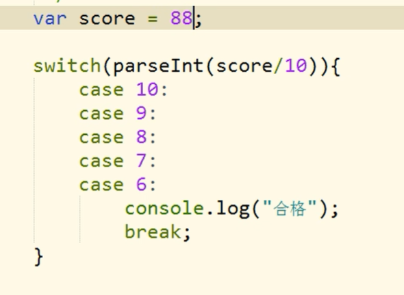
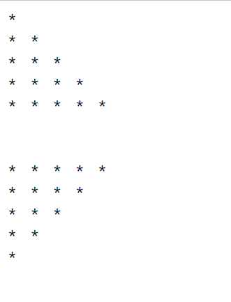
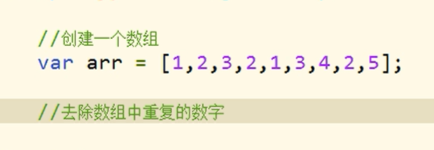

# 01_JS基础_JS简介

Java	一门编程语言

Script 脚本

Java 和 JavaScript 没啥关系

​	


​	


Chrome的v8引擎是所有浏览器引擎里对JS的实现支持最好最快的

不同浏览器用的引擎是不同的

​	

ECMAScript是标准	JavaScript是实现	这两个有等价关系


​	


DOM 和 BOM 都是提供一组对象来让我们操作浏览器

​	


​	

**JS 特点**


​	

解释型语言 

> 不用编译 写完可以直接运行	
>
> JavaScript跟python一样同解释型语言

​	

动态语言

> 对变量类型比较任意，不用定义变量类型，可以保存任何类型的变量值

​	

JS 也是面向对象语言

​	

​	

# 02_JS基础_JS的HelloWorld

​	

```html
【问题】 HTML style标签 注释样式为 <!-- --> 而不是 /* */ ？
【解决】找一下自己有没有安装jinja插件，将其禁用，就好了
		jinja一个模板插件 改变了原本vscode的注释样式

ctrl /			行注释
alt shift A		块注释
```

​	

**00_JS基础_HelloWorld.html**

```html
<!DOCTYPE html>
<html>
  <head>
    <meta charset="UTF-8" />
    <title>Document</title>
    <!-- 
        JS代码需要编写到script标签中 
            <script type="text/javascript"></script>
            <script></script>
            这两个等效 不写type属性 默认值也是type="text/javascript"
    -->
    <script>
      /*
        控制浏览器弹出一个警告框
        alert   警告
        alert("这是我的第一行JS代码"); 
      */

      /*
        让计算机在页面中输出一个内容
        document.write()    向body里输出一个内容
        document.write("看我出不出来就完事儿了");
      */

      /*
        向控制台输出一个内容
        console.log()   向控制台输出一个内容
        console.log("是陈舒舒呀！");
      */

      //自顶向下依次执行
      alert("这是我的第一行JS代码");
      document.write("看我出不出来就完事儿了");
      console.log("是陈舒舒呀！");
    </script>
    <style>
      /* <!--  -->   alt shift a
        <!--  -->   ctrl / */
      /*  */
    </style>
  </head>
  <body></body>
</html>

```

​	


​	

# 03_JS基础_js编写位置

​	

**01_JS基础_代码编写位置.html**

```html
<!DOCTYPE html>
<html>
  <head>
    <meta charset="UTF-8" />
    <title>Document</title>
    <!-- 
        可以将js代码编写到外部js文件中 然后通过script标签引入 
        写到外部文件中可以在不同的页面中同时引用 也可以利用到浏览器的缓存机制   推荐使用的方式
    -->
    <script src="js/script.js">
      /*
          script标签一旦用于引入外部文件了 就不能在编写代码了 即使编写了浏览器也会忽略
          如果需要 则可以再创建一个新的script标签用于编写内部代码
      */
      //   alert("我是内部的JS代码");   //引入外部js文件，所以失效了
    </script>
    <!-- 
        可以将js代码编写到script标签
        <script>
        alert("我是舒舒小可爱！");
        </script> 
    -->
    <script>
      alert("我是内部的JS代码"); //成功 代码自上而下执行
    </script>
  </head>
  <body>
    <!-- 
        可以将js代码编写到标签的onclick属性中 
        当我们点击按钮时 js代码才会执行
        onclick 鼠标单击
        属性值外面有双引号的，里面嵌套用单引号

        虽然可以写在标签的属性中 但是他们属于结构与行为耦合 不方便维护 所以不推荐使用
        这种形式也会用到 但不多
    -->
    <button onclick="alert('讨厌！');">点我一下</button>

    <!-- 
        可以将js代码写在超链接的href属性中
            这样当我们点击超链接时 会执行js代码
     -->
    <a href="javascript:alert('凯茵小可爱！😜');">你也点我一下</a>
    <a href="javascript:;">你也点我一下</a>
  </body>
</html>

```

​	


​	

​	

# 04_JS基础_基本语法

​	

**02_JS基础_基本语法.html**

```html
<!DOCTYPE html>
<html>
  <head>
    <meta charset="UTF-8" />
    <title>Document</title>
    <script>
      /* 
        多行注释
        JS注释
        多行注释 注释中的内容不会执行 但可以在源代码查看
        */
      // 单行注释  可以通过注释对代码进行简单的调试

      /* 
        1.JS中严格区分大小写
        2.JS中每一条语句以 分号; 结尾
            如果不写分号 浏览器会自动添加 但是会消耗资源
                而且有些时候 浏览器会加错分号 所以在开发中分号必须写
        3.JS中会忽略多个空格和换行 所以我们可以利用空格和换行对代码进行格式化
      */
    </script>
  </head>
  <body></body>
</html>

```

​	

# 05_JS基础_字面量和变量

​	

**03_JS基础_字面量和变量.html**

```html
<!DOCTYPE html>
<html>
  <head>
    <meta charset="UTF-8" />
    <title>Document</title>
    <script>
      /* 
        字面量 都是一些不可改变的值 也就是常量
            比如 1 2 3 4 5......
            字面量都是可以直接使用的 但是我们一般都不会直接使用字面量

        变量 可以用来保存字面量 而且变量的值可以任意改变的
            变量更加方便我们使用 所以在开发中都是通过变量去保存一个字面量
            而很少直接使用字面量

       */

      // 声明变量
      //在js中使用var关键字来声明一个变量
      var a;
      a = 123;
      console.log("a = " + a);
    </script>
  </head>
  <body></body>
</html>

```

​	

​	

# 06_JS基础_标识符

​	

**04_JS基础_标识符.html**

```html
<!DOCTYPE html>
<html lang="en">
  <head>
    <meta charset="UTF-8" />
    <title>Document</title>
    <script>
      /* 
        标识符
            在JS中所有的可以由我们自主命名的都可以称为是标识符
            例如 变量名 函数名 属性名都属于标识符
            命名一个标识符时需要遵守如下的规则：
                1.标识符中可以含有字母、数字、_ 、$
                2.标识符不嫩以数字开头
                3.标识符不能是ES中的关键字或保留字
                4.标识符一般都采用驼峰命名法
                    首字母小写 每个单词的开头字母大写 其余字母小写

            JS底层保存标识符实际上是采用的Unicode编码
                所以理论上讲 所有utf-8中含有的内容都可以作为标识符
        */
      var a_1_$ = 123;
      console.log(a_1_$);

      var 舒舒 = 101; //能这么命名 但千万别这么用
      console.log(舒舒);
    </script>
  </head>
  <body></body>
</html>

```

​	

​	

# 07_JS基础_字符串

​	

**05_JS基础_数据类型.html**

```html
<!DOCTYPE html>
<html lang="en">
  <head>
    <meta charset="UTF-8" />
    <title>Document</title>
    <script>
      var a = 123;
      /*
        JS的语法跟C和JAVA像 谁跟C都像 主要是JS跟Java像
        数据类型指的是字面量的类型
        在JS中一共有六种数据类型
            String      字符串
            Number      数值
            Boolean     布尔值
            Null        空值
            Underfined  未定义
            Object      对象

        除了Object属于引用数据类型 其他都是基本数据类型

      */

      /*
        String字符串
            在JS中字符串需要使用引号引起来
            使用 双引号 单引号 都可以 但是不要混着用
            引号不能嵌套 双引号不能放双引号 单引号不能放单引号

            \" 表示 "
            \' 表示 '
            \n 换行
            \t 制表符 Tab
            \\ 表示 \
      */
      var str = "hello";
      console.log(str);
      var str1 = "我说：'舒舒小可爱'",
        str2 = '我说："凯茵小可爱"'; //谁（单引号/双引号）嵌套谁（单引号/双引号）都可以

      console.log(str1 + "\n" + str2);

      /*
        在字符串中我们可以使用 \ 作为转义字符
            当表示一些特殊符号是可以使用 \ 进行
      */
      str3 = '我说："舒舒小可爱"';
      console.log(str3);

      str4 = "\\\\"; //俩 \ 表示一个\    第一个 \ 是转义
      console.log("\n" + str4);
    </script>
  </head>
  <body></body>
</html>

```

​	


​	

​	

# 08_JS基础_Number

​	

**06_JS基础_Number.html**

```html
<!DOCTYPE html>
<html lang="en">
  <head>
    <meta charset="UTF-8" />
    <title>Document</title>
    <script>
      /* 
            在JS中所有的数值都是Number类型
            包括整数和浮点数

            整数和浮点数都是Number类型
        */
      var a = 123;
      var b = "123";
      console.log(a);
      console.log(b);
      //输出结果都是123 但本质数据类型不同

      /* 
        可以使用一个运算符typeof
            来检查一个变量的类型
        语法：typeof 变量
        检查字符串时 会返回String
        检查数值时 会返回number
      */
      console.log(typeof a); //number
      console.log(typeof b); //String

      //   console.log(); 本身就自带换行
      //    JS中可以表示的数字的最大值 Number.MAX_VALUE
      //打印输出比最大值还大的值 输出到控制台的结果是 Infinity 表示正无穷
      // -Infinity  负无穷
      //使用typeof检查Infinity也会返回Number
      console.log(Number.MAX_VALUE); //Number的最大值为：2^1024（1.7976931348623157e+308）

      a = "abc" * "bcd";
      console.log(a); //NaN 不是数字
      //NaN 是一个特殊的数字 表示Not A Number

      a = NaN;
      console.log(a + "\t" + typeof a); // a的数据类型还是number
      // 使用typeof检查NaN也会返回number

      a = Number.MIN_VALUE;
      console.log(a); //5e-324 = 2^(-1074)  表示0以上的最小值
      //Number.MIN_VALUE 大于0的最小值

      /* 
        在JS中整数的运算基本可以保证精确
        如果使用JS进行浮点运算 可能得到一个不精确的结果
        所以千万不要使用JS进行对精确度要求比较高的运算
      */
      var c = 0.1 + 0.2;
      console.log(c); //0.30000000000000004
    </script>
  </head>
  <body></body>
</html>

```


​	

# 09_JS基础_布尔值


​	

# 10_JS基础_Null和Undefined

​	

**08_JS基础_Null和Undefined.html**

```html
<!DOCTYPE html>
<html lang="en">
  <head>
    <meta charset="UTF-8" />
    <title>Document</title>
    <script>
      /* 
        Null（空值）类型的值只有一个 就是null
        null这个值专门用来表示一个为空的对象
        使用typeof检查一个null值时 会返回object

        Undefined（未定义）类型的值只有一个 就是undefined
            当声明一个变量 但是并不给变量赋值时 它的值就是Undefined
            使用typeof检查一个undefined时也会返回undefined
        */
      var a = null;
      console.log(typeof a); //object

      var b;
      var c = undefined;
      console.log(b + " " + c); //undefined undefined
    </script>
  </head>
  <body></body>
</html>

```

​	

​	

# 11_JS基础_强制类型转换—String

​	

**09_JS基础_强制类型转换.html**

```html
<!DOCTYPE html>
<html lang="en">
  <head>
    <meta charset="UTF-8" />
    <title>Document</title>
  </head>
  <script>
    /* 
        强制类型转换
            指将一个数据类型强制转换为其他的数据类型
            类型转换主要指 将其他的数据类型 转换为 String Number Boolean
    */

    /*
        将其他数据类型转换成String
        方式一：
            调用被转换数据类型的toString()方法
            该方法不会影响到原变量 它会将转换的结果返回
            但是注意：null和undefined这两个值没有toString()方法，
                如果调用它们的方法 会报错

        方式二：
            调用String()函数 并将被转换的数据作为参数传递给函数
            使用String()函数做强制类型转换时
                对于Number和Boolean实际上就是调用的toString()方法
                但是对于null和undefined 就不会调用toString()方法
                    它会将null 直接转换为 "null"
                    将undefined 直接转换为 "undefined"
    */
    var a = 123;
    console.log(typeof a + "  " + a); //number  123
    a.toString();
    console.log(typeof a + "  " + a); //number  123 结果还是没变
    var b = a.toString();
    console.log(typeof b + "  " + b); //string  123 需要一个新变量来承接 成功返回String

    //如果想直接改变a的数据类型 拿a承接就行啦
    a = a.toString();
    console.log(typeof a + "  " + a); //string  123

    a = null;
    // a = a.toString();
    // console.log(typeof a);  //error

    a = undefined;
    // a = a.toString();
    // console.log(typeof a);  //error
    // console.log(a);

    a = 123;
    console.log(typeof a);
    console.log(a);

    //调用String()函数 来将a转换成字符串
    // String(a);  //这么写 a还是number 要重新赋值
    a = null;
    a = undefined;
    a = true;
    a = String(a);

    console.log(typeof a);
    console.log(a);
  </script>
  <body></body>
</html>

```

​	

​	

# 12_JS基础_强制类型转换—Number


​	**10_JS基础_转换为Number.html**

```html
<!DOCTYPE html>
<html lang="en">
  <head>
    <meta charset="UTF-8" />
    <title>Document</title>
    <script>
      /* 
            将其他的数据类型转换成Number
            转换方式一：
                使用Number()函数
                    字符串 --> 数字
                        1.如果是纯数字的字符串 则直接将转换成数字
                        2.如果字符串中有非数字的内容 则转换成NaN
                        3.如果字符串是一个空串或者是一个全是空格的字符串 则转换为0
                    
                    布尔 --> 数字
                        true 转成1
                        false 转成0
                    Null 转成数字  0
                    undefined 转换数字 NaN

            转换方式二：
                这种方式专门用来对付字符串
                parseInt() 把一个字符串转换为一个整数
                parseFloat() 把一个字符串转换为一个浮点数
        */

      var a = "10abc";
      a = ""; //number  0
      a = "        "; ////number  0
      a = true; //number  1
      a = false; //number  0
      a = null; //number  0
      a = undefined; //number  NaN

      //调用Number()函数来讲a转换为Number类型
      a = Number(a);

      a = "1234px123"; //number  1234
      a = "123.456"; //number  123
      //调用parseInt()函数将a转换为Number
      /* 
        parseInt()可以将一个字符串中的有效的整数内容取出去
            然后转换为Number（从左往右 碰到非数字则停止提取）
      */
      a = parseInt(a);

      /* 
        parseFloat()作用和parseInt()类似 不同的是它可以获得有效的小数
      */
      a = "123.456px";
      a = parseFloat(a); //number  123.456

      /* 
        如果对非String使用parseInt()或parseFloat()
            它会先将其转换为String 然后再操作
      */
      a = true;
      a = parseInt(a); //number  NaN
      //等同于 a = parseInt("true");

      //可以用parseInt()这么取整
      a = 123.456;
      a = parseInt(a); //number  123

      console.log(typeof a + "  " + a); // number  NaN    NaN 属于Number数据类型
    </script>
  </head>
  <body></body>
</html>

```

​	

​	

# 13_JS基础_其他进制的数字

​	

**11_JS基础_其他的进制的数字.html**

```html
<!DOCTYPE html>
<html lang="en">
  <head>
    <meta charset="UTF-8" />
    <title>Document</title>
    <script>
      var a = 123;
      /* 
            在js中 如果需要表示16进制的数字 则需要以0x开头
                8进制以0开头
                如果要表示2进制的数字 则需要以0b开头
                    但是 不是所有的浏览器都支持
        */
      //十六进制
      a = 0x10; //16

      //八进制
      a = 070; //56

      //二进制
      a = 0b10; //2

      //Google Chrome是当作10进制解析
      //像"070"这种字符串 有些浏览器会当成8进制解析 有些当成10进制解析
      a = "070";
      //可以在parseInt()中传递第二个参数，来指定数字的进制
      a = parseInt(a, 8);
      console.log(a); //无论几进制 输出都以10进制输出
    </script>
  </head>
  <body></body>
</html>

```

​	

​	

# 14_JS基础_转换成Boolean

​	

**12_JS基础_转换成Boolean.html**

```html
<!DOCTYPE html>
<html lang="en">
  <head>
    <meta charset="UTF-8" />
    <title>Document</title>
    <script>
      /* 
            将其他的数据类型转换为Boolean
                使用Boolea()函数
                    数字 -->  布尔
                        除了0和NaN是false 其余的都是true
                        
                    字符串 --> 布尔
                        除了空串 其余的都是true

                    null和undefined都会转换成false

                    对象也会转换为true
        */
      a = null;
      a = 0.1; //true
      a = Boolean(a);
      console.log(typeof a + "\t" + a);
    </script>
  </head>
  <body></body>
</html>

```

​	

​	

# 15_JS基础_算数运算符

​	

**13_JS基础_运算符.html**

```html
<!DOCTYPE html>
<html lang="en">
  <head>
    <meta charset="UTF-8" />
    <title>Document</title>
    <script>
      /* 
            运算符也叫操作符
                通过运算符可以对一个或多个值进行运算 并获取运算结果
                比如：typeof就是运算符 可以来获取一个值的类型
                    它会将该值的类型以字符串的形式返回
                    number string boolean undefined object

            算数运算符
                当对非Number类型的值进行运算时 会将在这些值转换成Number 然后再运算
                null转数字是0
                任何值和NaN做运算都得NaN
                *
                /
                +
                    对number是运算 对string是连接
                    任何值和字符串做加法运算 都会先转换为字符串 然后再和字符串做拼串连接的操作
                -
                %
        */
      var a = 123;
      var reslut = typeof a;

      console.log(typeof a + "\t" + typeof reslut); //number	string

      a = true + " hello";
      console.log(a); //true hello

      //巧妙将变量变为字符串(隐式类型转换) 由浏览器自动完成 实际上它也是调用String()函数
      var c = 123;
      c = null; //string  null
      c = c + "";

      //小练习
      c = 1 + 2 + "3"; //string  33  从左往右计算
      c = "1" + 2 + 3; //string  123  从左往右计算

      c = 2 * "8"; //number  16  运算会转换成Number
      c = 2 * undefined; //number  NaN
      c = 2 * null; //number  0
      c = 2 * false; //number  0

      /* 
        任何值做 - * / 运算时都会自动转换成Number
         我们可以利用这一特点做隐式的类型转换
            可以通过为一个值 -0 *1 /1 来将其转换成Number
            原理和Number()函数一样 使用起来更加简单
      */
      console.log(typeof c + "  " + c);
    </script>
  </head>
  <body></body>
</html>

```

​	

​	

# 16_JS基础_一元运算符

​	

**14_JS基础_一元运算符.html**

```html
<!DOCTYPE html>
<html lang="en">
  <head>
    <meta charset="UTF-8" />
    <title>Document</title>
    <script>
      /* 
            一元运算符 只需要一个操作数

            对于非Number类型的值
                它会先转换成Number 然后在运算
                可以对一个其他的数据类型使用+ 来将其转换为number
        */
      a = "19"; //string  19
      a = +a; //number  19
      a = true;
      a = +a; //number  1
      //   console.log(typeof a + "  " + a);

      var result = 1 + "2" + 3; //string  123
      var result = 1 + +"2" + 3; //number  6     一元运算符优先级高于二元运算符
      //也是隐式类型转换
      console.log(typeof result + "  " + result);
    </script>
  </head>
  <body></body>
</html>

```

​	

​	

# 17_JS基础_自增和自减

​	


​	

**15_JS基础_自增和自减.html**

```html
<!DOCTYPE html>
<html lang="en">
  <head>
    <meta charset="UTF-8" />
    <title>Document</title>
    <script>
      var d = 20;

      //小练习
      //20 + 22 + 22
      var result = d++ + ++d + d;
      console.log("result = " + result);

      //自增自减不用变量承接赋值 直接写就行
      d++; //等同于 d = d + 1;
      ++d; //等同于 d = d + 1;

      //自减原理跟自加相同 这里便不赘述了
    </script>
  </head>
  <body></body>
</html>

```

​	

​	

# 18_JS基础_自增练习


​	

​	

# 19_JS基础_逻辑运算符

​	

**16_JS基础_逻辑运算符.html**

```html
<!DOCTYPE html>
<html lang="en">
  <head>
    <meta charset="UTF-8" />
    <title>Document</title>
    <script>
      /* 
            JS中提供了3种逻辑运算
            && 与
                有一个false就返回false
                JS中的"与"属于短路的与
                    如果第一个值为false 则不会看第二个值

            || 或
                有一个true就返回true
                JS中的"或"属于短路的与
                如果第一个值为true 则不会看第二个值

            !  非
                对布尔值进行取反操作
                如果对非布尔值进行取反 则会将其转换为布尔值 然后再取反
                 所以我们可以利用该特点 来将一个其他的数据类型转换为布尔值
                 可以为一个任意数据类型取两次反 来将其转换为布尔值
                 原理跟Boolean()函数一样
        */
      var a = false;
      a = !a; //true
      //   console.log(a);

      //第一个值为true 会检查第二个值
      //false则直接略过
      //   true && alert("看我出不出来！！");   //出得来
      false && alert("看我出不出来！！"); //出不来

      //第一个值为false 会检查第二个值
      //true则直接略过
      //   false && alert("看我出不出来！！");   //出得来
      true || alert("看我出不出来！！"); //出不来
    </script>
  </head>
  <body></body>
</html>

```

​	

​	

# 20_JS基础_非布尔值的与或运算

或运算特点


它相当于只看一半告诉你结果 真的懒~

​	

**17_JS基础_非布尔值的与或运算.html**

```html
<!DOCTYPE html>
<html lang="en">
  <head>
    <meta charset="UTF-8" />
    <title>Document</title>
    <script>
      /* 
            && || 非布尔值的情况
                对于非布尔值进行与或运算时
                    会先将其转换为布尔值 然后再运算 并且返回原值
                与运算：
                 如果第一个值为true 则必然返回第二个值
                 如果第一个值为false 则必然返回第一个值

                或运算：（与 与运算刚好相反 其实看的是短路与 或进行考虑的）
                    例如或 第一个是false 甭管你后面是啥，直接给你返回第二个值
                    它相当于只看一半告诉你结果 真的懒~
                    如果第一个值为true 则必然返回第一个值
                    如果第一个值为false 则必然返回第二个值


        */
      //true && true
      //与运算 如果两个值都是true 则返回后边的
      var result = 5 && 6; //返回6

      //false && true
      result = 0 && 2; //0
      result = 2 && 0; //0

      //false && false
      //与运算 两个都是false则返回靠前的值
      result = NaN && 0; //返回NaN
      result = 0 && NaN; //返回0
    </script>
  </head>
  <body></body>
</html>

```

​	

​	

# 21_JS基础_赋值运算符


​	

​	

# 22_JS基础_关系运算符


**18_JS基础_关系运算符.html**

```html
<!DOCTYPE html>
<html lang="en">
  <head>
    <meta charset="UTF-8" />
    <title>Document</title>
    <script>
      /* 
            关系运算符 关系成立为true 否则为false 
                < > = <= >=
            任何值和NaN做任何比较 结果都是false

            非数值的情况
                对于非数值进行比较时 会将其转换为数字然后再比较
                如果符号两侧的值都是字符串时 不会将其转换为数字进行比较
                    而会分别比较字符串中字符的Unicode编码
        */

      //比较两个字符串时 比较的是字符串的字符编码
      console.log("1" < "5"); //true
      console.log("11" < "5"); //true   回到这里 我们可以知道 字符1和5先比较 5大 所以会返回true 后面不用看了
      console.log(11 < "5"); //false
      console.log("a" > "b"); //false

      //比较字符编码时 是一位一位进行比较
      //如果两位一样 则比较下一位 所以借用它来对英文进行排序
      console.log("abc" < "b"); //true
      console.log("abc" < "bcd"); //true
      //比较中文时 没有意义

      //注意：比较两个字符串型的数字 一定要转型！
      console.log("11" < "5"); //true
      console.log("11" < +"5"); //false
    </script>
  </head>
  <body></body>
</html>

```

​	

​	

# 23_JS基础_Unicode编码表


**19_JS基础_Unicode编码.html**

```html
<!DOCTYPE html>
<html lang="en">
  <head>
    <meta charset="UTF-8" />
    <title>Document</title>
    <script>
      /* 
            在字符串中使用转义字符输入Unicode编码
            \u四位编码
        */
      console.log("\u0054"); //T
      console.log("\u2620"); //骷髅头☠
    </script>
  </head>
  <body>
    <!-- 
        在网页中使用Unicode编码
        &#编码; 这里的编码需要的是10进制的
            由于Unicode编码是16进制的 所以需要转成10进制的

     -->
    <!-- 0x2620 对应的十进制：9760 -->
    <h1 style="font-size: 100px">&#9760;</h1>
  </body>
</html>

```

​	


​	

​	

# 24_JS基础_相等运算符

​	

**20_JS基础_相等运算符.html**

```html
<!DOCTYPE html>
<html lang="en">
  <head>
    <meta charset="UTF-8" />
    <title>Document</title>
    <script>
      /*
            使用 == 做相等运算
                相等返回true
                不相等返回false

            使用 == 来比较两个值 如果值的类型不同
                则会自动进行类型转换 将其转换为相同的类型 然后再比较

            != 和 == 正好相反 这里不赘述

            ===
                全等
                    用来判断两个值是否全等 它和全等类似 不同的是它不会做自动的类型转换
                        如果两个值的类型不同 直接返回false
            !==
                不全等
                    用来判断两个值是否不全等 它和不全等类似 不同的是它不会做自动的类型转换
                        如果两个值的类型不同 直接返回true

        */
      console.log(1 == 1); //相等符中间不能有空格
      console.log("1" == 1); //true

      console.log(null == 0); //false 这里null没转成number

      /* 
        undefined 衍生自null
         所以这两个值做相等判断时 会返回true
      */
      console.log(undefined == null); //true

      /* 
        NaN不和任何值相等 包括它本身
      */
      console.log(NaN == NaN); //false
      console.log(NaN == undefined); //false

      var b = NaN;
      console.log(b == NaN); //false
      /* 
        但我们可以通过isNaN()函数来判断一个值是否是NaN
      */
      console.log(isNaN(b)); //true
    </script>
  </head>
  <body></body>
</html>

```

​	

​	

# 25_JS基础_条件运算符

​	

**21_JS基础_条件运算符.html**

```html
<!DOCTYPE html>
<html lang="en">
  <head>
    <meta charset="UTF-8" />
    <title>Document</title>
    <script>
      /* 
        条件运算符也叫三元运算符
        语法：
            条件表达式 ? 语句1 : 语句2

          执行的流程
            条件运算符在执行时 首先对条件表达式进行求值
                如果该值为true 则执行语句1 并返回执行结果
                如果该值为false 则执行语句2 并返回执行结果

            如果条件的表达式的求值结果是一个非布尔值
                会将其转换成布尔值然后在运算
        */

      //利用三元运算符 求3个值中的最大值
      var a = 10,
        b = 200,
        c = 30;
      var max = a > b ? a : b;
      max = max > c ? max : c;

      //等同于这么写
      max = a > b ? (a > c ? a : c) : b > c ? b : c; //但这样太复杂 不推荐 不方便阅读
      console.log(max); //30

      console.log("hello" ? alert("语句1") : alert("语句2")); //这里会把hello转换成布尔值 true
      console.log("" ? alert("语句1") : alert("语句2")); //这里会把空串""转换成布尔值 false
    </script>
  </head>
  <body></body>
</html>

```

​	

​	

# 26_JS基础_运算符的优先级

​	

​	

**22_JS基础_运算符的优先级.html**

```html
<!DOCTYPE html>
<html lang="en">
  <head>
    <meta charset="UTF-8" />
    <title>Document</title>
    <script>
      /* 
            遇到优先级不清楚的可以通过 () 来改变优先级
            && 的优先级比 || 高
        */

      // 一个小练习判断 && ||谁的优先级高
      /*
        如果 || 的优先级高 或者两个一样高 则应该返回3
        如果 && 的优先级高 则应该返回1
       */
      var result = 1 || (2 && 3);
      console.log("result = " + result); //result = 1

      result = (1 || 2) && 3;
      console.log("result = " + result); //result = 3
    </script>
  </head>
  <body></body>
</html>

```

​	

​	

# 27_JS基础_代码块


# 28_JS基础_if语句（一）


# 29_JS基础_if语句（二）


 ==**画圈部分很重要**==

写if-else if-else语句注意条件判断的执行顺序，别写成死代码（就是除了if 下面语句永远不会执行的就是死代码）


# 30_JS基础_练习

练习1


练习1-参考答案


​	

在此基础 基于 `while循环` 和 `if判断` 做一个优化改进


用户如果输入无效数字可以重新输入并提示输入信息有误 而不是直接终止程序

​	

练习2


练习2-参考答案


​	

练习3


prompt()函数的返回值是String类型的 该题是排序比较大小 需要number数据类型


需要在prompt前面加上+ 进行类型转换  下面语句同理


​	

**23_JS基础_练习.html**

```html
<!DOCTYPE html>
<html lang="en">
  <head>
    <meta charset="UTF-8" />
    <title>Document</title>
    <script>
      /* 
            prompt()可以弹出一个提示框 该提示框中会带有一个文本框
              用户可以在文本框中输入一段内容 该函数需要一个字符串作为参数
              该字符串将会作为提示框的提示文字

            用户输入的内容将会作为函数的返回值返回 可以定义一个变量来接受该内容

        */
      var score = prompt("请输入舒舒的期末成绩: ");
      alert(score);
    </script>
  </head>
  <body></body>
</html>

```

​	

​	

**23_JS基础_练习.html**

```html
<!DOCTYPE html>
<html lang="en">
  <head>
    <meta charset="UTF-8" />
    <title>Document</title>
    <script>
      /* 
            prompt()可以弹出一个提示框 该提示框中会带有一个文本框
              用户可以在文本框中输入一段内容 该函数需要一个字符串作为参数
              该字符串将会作为提示框的提示文字

            用户输入的内容将会作为函数的返回值返回 可以定义一个变量来接受该内容

        */
      var score = prompt("请输入舒舒的期末成绩: ");
      alert(score);
    </script>
  </head>
  <body></body>
</html>

```

​	

**注意点**


如果这里判断条件表达式里写成了赋值 而不是等于 （也就是if(10) ）我们知道10转换为布尔值是true 也就是说这里的if语句是if(true) 该语句永远会执行

​	

​	

# 31 if 练习一

# 32 if 练习二

​	

# 33_JS基础_条件分支语句

> 条件分支语句也叫switch语句


注意这里需是 **全等比较**


如果num = 3	则不会执行case "3"	因为一个是Number 一个是String

> 每一个case都需要写break（确保只执行当前case的语句） 除非你想穿透执行 上图中有说明 比较结果为true 则从当前case处开始执行代码 switch以后的所有代码都会执行（遇到break语句则跳出）
>
> switch最后一个的（case/default）虽说可以不写break 但还是要写 强调一下~ 规范化很重要

​	


如果所有的比较结果都为false 则只执行 default 后的语句

​	


switch用得少 if用的多

​	

​	

# 34_JS基础_switch练习

问题




【注意】JS跟其他语言有点不同 88/10=8.8 不会四舍五入 选择case 8 这里我们需要用parseInt() 进行强制类型转换为Int型

​	

方法一


​	

方法二


这种用的多

​	

​	

# 35_JS基础_while循环

> \n 控制台里换行

> </ br> 网页里的换行


三个条件缺一不可

​	


​	


一直死循环 内存溢出就会强制关闭

​	

**25_JS基础_while循环.html**

```html
<!DOCTYPE html>
<html lang="en">
  <head>
    <meta charset="UTF-8" />
    <title>Document</title>
    <script>
      //   var n = 0;
      //   while (true) {
      //     alert(n++);

      //     //判断n是否是10
      //     if (n == 10) {
      //       //退出循环
      //       break;
      //     }
      //   }

      //1.创建一个初始化变量
      var i = 1;

      //在循环中设置一个条件表达式
      //   while (i < 10) {
      //     //定义一个更新表达式 每次更新初始化变量
      //     document.write(i++ + "<br />");
      //   }
      do {
        document.write(i++ + "<br />");
      } while (i <= 12);
    </script>
  </head>
  <body></body>
</html>

```

​	

​	

# 36_JS基础_while的练习


​	

**26_JS基础_while循环练习.html**

```html
<!DOCTYPE html>
<html lang="en">
  <head>
    <meta charset="UTF-8" />
    <title>Document</title>
    <script>
      /* 
            假如投资的年利率为5% 试求从1000块增长到5000块 需要花费多少年
        */
      var money = 1000,
        count_Year = 0;
      while (money < 5000) {
        money *= 1.05;
        count_Year++;
      }
      console.log("增长到5000块需花费 " + count_Year + " 年");
      console.log(money);
    </script>
  </head>
  <body></body>
</html>

```

​	

​	

# 37_JS基础_for循环


​	


​	


​	

打印1-100之间所有奇数之和


​	

练习题


​	

**27_JS基础_for循环.html**

```html
<!DOCTYPE html>
<html lang="en">
  <head>
    <meta charset="UTF-8" />
    <title>Document</title>
    <script>
      /* 
        跟C、java确实一模一样
        */
      for (var i = 0; i < 10; i++) {
        alert("舒舒小可爱！我已经说了 " + i + " 遍了");
      }
    </script>
  </head>
  <body></body>
</html>

```

​	

​	

# 38_JS基础_for循环练习


**27_JS基础_for循环.html** (**水仙花数**)

```html
<!DOCTYPE html>
<html lang="en">
  <head>
    <meta charset="UTF-8" />
    <title>Document</title>
    <script>
      /* 
        跟C、java确实一模一样
        */
      //   for (var i = 0; i < 10; i++) {
      //     alert("舒舒小可爱！我已经说了 " + i + " 遍了");
      //   }

      // 求3位数之间的水仙花数

      for (var i = 100; i < 1000; i++) {
        var bai = parseInt(i / 100);
        var shi = parseInt(i / 10) % 10;
        var ge = i % 10;

        if (bai * bai * bai + shi * shi * shi + ge * ge * ge == i) {
          console.log(i);
        }
      }
    </script>
  </head>
  <body></body>
</html>

```

​	

​	

# 39_40_JS基础_质数练习


​	


​	

**旗帜/哨兵 思想**

1. 设置状态 

2. 把状态放进循环事件等待变化

3. 查看状态情况

​	

**28_JS基础_质数练习.html**

```html
<!DOCTYPE html>
<html lang="en">
  <head>
    <meta charset="UTF-8" />
    <title>Document</title>
    <script>
      /* 
            判断一个数是否为质数（旗帜思想）
        */
      var flag = true; //默认是质数
      var num = prompt("请输入一个数：");
      alert(num);
      for (var i = 2; i < num; i++) {
        if (num % i == 0) {
          flag = false;
          break; //优化一下，加个break; 效率更高
        }
      }
      if (flag) {
        console.log(num + "是一个质数！");
      } else {
        console.log(num + "不是一个质数wwww");
      }
    </script>
  </head>
  <body></body>
</html>

```

​	

​	

# 41_JS基础_嵌套的for循环

​	

**29_JS基础_嵌套的for循环.html**

```html
<!DOCTYPE html>
<html lang="en">
  <head>
    <meta charset="UTF-8" />
    <title>Document</title>
    <script>
      /*
        通过程序 在页面中输出如下的图形：
        *
        **
        ***
        ****
        *****

        这里我们用到嵌套for循环
       */
      for (var i = 0; i < 5; i++) {
        for (var j = 0; j <= i; j++) {
          document.write("*&nbsp&nbsp&nbsp");
        }
        document.write("<br />"); //换行符也是要加双引号的
      }
      //外层控制高度 内层控制宽度
      document.write("<br />");
      document.write("<br />");

      //把三角形倒过来输出
      //方法一
      for (var i = 5; i > 0; i--) {
        for (var j = 1; j <= i; j++) {
          document.write("*&nbsp&nbsp&nbsp");
        }
        document.write("<br />"); //换行符也是要加双引号的
      }
      document.write("<br />");
      document.write("<br />");
      //方法二（简单）  这种思想也很重要 取互余数 不用倒着写
      for (var i = 0; i < 5; i++) {
        for (var j = 0; j < 5 - i; j++) {
          document.write("*&nbsp&nbsp&nbsp");
        }
        document.write("<br />"); //换行符也是要加双引号的
      }
    </script>
  </head>
  <body></body>
</html>

```



​	

# 42_JS基础_练习

# 43_JS基础_for循环练习

​	


​	

**30_JS基础_for循环练习.html**

```html
<!DOCTYPE html>
<html lang="en">
  <head>
    <meta charset="UTF-8" />
    <title>Document</title>
    <script>
      /*
            打印九九乘法表
        */
      for (var i = 1; i <= 9; i++) {
        for (var j = 1; j <= i; j++) {
          //这么写有些式子对不齐 用一个span标签来装一下
          //   document.write(j + "*" + i + "=" + j * i + "&nbsp&nbsp&nbsp");
          document.write("<span>" + j + "*" + i + "=" + j * i + "</span>");

          /*
            这里设置span标签设置 效果不正确显示的原因
            span标签格式错误
                正确写法：</span>
                错误写法：</ span>

            建议：为避免出现标签格式错误 可以先在body/head里智能提示生成 复制粘贴进去
          */
        }
        document.write("<br />");
      }
      document.write("<br />");
      document.write("<br />");
      document.write("<br />");
      /*
        质数练习 打印出1-100之间所有质数
      */
      //设置哨兵

      /* 
        测试如下的程序的性能
        再程序执行前，开启计时器
        console.time("计时器的名字") 可以用来开启一个计时器
          它需要一个字符串作为参数 这个字符串将会作为计时器的标识
      */
      console.time("test");

      for (var i = 2; i <= 10000; i++) {
        //这里的flag不能放外面 不然只会更新一次
        //需要放到第一个循环里 每当结束一个值的质数判断后
        //就重新更新为true进行下一个数的判断
        //放外面的话只会显示2跟3是质数 然后就没有其他显示了
        // 因为flag更新为false后就没有再更新了
        var flag = true;

        /* 
          优化二 可以通过Math.sqrt()对一个数进行开方 减少循环次数
        */
        var result = Math.sqrt(4);
        var result = Math.sqrt(97);
        console.log(result);
        for (var j = 2; j <= Math.sqrt(i); j++) {
          if (i % j == 0) {
            flag = false;
            break; //优化一 添加break 提升性能
          }
        }
        if (flag) {
          document.write(i + "是一个质数");
          document.write("<br />");
          // console.log(i);
        }
      }
      //终止计时器
      // console.timeEnd()用来停止一个计时器 需要一个计时器的名字作为参数
      //性能相差差不多3~6倍
      console.timeEnd("test");
    </script>
    <style type="text/css">
      span {
        display: inline-block;
        width: 80px;
      }
      body {
        width: 2000px;
      }
    </style>
  </head>
  <body></body>
</html>

```

​	

​	

# 44_JS基础_break和continue

> break关键字可以用来退出switch或循环语句


​	

​	

# 45_JS基础_质数练习的改进

本次主要改进优化两个部分 循环次数和break终止循环

详细代码已写入 **43_JS基础_for循环练习** 中的 *43_JS基础_for循环练习* 文件  可返回进行查看阅读

​	

​	

# 46_JS基础_对象的简介

​	

**31_JS基础_对象.html**

```html
<!DOCTYPE html>
<html lang="en">
  <head>
    <meta charset="UTF-8" />
    <title>Document</title>
  </head>
  <script>
    /* 
        JS中的数据类型
            String 字符串
            Number 数值
            Boolean 布尔值
            Null 空值
            Undefined 未定义
                以上这五种类型属于基本数据类型 以后我们看到的值
                    只要不是上边的5种 全都是对象
            Object 对象

        基本数据类型都是单一的值"hello" 123 true
            值和值之间没有任何的联系

        在JS中表示一个人的信息 （name gender age）
            var name = "孙悟空";
            var gender = "男";
            var age = 18;
        如果使用基本数据类型的数据 我们所创建的变量都是独立的 不能成为一个整体
        把n个变量都放到同一个object对象里 那么这n个变量就有了联系

        对象属于一种复合的数据类型 在对象中可以保存多个不同数据类型的属性

        对象的分类
            1.内建对象
                由ES标准中定义的对象 在任何的ES的实现中都可以使用
                比如：Math String Number Boolean Function Object......
            
            2.宿主对象
                由JS的运行环境提供的对象 目前来讲主要指由浏览器提供的对象
                比如：BOM DOM console document 

            3.自定义对象
                由开发人员自己创建的对象
    */
  </script>
  <body></body>
</html>

```

​	

​	

# 47_JS基础_对象的基本操作

​	

**31_JS基础_对象.html**

```html
<!DOCTYPE html>
<html lang="en">
  <head>
    <meta charset="UTF-8" />
    <title>Document</title>
  </head>
  <script>
    /* 
        JS中的数据类型
            String 字符串
            Number 数值
            Boolean 布尔值
            Null 空值
            Undefined 未定义
                以上这五种类型属于基本数据类型 以后我们看到的值
                    只要不是上边的5种 全都是对象
            Object 对象

        基本数据类型都是单一的值"hello" 123 true
            值和值之间没有任何的联系

        在JS中表示一个人的信息 （name gender age）
            var name = "孙悟空";
            var gender = "男";
            var age = 18;
        如果使用基本数据类型的数据 我们所创建的变量都是独立的 不能成为一个整体
        把n个变量都放到同一个object对象里 那么这n个变量就有了联系

        对象属于一种复合的数据类型 在对象中可以保存多个不同数据类型的属性

        对象的分类
            1.内建对象
                由ES标准中定义的对象 在任何的ES的实现中都可以使用
                比如：Math String Number Boolean Function Object......
            
            2.宿主对象
                由JS的运行环境提供的对象 目前来讲主要指由浏览器提供的对象
                比如：BOM DOM console document 

            3.自定义对象
                由开发人员自己创建的对象
    */

    //创建对象
    /* 
        使用new 关键字调用的函数 是构造函数constructor
        构造函数是专门用来创建对象的函数
        使用typeof 检查一个对象时 会返回object
    */
    var obj = new Object();
    // console.log(typeof obj);

    /* 
        可以在对象中添加属性（在对象中添加的值叫做属性）
        在对象中保存的值成为属性
        向对象中添加属性
            语法：对象.属性名 = 属性值;

    */
    //向obj中添加一个name属性
    obj.name = "舒舒";
    //向obj中添加一个gender属性
    obj.gender = "女";
    //向obj中添加一个age属性
    obj.age = "19";

    /* 
        读取对象中的属性
            语法：对象.属性名

        如果读取对象中没有的属性 不会报错而是会返回undefined

        修改对象的属性值
            语法：对象.属性名 = 新值;

    */
    obj.name = "凯茵小可爱";
    console.log(obj.name); //凯茵小可爱
    console.log(obj); //{name: '凯茵小可爱', gender: '女', age: '19'}

    /* 
        删除对象的属性
            语法：delete.属性名;
    */
    delete obj.age;
    console.log(obj.age); //undefined    不会报错
    console.log(obj); //{name: '凯茵小可爱', gender: '女'}

    //对象像一个容器
  </script>
  <body></body>
</html>

```

​	

​	

# 48_JS基础_属性名和属性值

​	

**32_JS基础_属性名和属性值.html**

```html
<!DOCTYPE html>
<html lang="en">
  <head>
    <meta charset="UTF-8" />
    <title>Document</title>
    <script>
      var obj = new Object();
      /*
           向对象中添加属性
           属性名:
               对象的属性名不强制要求遵守标识符的规范
                   什么乱七八糟的名字都可以使用
               但是我们使用还是尽量按照标识符的规范来
           */
      obj.name = "舒舒";
      obj.var = "hello";
      //   console.log(obj.var); //hello

      /*
           如果要使用特殊的属性名 不能采用 . 的方式来操作
            需要使用另一种方式
               语法：对象["属性名"] = 属性值;
            读取也需要采用这种方式
            特殊的属性名用[]来表示

            使用[]这种形式去操作属性 更加的灵活
                在[]中可以直接传递一个变量 这样变量值是多少就会读取那个属性

       */
      //   obj.123=789;
      //   console.log(obj.123);//Uncaught SyntaxError: Unexpected number
      obj["123"] = 789;
      var n = "123";
      console.log(obj["123"]); //789
      console.log(obj[n]); //789    同理

      /*
        属性值
            JS对象的属性值 可以是任意的数据类型
                甚至也可以是一个对象
      */

      obj.text = true;
      obj["text"] = null;
      //   obj.text = undefined;
      console.log(obj["text"]); //null
      console.log(obj.text); //null
      //用[]的话 里面是字符串类型 一定要加双引号
      //用 . 不能加引号

      var obj2 = new Object();
      obj2.name = "猪八戒";

      obj.text = obj2;
      console.log(obj);
      /* 
      打印结果：
      {123: 789, name: '舒舒', var: 'hello', text: {…}}
        123: 789
        name: "舒舒"
        text: {name: '猪八戒'}
        var: "hello"
        [[Prototype]]: Object
      */
      console.log(obj.text.name + "\n\n" + "hh" + "\n\n"); //猪八戒
      /* 
        in 运算符
         - 通过该运算符可以检查一个对象中是否含有指定的属性
            如果有则返回true 没有则返回false
         - 语法：
            “属性名” in 对象
      */

      //检查obj中是否含有test2属性
      console.log("test2" in obj); //false
      console.log("text" in obj); //true
    </script>
  </head>
  <body></body>
</html>

```

​	

​	

# 49_JS基础_基本数据类型和引用数据类型

> 基本数据类型的两个变量是两个相互独立的地址，而引用数据类型的两个变量指向的是同一个地址

​	


​	

**33_JS基础_基本数据类型和引用数据类型.html**

```html
<!DOCTYPE html>
<html lang="en">
  <head>
    <meta charset="UTF-8" />
    <title>Document</title>
    <script>
      /* 
        基本数据类型的两个变量是两个相互独立的地址
        而引用数据类型的两个变量指向的是同一个地址

        基本数据类型
        String Number Boolean Null Undefined

        引用数据类型
        Object

        JS中的变量都是保存到栈内存中的
            基本数据类型的值直接在栈内存中存储 （内存直接开辟在栈内存中）
            值与值之间是独立存在的 修改一个变量不会影响其他的变量

            对象是保存到堆内存中的  此时在栈内存中的变量名保存在栈内存中的变量值是 堆内存的地址
                每创建一个新的对象 就会在堆内存中开辟一个新的空间 
                而变量保存的是对象的内存地址（对象的引用）
                
                如果两个变量保存的是同一个对象引用 当一个通过一个变量修改属性时 另一个也会受到影响
                
            基本数据类型保存值  引用数据类型保存地址
        */

      //基本数据类型
      var a = 123;
      var b = a; //b重新2开辟了一块新空间 复制了a的信息过来
      a++;
      console.log("b = " + b + "\t" + "a = " + a); //b = 123	a = 124

      //引用数据类型
      var obj = new Object();
      //   var obj2 = new Object(); //再new的话是开辟一个新空间 下面var obj2 = obj;
      //使得obj2变量保存obj变量的内存地址 导致obj2开辟的空间没用到 浪费了
      obj.name = "舒舒";
      var obj2 = obj;
      console.log("obj = " + obj.name + "\t" + "obj2 = " + obj2.name); //obj = 舒舒	obj2 = 舒舒
      obj.name = "凯茵";
      console.log("obj = " + obj.name + "\t" + "obj2 = " + obj2.name); //obj = 凯茵	obj2 = 凯茵
      //obj2 指向的是obj的地址

      //设置obj2为null
      obj2 = null;
      console.log(obj); //{name: '凯茵'}
      console.log(obj2); //null
      //obj2 = null; 只是讲引用地址改为null obj无影响 要修改到堆内存的值才会影响到obj

      var c = 10;
      var d = 10;
      console.log(c == d); //true

      var obj3 = new Object();
      var obj4 = new Object();
      obj3.name = "冠映格";
      obj4.name = "冠映格";

      console.log(obj3 == obj4); //false 因为两个引用变量记录的是不同的地址

      /* 
        当比较两个基本数据类型的值时 就是比较值
        而比较两个引用数据类型时 它是比较的对象的内存地址
            如果两个对象是一模一样的 但是地址不同 它也会返回false
      */
    </script>
  </head>
  <body></body>
</html>

```

​	

​	

# 50_JS基础_对象字面量

​	


​	

**34_JS基础_对象字面量.html**

```html
<!DOCTYPE html>
<html lang="en">
  <head>
    <meta charset="UTF-8" />
    <title>Document</title>
    <script>
      //创建一个对象
      var obj = new Object();

      /* 
        使用对象字面量来创建一个对象
        {}是new Object()的字面量
      */
      var obj1 = {}; // {} 等同于 new Object();
      console.log(obj1); //Object

      /* 
        使用对象字面量 可以在创建对象时 直接指定对象中的属性
            语法：{属性名:属性值,属性名:属性值,属性名:属性值,......}
            对象字面量的属性名可以加引号也可以不加 建议不加
            如果要使用一些特殊的名字 则必须加引号
      */
      var obj3 = {
        name: "舒舒",
        age: 18,
        gender: "女",
        test: { name: "凯茵" },
      };
      console.log(obj3); //{name: '舒舒', age: 18, gender: '女', test: {…}}
      console.log(obj3.test); //{name: '凯茵'}

      //new Object() 和 {} 这两种方式都要会用
    </script>
  </head>
  <body></body>
</html>

```

​	

​	

# 51_JS基础_函数的简介

​	

**35_JS基础_函数.html**

```html
<!DOCTYPE html>
<html lang="en">
  <head>
    <meta charset="UTF-8" />
    <title>Document</title>
    <script>
      /* 
        函数 function
            函数也是一个对象  以后说啥都是对象 只要不是基本数据类型的
            函数中可以封装一些功能（代码） 在需要时可以执行这些功能（代码）
            函数中可以保存一些代码在需要的适合调用
            使用typeof 检查一个函数对象时 会返回function
        */

      //我们在实际开发很少使用构造函数来创建一个函数对象
      //创建一个函数对象
      //可以将要封装的代码以字符串的形式传递给构造函数
      var fun = new Function("console.log('舒舒');"); //记得 "舒舒" 记得加 ; 不然会报错 因为它是一句语句来着
      //这种方式写函数不好

      console.log(fun); //anonymous 匿名
      console.log(typeof fun); //function

      //调用函数 语法：函数对象();
      fun();

      //函数对象具有所有普通对象的功能 但是它更强大
      fun.hello = "你好";
      console.log(fun.hello);

      /* 
        
        使用 函数声明 来创建一个函数
            语法：
                function 函数名([形参1,形参2,...形参N ]){  // [] 是可选的意思 写不写都行
                    语句......
                }
      */
      function fun2() {
        console.log("嘿嘿！");
      }
      console.log(fun2);
      fun2();

      /* 
        使用 函数表达式 来创建一个函数
        var 函数名 = function([形参1,形参2,...,形参N]){
            语句......
        }
      */

      var fun3 = function () {
        console.log("我是fun3函数中封装的代码");
      };
      fun3();

      //匿名函数 不过没有意义
      //   function(){
      //     console.log("我是匿名函数中封装的代码");
      //   }
    </script>
  </head>
  <body></body>
</html>

```

​	

​	

# 52_JS基础_函数的参数


​	

**36_JS基础_函数的参数.html**

```html
<!DOCTYPE html>
<html lang="en">
  <head>
    <meta charset="UTF-8" />
    <title>Document</title>
    <script>
      /* 
        先写一个相加函数
        */
      function sum(a, b) {
        console.log("a = " + a);
        console.log("b = " + b);
        console.log(a + b);
      }
      sum(123, 456); // 579

      /* 
        调用函数时 解析器不会检查实参的类型
            所以要注意 是否有可能会接收到非法的参数 
            如果有可能则需要对参数进行类型的检查
        函数的实参可以是任意的数据类型
      */
      sum(123, "hello"); // 123hello
      sum(true, false); // 1

      /* 
        调用函数时 解析器也不会检查实参的数量
            多余实参不会被赋值
        如果实参的数量少于形参的数量 则没用对应实参的形参将是undefined
      */
      sum(123, 456, "hello", true, null); // 579

      sum(123); //NaN
      //   a = 123
      //b = undefined
      //number + undefined 确实等于NaN
    </script>
  </head>
  <body></body>
</html>

```

​	

​	

# 53_JS基础_函数的返回值

​	

**37_JS基础_函数的返回值.html**

```html
<!DOCTYPE html>
<html lang="en">
  <head>
    <meta charset="UTF-8" />
    <title>Document</title>
    <script>
      /* 
            创建一个函数 用来计算三个数的和

            可以使用return 来设置函数的返回值
            语法：
                return 值;

            return后的值将会作为函数的执行结果返回
                可以定义一个变量 来接受该结果
            在函数中 return后的语句都不会执行

            return; 相当于 return undefined;
            如果return语句后不跟任何值就相当于返回一个undefined
            如果函数中不写return 则也会返回undefined

            return后可以跟任意类型的值
        */

      var ret = alert("hello!");
      console.log(ret); // undefined

      function sum(a, b, c) {
        var d = a + b + c;
        return d;
      }

      //调用函数
      //变量result的值就是函数执行结果
      //函数返回什么result的值就是什么
      var result = sum(1, 2, 3);
      alert(result);
    </script>
  </head>
  <body></body>
</html>

```

​	

​	

# 54_JS基础_函数的返回值

​	

**38_JS基础_函数练习.html**

```html
<!DOCTYPE html>
<html lang="en">
  <head>
    <meta charset="UTF-8" />
    <title>Document</title>
    <script>
      /* 
        定义一个函数 判断一个数字是否是偶数 如果是返回true 否则返回false
        */

      function isOu(num) {
        //可以直接这么写
        return num % 2 == 0;
      }
      console.log(isOu(20));

      /* 
        创建一个函数 可以在控制台中输出一个人的信息
            可以输出人的name age gender address

        实参可以是任意的数据类型 也可以是一个对象
            当我们的参数过多时 可以将参数封装到一个对象中 然后通过对象传递
      */
      function intro(o) {
        console.log("o = " + o);
        console.log(
          "我是" +
            o.name +
            "今年" +
            o.age +
            "岁啦！是一名" +
            o.gender +
            "！住在" +
            o.address
        );
      }

      //创建一个对象
      var obj = {
        name: "舒舒呀！",
        age: 18,
        gender: "美少女",
        address: "田头圆村",
      };

      intro(obj);

      /* 
        实参可以是一个对象 也可以是一个函数 因为函数也是对象
      */
      function fun(a) {
        console.log("a = " + a);
        a(obj);
      }

      fun(intro);

      //将匿名函数作为实参传递给函数这种方式在开发中也会有
      fun(function () {
        alert("hello!");
      });
      //对象能干的事 函数都能干

      //类比一下可乐机
      /* 
        intro()
            调用函数    把可乐机做好的可乐给你
            相当于使用的函数的返回值

        intro
            函数对象    把可乐机直接给你
            相当于直接使用函数对象
      */
    </script>
  </head>
  <body></body>
</html>

```

​	

​	

# 55_JS基础_返回值的类型


​	


fun3()() 和 a() 是一样的 看下面 ***39_JS基础_return.html*** 代码块说明

​	

**39_JS基础_return.html**

```html
<!DOCTYPE html>
<html lang="en">
  <head>
    <meta charset="UTF-8" />
    <title>Document</title>
    <script>
      function fun2() {
        var obj = { name: "舒舒" };
        return obj;
      }
      var a = fun2();
      console.log("a = " + a.name);

      function fun3() {
        //在函数内部再声明一个函数
        function fun4() {
          alert("我是fun4");
        }

        //将fun4函数对象作为返回值返回
        return fun4;
      }

      //   console.log(fun3()); //执行不了里面的fun4()
      //函数里多嵌套几个函数 就要多写几个()来调用

      //调用方法一 直接调用
      //   console.log(fun3()()); //执行不了里面的fun4()
      //   fun3()();

      //调用方法二 间接调用
      a = fun3();
      //   a();
    </script>
  </head>
  <body></body>
</html>

```

​	

​	

# 56_JS基础_立即执行函数

​	

**40_JS基础_立即执行函数.html**

```html
<!DOCTYPE html>
<html lang="en">
  <head>
    <meta charset="UTF-8" />
    <title>Document</title>
    <script>
      //单写匿名函数会报错 需要用一对()括起来 表明它是一个整体才不会报错
      //在匿名函数后面多加一对()即可执行调用

      /* 
        函数对象()
        立即执行函数
            函数定义完 立即被调用
            立即执行函数往往只会执行一次
      */
      //调用方法一 立即执行函数
      //   (function () {
      //     alert("我是一个匿名函数~");
      //   })();

      //调用方法二 间接调用
      //   var value = function () {
      //     alert("我是一个匿名函数hh~");
      //   };
      //   value();

      //带参数的匿名函数立即执行
      (function (a, b) {
        console.log("a = " + a);
        console.log("b = " + b);
      })(123, 456);
      //执行结果
      //a = 123
      //b = 456
    </script>
  </head>
  <body></body>
</html>

```

​	

​	

# 57_JS基础_方法

​	

**41_JS基础_对象.html**

```html
<!DOCTYPE html>
<html lang="en">
  <head>
    <meta charset="UTF-8" />
    <title>Document</title>
    <script>
      /*
        创建一个对象
        */
      var obj = new Object();

      //向对象中添加属性
      obj.name = "舒舒";
      obj.age = 19;

      //对象的属性值可以是任何的数据类型 也可以是个函数
      obj.sayName = function () {
        //把函数对象赋值给sayName属性
        console.log(obj.name);
      };
      console.log(obj.sayName);
      //执行结果
      /*
        ƒ () {
        //把函数对象赋值给sayName属性
        console.log(obj.name);
      }
      */
      obj.sayName(); //舒舒

      /*
        函数也可以称为对象的属性
          如果一个函数作为一个对象的属性保存
          那么我们称这个函数是这个对象的方法
          调用这个函数就说调用对象的方法（method）

          但是它只是名称上的区别 没用其他的区别
      */

      function fun() {
        console.log(obj.name);
      }
      //调方法
      obj.sayName(); //舒舒
      //调函数
      fun(); //舒舒
      //只是名称上的区分 本质上是一样的

      var obj2 = {
        name: "凯茵",
        age: 18,
        sayName: function () {
          console.log(obj2.name);
        },
      };

      obj2.sayName(); //凯茵
    </script>
  </head>
  <body></body>
</html>

```

​	

**42_JS基础_枚举对象中的属性.html**

```html
<!DOCTYPE html>
<html lang="en">
  <head>
    <meta charset="UTF-8" />
    <title>Document</title>
    <script>
      var obj = {
        name: "凯茵",
        age: 18,
        gender: "美少女",
        address: "陆丰",
      };

      //枚举对象中的属性
      //使用for ... in 语句
      /*
        语法：
            for(var 变量 in 对象){

            }

        for ... in 语句 对象中有几个属性 循环体就会执行几次
        每次执行时 会将对象中的一个属性的名字赋值给变量
      */

      for (var n in obj) {
        // console.log("属性名"+n);
        // console.log(obj.n); //不能用这样 因为没有n的属性 而且传递的变量作为属性名的话 要用[]
        console.log(obj[n]);
      }
      //   for (var n in document) {
      //     console.log(n);
      //   }
    </script>
  </head>
  <body></body>
</html>

```

​	

​	

# 58_JS基础_全局作用域

> Scope 作用域

**43_JS基础_作用域(Scope).html**

```html
<!DOCTYPE html>
<html lang="en">
  <head>
    <meta charset="UTF-8" />
    <title>Document</title>
    <script>
      /* 
        作用域
            作用域指一个变量的作用的范围
            在JS中一共有两种作用域：
                1.全局作用域
                    直接编写在script标签中的JS代码 都在全局作用域
                    全局作用域在页面打开时创建 在页面关闭时销毁
                    在全局作用域中有一个全局对象window
                        它代表的是一个浏览器的窗口 它由浏览器创建我们可以直接使用
                    在全局作用域中
                        创建的变量都会作为window对象的属性保存
                        创建的函数都会作为window对象的方法保存

                2.函数作用域（局部作用域）
        */

      function fun() {
        var a = 123;
        console.log("我是window的fun方法");
      }
      //   console.log(a); //Uncaught ReferenceError: a is not defined

      console.log(window);

      //   在全局作用域中
      //   创建的变量都会作为window对象的属性保存
      var a = 10;
      console.log(window.a);

      //   在全局作用域中创建的函数都会作为window对象的方法保存
      window.fun();
      fun();

      //所谓的函数就是window下的方法 它俩其实没区别
    </script>
  </head>
  <body></body>
</html>

```

​	

**44_JS基础_变量的声明提前.html**

```html
<!DOCTYPE html>
<html lang="en">
  <head>
    <meta charset="UTF-8" />
    <title>Document</title>
    <script>
      /* 
        变量的声明提前
            使用var关键字声明的变量 会在所有的代码执行之前被声明（但是不会赋值）
                但是如果声明变量时不适用var关键字 则变量不会被声明提前

        函数的声明提前   
            使用函数声明形式创建的函数function函数(){}
                它会在所有的代码执行之前就被创建  优先级比较高
                    所以我们可以在函数声明前来调用函数
            使用函数表达式创建的函数 不会被声明提前 所以不能在声明前调用

            全局作用域中的变量都是全局变量
                在页面的任意的部分都可以访问到
        */
      console.log("a = " + a); //a = undefined 相当于var a; 被提到12行前面去了
      var a = 123;
      a = 123; //不写var 的话 12行直接报错

      fun(); //我是一个fun函数
      fun2(); //Uncaught TypeError: fun2 is not a function

      //函数声明 会被提前创建
      function fun() {
        console.log("我是一个fun函数");
      }

      //函数表达式声明 使用函数表达式创建的函数
      //函数表达式 不会被提前创建
      var fun2 = function () {
        console.log("我是一个fun2函数");
      };
    </script>
  </head>
  <body></body>
</html>

```

​	

​	

# 59_JS基础_函数作用域

​	

**45_JS基础_函数作用域.html**

```html
<!DOCTYPE html>
<html lang="en">
  <head>
    <meta charset="UTF-8" />
    <title>Document</title>
    <script>
      /* 
        函数作用域
            调用函数时创建函数作用域 函数执行完毕以后 函数作用域销毁
            每调用一次函数就会创建一个新的函数作用域 他们之间是互相独立的
            在函数作用域中可以访问到全局作用域的变量
                在全局作用域中无法访问到函数作用域的变量
            当在函数作用域操作一个变量时 它会先在自身作用域中寻找 如果有就直接使用
                如果没有则向上一次作用域中寻找 直到找到全局作用域
                如果全局作用域中依然没有找到 则会报错ReferenceError
            在函数中要访问全局变量可以使用window对象
        */
      //创建一个全局变量
      var a = 10;

      function fun() {
        var a = "我是fun函数中的变量a";
        var b = 20;

        function fun2() {
          console.log("a = " + a); //一级一级往上找
          console.log("a = " + window.a);
        }

        fun2();
      }

      //   console.log(b); //Uncaught ReferenceError: b is not defined

      //三个独立函数作用域
      //   fun();
      //   fun();
      //   fun();

      fun();

      /* 
        在函数作用域也有声明提前的特性
            使用var关键字声明的变量 会在函数中所有的代码执行之前被声明
            函数声明也会在函数中所有的代码执行之前执行
      */

      function fun3() {
        console.log(a);
        var a = 35;

        fun4();

        function fun4() {
          alert("Im fun4");
        }
      }

      //   fun3(); //undefined

      var c = 33;

      /* 
        在函数中 不使用var声明的变量都会成为全局变量
      */
      function fun5() {
        console.log("c = " + c);
        // var c = 10;
        c = 10;

        //d没有使用var关键字 则会设置为全局变量
        d = 100; //相当于 window.d = 100;
      }

      fun5(); //undefined
      console.log("c = " + c);
      console.log("d = " + d);

      var e = 23;
      /* 
        定义形参就相当于在函数作用域中声明了变量
            注意 形参就相当于在函数中声明了变量 只是未赋初值
      */
      function fun6(e) {
        //相当于给形参e声明了 var e;
        alert(e);
      }

      fun6(); //undefined 没有给形参赋实参的话

      //小练习
      var a1 = 123;
      function funA(a1) {
        //形参相当于在函数里声明变量 var a1;
        alert(a1);
        a1 = 456;
      }
      funA(123);
      alert(a1);
    </script>
  </head>
  <body></body>
</html>

```

​	

​	

# 60_JS基础_debug

​	

**46_JS基础_debug.html**

```html
<!DOCTYPE html>
<html lang="en">
  <head>
    <meta charset="UTF-8" />
    <title>Document</title>
    <script>
      /*
        谷歌调试右击变量没有 Add to watch？
            系统语言设置为中文后 
            debug右击变量的 `添加到监视选项(Add to watch)` 位置下移了 
            同时选项文本变更为 `将所选文本添加至监视表达式`
      */

      alert(d);
      var a = 10;
      var b = "hello";
      c = true;

      function fun() {
        alert("hello");
      }

      var d = 35;
    </script>
  </head>
  <body></body>
</html>

```

​	

​	

# 61_JS基础_this

​	

**47_JS基础_this.html**

```html
<!DOCTYPE html>
<html lang="en">
  <head>
    <meta charset="UTF-8" />
    <title>Document</title>
    <script>
      /* 
        解析器在调用函数每次都会向函数内部传递进一个隐含的参数
            这个隐含的参数就是this this指向的是一个对象
            这个对象我们称为函数执行的 上下文对象
            根据函数的调用方式的不同 this会指向不同的对象
                1.以函数的形式调用时 this永远都是window
                2.以方法的形式调用时 this就是调用方法的那个对象
        */

      function fun() {
        // console.log(a, b);
        console.log(this.name); //Window 确实有
      }

      //   fun(123, 456);

      //创建一个对象
      var obj = {
        name: "舒舒",
        sayName: fun,
      };

      //obj.sayName() 等同于 fun()
      //   console.log(obj.sayName == fun); //true

      obj.sayName(); //Object
      fun(); ////Window

      //以上的两个方法等同 但调用方式不同 this指向不同的对象

      var name = "全局的name属性";
      //以函数形式调用 this是window
      fun();
      //   等同于window.fun();

      //以方法的形式调用 this是调用方法的对象
      obj.sayName();
    </script>
  </head>
  <body></body>
</html>

```

​	

​	

# 62_JS基础_this补充

​	

**48_JS基础_this补充.html**

```html
<!DOCTYPE html>
<html lang="en">
  <head>
    <meta charset="UTF-8" />
    <title>Document</title>
    <script>
      //创建一个name变量
      var name = "全局";

      //创建一个fun()函数
      function fun() {
        console.log(this.name);
        //这里的this是至关重要的 只写name会永远锁定全局的name属性
      }

      //创建两个对象
      var obj = {
        name: "舒舒",
        sayName: fun,
      };

      var obj2 = {
        name: "凯茵",
        sayName: fun,
      };

      fun(); //全局
      obj.sayName(); //舒舒
      obj2.sayName(); //凯茵
    </script>
  </head>
  <body></body>
</html>

```

​	

​	

# 63_JS基础_使用工厂方法创建对象

​	

**49_JS基础_使用工厂方法创建对象.html**

```html
<!DOCTYPE html>
<html lang="en">
  <head>
    <meta charset="UTF-8" />
    <title>Document</title>
    <script>
      /*
        创建一个对象
      */
      var obj = {
        name: "舒舒",
        age: 19,
        gender: "女",
        sayName: function () {
          alert(this.name);
        },
      };
      var obj2 = {
        name: "凯茵",
        age: 18,
        gender: "女",
        sayName: function () {
          alert(this.name);
        },
      };

      //   obj2.sayName();

      /* 
        使用工厂方法创建对象
            通过该方法可以大批量的创建对象 
            利用函数封装的方法来创建对象明显比单个单个创建对象要快得多 同时减少冗余代码
      */
      function createPerson(name, age, gender) {
        //创建一个新的对象
        var obj = new Object();

        //向对象中添加属性
        obj.name = name;
        obj.age = age;
        obj.gender = gender;
        obj.sayName = function () {
          alert(this.name);
        };

        //将新的对象返回
        return obj;
      }
      var obj3 = createPerson("赵楷迪", 20, "男");
      var obj4 = createPerson("邓子林", 20, "男");
      var obj5 = createPerson("陈奕迅", 20, "男");

      console.log(obj3); //{name: '赵楷迪', age: 20, gender: '男', sayName: ƒ}
      console.log(obj4); //{name: '邓子林', age: 20, gender: '男', sayName: ƒ}
      console.log(obj5); //{name: '陈奕迅', age: 20, gender: '男', sayName: ƒ}

      obj5.sayName();

      /* 
        使用工厂方法创建的对象 使用构造函数都是Object
            所以创建的对象都是Object这个类型
            就导致我们无法区分出多种不同类型的对象
      */

      //人狗不分 都是new Object() 来的
    </script>
  </head>
  <body></body>
</html>

```

​	

​	

# 64_JS基础_构造函数

​	

**50_JS基础_构造函数.html**

```html
<!DOCTYPE html>
<html lang="en">
  <head>
    <meta charset="UTF-8" />
    <title>Document</title>
    <script>
      /*
        创建一个构造函数 专门用来创建Person对象的
            构造函数就是一个普通的函数 创建方式和普通函数没有区别
            不同的是构造函数习惯上首字母大写

        构造函数和普通函数的区别就是调用方式的不同
            普通函数就是直接调用 而构造函数需要使用new关键字来调用

        构造函数的执行流程
            1.立刻创建一个新的对象
            2.将新建的对象设置为函数中this 在构造函数中可以使用this来引用新建的对象
            3.逐行执行函数中的代码
            4.将新建的对象作为返回值返回

        使用同一个构造函数创建的对象 我们称为一类对象 也将一个构造函数称为一个类
            我们通过一个构造函数创建的对象 称为是该类的实例

        this的情况：
            1.当以函数的形式调用时 this是window
            2.当以方法的形式调用时 谁调用方法 this就是谁
            3.当以构造函数的形式调用时 this就是新创建的那个对象

      */

      function Person(name, age, gender) {
        // alert(this); //this就是新建的对象
        // alert("666");
        // this.name ="孙悟空";
        this.name = name;
        this.age = age;
        this.gender = gender;

        //全局变量
        // name = "789"; //不会赋值给per对象作为name属性 没意义 变成全局的了
      }

      //   var per = Person();
      //   console.log(per); //undefined

      var per = new Person("孙悟空", 18, "男");
      console.log(per); //括号里代码会依次执行 如果想给per添加属性值的话 必须通过this对象来引用才能实现
      //因为this对象就是要作为返回值赋值给per变量的对象
      //   console.log(per.name); //Person {}
      //函数本身就是对象 object

      //   console.log(window.name);

      function Dog() {}

      var dog = new Dog();
      console.log(dog);

      /* 
        instanceof 实例

        使用instanceof可以检查一个对象是否是一个类的实例
            语法：
                对象 instanceof 构造函数
                如果是则返回true 否则返回false
      */
      console.log(per instanceof Person); //true
      console.log(dog instanceof Person); //false

      /* 
        所有的对象都是Object的后代
            所以任何对象和Object做instanceof检查时都会返回true
      */
      console.log(dog instanceof Object); //true

      //加new就是构造函数 不加就是普通函数
    </script>
  </head>
  <body></body>
</html>

```

​	

​	

# 65_JS基础_构造函数修改

​	

**51_JS基础_构造函数修改.html**

```html
<!DOCTYPE html>
<html lang="en">
  <head>
    <meta charset="UTF-8" />
    <title>Document</title>
    <script>
      /* 
        创建一个Person构造函数
            在Person构造函数重 每一个对象都添加了一个sayName方法
                目前我们的方法是在构造函数内部创建的
                    也就是构造函数每执行一次就会创建一个新的sayName方法
                也是所有实例的sayName都是唯一的
                这样就会导致了构造函数执行一次就会创建一个新的方法
                    执行10000次就会创建10000个新的方法 而10000个方法都是一模一样的
                    这是完全没有必要的 完全可以使所有的对象共享同一个方法
                        避免内存的大量浪费
      */

      function Person(name, age, gender) {
        this.name = name;
        this.age = age;
        this.gender = gender;
        //向对象中添加一个方法
        // this.sayName = fun;  //学习了原型后 这里不用写了 把方法写进prototype属性里
        // 这样会造成构造函数每执行一次就会创建一个新的sayName方法 没必要
        //可以在全局作用域去定义这么一个function方法(这么做有弊端 后面会有解释的) 让所有构造函数对象共享同一个fun对象
        // 减少内存空间的开支
      }

      //将sayName方法在全局作用域中定义
      /* 
        将函数定义在全局作用域 污染了全局域的命名空间
            而且定义在全局作用域中也很不安全
            如何改进呢？看下一节html 原型.html
      */
      //学习了原型后 这里不用写了 把方法写进prototype属性里
      //   function fun() {
      //     alert("Hello大家好！我是" + this.name);
      //   }
      //向原型中添加sayName方法
      Person.prototype.sayName = function () {
        alert("Hello大家好！我是" + this.name);
      };

      var per = new Person("舒舒");
      var per2 = new Person("凯茵");
      console.log(per.sayName == per2.sayName); //true
      //如果fun定义在构造函数里面的话 per.sayName == per2.sayName 的结果是false

      per.sayName();
      per2.sayName();

      //这样对空间是一个非常大的节省
    </script>
  </head>
  <body></body>
</html>


```

​	

​	

# 66_JS基础_原型对象


prototype保存的是原型对象的地址


​	

**52_JS基础_原型.html**

```html
<!DOCTYPE html>
<html lang="en">
  <head>
    <meta charset="UTF-8" />
    <title>Document</title>
    <script>
      /*
       proto 原型
       原型模式 prototype

        我们所创建的每一个函数（普通函数也有） 解析器都会向函数中添加一个属性 prototype
            这个属性对应着一个对象 这个对象就是我们所谓的原型对象
        如果函数作为普通的函数调用prototype没有任何作用
        当函数以构造函数的形式调用时 它所创建的对象中都会有一个隐含的属性(__proto__)
            指向该构造函数的原型对象 我们可以通过__proto__来访问该属性

        原型对象就相当于一个公共的区域 所有同一个类的实例都可以访问到这个原型对象
            我们可以将对象中共有的内容 统一设置都原型对象中

        当我们访问对象的一个属性或方法时 它会先在对象自身中寻找 如果有则直接使用
            如果没有则会去原型对象中寻找 如果找到则直接使用

        以后创建构造函数时 可以将这些对象共有的属性和方法 统一添加到构造函数的原型对象中
            这样不用分别为每一个对象添加 也不会影响到全局作用域 
                就可以使每个对象都具有这些属性和方法了

        如果以后发现有些属性没有但却可以用？那么说明它在原型属性里
      */

      function Person() {}

      function MyClass() {}

      console.log(MyClass.prototype == Person.prototype); //false
      //每一个函数都有它自己的prototype

      var mc = new MyClass();
      //   console.log(MyClass.prototype);
      console.log(mc.__proto__);
      console.log(mc.__proto__ == MyClass.prototype); //true

      //向MyClass的原型中添加属性a
      MyClass.prototype.a = 123;

      console.log(mc.a); //123 写成mc.a 而不是mc.proto.a  proto可以省略
      mc.a = "我是mc中的a";
      console.log(mc.a); //我是mc中的a 如果在mc本身属性里找得到a 则不用去proto原型里找了

      //向MyClass的原型中添加一个方法
      MyClass.prototype.sayHello = function () {
        alert("Hello！我是原型的sayHello方法");
      };

      //   mc.sayHello();
    </script>
  </head>
  <body></body>
</html>

```

​	

​	

# 67_JS基础_原型对象


在原型对象中查找不到，则会去原型的原型对象中查找 逐级往上

​	

**53_JS基础_原型.html**

```html
<!DOCTYPE html>
<html lang="en">
  <head>
    <meta charset="UTF-8" />
    <title>Document</title>
    <script>
      /* 
        创建一个构造函数
        */
      function MyClass() {}

      //向MyClass的原型中添加一个name属性
      MyClass.prototype.name = "我是原型中的名字";

      var mc = new MyClass();

      console.log(mc.name);

      //使用in检查对象中是否含有某个属性时 如果对象中没有但是原型中有 也会返回true
      console.log("name" in mc); //true

      //可以使用对象的hasOwnProperty()来检查对象自身中是否含有该属性
      //使用该方法只有当对象自身中含有属性时 才会返回true
      console.log(mc.hasOwnProperty("name")); //false
      console.log(mc.hasOwnProperty("hasOwnProperty")); //false

      /* 
        原型对象也是对象 所以它也有原型
            当我们使用一个对象的属性或方法时 会先在自身中寻找
                自身中如果有 则直接使用
                如果没有则去原型对象中寻找 如果原型对象中有 则使用
                如果没有则去原型的原型中寻找 直到找到Object对象的原型
                Object对象的原型没有原型（下边的null） 如果在Object中依然没有找到 则返回undefined
      */

      console.log(mc.__proto__.hasOwnProperty("hasOwnProperty")); //false
      console.log(mc.__proto__.__proto__); //true
      console.log(mc.__proto__.__proto__.hasOwnProperty("hasOwnProperty")); //true
      console.log(mc.__proto__.__proto__.__proto__); //null 到头了
    </script>
  </head>
  <body></body>
</html>

```

​	

​	

# 68_JS基础_toString()

```html
    <script>
      function Person(name, age, gender) {
        this.name = name;
        this.age = age;
        this.gender = gender;
      }
      var per = new Person("孙悟空", 18, "男");

      console.log(per);
    </script>
```


谷歌浏览器一直以来就是有打印原型对象和原型的原型对象，不知道而已啦

​	

**54_JS基础_toString().html**

```html
<!DOCTYPE html>
<html lang="en">
  <head>
    <meta charset="UTF-8" />
    <title>Document</title>
    <script>
      function Person(name, age, gender) {
        this.name = name;
        this.age = age;
        this.gender = gender;
      }
      var per = new Person("孙悟空", 18, "男");
      var per2 = new Person("猪八戒", 38, "男");

      //修改原型对象的toString方法
      Person.prototype.toString = function () {
        return (
          "Person[name=" +
          this.name +
          ",age=" +
          this.age +
          ",gender=" +
          this.gender +
          "]"
        );
      };

      //当我们直接在页面中打印一个对象时 事实上是输出的对象的toString()方法的返回值
      //如果我们希望在输出对象时不输出[object Object] 可以为对象添加一个toString()方法

      //单修改per对象的toString方法
      per.toString = function () {
        // return "我是一个快乐的小Person";
        //也可以这样
        return (
          "Person[name=" +
          this.name +
          ",age=" +
          this.age +
          ",gender=" +
          this.gender +
          "]"
        );
      };

      //单写per返回的也是toString()的返回值
      console.log(per);
      console.log(per.toString());

      //toString在原型的原型对象中
      console.log(per.__proto__.__proto__.hasOwnProperty("toString")); //true

      console.log(per2);
    </script>
  </head>
  <body></body>
</html>

```

​	

​	

# 69_JS基础_垃圾回收

​	

**55_JS基础_垃圾回收.html**

```html
<!DOCTYPE html>
<html lang="en">
  <head>
    <meta charset="UTF-8" />
    <title>Document</title>
    <script>
      /*
       垃圾回收（GC：Garbage Collection）
        就像人生活的时间长了会产生垃圾一样 程序运行过程中也会产生垃圾
            这些垃圾积攒过多以后 会导致程序运行的速度过慢
            所以我们需要一个垃圾回收的机制 来处理程序运行过程中产生的垃圾
        当一个对象没有任何的变量或属性对它进行引用 此时我们将永远无法操作该对象
            此时这种对象就是一个垃圾 这种对象过多会占用大量的内存空间 导致程序运行变慢
            所以这种垃圾必须进行清理
            在JS中拥有自动的垃圾回收机制 会自动将这些垃圾对象从内存中销毁
                我们不需要也不能进行垃圾回收的操作 浏览器会自己去处理
            我们需要做的只是要将不再使用的对象设置为null即可
      */

      var obj = new Object();

      //将obj设置null，即断开跟堆内存开辟空间的链接 从此变为垃圾 等待被GC回收
      obj = null;
    </script>
  </head>
  <body></body>
</html>

```

​	

​	

# 70_JS基础_数组简介

对象使用属性名 数组使用索引


​	

**56_JS基础_数组.html**

```html
<!DOCTYPE html>
<html lang="en">
  <head>
    <meta charset="UTF-8" />
    <title>Document</title>
    <script>
      /*
       大多时间在研究自定义对象 日常开发中自定义对象并不是我们主要用的对象 
        主要用的还是内建对象和宿主对象 高级开发用自定义对象多
            内建对象和宿主对象也是从自定义对象来的 只不过不是我们定的

       内建对象
       宿主对象
       自定义对象

       数组（Array）
        数组也是一个对象
        它和我们普通对象功能类似 也是用来存储一些值的
        不同的是普通对象是使用字符串作为属性名的
            而数组是使用数字来作为索引操作元素

        索引 
            从0开始的整数
        对象使用属性名 数组使用索引
        数组的存储性能比普通对象要好 在开发中我们经常使用数组来存储一些数据

      */

      //创建数组对象
      var arr = new Array();

      console.log(arr);

      //使用typeof检查一个数组时 会返回object
      console.log(typeof arr); //object

      /* 
        向数组中添加元素
        语法：数组[索引] = 值;
      */
      arr[0] = 10;
      arr[1] = 33;
      console.log(arr); //(2) [10, 33]

      /* 
        读取数组中的元素
        语法：数组[索引]
            如果读取不存在的索引 它不会报错而是返回undefined
      */

      console.log(arr[1]);

      /* 
        获取数组的长度
        可以使用length属性来获取数组的长度
            语法：数组.length

        对于连续的数组 使用length可以获取到数组的长度(元素的个数)
        对于非连续的数组 使用length 会获取到数组的最大的索引+1
            尽量不要创建非连续的数组
      */
      console.log(arr.length); //不是length()喔 c++写多了

      arr[10] = 66;
      console.log(arr.length); // 11
      console.log(arr); //[10, 33, 空属性 × 8, 66]

      /* 
        修改length
            如果修改的length大于原长度 则多出部分会空出来
            如果修改的length小于原长度 则多出部分会被删除
      */
      arr.length = 10;

      console.log(arr.length);
      console.log(arr);

      /* 
        向数组的最后一个位置添加元素
            语法：数组[数组.length] = 值;
      */
      arr[arr.length] = 70;
      arr[arr.length] = 80;
      arr[arr.length] = 90;

      console.log(arr.length);
      console.log(arr);
    </script>
  </head>
  <body></body>
</html>

```

​	

​	

# 71_JS基础_数组字面量

​	

**57_JS基础_数组字面量.html**

```html
<!DOCTYPE html>
<html lang="en">
  <head>
    <meta charset="UTF-8" />
    <title>Document</title>
    <script>
      //创建一个数组
      //   var arr = new Array();

      //使用字面量来创建数组
      //语法 []
      //   var arr = [];

      //   console.log(typeof arr); //object

      //使用字面量创建数组时 可以在创建时就指定数组中的元素
      var arr = [1, 2, 3, 4, 5, 10];
      console.log(arr.length);
      console.log(arr);

      //使用构造函数创建数组时 也可以同时添加元素 将要添加的元素作为构造函数的参数传递
      //元素之间使用 , 隔开
      var arr2 = new Array(10, 20, 30);
      console.log(arr2);

      //创建一个数组 数组中只有一个元素10
      arr = [10];

      //创建一个长度为10的数组
      arr2 = new Array(10);

      console.log(arr2.length);
      console.log(arr2);

      //数组中的元素可以是任意的数据类型
      arr = ["hello", 1, true, null, undefined];
      console.log(arr); //(5) ['hello', 1, true, null, undefined]

      //也可以是对象
      var obj = { name: "孙悟空" };
      arr[arr.length] = obj;

      console.log(arr[arr.length - 1].name); //孙悟空

      arr = [{ name: "孙悟空" }, { name: "沙和尚" }, { name: "猪八戒" }];
      console.log(arr[1].name);

      //   也可以是一个函数
      arr = [
        function () {
          alert(1);
        },
        function () {
          alert(2);
        },
      ];
      //   arr[0]();

      console.log(arr);

      //数组中也可以放数组 如下这种数组称为二位数组
      arr = [
        [1, 2, 3],
        [4, 5, 6],
        [7, 8, 9],
      ];
      console.log(arr[1]);
      console.log(arr[1][1]); //5
    </script>
  </head>
  <body></body>
</html>

```

​	

​	

# 72_JS基础_数组的四个方法

​	

**58_JS基础_数组的方法.html**

```html
<!DOCTYPE html>
<html lang="en">
  <head>
    <meta charset="UTF-8" />
    <title>Document</title>
    <script>
      //以下四种数组方法平常用的多

      //创建一个数组
      var arr = ["孙悟空", "猪八戒", "沙和尚"];

      /* 
            push()
                该方法可以向数组的末尾添加一个或多个元素 并返回数组的新的长度
                可以将要添加的元素作为方法的参数传递
                    这样这些元素将会自动添加到数组的末尾
        */

      var result = arr.push("唐僧", "蜘蛛精", "白骨精");

      console.log(arr);
      console.log(result); //新的长度

      /* 
        pop()
            该方法可以删除数组的最后一个元素并返回最后一个元素
      */

      result = arr.pop();
      console.log(arr);
      console.log(result);

      /* 
        unshift()
            向数组开头添加一个或多个元素 并返回新的数组长度
            向前边插入元素以后 其他的元素索引会依次调整
      */
      result = arr.unshift("牛魔王", "二郎神");

      console.log(arr);
      console.log(result);

      /* 
        shift()
            可以删除数组的第一个元素 并将被删除的元素作为返回值返回
      */
      result = arr.shift();

      console.log(arr);
      console.log(result);
    </script>
  </head>
  <body></body>
</html>

```

​	

​	

# 73_JS基础_数组的遍历

​	

**59_JS基础_数组的遍历.html**

```html
<!DOCTYPE html>
<html lang="en">
  <head>
    <meta charset="UTF-8" />
    <title>Document</title>
    <script>
      //   var arr = ["舒舒", "凯茵", "冠映"];
      //   for (var i = 0; i < arr.length; i++) {
      //     console.log(arr[i]);
      //   }

      function Person(name, age, gender) {
        this.name = name;
        this.age = age;
      }

      //修改Person原型的toString
      Person.prototype.toString = function () {
        return "Person[name=" + this.name + ",age=" + this.age + "]";
      };

      //创建一个Person对象
      var per = new Person("孙悟空", 18);
      var per2 = new Person("猪八戒", 28);
      var per3 = new Person("红孩儿", 8);
      var per4 = new Person("蜘蛛精", 16);
      var per5 = new Person("二郎神", 38);

      /* 
        将这些person对象放入到一个数组中
      */
      var perArr = [per, per2, per3, per4, per5];

      /* 
      创建一个函数 可以将perArr中满18岁的Person提取出来
        然后封装到一个新的数组中并返回
     */

      console.log(perArr[1].toString());

      function getAdult(arr) {
        //创建一个新的数组
        var newArr = [];

        //遍历arr 获取arr中Person对象
        for (var i = 0; i < arr.length; i++) {
          //判断Person对象的age是否大于等于18
          if (arr[i].age >= 18) {
            //如果大于等于18 则将这个对象添加到newArr中
            newArr.push(arr[i]);
          }
        }
        // 将新的数组返回
        return newArr;
      }

      var result = getAdult(perArr);
      console.log(result);
    </script>
  </head>
  <body></body>
</html>

```

​	

​	

# 74_JS_数组练习

​	

**59_JS基础_数组的遍历.html**

```html
<!DOCTYPE html>
<html lang="en">
  <head>
    <meta charset="UTF-8" />
    <title>Document</title>
    <script>
      //   var arr = ["舒舒", "凯茵", "冠映"];
      //   for (var i = 0; i < arr.length; i++) {
      //     console.log(arr[i]);
      //   }

      function Person(name, age, gender) {
        this.name = name;
        this.age = age;
      }

      //修改Person原型的toString
      Person.prototype.toString = function () {
        return "Person[name=" + this.name + ",age=" + this.age + "]";
      };

      //创建一个Person对象
      var per = new Person("孙悟空", 18);
      var per2 = new Person("猪八戒", 28);
      var per3 = new Person("红孩儿", 8);
      var per4 = new Person("蜘蛛精", 16);
      var per5 = new Person("二郎神", 38);

      /* 
        将这些person对象放入到一个数组中
      */
      var perArr = [per, per2, per3, per4, per5];

      /* 
      创建一个函数 可以将perArr中满18岁的Person提取出来
        然后封装到一个新的数组中并返回
     */

      console.log(perArr[1].toString());

      function getAdult(arr) {
        //创建一个新的数组
        var newArr = [];

        //遍历arr 获取arr中Person对象
        for (var i = 0; i < arr.length; i++) {
          //判断Person对象的age是否大于等于18
          if (arr[i].age >= 18) {
            //如果大于等于18 则将这个对象添加到newArr中
            newArr.push(arr[i]);
          }
        }
        // 将新的数组返回
        return newArr;
      }

      var result = getAdult(perArr);
      console.log(result);
    </script>
  </head>
  <body></body>
</html>

```

​	

​	

# 75_JS基础_forEach

​	

**60_JS基础_forEach.html**

```html
<!DOCTYPE html>
<html lang="en">
  <head>
    <meta charset="UTF-8" />
    <title>Document</title>
    <script>
      /*
        一般我们都是使用for循环去遍历数组
            JS中还为我们提供了一个方法 用来遍历数组
            forEach()
                这个方法只支持IE8以上的浏览器
                    IE8及以下的浏览器均不支持该方法 所以如果需要兼容IE8 则不要使用forEach
                    还是使用for循环来遍历
      */

      //创建一个数组
      var arr = ["孙悟空", "猪八戒", "沙和尚", "唐僧", "蜘蛛精", "白骨精"];

      function fun() {}

      /* 
        forEach()方法需要一个函数作为参数
            不用去其他地方定义 直接在参数里头传一个匿名函数并定义
            像这种函数 由我们创建但是不由我们调用的 我们称为回调函数（浏览器自己去调）
            数组中有几个元素就会执行几次 每次执行时 浏览器会将遍历到的元素
                以实参的形式传递进来 我们可以来定义形参 来读取这些内容
            浏览器会在回调函数中传递三个参数
                第一个参数 就是当前正在遍历的元素 value
                第二个参数 就是当前正在遍历的元素的索引 index
                第三个参数 就是正在遍历的数组   obj（arr）
      */
      arr.forEach(function (value, index, obj) {
        console.log("obj = " + obj);
        // console.log(obj == arr); //true
      });
    </script>
  </head>
  <body></body>
</html>

```

​	

​	

# 76_JS基础_slice和splice

​	

**61_JS基础_slice和splice.html**

```html
<!DOCTYPE html>
<html lang="en">
  <head>
    <meta charset="UTF-8" />
    <title>Document</title>
    <script>
      var arr = ["孙悟空", "猪八戒", "沙和尚", "唐僧", "蜘蛛精", "白骨精"];

      /* 
        slice()
            可以用来从数组提取指定元素
            该方法不会改变元素数组 而是将截取到的元素封装到一个新数组中返回
            参数：
                1.截取开始的位置的索引  包含开始索引
                2.截取结束的位置的索引  不包含结束索引
                    第二个参数可以省略不写 此时会截取从开始索引往后的所有元素
                索引可以传递一个负值 如果传递一个负值 则从后往前计算
                    -1 倒数第一
                    -2 倒数第二 
        */

      var result = arr.slice(0, 2); //slice(start,end) end是开区间
      console.log(result);

      result = arr.slice(1);
      console.log(result);

      result = arr.slice(1, -2);
      console.log(result); //(3) ['猪八戒', '沙和尚', '唐僧']
      //还是从左往后的走，相当于一个元素拥有两个索引 一个正索引 一个负索引
      //负索引从左往右数

      /* 
        splice()
            可以用于删除数组中的指定元素
            使用splice()会影响到原数组 会将指定元素从原数组中删除
                并将被删除的元素作为返回值返回
            参数
                第一个 表示开始位置的索引
                第二个 表示删除的数量
                第三个及以后
                    可以传递一些新的元素 这些元素将会自动插入到开始位置索引前边
      */
      var result = arr.splice(0, 2); //参数2表示删除两个
      console.log(arr);
      console.log(result);

      arr = ["孙悟空", "猪八戒", "沙和尚", "唐僧", "蜘蛛精", "白骨精"];
      result = arr.splice(0, 1, "牛魔王");

      console.log(arr); //['牛魔王', '猪八戒', '沙和尚', '唐僧', '蜘蛛精', '白骨精']
      console.log(result); //['孙悟空']

      arr = ["孙悟空", "猪八戒", "沙和尚", "唐僧", "蜘蛛精", "白骨精"];
      result = arr.splice(1, 1, "牛魔王", "铁扇公主");
      console.log(arr); //['孙悟空', '牛魔王', '铁扇公主', '沙和尚', '唐僧', '蜘蛛精', '白骨精']
      console.log(result); //['猪八戒']

      //如果不想删除元素 单纯插入元素到指定位置也是ok的
      arr = ["孙悟空", "猪八戒", "沙和尚", "唐僧", "蜘蛛精", "白骨精"];
      result = arr.splice(1, 0, "牛魔王", "铁扇公主");
      console.log(arr); //['孙悟空', '牛魔王', '铁扇公主', '猪八戒', '沙和尚', '唐僧', '蜘蛛精', '白骨精']
      console.log(result); //[]
    </script>
  </head>
  <body></body>
</html>

```

​	

​	

# 77_JS基础_数组去重练习



**62_JS基础_数组去重练习.html**

```html
<!DOCTYPE html>
<html lang="en">
  <head>
    <meta charset="UTF-8" />
    <title>Document</title>
    <script>
      //创建一个数组
      var arr = [1, 2, 3, 2, 2, 1, 3, 4, 2, 5];

      //去除数组中重复的数字
      for (var i = 0; i < arr.length; i++) {
        for (var j = i + 1; j < arr.length; j++) {
          if (arr[i] == arr[j]) {
            arr.splice(j, 1);
            //当删除了当前j所在的元素以后 后边的元素会自动补位
            //此时将不会在比较这个元素 我需要在比较一次j所在的位置
            //使j自减 便可以再比一次
            j--;
          }
        }
      }
      console.log(arr); //[1, 2, 3, 4, 5]
    </script>
  </head>
  <body></body>
</html>
	
```

​	

​	

# 78_JS基础_数组的剩余方法

​	

**63_JS基础_数组的剩余方法.html**

```html
<!DOCTYPE html>
<html lang="en">
  <head>
    <meta charset="UTF-8" />
    <title>Document</title>
    <script>
      var arr = ["孙悟空", "猪八戒", "沙和尚"];
      var arr2 = ["白骨精", "玉兔精", "蜘蛛精"];

      /* 
        concat()可以连接两个或多个数组 并将新的数组返回
            该方法不会对原数组产生影响
      */

      var result = arr.concat(arr2);
      console.log(result); // ['孙悟空', '猪八戒', '沙和尚', '白骨精', '玉兔精', '蜘蛛精']
      var arr3 = ["二郎神", "太上老君", "玉皇大帝"];
      result = arr.concat(arr2, arr3);
      console.log(result);
      //(9) ['孙悟空', '猪八戒', '沙和尚', '白骨精', '玉兔精', '蜘蛛精', '二郎神', '太上老君', '玉皇大帝']
      result = arr.concat(arr2, arr3, "牛魔王", "铁扇公主");
      console.log(result);
      //['孙悟空', '猪八戒', '沙和尚', '白骨精', '玉兔精', '蜘蛛精', '二郎神', '太上老君', '玉皇大帝', '牛魔王', '铁扇公主']

      /* 
        join()
            该方法可以将数组转换为一个字符串
            该方法不会对原数组产生影响 而是将转换后的字符串作为结果返回
            在join()中可以指定一个字符串作为参数 这个字符串将会成为数组中元素的连接符
                如果不指定连接符 则默认使用 , 作为连接符
      */

      result = arr.join();
      console.log(result); //孙悟空,猪八戒,沙和尚
      console.log(typeof result); //string

      result = arr.join("hello! ");
      console.log(result); //孙悟空hello! 猪八戒hello! 沙和尚

      /* 
        reverse()
            该方法用来反转数组（前边的去后边 后边的去前边）
            该方法直接修改原数组
      */

      console.log(arr); //['孙悟空', '猪八戒', '沙和尚']
      arr.reverse();

      console.log(arr); //['沙和尚', '猪八戒', '孙悟空']

      arr = ["b", "d", "e", "a", "c"];

      /* 
        sort()
            可以用来对数组中的元素进行排序
            也会影响原数组 默认会按照Unicode编码进行排序
      */

      arr.sort();
      console.log(arr); //['a', 'b', 'c', 'd', 'e']
      arr.reverse(); //从大到小排序
      console.log(arr); //['e', 'd', 'c', 'b', 'a']

      /* 
        即使对于纯数字的数组 使用sort()排序时 也会按照Unicode编码来排序
            所以对数字进行排序时 可能会得到错误的结果

        我们可以自己来指定排序的规则
            我们可以在sort()添加一个回调函数 来指定排序规则
                回调函数中需要定义两个形参
                浏览器将会分别使用数组中的元素作为实参去调用回调函数
                使用哪个元素调用不确定 但是肯定的是在数组中a一定在b前边
              浏览器会根据回调函数的返回值来决定元素的顺序
                如果返回一个大于0的值 则元素会交换位置
                如果返回一个小于0的值 则元素位置不变
                如果返回一个0 则认为两个元素相等 也不交换位置

            sort的回调函数(a,b)
                如果需要升序排序 则返回a-b (a比b大的话 return一个大于0的数 不就是交换位置了嘛 
                    交换的话不就是以升序的方式排列嘛)
                如果需要降序排序 则返回b-a
      */
      arr = [3, 4, 11, 2, 5];
      //   arr.sort(); //这么调 可能导致结果出错 因为是按Unicode编码 可以使用回调函数来解决这个问题

      arr.sort(function (a, b) {
        //前边的大
        if (a < b) {
          return -1;
        } else if (a > b) {
          return 1;
        } else {
          return 0;
        }
        //上面那么写麻烦 可以这么来写

        //升序排列
        return a - b; //[2, 3, 4, 5, 11]

        //降序排列
        // return b - a; //[11, 5, 4, 3, 2]
      });

      console.log(arr); //[11, 2, 3, 4, 5]
    </script>
  </head
  <body></body>
</html>

```

​	

​	

# 79_JS基础_call和apply

​	

**64_JS基础_函数的方法.html**

```html
<!DOCTYPE html>
<html lang="en">
  <head>
    <meta charset="UTF-8" />
    <title>Document</title>
    <script>
      function fun(a, b) {
        console.log("a = " + a);
        console.log("b = " + b);
        // alert(this.name);
      }
      /*  
        call()和apply()  
            这两个方法都是函数对象的方法  需要通过函数对象来调用
            当对函数调用call()和apply()都会调用函数执行
            在调用call()和apply()可以将一个对象指定为第一个参数
                此时这个对象将会成为函数执行时的this
            call()方法可以将实参在对象之后依次传递
            apply()方法需要将实参封装到一个数组中统一传递

            call()和apply()都是用来指定this的
                call()的实参是一个一个传的
                apply()的实参需要封装成一个数组传递
                就这么一个区别

        this的情况：
            1.以函数形式调用时 this永远都是window
            2.以方法的形式调用时 this是调用方法的对象
            3.以构造函数的形式调用时 this是新创建的那个对象
            4.使用call和apply调用时 this是指定的那个对象
        */

      var obj = {
        name: "obj",
        sayName: function () {
          alert(this.name);
        },
      };

      fun.call(obj, 2, 3); //a = 2   b = 3
      //   fun.apply(obj, 2, 3); //error
      fun.apply(obj, [2, 3]);

      var obj2 = { name: "obj2" };

      //无参数调用三个的效果一样
      //   fun.apply();
      //   fun.call();
      //   fun();

      //   fun(); //[object Window]

      //   fun.call(obj);//[object Object]
      //   fun.apply(obj); //[object Object]

      obj.sayName.apply(obj2);
      //obj2 用apply、call这两种方法可以指定调用哪一个对象this
      //参数是谁 this就是谁
    </script>
  </head>
  <body></body>
</html>

```

​	

​	

# 80_JS基础_arguments

​	

**65_JS基础_arguments.html**

```html
<!DOCTYPE html>
<html lang="en">
  <head>
    <meta charset="UTF-8" />
    <title>Document</title>
    <script>
      /* 
        在调用函数 浏览器每次都会传递进两个隐含的参数
            1.函数的上下文对象 this
            2.封装实参的对象 arguments
                arguments是一个类数组对象 它也可以通过索引来操作数据 也可以获取长度
                在调用函数时 我们所传递的实参都会在arguments中保存
                arguments.length可以用来获取实参的长度
                我们即使不定义形参 也可以通过arguments来使用实参
                    只不过比较麻烦
                    arguments[0] 表示第一个实参
                    arguments[1] 表示第二个实参
                它里边有一个属性叫做callee
                    这个属性对于一个函数对象 就是当前正在指向的函数的对象
        */

      function fun(a, b) {
        // console.log(arguments);
        console.log(arguments.length);
        console.log(Array.isArray(arguments)); //false
        console.log(arguments instanceof Array); //false
        console.log(arguments[0]); //hello
        console.log(arguments.callee);
        console.log(arguments.callee == fun); //true
      }
      fun("hello", true); // arguments.length == 2
    </script>
  </head>
  <body></body>
</html>

```

​	

​	

# 81_JS基础_Date对象

时间戳的单位是 毫秒 ms

**66_JS基础_Date.html**

```html
<!DOCTYPE html>
<html lang="en">
  <head>
    <meta charset="UTF-8" />
    <title>Document</title>
    <script>
      /*
        在JS中使用Date对象来表示一个时间
      */

      //创建一个Date对象
      //如果直接使用构造函数创建一个Date对象 则会封装为当前代码执行的时间
      var d = new Date();

      console.log(d); //Sat Aug 06 2022 16:42:37 GMT+0800 (中国标准时间)

      //创建一个指定的时间对象
      //需要在构造函数中传递一个表示时间的字符串作为参数
      //日期的格式 月份/日/年 时:分:秒
      // 年份写完整 避免歧义 16 可以是2016 可以是1916
      var d2 = new Date("12/03/2016 11:10:30");
      console.log(d2); //Sat Dec 03 2016 11:10:30 GMT+0800 (中国标准时间)

      /* 
        getDate()
            获取当前日期对象是几号
      */
      var date = d.getDate();
      console.log("date = " + date); //date = 6 今天是8月6号咯

      /* 
        getDay()
            获取当前日期对象是周几
            会返回一个0-6的值
                0表示周日
                1表示周一
                ......
      */
      var day = d.getDay();
      console.log("day = " + day); //day = 6 星期六嘛

      /* 
        getMonth()
        Sat Aug 06 2022 16:58:50 GMT+0800 (中国标准时间)
            获取当前时间对象的月份
            会返回一个0-11的值
                0表示1月
                1表示2月
                7表示8月
            所以下面的console.log写成month+1 才是对应的月份
      */
      var month = d.getMonth();

      //可以这么写
      //   month = parseInt(month);
      //   //   console.log(typeof month);
      //   console.log("month = " + (month + 1)); // month = 8

      //也可以这么写来获取月份
      month = parseInt(month) + 1;
      //   console.log(typeof month);
      console.log("month = " + month); //month = 8

      /* 
        getFullYear()
            获取当前日期对象的年份
      */
      var year = d.getFullYear();

      console.log("year = " + year); //year = 2022

      /* 
        getTime()
            获取当前日期对象的时间戳
            时间戳 指的是格林威治标准时间的1970年1月1日, 0时0分0秒
                到当前日期所花费的毫秒数(1秒 == 1000毫秒)
            计算机底层在保存时间时使用都是时间戳
      */

      var time = d.getTime();
      console.log("time = " + time); //time = 1659777182884 （单位是毫秒）
      console.log("time = " + time / 1000 / 60 / 60 / 24 / 365); //time = 52.631199408263576

      var d3 = new Date("1/1/1970 0:0:0");
      time = d3.getTime();
      console.log(time); //-28800000 为什么是负数而不是0呢？因为是外国人定的 有时区差 这里显示的是中国标准时间
      console.log(time / 1000 / 3600); //-8 美国人定的 中国和美国 时区相差8小时

      //利用时间戳来测试代码的执行的性能
      //获取当前的时间戳
      var start = Date.now(); //获取的是第90行代码执行时的时间戳
      //   console.log(time);
      for (var i = 0; i < 100; i++) {
        console.log(i);
      }
      var end = Date.now();

      console.log("执行了" + (end - start) + "毫秒");
    </script>
  </head>
  <body></body>
</html>

```

​	

​	

# 82_JS基础_Math

​	

**67_JS基础_Math.html**

```html
<!DOCTYPE html>
<html lang="en">
  <head>
    <meta charset="UTF-8" />
    <title>Document</title>
    <script>
      /*
        Math
            Math和其他的对象不同 它不是一个构造函数
                它属于一个工具类 不用创建对象 它里边封装了数学运算相关的属性和方法
            比如：
                Math.PI 表示的圆周率
        */
      console.log(Date); //ƒ Date() { [native code] } 是一个函数
      console.log(Math); //Object Math是一个对象
      console.log(Math.PI); //3.141592653589793

      /*
        abs()可以用来计算一个数的绝对值
      */
      console.log(Math.abs(-1)); // 1

      /*
        Math.ceil()
            可以对一个数进行向上取整 小数位只要有值就自动进1
        Math.floor()
            可以对一个数进行向上取整
        Math.round()
            可以对一个数进行四舍五入取整
      */
      console.log(Math.ceil(1.4)); // 2
      console.log(Math.ceil(1.0)); // 1

      console.log(Math.floor(1.999)); // 1
      //floor()性能比parseInt()快得多 parseInt是对字符串 floor是对数字
      //   console.log(Math.floor(1.99px)); // Uncaught SyntaxError 只能对数字
      console.log("----------");
      console.log(Math.round(1.4)); //1
      console.log(Math.round(1.5)); //2

      /*    
        Math.random()
            可以用来生成一个0-1之间的随机数 两边都是开区间 不会出现0和1
            
            生成一个0-10之间的随机数
            生成一个0-x之间的随机数
                Math.round(Math.random()*x)

            生成一个1-10之间的随机数
            生成一个x-y之间的随机数
            Math.round(Math.random() * (y-x) + x) 
            
      */
      Math.random;
      console.log(Math.random());

      //生成0-10的随机数
      console.log(Math.random() * 10);

      //如果想取到0和10 可以加个round()方法
      console.log(Math.round(Math.random() * 10));

      //打印1-10
      console.log("----------");
      //   for (var i = 0; i < 20; i++) {
      //     console.log(Math.round(Math.random() * 9 + 1));
      //   }

      /* 
        max() 可以获取多个数中的最大值
        min() 可以获取多个数中的最小值
      */
      var max = Math.max(10, 20, 30);
      console.log(max);
      max = Math.max(10, 20, 30, "a");
      max = Math.max("a", "b", "c");
      //max() 只能用于number
      console.log(max); //NaN

      var min = Math.min(10, 20, 30);
      console.log(min);

      /* 
        Math.pow(x,y)
            返回x的y次幂
      */

      console.log(Math.pow(2, 2));

      /* 
        Math.sqrt()
            用于对一个数进行开方运算
      */
      console.log(Math.sqrt(4));
      console.log(Math.sqrt(2));
    </script>
  </head>
  <body></body>
</html>

```

​	

​	

# 83_JS基础_包装类

​	

**68_JS基础_包装类.html**

```html
<!DOCTYPE html>
<html lang="en">
  <head>
    <meta charset="UTF-8" />
    <title>Document</title>
    <script>
      /* 
        基本数据类型
            String Number Boolean Null Undefined
        引用数据类型
            Object

        在JS中为我们提供了三个包装类 通过这三个包装类可以将基本数据类型的数据转换为对象
        String()
                可以将基本数据类型字符串转换为String对象
        Number()
                可以将基本数据类型字符串转换为Number对象
        Boolean()
                可以将基本数据类型字符串转换为Boolean对象
        但是注意：我们在实际应用中不会使用基本数据类型的对象
            如果使用基本数据类型的对象 在做一些比较时可能会带来一些不可预期的结果 如38行代码
        */

      //创建一个Number类型的对象
      var num = new Number(3);
      var str = new String("hello");
      var bool = new Number(true);

      console.log(typeof bool);

      //两个对象 内存地址肯定是不同了 都是new的对象
      var num2 = new Number(3);
      console.log(num == num2); //false

      //对象转成布尔值都是true
      var b = new Boolean(false); //b是一个对象

      //   if (b) {
      //     alert("我运行了~");
      //   }

      /* 
        方法和属性只能添加给对象 不能添加给基本数据类型
            当我们对一些基本数据类型的值去调用属性和方法时
                浏览器会临时使用包装类将其转换为对象 然后在调用对象的属性和方法
                调用完以后 在将其转换为基本数据类型
      */
      var s = 123;
      s = s.toString();

      //   s.hello = "你好";
      //   console.log(s.hello); //undefined 转换成的对象已经被销毁了，又将其转换为基本数据类型

      console.log(s);
      console.log(typeof s); //string
    </script>
  </head>
  <body></body>
</html>

```

​	

​	

# 84_JS基础_字符串的方法

​	

**69_JS基础_字符串的相关方法.html**

```html
<!DOCTYPE html>
<html lang="en">
  <head>
    <meta charset="UTF-8" />
    <title>Document</title>
    <script>
      //创建一个字符串
      var str = "Hello Atguigu";

      /* 
            在底层字符串是以字符数组的形式保存的
            ["H","e","l"...]
        */

      //length是一个属性 所以调用的时候后面不用加()
      console.log(str.length); //13
      console.log(str[5]);

      /* 
        charAt()
            可以返回字符串中指定位置的字符
            根据索引获取指定的字符
      */

      var result = str.charAt(6); //但其实这样不如str[6] 更简洁的书写
      console.log(result);

      /* 
        charCodeAt()
            获取指定位置的字符编码(Unicode编码)
      */

      result = str.charCodeAt(6);

      console.log(result); //65

      /* 
        String.fromCharCode()
            可以根据字符编码去获取字符
      */
      result = String.fromCharCode(97); // a  需要十进制的
      //如果输入的是非十进制的，例如十六进制 需要加0x
      result = String.fromCharCode(0x2692); //需要十进制的

      console.log(result); // ⚒

      /* 
        concat()
            可以用来连接两个或多个字符串
            作用和 + 一样
      */

      result = str.concat("你好", "再见");

      console.log(result); //Hello Atguigu你好再见

      /* 
        indexof()
            该方法可以检索一个字符串中是否含有指定内容
            如果字符串中含有该内容 则会返回其第一次出现的索引
                如果没有找到指定的内容 则返回-1
            可以指定一个第二个参数 指定开始查找的位置
        lastIndexOf();
            该方法的用法和indexOf()一样
                不同的是indexOf是从前往后找
                而lastIndexOf是从后往前找
      */
      result = str.indexOf("H", 0); //从零开始
      console.log(result);

      result = str.lastIndexOf("u");
      console.log(result); //12

      /* 
        slice()
            可以从字符串中截取指定的内容
            不会影响原字符串 而是将截取的内容返回
            参数：
                第一个 开始位置的索引（包括开始位置）
                第二个 结束位置的索引（不包括结束位置）
                    如果省略第二个参数 则会截取到后边所有的
                  也可以传递一个负数作为参数 负数的话将会从后边开始计算
      */

      str = "sdfghjkl";

      result = str.slice(1, 5);
      result = str.slice(1);
      result = str.slice(1, -1);
      console.log(result);

      /* 
        substring()
            可以用来截取一个字符串 跟slice()类似
            参数：
                第一个 开始截取位置的索引（包括开始位置）
                第二个 结束位置的索引（不包括结束位置）
                不同的是这个方法不能接受负值作为参数
                    如果传递了一个负值 则默认使用0
                而且他还自动调整参数的位置 如果第二个参数小于第一个 则自动交换
      */

      result = str.substring(0, 1);
      result = str.substring(1, -1);

      console.log(result);

      /* 
        substr()
            用来截取字符串
            参数：
                1.截取开始位置的索引
                2.截取的长度
      */

      str = "asdfghjk";
      result = str.substr(3, 3);
      console.log(result);

      /* 
        split()
            可以将一个字符串拆分为一个数组
            参数：
                需要一个字符串作为参数 将会根据该字符串去拆分数组
      */
      str = "abc,bcd,efg,hij";
      result = str.split(",");

      /* 
        如果传递一个空串作为参数 则会将每个字符都拆分为数组中的一个元素
      */
      result = str.split("");

      console.log(Array.isArray(result));
      console.log(result);
      console.log(result.length);

      str = "China";
      /* 
        toUpperCase()
            将一个字符串转换为大写并返回
      */
      result = str.toUpperCase();
      console.log(result); //CHINA

      str = "China";
      /* 
        toLowerCase()
            将一个字符串转换为小写并返回
      */
      result = str.toLowerCase();
      console.log(result); //china
    </script>
  </head>
  <body></body>
</html>

```

​	

​	

# 85_JS基础_正则表达式的简介
