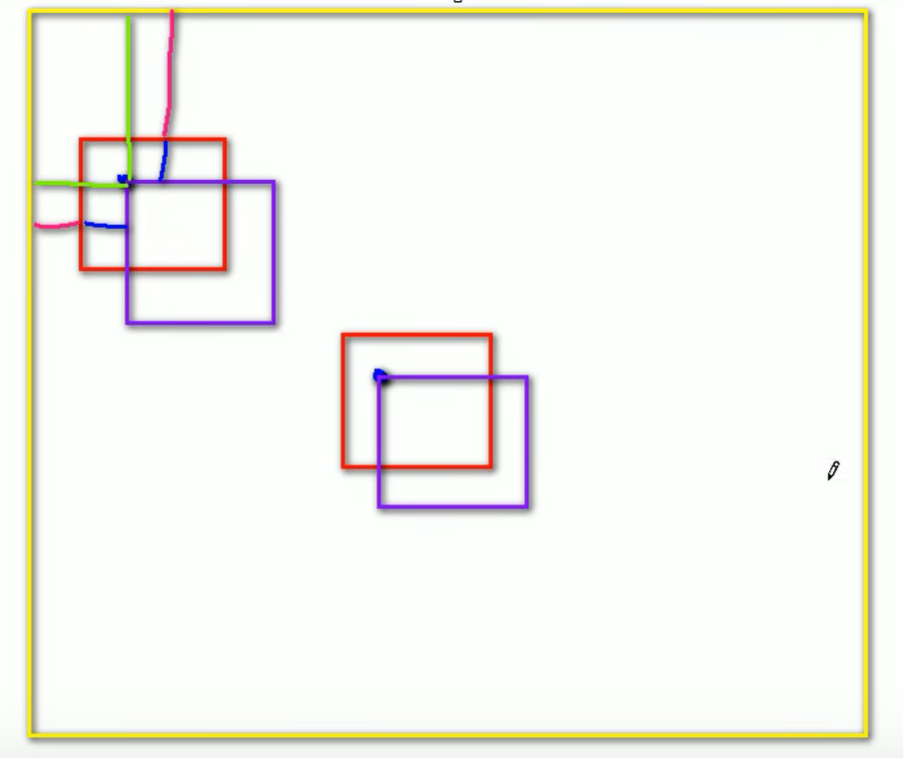
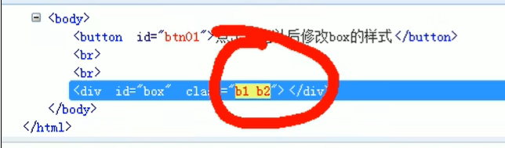
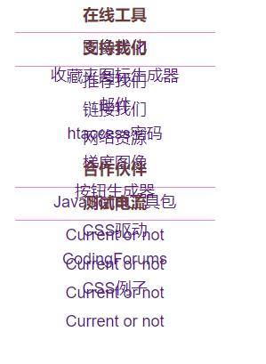
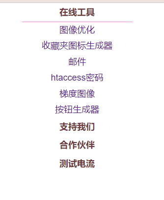
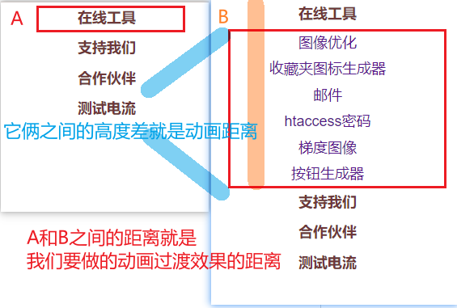
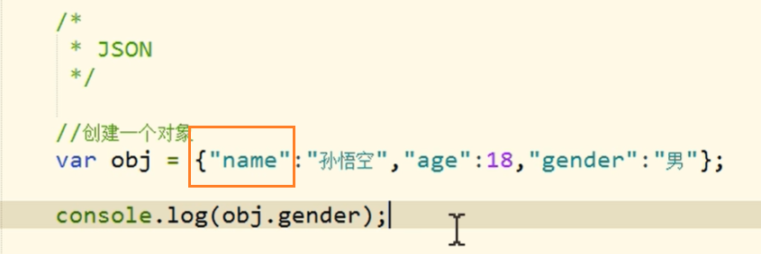
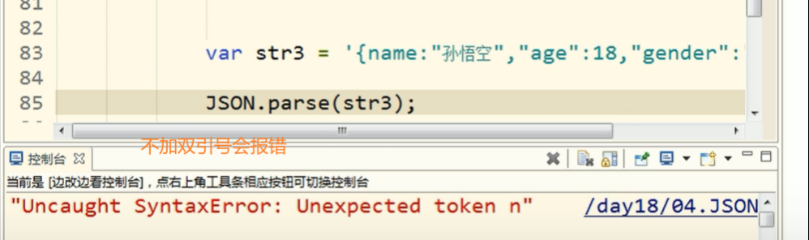

# 118_JS基础_拖拽（一）

​	

**97_JS基础_拖拽.html**

```html
<!DOCTYPE html>
<html lang="en">
  <head>
    <meta charset="UTF-8" />
    <title>Document</title>
    <style>
      #box1 {
        width: 100px;
        height: 100px;
        background-color: red;
        position: absolute;
      }
      #box2 {
        width: 100px;
        height: 100px;
        background-color: yellow;
        position: absolute;

        left: 200px;
        top: 200px;
      }
    </style>
    <script>
      window.onload = function () {
        /* 
            拖拽元素
                拖拽流程
                    1.当鼠标在被拖拽元素上按下时 开始拖拽 onmousedown
                    2.当鼠标移动时 被拖拽元素跟随鼠标移动 onmousemove
                    3.当鼠标松开时 被拖拽元素固定在当前位置 onmouseup
        */

        //获取box1
        var box1 = document.getElementById("box1");
        //为box1绑定一个鼠标按下事件
        //当鼠标在被拖拽元素上按下时 开始拖拽 onmousedown
        box1.onmousedown = function (event) {
          event = event || window.event;
          //div的偏移量 鼠标.clientX - 元素.offsetLeft
          //div的偏移量 鼠标.clientY - 元素.offsetTop
          var ol = event.clientX - box1.offsetLeft;
          var ot = event.clientY - box1.offsetTop;

          //onmousedown的event 和 onmousemove的event是不一样的

          //为document绑定一个onmousemove事件
          document.onmousemove = function (event) {
            event = event || window.event;
            //当鼠标移动时 被拖拽元素跟随鼠标移动 onmousemove
            //获取鼠标的坐标
            var left = event.clientX - ol;
            var top = event.clientY - ot;

            //修改box1的位置
            box1.style.left = left + "px";
            box1.style.top = top + "px";
          };

          //为元素绑定一个鼠标松开事件
          //   box1.onmouseup = function () {
          document.onmouseup = function () {
            /*  如果是box1的onmouseup的话 将box1拖拽到box2位置松开 
                    会发现box1并没有停止移动 而是跟随鼠标继续运动 
                    因为到box2松开鼠标是触发box2的事件 不是box1的，
                    所以这里要把box1改成全局的document，就可以解决啦 
            */

            //当鼠标松开时 被拖拽元素固定在当前位置 onmouseup
            //取消document的onmousemove事件
            document.onmousemove = null;

            //取消document的onmouseup事件
            document.onmouseup = null;

            // alert("鼠标松开了");
          };
        };
      };
    </script>
  </head>
  <body>
    <div id="box1"></div>
    <div id="box2"></div>
  </body>
</html>

```

​	

​	

# 119_JS基础_拖拽（二）




要获取浏览器的什么信息可以传入event参数来获取

​	

**98_JS基础_拖拽-IE8和其他浏览器-兼容.html**

```html
<!DOCTYPE html>
<html>
  <head>
    <meta charset="UTF-8" />
    <title>Document</title>
    <style>
      #box1 {
        width: 100px;
        height: 100px;
        background-color: red;
        position: absolute;
      }
      #box2 {
        width: 100px;
        height: 100px;
        background-color: yellow;
        position: absolute;

        left: 200px;
        top: 200px;
      }
    </style>
    <script>
      window.onload = function () {
        /* 
            拖拽元素
                拖拽流程
                    1.当鼠标在被拖拽元素上按下时 开始拖拽 onmousedown
                    2.当鼠标移动时 被拖拽元素跟随鼠标移动 onmousemove
                    3.当鼠标松开时 被拖拽元素固定在当前位置 onmouseup
        */

        //获取box1
        var box1 = document.getElementById("box1");
        //获取box2
        var box2 = document.getElementById("box2");

        //为box1绑定一个鼠标按下事件
        //当鼠标在被拖拽元素上按下时 开始拖拽 onmousedown
        box1.onmousedown = function (event) {
          //设置box1捕获所有鼠标按下的事件
          /* 
            setCapture()
              只有IE支持 但是火狐中调用时不会报错
                而如果使用chrome调用 会报错
          */

          // 写法一
          // if (box1.setCapture) {
          //   box1.setCapture();
          // }

          //写法二
          // 也可以这么写
          box1.setCapture && box1.setCapture();
          //如果第一个为true 则第二个也执行
          //如果第一个为false 第二个也就不用执行

          //完了需要设置releaseCapture来取消对鼠标的捕获
          //  不然鼠标移向空白地方点击依然会捕获box1并移动

          event = event || window.event;
          //div的偏移量 鼠标.clientX - 元素.offsetLeft
          //div的偏移量 鼠标.clientY - 元素.offsetTop
          var ol = event.clientX - box1.offsetLeft;
          var ot = event.clientY - box1.offsetTop;

          //onmousedown的event 和 onmousemove的event是不一样的

          //为document绑定一个onmousemove事件
          document.onmousemove = function (event) {
            event = event || window.event;
            //当鼠标移动时 被拖拽元素跟随鼠标移动 onmousemove
            //获取鼠标的坐标
            var left = event.clientX - ol;
            var top = event.clientY - ot;

            //修改box1的位置
            box1.style.left = left + "px";
            box1.style.top = top + "px";
          };

          //为元素绑定一个鼠标松开事件
          //   box1.onmouseup = function () {
          document.onmouseup = function () {
            /*  如果是box1的onmouseup的话 将box1拖拽到box2位置松开 
                    会发现box1并没有停止移动 而是跟随鼠标继续运动 
                    因为到box2松开鼠标是触发box2的事件 不是box1的，
                    所以这里要把box1改成全局的document，就可以解决啦 
            */

            //当鼠标松开时 被拖拽元素固定在当前位置 onmouseup
            //取消document的onmousemove事件
            document.onmousemove = null;

            //取消document的onmouseup事件
            document.onmouseup = null;

            // alert("鼠标松开了");

            //当鼠标松开时 取消对事件的捕获
            box1.releaseCapture && box1.releaseCapture();
          };

          /* 
            当我们拖拽一个网页中的内容时 浏览器会默认去搜索引擎中搜索内容
              此时会导致拖拽功能的异常 这个是浏览器提供的默认行为
              如果不希望发生这个行为 则可以通过return false来取消默认行为

            但是这招对IE8不起作用
          */
          return false; //这个也得写 上面releaseCapture()只是针对IE的
        };
      };
    </script>
  </head>
  <body>
    我是一段文字
    <div id="box1"></div>
    <div id="box2"></div>
  </body>
</html>

```

​	

​	

# 120_JS基础_拖拽（三）

​	

**99_JS基础_拖拽-测试IE8.html**

```html
<!DOCTYPE html>
<html lang="en">
  <head>
    <meta charset="UTF-8" />
    <title>Document</title>
    <style>
      body {
        border: 1px solid red;
      }
    </style>
    <script>
      // capture 捕获

      window.onload = function () {
        //分别为两个按钮绑定单击响应函数
        var btn01 = document.getElementById("btn01");
        var btn02 = document.getElementById("btn02");

        btn01.onclick = function () {
          alert(1);
        };
        btn02.onclick = function () {
          alert(2);
        };

        //设置btn01对鼠标按下相关的事件进行捕获
        /*        
            当调用一个元素的setCapture()方法以后 这个元素将会把下一次
                所有的鼠标按下相关的事情捕获到自身上 
          */
        btn01.setCapture();
      };
    </script>
  </head>
  <body>
    <button id="btn01">按钮01</button>
    <button id="btn02">按钮02</button>
  </body>
</html>

```

​	

**100_JS基础_拖拽-测试3.html**

```html
<!DOCTYPE html>
<html>
  <head>
    <meta charset="UTF-8" />
    <title>Document</title>
    <style>
      #box1 {
        width: 100px;
        height: 100px;
        background-color: red;
        position: absolute;
      }
      #box2 {
        width: 100px;
        height: 100px;
        background-color: yellow;
        position: absolute;

        left: 200px;
        top: 200px;
      }
    </style>
    <script>
      window.onload = function () {
        /* 
            拖拽元素
                拖拽流程
                    1.当鼠标在被拖拽元素上按下时 开始拖拽 onmousedown
                    2.当鼠标移动时 被拖拽元素跟随鼠标移动 onmousemove
                    3.当鼠标松开时 被拖拽元素固定在当前位置 onmouseup
        */

        //获取box1
        var box1 = document.getElementById("box1");
        //获取box2
        var box2 = document.getElementById("box2");
        var img2 = document.getElementById("img2");

        //开启box1的拖拽
        drag(box1);
        //开启box2的拖拽
        drag(box2);

        drag(img2);
      };

      /* 
        提取一个专门用来设置拖拽的函数
        参数：开启拖拽的元素
      */
      function drag(obj) {
        //box2
        obj.onmousedown = function (event) {
          //设置box2捕获所有鼠标按下的事件
          /* 
            setCapture()
              只有IE支持 但是火狐中调用时不会报错
                而如果使用chrome调用 会报错
          */

          obj.setCapture && obj.setCapture();
          //如果第一个为true 则第二个也执行
          //如果第一个为false 第二个也就不用执行

          //完了需要设置releaseCapture来取消对鼠标的捕获
          //  不然鼠标移向空白地方点击依然会捕获box1并移动

          event = event || window.event;
          //div的偏移量 鼠标.clientX - 元素.offsetLeft
          //div的偏移量 鼠标.clientY - 元素.offsetTop
          var ol = event.clientX - obj.offsetLeft;
          var ot = event.clientY - obj.offsetTop;

          //onmousedown的event 和 onmousemove的event是不一样的

          //为document绑定一个onmousemove事件
          document.onmousemove = function (event) {
            event = event || window.event;
            //当鼠标移动时 被拖拽元素跟随鼠标移动 onmousemove
            //获取鼠标的坐标
            var left = event.clientX - ol;
            var top = event.clientY - ot;

            //修改box2的位置
            obj.style.left = left + "px";
            obj.style.top = top + "px";
          };

          //为元素绑定一个鼠标松开事件
          document.onmouseup = function () {
            //当鼠标松开时 被拖拽元素固定在当前位置 onmouseup
            //取消document的onmousemove事件
            document.onmousemove = null;

            //取消document的onmouseup事件
            document.onmouseup = null;

            //当鼠标松开时 取消对事件的捕获
            obj.releaseCapture && obj.releaseCapture();
          };

          return false;
        };
      }
    </script>
  </head>
  <body>
    我是一段文字
    <div id="box1"></div>
    <div id="box2"></div>
    
    <!-- 记得要开启定位才能进行拖拽！ -->
  </body>
</html>

```

​	

​	

# 121_JS基础_滚轮的事件

​	

**101_JS基础_鼠标滚轮事件.html**

```html
<!DOCTYPE html>
<html lang="en">
  <head>
    <meta charset="UTF-8" />
    <title>Document</title>
    <style>
      #box1 {
        width: 100px;
        height: 100px;
        background-color: red;
      }
    </style>
    <script>
      window.onload = function () {
        /* 
                当鼠标滚轮向下滚动时 box1变长
                  当滚轮向上滚动时 box1变短
            */

        //获取id为box1的div
        var box1 = document.getElementById("box1");

        //为box1绑定一个鼠标滚轮滚动的事件
        /* 
            onmousewheel鼠标滚轮事件 会在滚轮滚动时触发
                但是火狐不支持该属性

            在火狐中需要使用 DOMMouseScroll 来绑定滚动事件
                注意该事件需要通过addEventListener()函数来绑定
        */
        box1.onmousewheel = function (event) {
          event = event || window.event;
          /*           
            
            event.wheelDelta 可以获取鼠标滚轮滚动的方向
            向上滚 180 向下滚 -180
            wheelDelta这个值我们不看大小 只看正负 
          */
          //   alert(event.wheelDelta);
          //   alert("滚了~~");

          /* 
            wheelDelta这个属性火狐中不支持
            在火狐中使用event.detail来获取滚动的方向
            向上滚 -3 向下滚 3
          */
          //   alert(event.detail);

          /* 
            当鼠标滚轮向下 box1变长
              当滚轮向上滚动时 box1变短
            */
          //判断鼠标滚轮滚动的方向
          if (event.wheelDelta > 0 || event.detail < 0) {
            // alert("向上滚");
            //向上滚 box1变短
            box1.style.height = box1.clientHeight - 10 + "px";
          } else {
            // alert("向下滚");
            //向下滚 box1变长
            box1.style.height = box1.clientHeight + 10 + "px";
          }

          /* 
            使用addEventListener()方法绑定响应函数 取消默认行为不能使用return false
            需要使用event来取消默认行为event.preventDefault();
            但是IE8不支持event.preventDefault(); 如果直接调用会报错
          */
          event.preventDefault && event.preventDefault();

          /* 
          当滚轮滚动时 如果浏览器有滚动条 滚动条会随之滚动
          这是浏览器的默认行为 如果不希望发生 则可以取消默认行为
         */
          return false;
        };

        bind(box1, "DOMMouseScroll", box1.onmousewheel);
      };

      function bind(obj, eventStr, callback) {
        if (obj.addEventListener) {
          //大部分浏览器兼容的方式
          obj.addEventListener(eventStr, callback, false);
        } else {
          /* 
                this是谁由调用方式决定
                callback.call(obj)
            */

          //IE8及以下
          obj.attachEvent("on" + eventStr, function () {
            //在匿名函数中调用回调函数
            callback.call(obj);
          });
        }
      }
    </script>
  </head>
  <body style="height: 2000px">
    <div id="box1"></div>
  </body>
</html>

```

​	

​	

# 122_JS基础_键盘事件

​	

**102_JS基础_键盘事件.html**

```html
<!DOCTYPE html>
<html lang="en">
  <head>
    <meta charset="UTF-8" />
    <title>Document</title>
    <script>
      window.onload = function () {
        /* 
                键盘事件
                  onkeydown
                    按键被按下
                    对于onkeydown来说如果一直按着某个按键不松手 则事件会一直触发
                    当onkeydown连续触发时 第一次和第二次之间会间隔稍微长一点 其他的会非常的快
                        这种设计是为了防止误操作的发生
                  onkeyup
                    按键被松开
                 
                  键盘事件一般都会绑定给一些可以获取到焦点的对象或者是document
            */
        document.onkeydown = function (event) {
          //   console.log("按键被按下了");
          event = event || window.event;

          /* 
            可以通过keyCode来获取按键的编码
              通过它可以判断哪个按键被按下
            除了keyCode 事件对象中还提供了几个属性
                altKey
                ctrlKey
                shiftKey
                    这三个用来判断alt ctrl 和shift是否被按下
                        如果按下则返回true 否则返回false
        */
          //   console.log(event.keyCode);

          //判断一个y是否被按下
          //判断y和ctrl是否同时被按下
          if (event.keyCode === 89 && event.ctrlKey) {
            console.log("ctrl和y被按下了");
          }
        };
        // document.onkeyup = function () {
        //   console.log("按键被松开了");
        // };

        //获取input
        var input = document.getElementsByTagName("input")[0];

        input.onkeydown = function (event) {
          //   console.log("按键被按下了");

          event = event || window.event;

          //使文本框不能输入数字
          //   console.log(event.keyCode); //获取数字的Code
          // 数字0-9 对应code 48-57
          console.log("按键被按下了");
          if (event.keyCode >= 48 && event.keyCode <= 57) {
            /* 
            在文本框中输入内容 属于onkeydown的默认行为
            如果在onkeydown中取消了默认行为 则输入内容 不会出现在文本框中
          */

            return false; //控制台有打印信息 但输入框没显示信息
          }
        };
      };
    </script>
  </head>
  <body>
    <input type="text" />
  </body>
</html>

```

​	

​	

# 123_JS基础_键盘移动div

**103_JS基础_键盘移动div练习.html**

```html
<!DOCTYPE html>
<html lang="en">
  <head>
    <meta charset="UTF-8" />
    <title>Document</title>
    <style>
      #box1 {
        width: 100px;
        height: 100px;
        background-color: red;
        position: absolute;
      }
    </style>
    <script>
      //使div可以根据不同的方向键向不同的方向移动
      /* 
        按上键 div向上移
        按下键 div向下移
        按左键 div向左移
        按右键 div向右移

        */

      window.onload = function () {
        //document绑定一个按键按下的事件
        document.onkeydown = function (event) {
          event = event || window.event;

          //定义一个变量 来表示移动的速度
          var speed = 10;

          //当用户按了ctrl以后 速度加快
          if (event.ctrlKey) {
            speed = 50;
          }

          /* 
                    37 左
                    38 上
                    39 右
                    40 下
                */
          //   console.log(event.keyCode);

          switch (event.keyCode) {
            case 37:
              //   alert("向左"); left值减小
              box1.style.left = box1.offsetLeft - speed + "px";
              break;
            case 38:
              //   alert("向上");
              box1.style.top = box1.offsetTop - speed + "px";

              break;
            case 39:
              //   alert("向右");
              box1.style.left = box1.offsetLeft + speed + "px";

              break;
            case 40:
              //   alert("向下");
              box1.style.top = box1.offsetTop + speed + "px";
              break;
          }
        };
      };
    </script>
  </head>
  <body>
    <div id="box1"></div>
  </body>
</html>

```

​	

​	

DOM是JS用来操作网页的

BOM是JS用来操作浏览器的

# 124_JS基础_Navigator

userAgent等价于浏览器

说用户代理是怎么显示的也就是说浏览器是怎么显示的

如果通过userAgent的信息（正则表达式提取）无法区分是来自什么浏览器 可以通过浏览器特定的属性/方法作为判断条件来区分

​	

**104_JS基础_BOM.html**

```html
<!DOCTYPE html>
<html lang="en">
  <head>
    <meta charset="UTF-8" />
    <title>Document</title>
    <script>
      /* 
            BOM
                浏览器对象模型
                BOM可以使我们通过JS来操作浏览器
                在BOM中为我们提供了一组对象 用来完成对浏览器的操作
                BOM对象
                    Window
                        代表的是整个浏览器的窗口 同时window也是网页中的全局对象
                    Navigator
                        代表的当前浏览器的信息 通过该对象可以来识别不同的浏览器
                    Location
                        代表当前浏览器的地址栏信息 通过Location可以获取地址栏信息 或者操作浏览器跳转页面
                    History
                        代表浏览器的历史记录 可以通过该对象来操作浏览器的历史记录
                            由于隐私原因 该对象不能获取到具体的历史记录 只能操作浏览器向前或向后翻页
                            而且该操作只在当次访问时有效
                    Screen
                        代表用户的屏幕的信息 通过该对象可以获取到用户的显示器的相关的信息

                    这些BOM对象在浏览器中都是作为window对象的属性保存的
                        可以通过window对象来使用 也可以直接使用
        */

      //   console.log(window.navigator); //Navigator
      //   console.log(navigator); //Navigator
      //   console.log(location); //
      //   console.log(history); //

      /* 
        Navigator
            代表的当前浏览器的信息 通过该对象可以来识别不同的浏览器
            由于历史原因 Navigator对象中的大部分属性都已经不能帮助我们识别浏览器了
            一般我们只会使用userAgent来判断浏览器的信息
                userAgent是一个字符串 
                这个字符串中包含有用来描述浏览器信息的内容
                不同的浏览器会有不同的userAgent

            Chrome的userAgent
                Mozilla/5.0 (Windows NT 10.0; Win64; x64) AppleWebKit/537.36 (KHTML, like Gecko) Chrome/103.0.0.0 Safari/537.36
            Firefox的userAgent
                 Mozilla/5.0 (Windows NT 10.0; Win64; x64; rv:103.0) Gecko/20100101 Firefox/103.0
            IE8的userAgent
                Mozilla/4.0 (compatible; MSIE 8.0; Windows NT 6.2; WOW64; Trident/7.0; .NET4.0C; .NET4.0E; .NET CLR 2.0.50727; .NET CLR 3.0.30729; .NET CLR 3.5.30729; Tablet PC 2.0)
            IE9的userAgent
                Mozilla/5.0 (compatible; MSIE 9.0; Windows NT 6.2; WOW64; Trident/7.0; .NET4.0C; .NET4.0E; .NET CLR 2.0.50727; .NET CLR 3.0.30729; .NET CLR 3.5.30729; Tablet PC 2.0)
            IE10的userAgent
                Mozilla/5.0 (compatible; MSIE 10.0; Windows NT 6.2; WOW64; Trident/7.0; .NET4.0C; .NET4.0E; .NET CLR 2.0.50727; .NET CLR 3.0.30729; .NET CLR 3.5.30729; Tablet PC 2.0)
            IE11的userAgent
                Mozilla/5.0 (Windows NT 6.2; WOW64; Trident/7.0; .NET4.0C; .NET4.0E; .NET CLR 2.0.50727; .NET CLR 3.0.30729; .NET CLR 3.5.30729; Tablet PC 2.0; rv:11.0) like Gecko
                在IE11中已经将微软和IE相关的标识都已经去除了 所以我们基本已经不能通过UserAgent来识别一个浏览器是否是IE了
        */
      //   alert(navigator.appName); //Netscape
      //   console.log(navigator.userAgent);
      var ua = navigator.userAgent;
      //   console.log(ua);
      //   alert(ua);

      if (/firefox/i.test(ua)) {
        alert("你是火狐！！！");
      } else if (/chrome/i.test(ua)) {
        alert("你是chrome！！！");
      } else if (/msie/i.test(ua)) {
        alert("你是IE浏览器~~~");
      } else if ("ActiveXObject" in window) {
        alert("你是IE11，枪毙了你~~~");
      }

      /* 
        如果通过UserAgent不能判断 还可以通过一些浏览器中特有的对象 来判断浏览器的信息
        比如：ActiveXObject
      */
      /*       
        有欠缺版 无法识别 IE11
        if (window.ActiveXObject) {
            alert("你是IE，我已经抓住你了~~~");
        } else {
            alert("你不是IE~~~");
        } 

        //完美版 所以IE版本浏览器都适用
        //   if ("ActiveXObject" in window) {
        //     alert("你是IE，我已经抓住你了~~~");
        //   } else {
        //     alert("你不是IE~~~");
        //   }
      */

      //   alert("ActiveXObject" in window);
      /*
        IE11动了点手脚 将window.ActiveXObject转换成布尔值
        !!window.ActiveXObject == false (本应是true)
        所以我们不能把这个语句作为判断条件语句
        应修改为"ActiveObject" in window
        
        IE 11 通过 userAgent的rv:11.0 作为判断是否为IE 11浏览器可能出现误伤 
        就是无法精准100% 所以不用这个
      */
    </script>
  </head>
  <body></body>
</html>

```

​	

​	

# 125_JS基础_History

​	

**105_JS基础_History.html**

```html
<!DOCTYPE html>
<html lang="en">
  <head>
    <meta charset="UTF-8" />
    <title>Document</title>
    <script>
      /* 
            History
                对象可以用来操作浏览器向前或向后翻页
        */

      window.onload = function () {
        //获取按钮对象
        var btn = document.getElementById("btn");

        btn.onclick = function () {
          /* 
            length
                属性 可以获取到当前访问的链接数量
                因为当前网页 如果有超链接跳转至此页面的话 
                    我们是可以后退的 所以当前页面是有记录先前跳转前链接的记录
                    那么也就有记录链接数量（即链接长度）
             */
          //   alert(history.length);
          /* 
            back()
                可以用来回退到上一个页面 作用和浏览器的回退按钮一样
          */
          //   history.back();
          /* 
            forward()
                可以跳转下一个页面 作用和浏览器的前进按钮一样
            */
          //   history.forward();
          /* 
            go()
                可以用来跳转到指定的页面
                它需要一个整数作为参数
                  1 表示向前跳转一个页面 相对于forward
                  2 表示向前跳转两个页面
                  -1 表示向后跳转一个页面 相对于back
                  -2 表示向后跳转两个页面
                  
        */
          history.go();
        };
      };
    </script>
  </head>
  <body>
    <button id="btn">点我一下</button>
    <h1>History</h1>
    <a href="106_JS基础_History_test01.html">去 History_test01</a>
  </body>
</html>

```

​	

**106_JS基础_History_test01.html**

```html
<!DOCTYPE html>
<html lang="en">
  <head>
    <meta charset="UTF-8" />
    <title>Document</title>
  </head>
  <body>
    <h1>TEST01</h1>
    <a href="107_JS基础_History_test02.html">去 History_test02</a>
  </body>
</html>

```

​	

**107_JS基础_History_test02.html**

```html
<!DOCTYPE html>
<html lang="en">
  <head>
    <meta charset="UTF-8" />
    <title>Document</title>
  </head>
  <body>
    <h1>TEST02</h1>
    <a href="105_JS基础_History.html">去 History.html</a>
  </body>
</html>

```

​	

​	

# 126_JS基础_Location

​	

**108_JS基础_Location.html**

```html
<!DOCTYPE html>
<html lang="en">
  <head>
    <meta charset="UTF-8" />
    <title>Document</title>
    <script>
      /* 
        Location
            该对象封装了浏览器地址栏的信息
        */

      window.onload = function () {
        //获取按钮对象
        var btn = document.getElementById("btn");

        btn.onclick = function () {
          //如果直接打印location 则可以获取到地址栏的信息(当前页面的完整路径)
          //   alert(location);
          /* 
            如果直接将location属性修改为一个完整的路径 或相对路径
              则我们页面会自动跳转到该路径 并且会生成相应的历史记录
          */
          //   location = "http://www.baidu.com";
          //   location = "106_JS基础_History_test01.html";
          /* 
            assign()
                用来跳转到其他的页面 作用和直接修改location一样
        */
          //   location.assign("http://www.baidu.com");
          /* 
            reload()
                用于重新加载当前页面 作用和刷新按钮一样
                如果在方法中传递一个true 作为参数 则会强制清空缓存刷新页面
        */
          //   location.reload(true);
          /* 
            replace()
                可以使用一个新的页面替换当前页面 调用完毕也会跳转页面
        */
          location.replace("106_JS基础_History_test01.html");
        };
      };
    </script>
  </head>
  <body>
    <button id="btn">点我一下</button>
    <h1>Location</h1>
    <input type="text" />
    <a href="106_JS基础_History_test01.html">去 History_test01</a>
  </body>
</html>

```

​	

​	

# 127_JS基础_定时器简介

​	

**109_JS基础_定时调用.html**

```html
<!DOCTYPE html>
<html lang="en">
  <head>
    <meta charset="UTF-8" />
    <title>Document</title>
    <script>
      window.onload = function () {
        //获取count
        var count = document.getElementById("count");

        //使count中的内容 自动切换
        /* 
                JS的程序的执行速度是非常非常快的
                    如果希望一段程序 可以每间隔一段时间执行一次 可以使用定时调用
            */
        // for (var i = 0; i < 10000; i++) {
        //   count.innerHTML = i;
        //   alert("hello");
        // }

        /* 
            setInterval()  (翻译：设置间隔)
                定时调用
                可以将一个函数 每隔一段时间执行一次
                参数：
                    1.回调函数 该函数会每隔一段时间被调用一次
                    2.每次调用间隔的时间 单位是毫秒
        */
        var num = 1;
        var timer = setInterval(function () {
          count.innerHTML = num++;

          if (num == 11) {
            //关闭定时器
            clearInterval(timer);
          }

          //因为赋值是num++ 所以先赋值后++ 最多就到10就停止了
        }, 1000);

        console.log(timer); //返回一个number 该定时器的唯一标识（身份证）

        //clearInterval()可以用来关闭一个定时器
        //方法中需要一个定时器的标识作为参数 这样将关闭标识对应的定时器
        // clearInterval(timer);
      };
    </script>
  </head>
  <body>
    <h1 id="count">1</h1>
  </body>
</html>

```

​	

​	

# 128_JS基础_切换图片练习

定时器可以说是慢倍速的for循环

​	

**110_JS基础_切换图片练习.html**

```html
<!DOCTYPE html>
<html lang="en">
  <head>
    <meta charset="UTF-8" />
    <title>Document</title>
    <script>
      window.onload = function () {
        /* 
                使图片可以自动转换
            */

        //获取img标签
        var img1 = document.getElementById("img1");

        //创建一个数组来保存图片的路径
        var imgArr = [
          "img/1.jpg",
          "img/2.jpg",
          "img/3.jpg",
          "img/4.jpg",
          "img/5.jpg",
        ];

        //创建一个变量 用来保存当前图片的索引
        var index = 0;

        //定义一个变量 用来保存定时器的标识 （放在btn01中无法被btn02获取）
        var timer;
        //为btn01绑定一个单击响应函数
        var btn01 = document.getElementById("btn01");
        btn01.onclick = function () {
          /* 
                目前 我们每点击一次按钮 就会开启一个定时器
                （为什么开始按钮点多了停止不了呢因为timer只能关闭最后的一个）
                    点击多次就会开启多个定时器 这就导致图片的切换速度过快
                    并且我们只能关闭最后一次开启的定时器

            */

          //在开启定时器之前 需要将当前元素上的其他定时器关闭
          clearInterval(timer);

          /* 
            开启一个定时器 来自动切换图片
            */
          timer = setInterval(function () {
            //索引自增
            index++;

            //判断索引是否超过最大索引
            //   if (index >= imgArr.length) {
            //     //则将index设置为0
            //     index = 0;
            //   }
            // index = index % imgArr.length;
            index %= imgArr.length;

            //修改img1的src属性
            img1.src = imgArr[index];
          }, 1000);
        };

        //为btn02绑定一个单击响应函数
        var btn02 = document.getElementById("btn02");
        btn02.onclick = function () {
          //点击按钮以后 停止图片的自动切换 关闭定时器
          /* 
            clearInterval()可以接收任意参数
              如果参数是一个有效的定时器的标识 则停止对应的定时器
              如果参数不是一个有效的标识 则什么也不做
          */
          clearInterval(timer);
        };
      };
    </script>
  </head>
  <body>
    
    <br /><br />
    <button id="btn01">开始</button>
    <button id="btn02">停止</button>
  </body>
</html>

```

​	

​	

# 129_JS基础_修改div移动练习

之前开头不连贯是因为一个函数既要控制方向又要控制速度 现在写成两个（主要还是有防误触的设置，现在用一个定时器来控制移动的时间，覆盖掉防误触的设置）

速度用定时器去控制 方向按键只控制方向

​	

**123和129的div移动对比**

- 123：按下方向键后 立即触发onclick函数立刻执行一次操作 然后等待防误触时长后 按照系统默认的连续按下间隔时长 连续执行onclick函数

- 129：按下方向键后 立即触发onclick函数立刻执行一次操作 然后根据设置的定时器时间间隔 执行函数

​	

**111_JS基础_键盘移动div练习.html**

```html
<!DOCTYPE html>
<html lang="en">
  <head>
    <meta charset="UTF-8" />
    <title>Document</title>
    <style>
      #box1 {
        width: 100px;
        height: 100px;
        background-color: rgb(165, 62, 234);
        position: absolute;
      }
    </style>
    <script>
      //使div可以根据不同的方向键向不同的方向移动
      /* 
        按上键 div向上移
        按下键 div向下移
        按左键 div向左移
        按右键 div向右移

        */

      window.onload = function () {
        //定义一个变量 来表示移动的速度
        var speed = 10;

        // 创建一个变量表示方向
        //通过修改dir来影响移动的方向
        var dir = 0;

        //开启一个定时器 来控制div的移动
        setInterval(function () {
          /* 
                    37 左
                    38 上
                    39 右
                    40 下
                */
          //   console.log(event.keyCode);

          switch (dir) {
            case 37:
              //   alert("向左"); left值减小
              box1.style.left = box1.offsetLeft - speed + "px";
              break;
            case 38:
              //   alert("向上");
              box1.style.top = box1.offsetTop - speed + "px";

              break;
            case 39:
              //   alert("向右");
              box1.style.left = box1.offsetLeft + speed + "px";

              break;
            case 40:
              //   alert("向下");
              box1.style.top = box1.offsetTop + speed + "px";
              break;
          }
        }, 10);

        //document绑定一个按键按下的事件
        document.onkeydown = function (event) {
          event = event || window.event;

          //当用户按了ctrl以后 速度加快
          if (event.ctrlKey) {
            speed = 50;
          } else {
            speed = 10;
          }

          //使dir等于按键的值
          dir = event.keyCode;
        };

        //当按键松开时 div不再移动
        document.onkeyup = function () {
          //设置方向为0
          dir = 0;
        };
      };
    </script>
  </head>
  <body>
    <div id="box1"></div>
  </body>
</html>

```

​	

​	

# 130_JS基础_延时调用

​	

**112_JS基础_延时调用.html**

```html
<!DOCTYPE html>
<html lang="en">
  <head>
    <meta charset="UTF-8" />
    <title>Document</title>
    <script>
      var num = 1;

      //开启一个定时器
      var timer1 = setInterval(function () {
        console.log(num++);
      }, 1000);

      /* 
            延时调用
                延时调用一个函数不马上执行 而是隔一段时间以后在执行 而且只会执行一次

            延时调用和定时调用的区别
                定时调用会执行多次
                而延时调用只会执行一次

            延时调用和定时调用实际上是可以相互代替的 在开发中根据自己需要去选择
        */
      var timer2 = setTimeout(function () {
        console.log(num++);
      }, 1000);

      //   //使用clearTimeout()来关闭一个延时调用
      clearTimeout(timer1);
      //   clearTimeout(timer2);
    </script>
  </head>
  <body></body>
</html>

```

​	

​	

# 131_JS基础_定时器的应用（一）

​	

**113_JS基础_定时器.html**

```html
<!DOCTYPE html>
<html lang="en">
  <head>
    <meta charset="UTF-8" />
    <title>Document</title>
    <style>
      * {
        margin: 0;
        padding: 0;
      }

      #box1 {
        width: 100px;
        height: 100px;
        background-color: red;
        position: absolute;
        left: 0;
        /* 这里没指定left的话 IE是默认left为auto */
      }
    </style>
    <script>
      window.onload = function () {
        //获取box1
        var box1 = document.getElementById("box1");
        //获取btn01
        var btn01 = document.getElementById("btn01");
        //点击按钮以后 使box1向右移动（left值增大）

        //定义一个变量 用来保存定时器的标识
        var timer;

        btn01.onclick = function () {
          //关闭上一个定时器 禁止在未达到终点之前启动多个定时器
          clearInterval(timer);

          //开启一个定时器 用来执行动画效果
          timer = setInterval(function () {
            //获取box1的原来的left值
            var oldValue = parseInt(getStyle(box1, "left")); //getStyle返回的值带px 我们只需要整数的部分方便下面加减
            //而且用自定义的getStyle()的好处是方向不会写死 可以任意改变哪一个方向上的值

            //在旧值的基础上增加
            var newValue = oldValue + 10;

            //判断newValue是否大于800
            //我们需要每次运行都能达到800px的位置
            //叠加的值不同可能无法精准达到800px，需要我们这里需要判断修改一下
            if (newValue > 800) {
              newValue = 800;
            }

            //将新值设置给box1
            box1.style.left = newValue + "px";

            //当元素移动到800px时 使其停止执行动画
            if (newValue === 800) {
              //达到目标 关闭定时器
              clearInterval(timer);
            }
          }, 22);
        };
      };

      /* 
        定义一个函数 用来获取指定元素的当前的样式
        参数：
            obj 要获取的样式的元素
            name 要获取的样式名
      */
      function getStyle(obj, name) {
        /* 
            这里存在一个问题，该方法要怎么修改才能兼容两种浏览器（兼容性处理）

            其实只需要判断有没有getComputedStyle方法就行了 有则调用
        */

        if (window.getComputedStyle) {
          //没加window. 是变量 加了是方法/属性
          //正常浏览器的方式
          // return getComputedStyle(obj, null).name;//不是name 这样写死了 虽然和形参同名 用[]来表示
          return getComputedStyle(obj, null)[name]; //不是name 这样写死了 虽然和形参同名 用[]来表示
        } else {
          //IE8的方式
          return obj.currentStyle[name];
        }

        //也可以用三元运算符
        // return window.getComputedStyle
        //   ? getComputedStyle(obj, null)[name]
        //   : obj.currentStyle[name];

        //这么用会优先使用currentStyle 跟上面的没区别 只是我们希望优先使用getComputedStyle
        // if(obj.currentStyle){
        //     return obj.currentStyle[name];
        // }else{
        //     return getComputedStyle(obj, null)[name];
        // }
      }
    </script>
  </head>
  <body>
    <button id="btn01">点击按钮以后box1向右移动</button>
    <br /><br />
    <div id="box1"></div>
    <div
      style="
        width: 0px;
        height: 1000px;
        border-left: 1px black solid;
        position: absolute;
        left: 800px;
        top: 0px;
      "
    ></div>
  </body>
</html>

```

​	

​	

# 132_JS基础_定时器的应用（二）

​	

**114_JS基础_定时器2.html**

```html
<!DOCTYPE html>
<html lang="en">
  <head>
    <meta charset="UTF-8" />
    <title>Document</title>
    <style>
      * {
        margin: 0;
        padding: 0;
      }

      #box1 {
        width: 100px;
        height: 100px;
        background-color: red;
        position: absolute;
        left: 0;
        /* 这里没指定left的话 IE是默认left为auto */
      }
    </style>
    <script>
      window.onload = function () {
        //获取box1
        var box1 = document.getElementById("box1");
        //获取btn01
        var btn01 = document.getElementById("btn01");
        //点击按钮以后 使box1向右移动（left值增大）

        //获取btn02
        var btn02 = document.getElementById("btn02");

        btn01.onclick = function () {
          move(box1, 800, 10);
        };

        //点击按钮以后 使box1向左移动（left值减小）
        btn02.onclick = function () {
          move(box1, 0, 10);
        };
      };

      /*
              定义一个函数 用来获取指定元素的当前的样式
              参数：
                  obj 要获取的样式的元素
                  name 要获取的样式名
            */
      function getStyle(obj, name) {
        /*
                  这里存在一个问题，该方法要怎么修改才能兼容两种浏览器（兼容性处理）

                  其实只需要判断有没有getComputedStyle方法就行了 有则调用
              */

        if (window.getComputedStyle) {
          //没加window. 是变量 加了是方法/属性
          //正常浏览器的方式
          // return getComputedStyle(obj, null).name;//不是name 这样写死了 虽然和形参同名 用[]来表示
          return getComputedStyle(obj, null)[name]; //不是name 这样写死了 虽然和形参同名 用[]来表示
        } else {
          //IE8的方式
          return obj.currentStyle[name];
        }

        //也可以用三元运算符
        // return window.getComputedStyle
        //   ? getComputedStyle(obj, null)[name]
        //   : obj.currentStyle[name];

        //这么用会优先使用currentStyle 跟上面的没区别 只是我们希望优先使用getComputedStyle
        // if(obj.currentStyle){
        //     return obj.currentStyle[name];
        // }else{
        //     return getComputedStyle(obj, null)[name];
        // }
      }

      //定义一个变量 用来保存定时器的标识
      var timer;

      //尝试创建一个可以执行简单动画的函数
      /* 
        参数
          obj 要执行动画的对象
          target 执行动画的目标位置
          speed 移动的速度（正数向右移动 负数向左移动）
      */
      function move(obj, target, speed) {
        //关闭上一个定时器 禁止在未达到终点之前启动多个定时器
        clearInterval(timer);

        //获取元素目前的位置
        var current = parseInt(getStyle(obj, "left"));

        //判断速度的正负值 这一步应由函数内部判断
        //  因为到实际应用中我们往往不清楚obj的位置跟我们target位置的关系
        //    统一传入正数的speed 再让函数内部去判断正负号

        //如果从0向800移动 则speed为正
        //如果从800向0移动 则speed为负
        if (current > target) {
          //此时速度应为负值
          speed = -speed;
        }

        //开启一个定时器 用来执行动画效果
        timer = setInterval(function () {
          //获取box1的原来的left值
          var oldValue = parseInt(getStyle(obj, "left")); //getStyle返回的值带px 我们只需要整数的部分方便下面加减
          //而且用自定义的getStyle()的好处是方向不会写死 可以任意改变哪一个方向上的值

          //在旧值的基础上增加
          var newValue = oldValue + speed;

          //判断newValue是否大于800
          //从800向0移动
          //向左移动时 需要判断newValue是否小于target
          //向右移动时 需要判断newValue是否大于target
          if (
            (speed < 0 && newValue < target) ||
            (speed > 0 && newValue > target)
          ) {
            newValue = target;
          }

          //将新值设置给box1
          obj.style.left = newValue + "px";

          //当元素移动到0px时 使其停止执行动画
          if (newValue === target) {
            //达到目标 关闭定时器
            clearInterval(timer);
          }
        }, 22);
      }
    </script>
  </head>
  <body>
    <button id="btn01">点击按钮以后box1向右移动</button>
    <button id="btn02">点击按钮以后box1向左移动</button>
    <br /><br />
    <div id="box1"></div>
    <div
      style="
        width: 0px;
        height: 1000px;
        border-left: 1px black solid;
        position: absolute;
        left: 800px;
        top: 0px;
      "
    ></div>
  </body>
</html>

```

​	

​	

# 133_JS基础_定时器的应用（三）

​	

**115_JS基础_定时器3.html**

```html
<!DOCTYPE html>
<html lang="en">
  <head>
    <meta charset="UTF-8" />
    <title>Document</title>
    <style>
      * {
        margin: 0;
        padding: 0;
      }

      #box1 {
        width: 100px;
        height: 100px;
        background-color: skyblue;
        position: absolute;
        left: 0;
        /* 这里没指定left的话 IE是默认left为auto */
      }

      #box2 {
        width: 100px;
        height: 100px;
        background-color: pink;
        position: absolute;
        left: 0;
        top: 200px;
        /* 这里没指定left的话 IE是默认left为auto */
      }
    </style>

    <script src="js/tools.js"></script>

    <script>
      window.onload = function () {
        //获取box1
        var box1 = document.getElementById("box1");
        //获取btn01
        var btn01 = document.getElementById("btn01");
        //点击按钮以后 使box1向右移动（left值增大）

        //获取btn02
        var btn02 = document.getElementById("btn02");

        btn01.onclick = function () {
          move(box1, "left", 800, 20);
        };

        //点击按钮以后 使box1向左移动（left值减小）
        btn02.onclick = function () {
          move(box1, "left", 0, 10);
        };

        //获取btn03
        var btn03 = document.getElementById("btn03");
        btn03.onclick = function () {
          move(box2, "left", 800, 10);
        };

        //测试按钮
        var btn04 = document.getElementById("btn04");
        btn04.onclick = function () {
          // move(box2, "width", 800, 10);
          // move(box2, "top", 800, 10);
          // move(box2, "height", 800, 10);
          move(box2, "width", 800, 10, function () {
            // alert("动画执行完毕~~~");
            move(box2, "height", 400, 10, function () {
              move(box2, "top", 0, 10, function () {
                move(box2, "width", 100, 10, function () {});
              });
            });
          });
        };
      };
    </script>
  </head>
  <body>
    <button id="btn01">点击按钮以后box1向右移动</button>
    <button id="btn02">点击按钮以后box1向左移动</button>
    <button id="btn03">点击按钮以后box2向右移动</button>
    <button id="btn04">测试按钮</button>
    <br /><br />
    <div id="box1"></div>
    <div id="box2"></div>
    <div
      style="
        width: 0px;
        height: 1000px;
        border-left: 1px black solid;
        position: absolute;
        left: 800px;
        top: 0px;
      "
    ></div>
  </body>
</html>

```

​	

方法封装进js文件里

**tools.js**

```js
/*
    定义一个函数 用来获取指定元素的当前的样式
    参数：
        obj 要获取的样式的元素
        name 要获取的样式名
    */
function getStyle(obj, name) {
  /*
    这里存在一个问题，该方法要怎么修改才能兼容两种浏览器（兼容性处理）

    其实只需要判断有没有getComputedStyle方法就行了 有则调用
    */

  if (window.getComputedStyle) {
    //没加window. 是变量 加了是方法/属性
    //正常浏览器的方式
    // return getComputedStyle(obj, null).name;//不是name 这样写死了 虽然和形参同名 用[]来表示
    return getComputedStyle(obj, null)[name]; //不是name 这样写死了 虽然和形参同名 用[]来表示
  } else {
    //IE8的方式
    return obj.currentStyle[name];
  }

  //也可以用三元运算符
  // return window.getComputedStyle
  //   ? getComputedStyle(obj, null)[name]
  //   : obj.currentStyle[name];

  //这么用会优先使用currentStyle 跟上面的没区别 只是我们希望优先使用getComputedStyle
  // if(obj.currentStyle){
  //     return obj.currentStyle[name];
  // }else{
  //     return getComputedStyle(obj, null)[name];
  // }
}

//定义一个变量 用来保存定时器的标识
/* 
    目前我们的定时器的标识由全局变量timer保存
        所有的执行正在执行的定时器都在这个变量中保存
    */
// var timer;

//尝试创建一个可以执行简单动画的函数
/* 
    参数
        obj 要执行动画的对象
        attr 要执行动画的样式 比如：left top width height
        target 执行动画的目标位置
        speed 移动的速度（正数向右移动 负数向左移动）
        callback 回调函数 这个函数将会在动画执行完毕以后执行
    */
function move(obj, attr, target, speed, callback) {
  //关闭上一个定时器 禁止在未达到终点之前启动多个定时器
  clearInterval(obj.timer);

  //获取元素目前的位置
  var current = parseInt(getStyle(obj, attr));

  //判断速度的正负值 这一步应由函数内部判断
  //  因为到实际应用中我们往往不清楚obj的位置跟我们target位置的关系
  //    统一传入正数的speed 再让函数内部去判断正负号

  //如果从0向800移动 则speed为正
  //如果从800向0移动 则speed为负
  if (current > target) {
    //此时速度应为负值
    speed = -speed;
  }

  //开启一个定时器 用来执行动画效果
  //向执行动画的对象中添加一个timer属性 用来保存它自己的定时器的标识
  obj.timer = setInterval(function () {
    //获取box1的原来的left值
    var oldValue = parseInt(getStyle(obj, attr)); //getStyle返回的值带px 我们只需要整数的部分方便下面加减
    //而且用自定义的getStyle()的好处是方向不会写死 可以任意改变哪一个方向上的值

    //在旧值的基础上增加
    var newValue = oldValue + speed;

    //判断newValue是否大于800
    //从800向0移动
    //向左移动时 需要判断newValue是否小于target
    //向右移动时 需要判断newValue是否大于target
    if ((speed < 0 && newValue < target) || (speed > 0 && newValue > target)) {
      newValue = target;
    }

    //将新值设置给box1
    obj.style[attr] = newValue + "px";
    /* 
        传入的如果是一个变量的话 要用[] 来接收
        而不能使用 . 不然会误以为是自定义对象属性
        */

    //当元素移动到0px时 使其停止执行动画
    if (newValue === target) {
      //达到目标 关闭定时器
      clearInterval(obj.timer);
      //动画执行完毕 调用回调函数
      callback && callback();
      //有传回调函数你就执行 没有就不执行
    }
  }, 22);
}

```

​	

​	

# 134_JS基础_完成轮播图界面

​	

**116_JS基础_完成轮播图界面.html**

```html
<!DOCTYPE html>
<html lang="en">
  <head>
    <meta charset="UTF-8" />
    <title>Document</title>
    <style>
      * {
        margin: 0;
        padding: 0;
      }

      /* 
            设置outer的样式
        */
      #outer {
        /* 设置宽和高 */
        width: 520px;
        height: 333px;
        /* 居中 */
        margin: 50px auto;
        /* 设置背景颜色 */
        background-color: yellowgreen;
        /* 设置padding */
        padding: 10px 0;
        /* 开启相对定位 */
        position: relative;
        /* 裁剪溢出的内容 */
        overflow: hidden;
      }

      /* 设置imgList */
      #imgList {
        /* 去除项目符号 */
        list-style: none;
        /* 设置ul的宽度 */
        width: 2600px;
        /* 
            开启绝对定位 
            想要移动位置需要开启绝对定位
        */
        position: absolute;
        /* 设置偏移量 */
        /* 
            每向左移动520px 就会显示到下一张图片
        */
        left: 0px;
      }

      /* 设置图片中的li */
      #imgList li {
        /* 设置浮动 */
        float: left;
        /* 设置左右外边距 */
        margin: 0 10px;
      }

      /* 设置图片统一大小 */
      #imgList li img {
        width: 500px;
        height: 333px;
      }

      /* 设置导航按钮 */
      #navDiv {
        /* 开启绝对定位 */
        position: absolute;
        /* 设置位置 */
        bottom: 15px;
        /* 设置left值 
                outer宽度 520
                navDiv宽度 25*5 = 125
                    520 - 125 = 395/2 197.5
        */
        /* left: 197px; */
        /*left写死了不灵活 无法根据数量动态更改*/
      }

      #navDiv a {
        /* 设置超链接浮动 */
        float: left;
        /* 设置超链接的宽和高 */
        width: 15px;
        height: 15px;
        /* 设置背景颜色 */
        background-color: red;
        /* 设置左右外边距 */
        margin: 0 5px;
        /* 设置透明 */
        opacity: 0.5;
        /* 兼容IE8透明 */
        filter: alpha(opacity=50);
      }

      /* 设置鼠标移入的效果 */
      #navDiv a:hover {
        background-color: black;
        /* #navDiv a被设置为半透明 所以没有那么黑 */
      }
    </style>
    <script>
      window.onload = function () {
        /* 
                因为添加或删除图片的时候 outer都要改变大小 不然定义一个函数去动态更改
            */
        //获取imgList
        var imgList = document.getElementById("imgList");

        //获取页面中所有的img标签
        var imgArr = document.getElementsByTagName("img");

        //设置imgList的宽度
        imgList.style.width = 520 * imgArr.length + "px";

        //设置导航按钮居中
        //获取navDiv
        var navDiv = document.getElementById("navDiv");
        //获取outer
        var outer = document.getElementById("outer");
        //设置navDiv的left值
        navDiv.style.left = (outer.offsetWidth - navDiv.offsetWidth) / 2 + "px";

        //默认显示图片的索引
        var index = 0;
        //获取所有的a
        var allA = document.getElementsByTagName("a");
        //设置默认选中的效果
        allA[index].style.backgroundColor = "black";
      };
    </script>
  </head>
  <body>
    <!-- 创建一个外部的div 来作为大的容器 -->
    <div id="outer">
      <!-- 创建一个ul 用于防止图片 -->
      <ul id="imgList">
        <li>
          
        </li>
        <li>
          
        </li>
        <li>
          
        </li>
        <li>
          
        </li>
        <li>
          
        </li>
      </ul>
      <!-- 创建导航按钮 -->
      <div id="navDiv">
        <a href="javascript:;"></a>
        <a href="javascript:;"></a>
        <a href="javascript:;"></a>
        <a href="javascript:;"></a>
        <a href="javascript:;"></a>
      </div>
    </div>
  </body>
</html>

```

\#imgList中的left写死为0 点击按钮跳转图片的功能还没实现 下一个视频开始学习~


# 135_JS基础_完成点击按钮切换图片

# 136_JS基础_完成轮播图

自定义function setA() for循环遍历出现的问题

> JS设置的background-color都是内联样式 优先级比style样式表高 导致一次onclick后 所以超链接的背景颜色均变为红色
>
> 解决：不设置内联样式 也就是让其等于"" 也就是把它的内联样式给去掉了 那么效果就还是样式表里的样式

hover效果没有消失 这里写错了 只是点击一次后全部变成了红色

​	

**116_JS基础_完成轮播图界面.html**

```html
<!DOCTYPE html>
<html lang="en">
  <head>
    <meta charset="UTF-8" />
    <title>Document</title>
    <style>
      * {
        margin: 0;
        padding: 0;
      }

      /* 
            设置outer的样式
        */
      #outer {
        /* 设置宽和高 */
        width: 520px;
        height: 333px;
        /* 居中 */
        margin: 50px auto;
        /* 设置背景颜色 */
        background-color: yellowgreen;
        /* 设置padding */
        padding: 10px 0;
        /* 开启相对定位 */
        position: relative;
        /* 裁剪溢出的内容 */
        overflow: hidden;
      }

      /* 设置imgList */
      #imgList {
        /* 去除项目符号 */
        list-style: none;
        /* 设置ul的宽度 */
        width: 2600px;
        /* 
            开启绝对定位 
            想要移动位置需要开启绝对定位
        */
        position: absolute;
        /* 设置偏移量 */
        /* 
            每向左移动520px 就会显示到下一张图片
        */
        left: 0px;
      }

      /* 设置图片中的li */
      #imgList li {
        /* 设置浮动 */
        float: left;
        /* 设置左右外边距 */
        margin: 0 10px;
      }

      /* 设置图片统一大小 */
      #imgList li img {
        width: 500px;
        height: 333px;
      }

      /* 设置导航按钮 */
      #navDiv {
        /* 开启绝对定位 */
        position: absolute;
        /* 设置位置 */
        bottom: 15px;
        /* 设置left值 
                outer宽度 520
                navDiv宽度 25*5 = 125
                    520 - 125 = 395/2 197.5
        */
        /* left: 197px; */
        /*left写死了不灵活 无法根据数量动态更改*/
      }

      #navDiv a {
        /* 设置超链接浮动 */
        float: left;
        /* 设置超链接的宽和高 */
        width: 15px;
        height: 15px;
        /* 设置背景颜色 */
        background-color: red;
        /* 设置左右外边距 */
        margin: 0 5px;
        /* 设置透明 */
        opacity: 0.5;
        /* 兼容IE8透明 */
        filter: alpha(opacity=50);
      }

      /* 设置鼠标移入的效果 */
      #navDiv a:hover {
        background-color: black;
        /* #navDiv a被设置为半透明 所以没有那么黑 */
      }
    </style>
    <!-- 引用工具 -->
    <script src="js/tools.js"></script>
    <script>
      window.onload = function () {
        /* 
                因为添加或删除图片的时候 outer都要改变大小 不然定义一个函数去动态更改
            */
        //获取imgList
        var imgList = document.getElementById("imgList");

        //获取页面中所有的img标签
        var imgArr = document.getElementsByTagName("img");

        //设置imgList的宽度
        imgList.style.width = 520 * imgArr.length + "px";

        //设置导航按钮居中
        //获取navDiv
        var navDiv = document.getElementById("navDiv");
        //获取outer
        var outer = document.getElementById("outer");
        //设置navDiv的left值
        navDiv.style.left = (outer.offsetWidth - navDiv.offsetWidth) / 2 + "px";

        //默认显示图片的索引
        var index = 0;
        //获取所有的a
        var allA = document.getElementsByTagName("a");
        //设置默认选中的效果
        allA[index].style.backgroundColor = "black";

        /* 
            点击超链接切换到指定的图片
                点击第一个超链接 显示第一个图片
                点击第二个超链接 显示第二个图片

        */

        //为所有的超链接都绑定单击响应函数
        for (var i = 0; i < allA.length; i++) {
          //为每一个超链接都添加一个num属性
          allA[i].num = i;
          // alert("hello!");

          //因为for循环在加载页面后立刻执行 不会等onclick
          // 这里需要自定义一个nuj来保存各个超链接的索引值

          //为超链接绑定单击响应函数
          allA[i].onclick = function () {
            // alert(this.num);
            //获取点击超链接的索引
            index = this.num;

            //切换图片
            /* 
                      索引 距离
                第一张  0   0
                第二张  1   -520
                第三张  2   -1040
            */
            // imgList.style.left = -520 * index + "px";//这里我们来引入js文件 该句就不用了
            //设置选中的a
            setA(index);

            //使用move函数切换图片
            move(imgList, "left", -520 * index, 35, function () {});
          };
        }

        //创建一个方法用来设置选中的a
        function setA(index) {
          //遍历所有a 并将它们的背景颜色设置为红色
          for (var i = 0; i < allA.length; i++) {
            allA[i].style.backgroundColor = "";
          }

          //将选中的a设置为黑色
          allA[index].style.backgroundColor = "black";
        }
      };
    </script>
  </head>
  <body>
    <!-- 创建一个外部的div 来作为大的容器 -->
    <div id="outer">
      <!-- 创建一个ul 用于防止图片 -->
      <ul id="imgList">
        <li>
          
        </li>
        <li>
          
        </li>
        <li>
          
        </li>
        <li>
          
        </li>
        <li>
          
        </li>
      </ul>
      <!-- 创建导航按钮 -->
      <div id="navDiv">
        <a href="javascript:;"></a>
        <a href="javascript:;"></a>
        <a href="javascript:;"></a>
        <a href="javascript:;"></a>
        <a href="javascript:;"></a>
      </div>
    </div>
  </body>
</html>

```

​	


​	

# 137_JS基础_类的操作

JS是行为，CSS是表现



class属性可以写两个 中间用空格隔开 便可以同时拥有两个样式

判断字符串是否包含其内容 我们可以用正则表达式来判断

​	

```js
JavaScript RegExp \b 元字符 匹配单词边界

//令cn = b2

var reg = new RegExp("\\b" + cn + "\\b");
alert(reg);

var reg1 = /\bb2\b/;
alert(reg1);

var reg2 = new RegExp("\b" + cn + "\b");
alert(reg2);

var reg3 = new RegExp("\b");
alert(reg3);

输出结果：
reg = /\bb2\b/
reg1 = /\bb2\b/
reg2 = /b2/
reg3 = //

所以 当我们的正则表达式是拼接起来的话（有变量参与）那么我们需要对其 \ 进行转义 不然正则的内容不会是我们想要的
```

​	

**117_JS基础_类的操作.html**

```html
<!DOCTYPE html>
<html lang="en">
  <head>
    <meta charset="UTF-8" />
    <title>Document</title>
    <style>
      .b1 {
        width: 100px;
        height: 100px;
        background-color: pink;
      }
      .b2 {
        width: 200px;
        height: 200px;
        background-color: skyblue;
        /* 直接将具有b1属性的样式修改赋值为b2 */
      }
    </style>
    <script>
      window.onload = function () {
        //获取box
        var box = document.getElementById("box");
        //获取btn01
        var btn01 = document.getElementById("btn01");

        //为btn01绑定单击响应函数
        btn01.onclick = function () {
          //修改box的样式
          /*
             在js中通过style属性来修改元素的样式 每修改一个样式 浏览器就需要重新渲染一次页面
               这样的执行的性能是比较差的 而且这种形式当我们要修改多个样式时 也不太方便
                 像这里修改了三个样式 浏览器要重新渲染3次样式
           */
          //   box.style.width = "200px";
          //   box.style.height = "200px";
          //   box.style.backgroundColor = "skyblue";
          //在js中修改css 二者就耦合了
          /*
             我希望一行代码 可以同时修改多个样式
           */

          //修改box的class属性
          /*
             我们可以通过修改元素的class属性来间接的修改样式
             这样一来 我们只需要修改一次 即可同时修改多个样式
                 浏览器只需要重新渲染页面一次 性能比较好
                 并且这种方式 可以使表现和行为进一步的分离

             这样JS跟CSS耦合度低 且性能高 可复用性强
           */
          //   box.className = "b2";
          /*
             有一个问题 有时候我们想要在b1的基础上加上b2的属性
                 可以这么做
         */
          //   box.className += " b2";
          //注意b2前要加空格 不然b1和b2的样式黏在一起 样式效果都不见了
          //下面我们将其封装成函数
          //   addClass(box, "b2");
          //   alert(hasClass(box, "b2"));
          //   removeClass(box, "b2");
          toggleClass(box, "b2");
        };
      };

      //定义一个函数u用来向一个元素中添加指定的class属性值
      /*
         参数：
             obj 要添加class属性的元素
             cn 要添加的class值
       */
      function addClass(obj, cn) {
        //检查obj中是否含有cn
        if (!hasClass(obj, cn)) {
          obj.className += " " + cn;
        }

        /*
             单纯写 obj.className += " " + cn; 我们会发现一个问题
               id为box的div标签的内联样式中的class属性值会不断添加b2字符串 当我们不断点击添加时
                 虽然显示效果没影响 但这样的代码会很奇怪 我们需要封装了函数
                   来对添加时判断所要添加的标签是否已经含有了所要添加的class属性值
                     判断字符串是否包含其内容 我们可以用正则表达式来判断
         */
      }

      /*
         判断一个元素中是否含有指定的class属性值
             如果有该class 则返回true 没有则返回false
       */
      function hasClass(obj, cn) {
        //判断obj中的class属性有没有包含 cn样式

        //创建一个正则表达式
        // var reg1 = /\bb2\b/;
        //但这样正则表达式的内容就写死了无法传cn进去
        // 用构造函数来解决该问题

        var reg = new RegExp("\\b" + cn + "\\b");

        // var reg = new RegExp("\\b" + cn + "\\b");
        // alert(reg);

        // var reg1 = /\bb2\b/;
        // alert(reg1);

        // var reg2 = new RegExp("\b" + cn + "\b");
        // alert(reg2);

        // var reg3 = new RegExp("\b");
        // alert(reg3);
        return reg.test(obj.className);
      }

      /* 
        删除一个元素中的指定的class属性
      */
      function removeClass(obj, cn) {
        //创建一个正则表达式
        var reg = new RegExp("\\b" + cn + "\\b");

        //删除class
        obj.className = obj.className.replace(reg, "");
        //replace() 用空串"" 来替换reg
      }

      /* 
        toggleClass可以用来切换一个类
            如果元素中具有该类 则删除
            如果元素中没有该类 则添加
      */
      function toggleClass(obj, cn) {
        //判断obj中是否含有cn
        if (hasClass(obj, cn)) {
          //有 则删除
          removeClass(obj, cn);
        } else {
          //没有 则添加
          addClass(obj, cn);
        }
      }
    </script>
  </head>
  <body>
    <button id="btn01">点击按钮以后修改box的样式</button>
    <br /><br />
    <div id="box" class="b1"></div>
  </body>
</html>

```

​	

​	

# 138_JS基础_二级菜单-完成基本功能

​	



```css

div.sdmenu div {
  background-color: url(title.gif) repeat-x;
  overflow: hidden;
  /*让文字隐藏*/
}
```

​	



**118_JS基础_二级菜单.html**

```html
<!DOCTYPE html>
<html lang="en">
  <head>
    <meta charset="UTF-8" />
    <title>二级菜单</title>
    <style>
      * {
        margin: 0;
        padding: 0;
        list-style-type: none;
      }
      a,
      img {
        border: 0;
        text-decoration: none;
      }
      body {
        font: 12px/180% Arial, Helvetica, sans-serif, "新宋体";
      }
    </style>
    <link rel="stylesheet" href="css/sdmenu.css" />
    <script src="js/tools.js"></script>
    <script>
      window.onload = function () {
        /* 
            我们的每一个菜单都是一个div
              当div具有collapsed这个类时 div就是折叠的状态
              当div没有这个类是 div就是展开的状态
            */
        /* 
            点击菜单 切换菜单的显示状态
            */

        //获取所有的class为menuSpan的元素
        var menuSpan = document.querySelectorAll(".menuSpan");

        //定义一个变量 来保存当前打开的菜单
        var openDiv = menuSpan[0].parentNode;

        //为span绑定单击响应函数
        for (var i = 0; i < menuSpan.length; i++) {
          menuSpan[i].onclick = function () {
            // alert("hello");

            //this代表我当前点击的span
            //获取当前span的父元素
            var parentDiv = this.parentNode;

            //关闭parentDiv
            // addClass(parentDiv,"collapsed");
            toggleClass(parentDiv, "collapsed");

            //判断openDiv和parentDiv是否相同
            if (openDiv != parentDiv && !hasClass(openDiv, "collapsed")) {
              //打开菜单以后 应该关闭之前打开的菜单
              //为了可以统一处理动画过渡效果 我们希望在这将addClass改为toggleClass
              //   addClass(openDiv, "collapsed");
              //此处toggleClass不需要有移除的功能
              toggleClass(openDiv, "collapsed");
            }

            //修改openDiv为当前打开的菜单
            openDiv = parentDiv;
          };
        }
      };
    </script>
  </head>
  <body>
    <div id="my_menu" class="sdmenu">
      <div>
        <span class="menuSpan">在线工具</span>
        <a href="#">图像优化</a>
        <a href="#">收藏夹图标生成器</a>
        <a href="#">邮件</a>
        <a href="#">htaccess密码</a>
        <a href="#">梯度图像</a>
        <a href="#">按钮生成器</a>
      </div>
      <div class="collapsed">
        <span class="menuSpan">支持我们</span>
        <a href="#">推荐我们</a>
        <a href="#">链接我们</a>
        <a href="#">网络资源</a>
      </div>
      <div class="collapsed">
        <span class="menuSpan">合作伙伴</span>
        <a href="#">JavaScript工具包</a>
        <a href="#">CSS驱动</a>
        <a href="#">CodingForums</a>
        <a href="#">CSS例子</a>
      </div>
      <div class="collapsed">
        <span class="menuSpan">测试电流</span>
        <a href="#">Current or not</a>
        <a href="#">Current or not</a>
        <a href="#">Current or not</a>
        <a href="#">Current or not</a>
      </div>
    </div>
  </body>
</html>

```

​	

**sdmenu.css**

```css
/* sdmenu */

div.sdmenu {
  width: 150px;
  margin: 0 auto;
  font-family: Arial, sans-serif;
  font-size: 12px;
  padding-bottom: 10px;
  background-color: url(bottom.gif) no-repeat right bottom;
  color: rgb(80, 236, 229);
}

div.sdmenu div {
  background-color: url(title.gif) repeat-x;
  overflow: hidden;
}

div.sdmenu div:first-child {
  background-color: url(toptitle.gif) no-repeat;
}

div.sdmenu div.collapsed {
  height: 25px;
}
div.sdmenu div span {
  display: block;
  height: 15px;
  line-height: 15px;
  overflow: hidden;
  padding: 5px 25px;
  font-weight: bold;
  color: rgb(110, 56, 56);
  background-color: url(expanded.gif) no-repeat 10px center;
  cursor: pointer;
  border-bottom: 1px solid rgb(241, 133, 194);
  text-align: center;
}

#my_menu a {
  display: block;
  text-align: center;
}

```

​	

​	

# 139_JS基础_二级菜单-过渡效果

​	



​	

**118_JS基础_二级菜单.html**

```html
<!DOCTYPE html>
<html lang="en">
  <head>
    <meta charset="UTF-8" />
    <title>二级菜单</title>
    <style>
      * {
        margin: 0;
        padding: 0;
        list-style-type: none;
      }
      a,
      img {
        border: 0;
        text-decoration: none;
      }
      body {
        font: 12px/180% Arial, Helvetica, sans-serif, "新宋体";
      }
    </style>
    <link rel="stylesheet" href="css/sdmenu.css" />
    <script src="js/tools.js"></script>
    <script>
      window.onload = function () {
        /* 
            我们的每一个菜单都是一个div
              当div具有collapsed这个类时 div就是折叠的状态
              当div没有这个类是 div就是展开的状态
            */
        /* 
            点击菜单 切换菜单的显示状态
            */

        //获取所有的class为menuSpan的元素
        var menuSpan = document.querySelectorAll(".menuSpan");

        //定义一个变量 来保存当前打开的菜单
        var openDiv = menuSpan[0].parentNode;

        //为span绑定单击响应函数
        for (var i = 0; i < menuSpan.length; i++) {
          menuSpan[i].onclick = function () {
            // alert("hello");

            //this代表我当前点击的span
            //获取当前span的父元素
            var parentDiv = this.parentNode;

            //切换菜单的显示状态
            toggleMenu(parentDiv);

            //判断openDiv和parentDiv是否相同
            if (openDiv != parentDiv && !hasClass(openDiv, "collapsed")) {
              //打开菜单以后 应该关闭之前打开的菜单
              //为了可以统一处理动画过渡效果 我们希望在这将addClass改为toggleClass
              //   addClass(openDiv, "collapsed");
              //此处toggleClass不需要有移除的功能
              //   toggleClass(openDiv, "collapsed");

              //切换菜单的显示状态
              toggleMenu(openDiv);
            }

            //修改openDiv为当前打开的菜单
            openDiv = parentDiv;
          };
        }
      };

      /* 
        用来切换菜单折叠和显示状态
      */
      function toggleMenu(obj) {
        //在切换类之前 获取元素的高度
        var begin = obj.offsetHeight;

        //切换parentDiv的显示
        // addClass(parentDiv,"collapsed");
        toggleClass(obj, "collapsed");

        //在切换类之后获取一个高度
        var end = obj.offsetHeight;

        // console.log(begin + " " + end);
        //动画效果就是将高度从begin向end过渡
        //将元素的高度重置为begin
        obj.style.height = begin + "px";

        //执行动画 从begin向end过渡
        move(obj, "height", end, 1, function () {
          //动画过程清晰明了
          //动画执行完毕 内联样式已经没有存在的意义了 删除之
          obj.style.height = "";
        });
      }
    </script>
  </head>
  <body>
    <div id="my_menu" class="sdmenu">
      <div>
        <span class="menuSpan">在线工具</span>
        <a href="#">图像优化</a>
        <a href="#">收藏夹图标生成器</a>
        <a href="#">邮件</a>
        <a href="#">htaccess密码</a>
        <a href="#">梯度图像</a>
        <a href="#">按钮生成器</a>
      </div>
      <div class="collapsed">
        <span class="menuSpan">支持我们</span>
        <a href="#">推荐我们</a>
        <a href="#">链接我们</a>
        <a href="#">网络资源</a>
      </div>
      <div class="collapsed">
        <span class="menuSpan">合作伙伴</span>
        <a href="#">JavaScript工具包</a>
        <a href="#">CSS驱动</a>
        <a href="#">CodingForums</a>
        <a href="#">CSS例子</a>
      </div>
      <div class="collapsed">
        <span class="menuSpan">测试电流</span>
        <a href="#">Current or not</a>
        <a href="#">Current or not</a>
        <a href="#">Current or not</a>
        <a href="#">Current or not</a>
      </div>
    </div>
  </body>
</html>

```

​	

​	

# 140_JS基础_JSON

JS中，对象的属性加不加双引号都行（例如：框框里的name）

但JSON中 对象的属性名必须加双引号 也不能是单引号



​	

若要兼容IE7及以下的浏览器环境的话 需要上网查找一下兼容的js文件，然后进行引入

IE8及其以下用不了 console.log( );  IE8以上的没了解

​	



​	

**119_JS基础_JSON.html**

```html
<!DOCTYPE html>
<html lang="en">
  <head>
    <meta charset="UTF-8" />
    <title>Document</title>
    <script>
      /* 
            JSON
                JS中的对象只有JS自己认识 其他的语言都不认识
                JSON就是一个特殊格式的字符串 这个字符串可以被任意的语言所识别
                  并且可以转换为任意语言中的对象（因为JSON的东西是所有语言公共的东西 说tm这么高大上） 
                    JSON在开发中主要用来数据的交互
                    例如 前后端要数据交互 由于前后端所使用语言不一致 所以用JSON来进行交互传输

                JSON
                    JavaScript Object Notation JS对象表示法
                    JSON和JS对象的格式一样 只不过JSON字符串的属性名必须加双引号
                        其他的和JS语法一致
                
                JSON的分类：
                    1.对象 {}
                    2.数组 []

                JSON中允许的值
                    1.字符串
                    2.数值
                    3.布尔值
                    4.null
                    5.对象（只能说普通对象 不能是函数对象 因为函数每种编程语言的函数语法命名不同，只有自己可以识别自己）
                    6.数组
        */
      //创建一个对象
      var obj = '{"name":"孙悟空","age":18,"gender":"男"}'; //JSON对象
      //   console.log(typeof obj); //string

      var arr = '[1, 2, 3, "hello", true]'; //JSON数组

      var obj2 = '{"arr":[1,2,3]}';

      var arr2 =
        '[{"name":"孙悟空","age":18,"gender":"男"},{"name":"孙悟空","age":18,"gender":"男"}]';

      /* 
        将JSON字符串转换为JS中的对象
          在JS中 为我们提供了一个工具类 就叫JSON
          这个对象可以帮助我们将一个JSON转换为JS对象 也可以将一个JS对象转换为JSON
    */
      //   console.log(JSON);
      var json = '{"name":"孙悟空","age":18,"gender":"男"}'; //JSON对象
      console.log(typeof json); //string
      /* 
        json --> js对象
            JSON.parse()
                可以将JSON字符串转换为js对象
                它需要一个JSON字符串作为参数 会将字符串转换为JS对象并返回
    */
      var o = JSON.parse(json);
      //   console.log(typeof o); //object
      //   console.log(o.name); //孙悟空

      var o2 = JSON.parse(arr);
      //   console.log(o2[1]);

      var obj3 = { name: "猪八戒", age: 28, gender: "男" };

      /* 
        JS对象 ---> JSON
          JSON.stringify()
            可以将一个JS对象转换为JSON字符串
            需要一个js对象作为参数 会返回一个JSON字符串
    */
      var str = JSON.stringify(obj3);
      console.log(str); //{"name":"猪八戒","age":28,"gender":"男"}
      console.log(typeof str); //string

      /* 
        JSON这个对象在IE7及以下的浏览器中不支持 所以在这些浏览器中调用时会报错
      */
    </script>
  </head>
  <body></body>
</html>

```

​	

**120_JS基础_JSON.html**

```html
<!DOCTYPE html>
<html lang="en">
  <head>
    <meta charset="UTF-8" />
    <title>Document</title>
    <!-- 
        如果需要兼容IE7及以下的JSON操作 则可以通过引入一个外部的js文件来处理
        有需要的话网上查找 将别人写好的兼容IE7及以下的js文件 引用进来即可解决兼容性问题 
    -->
    <scriptsrc></scripts>

    <script>
      var str = '{"name":"孙悟空","age":18,"gender":"男"}';

      /* 
        eval()
            这个函数可以用来执行一段字符串形式的JS代码 并将执行结果返回
            如果使用eval()执行的字符串中含有{} 它会将{}当成代码块
                如果不希望将其当成代码块解析 则需要在字符串前后各加一个()

            eval()这个函数的功能很强大 可以直接执行一个字符串中的js代码
                但是在开发中尽量不要使用 首先它的执行性能比较差 然后它还具有安全隐患
      */
      var str2 = 'alert("hello");';
      eval(str2);
      var obj = eval("(" + str + ")");
      //   console.log(obj);
      alert(obj); //object
    </script>
  </head>
  <body></body>
</html>

```

