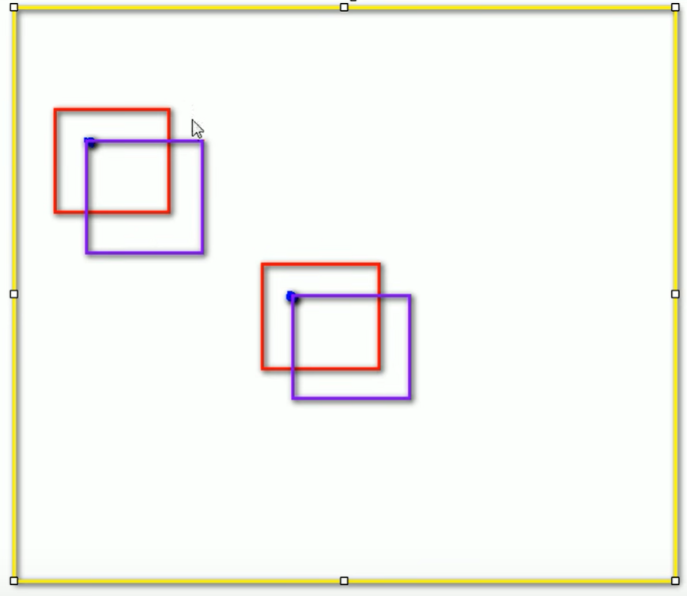
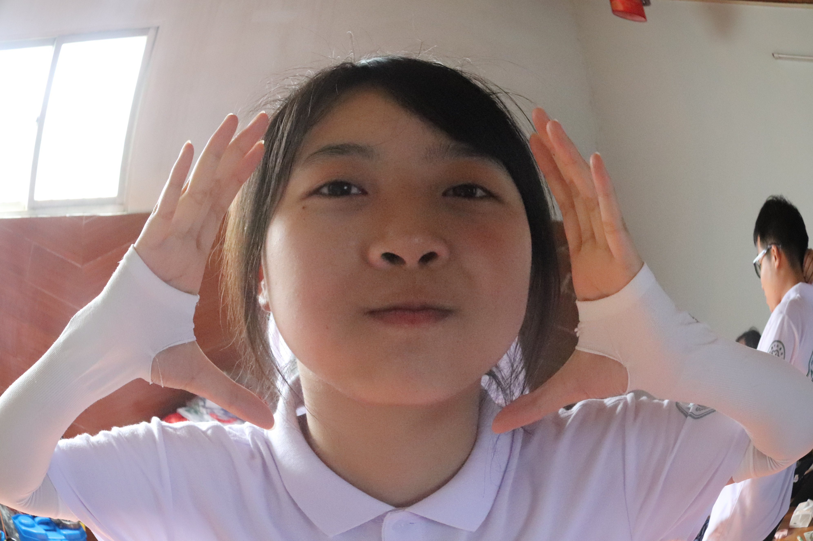

# 118_JS基础_拖拽（一）

​	

**97_JS基础_拖拽.html**

```html
<!DOCTYPE html>
<html lang="en">
  <head>
    <meta charset="UTF-8" />
    <title>Document</title>
    <style>
      #box1 {
        width: 100px;
        height: 100px;
        background-color: red;
        position: absolute;
      }
      #box2 {
        width: 100px;
        height: 100px;
        background-color: yellow;
        position: absolute;

        left: 200px;
        top: 200px;
      }
    </style>
    <script>
      window.onload = function () {
        /* 
            拖拽元素
                拖拽流程
                    1.当鼠标在被拖拽元素上按下时 开始拖拽 onmousedown
                    2.当鼠标移动时 被拖拽元素跟随鼠标移动 onmousemove
                    3.当鼠标松开时 被拖拽元素固定在当前位置 onmouseup
        */

        //获取box1
        var box1 = document.getElementById("box1");
        //为box1绑定一个鼠标按下事件
        //当鼠标在被拖拽元素上按下时 开始拖拽 onmousedown
        box1.onmousedown = function (event) {
          event = event || window.event;
          //div的偏移量 鼠标.clientX - 元素.offsetLeft
          //div的偏移量 鼠标.clientY - 元素.offsetTop
          var ol = event.clientX - box1.offsetLeft;
          var ot = event.clientY - box1.offsetTop;

          //onmousedown的event 和 onmousemove的event是不一样的

          //为document绑定一个onmousemove事件
          document.onmousemove = function (event) {
            event = event || window.event;
            //当鼠标移动时 被拖拽元素跟随鼠标移动 onmousemove
            //获取鼠标的坐标
            var left = event.clientX - ol;
            var top = event.clientY - ot;

            //修改box1的位置
            box1.style.left = left + "px";
            box1.style.top = top + "px";
          };

          //为元素绑定一个鼠标松开事件
          //   box1.onmouseup = function () {
          document.onmouseup = function () {
            /*  如果是box1的onmouseup的话 将box1拖拽到box2位置松开 
                    会发现box1并没有停止移动 而是跟随鼠标继续运动 
                    因为到box2松开鼠标是触发box2的事件 不是box1的，
                    所以这里要把box1改成全局的document，就可以解决啦 
            */

            //当鼠标松开时 被拖拽元素固定在当前位置 onmouseup
            //取消document的onmousemove事件
            document.onmousemove = null;

            //取消document的onmouseup事件
            document.onmouseup = null;

            // alert("鼠标松开了");
          };
        };
      };
    </script>
  </head>
  <body>
    <div id="box1"></div>
    <div id="box2"></div>
  </body>
</html>

```

​	

​	

# 119_JS基础_拖拽（二）




要获取浏览器的什么信息可以传入event参数来获取

​	

**98_JS基础_拖拽-IE8和其他浏览器-兼容.html**

```html
<!DOCTYPE html>
<html>
  <head>
    <meta charset="UTF-8" />
    <title>Document</title>
    <style>
      #box1 {
        width: 100px;
        height: 100px;
        background-color: red;
        position: absolute;
      }
      #box2 {
        width: 100px;
        height: 100px;
        background-color: yellow;
        position: absolute;

        left: 200px;
        top: 200px;
      }
    </style>
    <script>
      window.onload = function () {
        /* 
            拖拽元素
                拖拽流程
                    1.当鼠标在被拖拽元素上按下时 开始拖拽 onmousedown
                    2.当鼠标移动时 被拖拽元素跟随鼠标移动 onmousemove
                    3.当鼠标松开时 被拖拽元素固定在当前位置 onmouseup
        */

        //获取box1
        var box1 = document.getElementById("box1");
        //获取box2
        var box2 = document.getElementById("box2");

        //为box1绑定一个鼠标按下事件
        //当鼠标在被拖拽元素上按下时 开始拖拽 onmousedown
        box1.onmousedown = function (event) {
          //设置box1捕获所有鼠标按下的事件
          /* 
            setCapture()
              只有IE支持 但是火狐中调用时不会报错
                而如果使用chrome调用 会报错
          */

          // 写法一
          // if (box1.setCapture) {
          //   box1.setCapture();
          // }

          //写法二
          // 也可以这么写
          box1.setCapture && box1.setCapture();
          //如果第一个为true 则第二个也执行
          //如果第一个为false 第二个也就不用执行

          //完了需要设置releaseCapture来取消对鼠标的捕获
          //  不然鼠标移向空白地方点击依然会捕获box1并移动

          event = event || window.event;
          //div的偏移量 鼠标.clientX - 元素.offsetLeft
          //div的偏移量 鼠标.clientY - 元素.offsetTop
          var ol = event.clientX - box1.offsetLeft;
          var ot = event.clientY - box1.offsetTop;

          //onmousedown的event 和 onmousemove的event是不一样的

          //为document绑定一个onmousemove事件
          document.onmousemove = function (event) {
            event = event || window.event;
            //当鼠标移动时 被拖拽元素跟随鼠标移动 onmousemove
            //获取鼠标的坐标
            var left = event.clientX - ol;
            var top = event.clientY - ot;

            //修改box1的位置
            box1.style.left = left + "px";
            box1.style.top = top + "px";
          };

          //为元素绑定一个鼠标松开事件
          //   box1.onmouseup = function () {
          document.onmouseup = function () {
            /*  如果是box1的onmouseup的话 将box1拖拽到box2位置松开 
                    会发现box1并没有停止移动 而是跟随鼠标继续运动 
                    因为到box2松开鼠标是触发box2的事件 不是box1的，
                    所以这里要把box1改成全局的document，就可以解决啦 
            */

            //当鼠标松开时 被拖拽元素固定在当前位置 onmouseup
            //取消document的onmousemove事件
            document.onmousemove = null;

            //取消document的onmouseup事件
            document.onmouseup = null;

            // alert("鼠标松开了");

            //当鼠标松开时 取消对事件的捕获
            box1.releaseCapture && box1.releaseCapture();
          };

          /* 
            当我们拖拽一个网页中的内容时 浏览器会默认去搜索引擎中搜索内容
              此时会导致拖拽功能的异常 这个是浏览器提供的默认行为
              如果不希望发生这个行为 则可以通过return false来取消默认行为

            但是这招对IE8不起作用
          */
          return false; //这个也得写 上面releaseCapture()只是针对IE的
        };
      };
    </script>
  </head>
  <body>
    我是一段文字
    <div id="box1"></div>
    <div id="box2"></div>
  </body>
</html>

```

​	

​	

# 120_JS基础_拖拽（三）

​	

**99_JS基础_拖拽-测试IE8.html**

```html
<!DOCTYPE html>
<html lang="en">
  <head>
    <meta charset="UTF-8" />
    <title>Document</title>
    <style>
      body {
        border: 1px solid red;
      }
    </style>
    <script>
      // capture 捕获

      window.onload = function () {
        //分别为两个按钮绑定单击响应函数
        var btn01 = document.getElementById("btn01");
        var btn02 = document.getElementById("btn02");

        btn01.onclick = function () {
          alert(1);
        };
        btn02.onclick = function () {
          alert(2);
        };

        //设置btn01对鼠标按下相关的事件进行捕获
        /*        
            当调用一个元素的setCapture()方法以后 这个元素将会把下一次
                所有的鼠标按下相关的事情捕获到自身上 
          */
        btn01.setCapture();
      };
    </script>
  </head>
  <body>
    <button id="btn01">按钮01</button>
    <button id="btn02">按钮02</button>
  </body>
</html>

```

​	

**100_JS基础_拖拽-测试3.html**

```html
<!DOCTYPE html>
<html>
  <head>
    <meta charset="UTF-8" />
    <title>Document</title>
    <style>
      #box1 {
        width: 100px;
        height: 100px;
        background-color: red;
        position: absolute;
      }
      #box2 {
        width: 100px;
        height: 100px;
        background-color: yellow;
        position: absolute;

        left: 200px;
        top: 200px;
      }
    </style>
    <script>
      window.onload = function () {
        /* 
            拖拽元素
                拖拽流程
                    1.当鼠标在被拖拽元素上按下时 开始拖拽 onmousedown
                    2.当鼠标移动时 被拖拽元素跟随鼠标移动 onmousemove
                    3.当鼠标松开时 被拖拽元素固定在当前位置 onmouseup
        */

        //获取box1
        var box1 = document.getElementById("box1");
        //获取box2
        var box2 = document.getElementById("box2");
        var img2 = document.getElementById("img2");

        //开启box1的拖拽
        drag(box1);
        //开启box2的拖拽
        drag(box2);

        drag(img2);
      };

      /* 
        提取一个专门用来设置拖拽的函数
        参数：开启拖拽的元素
      */
      function drag(obj) {
        //box2
        obj.onmousedown = function (event) {
          //设置box2捕获所有鼠标按下的事件
          /* 
            setCapture()
              只有IE支持 但是火狐中调用时不会报错
                而如果使用chrome调用 会报错
          */

          obj.setCapture && obj.setCapture();
          //如果第一个为true 则第二个也执行
          //如果第一个为false 第二个也就不用执行

          //完了需要设置releaseCapture来取消对鼠标的捕获
          //  不然鼠标移向空白地方点击依然会捕获box1并移动

          event = event || window.event;
          //div的偏移量 鼠标.clientX - 元素.offsetLeft
          //div的偏移量 鼠标.clientY - 元素.offsetTop
          var ol = event.clientX - obj.offsetLeft;
          var ot = event.clientY - obj.offsetTop;

          //onmousedown的event 和 onmousemove的event是不一样的

          //为document绑定一个onmousemove事件
          document.onmousemove = function (event) {
            event = event || window.event;
            //当鼠标移动时 被拖拽元素跟随鼠标移动 onmousemove
            //获取鼠标的坐标
            var left = event.clientX - ol;
            var top = event.clientY - ot;

            //修改box2的位置
            obj.style.left = left + "px";
            obj.style.top = top + "px";
          };

          //为元素绑定一个鼠标松开事件
          document.onmouseup = function () {
            //当鼠标松开时 被拖拽元素固定在当前位置 onmouseup
            //取消document的onmousemove事件
            document.onmousemove = null;

            //取消document的onmouseup事件
            document.onmouseup = null;

            //当鼠标松开时 取消对事件的捕获
            obj.releaseCapture && obj.releaseCapture();
          };

          return false;
        };
      }
    </script>
  </head>
  <body>
    我是一段文字
    <div id="box1"></div>
    <div id="box2"></div>
    
    <!-- 记得要开启定位才能进行拖拽！ -->
  </body>
</html>

```

​	

​	

# 121_JS基础_滚轮的事件


