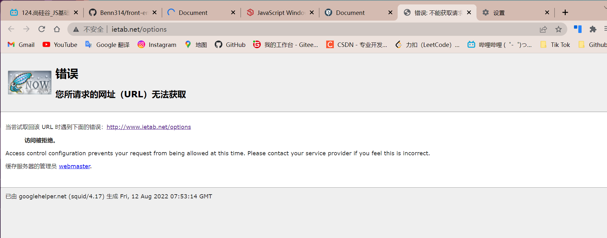
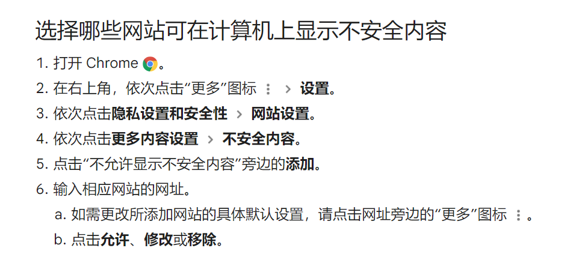
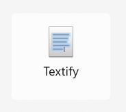
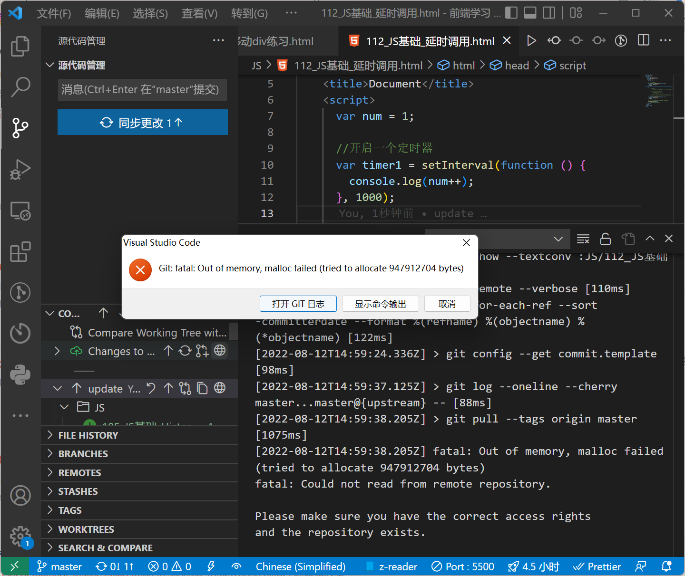
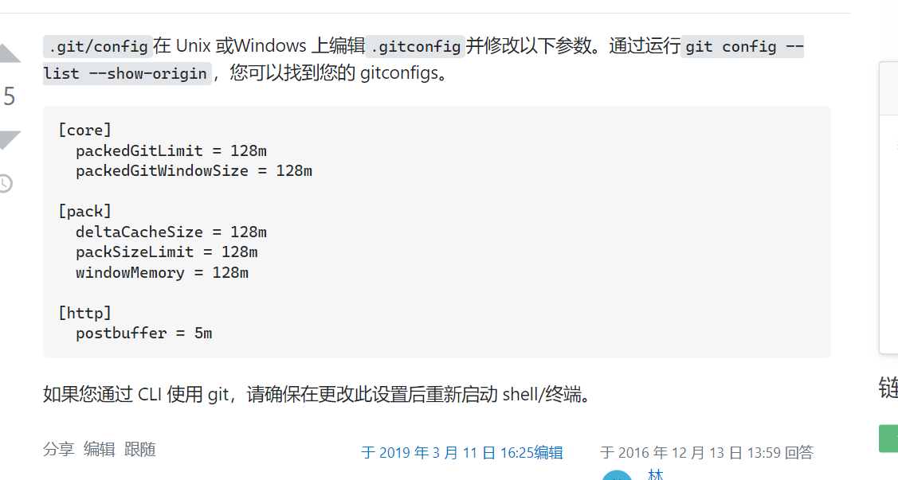
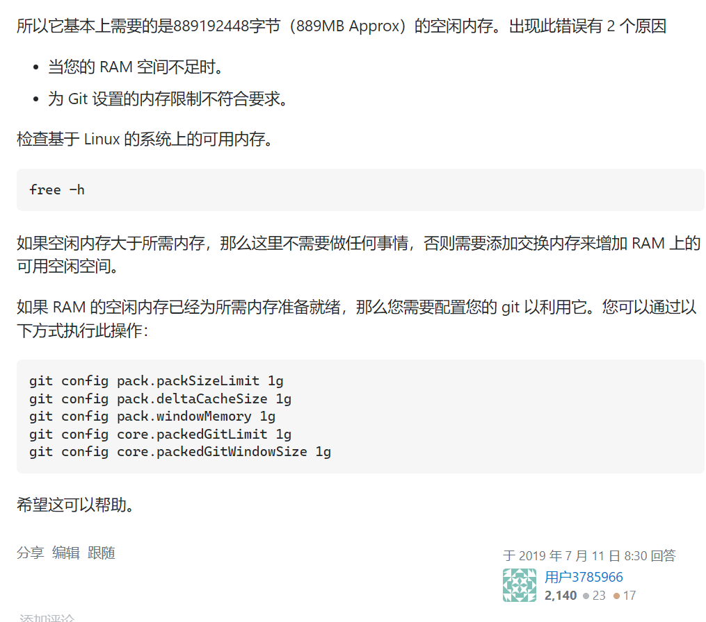

```html
8月12日 【Ben】

遇到的问题
【问题】
1.无法访问 https://www.ietab.net/options 网址链接？
【原因】科学上网的应用造成的
2.IE浏览器的alert弹窗无法复制信息？
3.vscode gitpush 遇到 Git: fatal: Out of memory, malloc failed (tried to allocate 947912704 bytes)

【解决】
1.两种方式以供解决
方式一: 先访问 http://www.ietab.net 再加上/options
方式二: 打开 chrome设置 该站点的【不安全内容】选项为允许 具体操作如下图
访问 https://www.ietab.net/options  如无法显示 地址栏刷新即可
2.下载个可强行复制的应用或插件就可以了 自己用的 Textify 强制转化为可复制文本即可复制粘贴
3.git/config在 Unix 或Windows 上编辑.gitconfig并修改以下参数。通过运行git config --list --show-origin，您可以找到您的 gitconfigs。

在本地仓库中的.git/config添加如下代码 增加空闲内存空间
---
[core]
  packedGitLimit = 128m
  packedGitWindowSize = 128m

[pack]
  deltaCacheSize = 128m
  packSizeLimit = 128m
  windowMemory = 128m

[http]
  postbuffer = 5m
---
如果您通过 CLI 使用 git，请确保在更改此设置后重新启动 shell/终端。

今日小结
1.【JS】学习了事件[滚轮,键盘]、BOM[Navigator,History,Location]、定时器、练习[键盘移动div,切换图片,修改div移动,定时器延时调用]
2.【JS】P121看到了P130
3.小结 || && 实现对象快速赋值

event = event || window.event; 
【解释】 有event吗？有就赋值给自己 没有则赋值 window.event

event.preventDefault && event.preventDefault();
【解释】有preventDefault方法吗？有则执行该方法 没有则不执行该语句

4.对DOM与BOM的理解
    ① DOM是JS用来操作网页的
    ② BOM是JS用来操作浏览器的

明日计划
1.【JS】学到P140 结束为期13天的JS学习任务 jin
```

​	

​	

【问题一 解决】





---

​	



​	

#### 快速设置— 如果你知道该怎么操作，直接使用下面的地址

HTTPS  SSH

我们强烈建议所有的git仓库都有一个`README`, `LICENSE`, `.gitignore`文件

初始化 readme 文件

Git入门？查看 [帮助](https://gitee.com/oschina/git-osc/wikis/帮助) , [Visual Studio](https://gitee.com/help/articles/4118) / [TortoiseGit](http://my.oschina.net/longxuu/blog/141699) / [Eclipse](https://gitee.com/help/articles/4119) / [Xcode](http://my.oschina.net/zxs/blog/142544) 下如何连接本站, [如何导入仓库](http://www.oschina.net/question/82993_133520)

#### 简易的命令行入门教程:

Git 全局设置:

```
git config --global user.name "Bennnnnnn"
git config --global user.email "209441806@qq.com"
```

创建 git 仓库:

```
mkdir front-end_learning
cd front-end_learning
git init 
touch README.md
git add README.md
git commit -m "first commit"
git remote add origin https://gitee.com/bennnnnnn/front-end_learning.git
git push -u origin "master"
```

已有仓库?

```
cd existing_git_repo
git remote add origin https://gitee.com/bennnnnnn/front-end_learning.git
git push -u origin "master"
```

​	

【问题三】



​	

【解决】



​	

