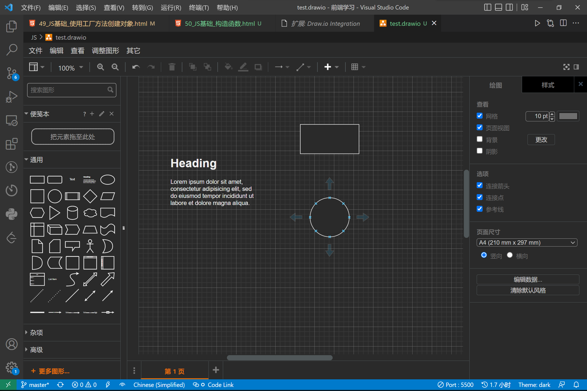

```html
8月5日 【Ben】

遇到的问题
【问题】
1.vscode上下移动代码？
2.vscode打开/关闭资源管理器？
3.谷歌调试右击变量没有 Add to watch？
4. <!DOCTYPE>标签

【解决】
1. 使用快捷键 ALT + ⇧/⇩
2. 使用快捷键 CTRL + B
3. 系统语言设置为中文后 debug右击变量的 `添加到监视选项(Add to watch)` 位置下移了 同时选项文本变更为 `将所选文本添加至监视表达式`
4.<!DOCTYPE>规定了浏览器文档使用哪种html或者xhtml规范 平时我们常用的 <!DOCTYPE html> 便是html5的声明 如果没有<!DOCTYPE>
声明，那么不同的浏览器将会以自己不同的怪异的模式去解析渲染页面，这样页面在不同的浏览器上呈现出来的效果也就不一样，人们把这称之
为“怪异模式”。但是如果声明了，将会开启“严格模式”，又有人称之为“标准模式”，浏览器将已w3c标准来解析渲染页面。

今日小结
1.学习了xxx
2.P58看到了第xx集
3.xxx

明日计划
1.学到第xx集
```

问题4  参考文章： [HTML中 !DOCTYPE 的解释与作用](https://blog.csdn.net/sunhl951/article/details/79763727?ops_request_misc=%257B%2522request%255Fid%2522%253A%2522165967323516782246445748%2522%252C%2522scm%2522%253A%252220140713.130102334..%2522%257D&request_id=165967323516782246445748&biz_id=0&utm_medium=distribute.pc_search_result.none-task-blog-2~all~sobaiduend~default-1-79763727-null-null.142^v39^pc_rank_v36,185^v2^control&utm_term=%21DOCTYPE%20html&spm=1018.2226.3001.4187)

​	

vscode 集成的 `draw.io` 插件极致顺滑

