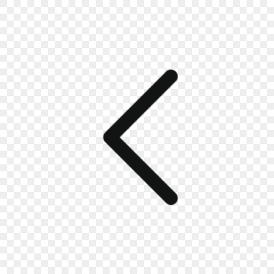
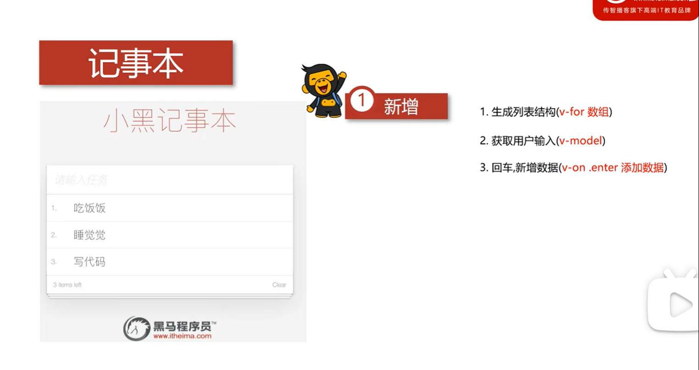
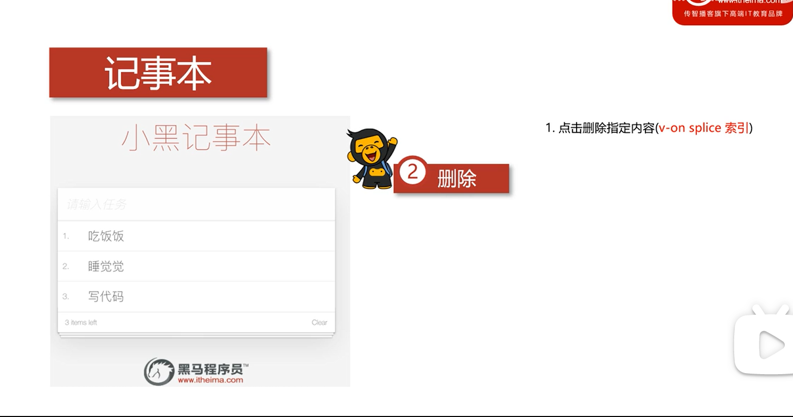

# 01 课程介绍


​	

​	

# 02 Vue基础-简介


​	

​	

# 03 Vue基础-第一个Vue程序


​	

**01_vue基础.html**

```html
<!DOCTYPE html>
<html lang="en">
  <head>
    <meta charset="UTF-8" />
    <meta http-equiv="X-UA-Compatible" content="IE=edge" />
    <meta name="viewport" content="width=device-width, initial-scale=1.0" />
    <title>Document</title>
  </head>
  <body>
    <div id="app">{{message}}</div>
    <!-- 开发环境版本，包含了有帮助的命令行警告 -->
    <script src="https://cdn.jsdelivr.net/npm/vue@2/dist/vue.js"></script>
    <script>
      var app = new Vue({
        el: "#app",
        data: {
          message: " Hello Vue! ",
        },
      });
    </script>
  </body>
</html>

```

​	

​	

# 04 Vue基础-el挂载点


实际开发中一般用id选择器 因为约定 id选择器是唯一的，而class类选择器和标签选择器则不是唯一的


不能把el挂到body标签和html标签上


​	

​	

# 05 Vue基础 data数据对象


​	

要添加这样的复杂类型 如何使用呢？


​	

**03_data数据对象.html**

```html
<!DOCTYPE html>
<html lang="en">
  <head>
    <meta charset="UTF-8" />
    <meta http-equiv="X-UA-Compatible" content="IE=edge" />
    <meta name="viewport" content="width=device-width, initial-scale=1.0" />
    <title>Document</title>
  </head>
  <body>
    <div id="app">
      {{message}}
      <h2>{{school.name }} {{school.mobile}}</h2>
      <ul>
        <li>{{campus[0]}}</li>
        <li>{{campus[3]}}</li>
      </ul>
    </div>
    <!-- 开发环境版本，包含了有帮助的命令行警告 -->
    <script src="https://cdn.jsdelivr.net/npm/vue@2/dist/vue.js"></script>
    <script>
      var app = new Vue({
        el: "#app",
        data: {
          message: " Hello Vue! ",
          school: {
            name: "小黑",
            mobile: "123456",
          },
          campus: ["北京校区", "上海校区", "广州校区", "深圳校区"],
        },
      });
    </script>
  </body>
</html>

```

​	

​	

# 06 本地应用-介绍


通过


来实现

vue指令有下面这些


​	

​	

# 07 本地应用 v-text指令


（v-text属性）内部用 +连接符表达式 连接的内容不会被覆盖  前后标签的内容则会被替换

​	

**04_v-text指令.html**

```html
<!DOCTYPE html>
<html lang="en">
  <head>
    <meta charset="UTF-8" />
    <meta http-equiv="X-UA-Compatible" content="IE=edge" />
    <meta name="viewport" content="width=device-width, initial-scale=1.0" />
    <title>Document</title>
  </head>
  <body>
    <div id="app">
      <h2 v-text="message+'!'">深圳</h2>
      <h2 v-text="info+'!'">深圳</h2>
      <h2>{{message+'!'}} 深圳</h2>
      <h2 v-text="message+'0'">{{message+'1'}} 深圳</h2>
    </div>
    <!-- 开发环境版本，包含了有帮助的命令行警告 -->
    <script src="https://cdn.jsdelivr.net/npm/vue@2/dist/vue.js"></script>
    <script>
      var app = new Vue({
        el: "#app",
        data: {
          message: "小黑马",
          info: "前端30k",
        },
      });
    </script>
  </body>
</html>

```

> 运行结果


> v-text属性优先级比 {{ }} 大  有了v-text  {{ }}也会被全部覆盖  二者最好不要一起用

​	

​	

# 08 本地应用 v-html指令


v-on:monseenter 鼠标移入事件

​	

​	

# 09 本地应用 v-on指令基础


​	

​	

# 10 本地应用 计数器


​	

​	

# 11 本地应用 v-show指令


​	

**05_v-show指令.html**

```html
<!DOCTYPE html>
<html lang="en">
  <head>
    <meta charset="UTF-8" />
    <meta http-equiv="X-UA-Compatible" content="IE=edge" />
    <meta name="viewport" content="width=device-width, initial-scale=1.0" />
    <title>Document</title>
  </head>
  <body>
    <div id="app">
      <input type="button" value="切换显示状态" @click="changeIsShow" />
      <input type="button" value="累加年龄" @click="addAge" />
      
      =18" src="img/v-show.png" alt="" />
    </div>
    <!-- 开发环境版本，包含了有帮助的命令行警告 -->
    <script src="https://cdn.jsdelivr.net/npm/vue@2/dist/vue.js"></script>
    <script>
      var app = new Vue({
        el: "#app",
        data: {
          isShow: false,
          age: 17,
        },
        methods: {
          changeIsShow: function () {
            this.isShow = !this.isShow;
          },
          addAge: function () {
            this.age++;
          },
        },
      });
    </script>
  </body>
</html>

```

​	


​	

​	

# 12 本地应用 v-if指令


​	

> v-if 和 v-show的效果显示相同 但是 v-if 是将整个标签移除 而 v-show 是更改其标签的样式

​	

​	

# 13 本地应用 v-bind指令


​	


> 动态增删class属性  建议使用对象的方式来写 true的话显示 false就移除

​	

**06_v-bind指令.html**

```html
<!DOCTYPE html>
<html lang="en">
  <head>
    <meta charset="UTF-8" />
    <meta http-equiv="X-UA-Compatible" content="IE=edge" />
    <meta name="viewport" content="width=device-width, initial-scale=1.0" />
    <title>v-bind</title>
    <style>
      .active {
        border: 1px solid green;
      }
    </style>
  </head>
  <body>
    <!--  -->
    <div id="app">
      
      <br />
      <!-- 
        三元运算符的写法
        :class="isActive?'active':''" 
      -->
      
      <br />
      <!-- 
        使用对象的方式来动态增删class属性
        active:isActive
       -->
      

      <!-- 可以用字符串拼接 -->
    </div>
    <!-- 开发环境版本，包含了有帮助的命令行警告 -->
    <script src="https://cdn.jsdelivr.net/npm/vue@2/dist/vue.js"></script>
    <script>
      var app = new Vue({
        el: "#app",
        data: {
          imgSrc: "img/v-show.png",
          imgTitle: "黑马程序员",
          isActive: false,
        },
        methods: {
          toggleActive: function () {
            this.isActive = !this.isActive;
          },
        },
      });
    </script>
  </body>
</html>

```

​	


​	

​	

# 14 本地应用 图片切换

v-if是操作dom元素增加和删除 对性能消耗大


​	

**07_本地应用-图片切换.html**

```html
<!DOCTYPE html>
<html lang="en">
  <head>
    <meta charset="UTF-8" />
    <meta http-equiv="X-UA-Compatible" content="IE=edge" />
    <meta name="viewport" content="width=device-width, initial-scale=1.0" />
    <title>Document</title>
  </head>
  <body>
    <div id="mask">
      <div class="center">
        <h2 class="title">
          
        </h2>
        <!-- 图片 -->
        <!--  -->
        
        <!-- 左箭头 v-show -->
        <!-- <a
          href="javascript:void(0)"
          v-show="index!=0"
          @click="prev"
          class="left"
        >
          
        </a> -->

        <!-- 左箭头 v-if -->
        <a href="javascript:void(0)" v-if="index!=0" @click="prev" class="left">
          
        </a>

        <!-- 右箭头 -->
        <a
          href="javascript:void(0)"
          v-show="index<imgArr.length-1"
          @click="next"
          class="right"
        >
          
        </a>
      </div>
    </div>

    <!-- 开发环境版本，包含了有帮助的命令行警告 -->
    <script src="https://cdn.jsdelivr.net/npm/vue@2/dist/vue.js"></script>

    <script>
      var app = new Vue({
        el: "#mask",
        data: {
          imgArr: ["./img/00.jpg", "./img/01.jpg", "./img/02.jpg"],
          index: 0,
        },
        methods: {
          prev: function () {
            this.index--;
          },
          next: function () {
            this.index++;
          },
        },
      });
    </script>
  </body>
</html>

```

​	


​	

​	

# 15 本地应用 v-for指令


​	

**08_v-for指令.html**

```html
<!DOCTYPE html>
<html lang="en">
  <head>
    <meta charset="UTF-8" />
    <meta http-equiv="X-UA-Compatible" content="IE=edge" />
    <meta name="viewport" content="width=device-width, initial-scale=1.0" />
    <title>Document</title>
  </head>
  <body>
    <div id="app">
      <input type="button" value="添加数据" @click="add" />
      <input type="button" value="移除数据" @click="remove" />
      <!-- 
        it 是每一项的值
        index 是每一项的索引
    -->
      <ul>
        <li v-for="(it,index) in arr">{{ index+1 }}黑马程序员:{{it}}</li>
      </ul>
      <!-- 要获取到对象的值 要用. 获取 单一个item获取会把属性名也包含进去 -->
      <h2 v-for="item in vegetables" v-bind:title="item.name">{{item.name}}</h2>
    </div>
    <!-- 开发环境版本，包含了有帮助的命令行警告 -->
    <script src="https://cdn.jsdelivr.net/npm/vue@2/dist/vue.js"></script>
    <script>
      var app = new Vue({
        el: "#app",
        data: {
          arr: ["北京", "上海", "广州", "深圳"],
          vegetables: [{ name: "西兰花炒蛋" }, { name: "蛋炒西兰花" }],
        },
        methods: {
          add: function () {
            this.vegetables.push({ name: "花菜炒蛋" });
          },
          remove: function () {
            this.vegetables.shift();
          },
        },
      });
    </script>
  </body>
</html>

```

​	

​	

# 16 本地应用 v-on补充


​	

**09_v-on补充.html**

```html
<!DOCTYPE html>
<html lang="en">
  <head>
    <meta charset="UTF-8" />
    <meta http-equiv="X-UA-Compatible" content="IE=edge" />
    <meta name="viewport" content="width=device-width, initial-scale=1.0" />
    <title>Document</title>
  </head>
  <body>
    <div id="app">
      <input type="button" value="点击" @click="doIt(666,'老铁')" />
      <input type="text" @keyup.enter="sayHi" />
    </div>
    <!-- 开发环境版本，包含了有帮助的命令行警告 -->
    <script src="https://cdn.jsdelivr.net/npm/vue@2/dist/vue.js"></script>
    <script>
      var app = new Vue({
        el: "#app",
        methods: {
          doIt: function (p1, p2) {
            console.log("做it");
            console.log(p1);
            console.log(p2);
          },
          sayHi: function () {
            alert("吃了没");
          },
        },
      });
    </script>
  </body>
</html>

```

​	

​	

# 17 本地应用 v-model指令


​	

**10_v-model指令.html**

```html
<!DOCTYPE html>
<html lang="en">
  <head>
    <meta charset="UTF-8" />
    <meta http-equiv="X-UA-Compatible" content="IE=edge" />
    <meta name="viewport" content="width=device-width, initial-scale=1.0" />
    <title>v-model指令</title>
  </head>
  <body>
    <div id="app">
      <input type="button" value="修改message" @click="setM" />
      <input type="text" v-model="message" @keyup.enter="getM" />
      <h2>{{message}}</h2>
    </div>
    <!-- 开发环境版本，包含了有帮助的命令行警告 -->
    <script src="https://cdn.jsdelivr.net/npm/vue@2/dist/vue.js"></script>
    <script>
      var app = new Vue({
        el: "#app",
        data: {
          message: "黑马程序员",
        },
        methods: {
          getM: function () {
            alert(this.message);
          },
          setM: function () {
            this.message = "酷丁🐟";
          },
        },
      });
    </script>
  </body>
</html>

```

​	

​	

# 18 本地应用 小黑记事本-介绍


​	

​	

# 19 本地应用 小黑记事本-新增




​	

**11_小黑记事本-新增.html**

```html
<!DOCTYPE html>
<html lang="en">
  <head>
    <meta charset="UTF-8" />
    <meta http-equiv="X-UA-Compatible" content="IE=edge" />
    <meta name="viewport" content="width=device-width, initial-scale=1.0" />
    <title>Document</title>
  </head>
  <body>
    <!-- 主体区域 -->
    <section id="todoapp">
      <!-- 输入框 -->
      <header class="header">
        <h1>小黑记事本</h1>
        <input
          v-model="inputValue"
          @keyup.enter="add"
          autofocus="autofocus"
          autocomplete="off"
          placeholder="请输入任务"
          class="new-todo"
        />
      </header>
      <!-- 列表区域 -->
      <section class="main">
        <ul class="todo-list">
          <li class="todo" v-for="(item,index) in list">
            <div class="view">
              <span class="index"> {{ index+1 }}.</span>
              <label for="">{{item}}</label>
              <button class="destroy"></button>
            </div>
          </li>
        </ul>
      </section>
      <!-- 统计和清空 -->
      <footer class="footer">···</footer>
    </section>
    <!-- 底部-->
    <footer class="info">···</footer>
    <!-- 开发环境版本，包含了有帮助的命令行警告 -->
    <script src="https://cdn.jsdelivr.net/npm/vue@2/dist/vue.js"></script>
    <script>
      var app = new Vue({
        el: "#todoapp",
        data: {
          list: ["写代码", "吃饭饭", "睡觉觉"],
          inputValue: "好好学习，天天向上",
        },
        methods: {
          add: function () {
            this.list.push(this.inputValue);
          },
        },
      });
    </script>
  </body>
</html>

```

​	

​	

# 20 本地应用 小黑记事本-删除




​	

**11_小黑记事本-新增.html**

```html
<!DOCTYPE html>
<html lang="en">
  <head>
    <meta charset="UTF-8" />
    <meta http-equiv="X-UA-Compatible" content="IE=edge" />
    <meta name="viewport" content="width=device-width, initial-scale=1.0" />
    <title>Document</title>
  </head>
  <body>
    <!-- 主体区域 -->
    <section id="todoapp">
      <!-- 输入框 -->
      <header class="header">
        <h1>小黑记事本</h1>
        <input
          v-model="inputValue"
          @keyup.enter="add"
          autofocus="autofocus"
          autocomplete="off"
          placeholder="请输入任务"
          class="new-todo"
        />
      </header>
      <!-- 列表区域 -->
      <section class="main">
        <ul class="todo-list">
          <li class="todo" v-for="(item,index) in list">
            <div class="view">
              <span class="index"> {{ index+1 }}.</span>
              <label for="">{{item}}</label>
              <button class="destroy" @click="remove(index)"></button>
            </div>
          </li>
        </ul>
      </section>
      <!-- 统计和清空 -->
      <footer class="footer">···</footer>
    </section>
    <!-- 底部-->
    <footer class="info">···</footer>
    <!-- 开发环境版本，包含了有帮助的命令行警告 -->
    <script src="https://cdn.jsdelivr.net/npm/vue@2/dist/vue.js"></script>
    <script>
      var app = new Vue({
        el: "#todoapp",
        data: {
          list: ["写代码", "吃饭饭", "睡觉觉"],
          inputValue: "好好学习，天天向上",
        },
        methods: {
          add: function () {
            this.list.push(this.inputValue);
          },
          remove: function (index) {
            // console.log("删除");
            // console.log(index);
            this.list.splice(index, 1);
          },
        },
      });
    </script>
  </body>
</html>

```

​	

​	

# 21 本地应用 小黑记事本-统计


​	

**11_小黑记事本-新增.html**

```html
<!DOCTYPE html>
<html lang="en">
  <head>
    <meta charset="UTF-8" />
    <meta http-equiv="X-UA-Compatible" content="IE=edge" />
    <meta name="viewport" content="width=device-width, initial-scale=1.0" />
    <title>Document</title>
  </head>
  <body>
    <!-- 主体区域 -->
    <section id="todoapp">
      <!-- 输入框 -->
      <header class="header">
        <h1>小黑记事本</h1>
        <input
          v-model="inputValue"
          @keyup.enter="add"
          autofocus="autofocus"
          autocomplete="off"
          placeholder="请输入任务"
          class="new-todo"
        />
      </header>
      <!-- 列表区域 -->
      <section class="main">
        <ul class="todo-list">
          <li class="todo" v-for="(item,index) in list">
            <div class="view">
              <span class="index"> {{ index+1 }}.</span>
              <label for="">{{item}}</label>
              <button class="destroy" @click="remove(index)"></button>
            </div>
          </li>
        </ul>
      </section>
      <!-- 统计和清空 -->
      <footer class="footer">
        <span class="todo-count">
          <strong> {{list.length}} </strong> items left
        </span>
        <button class="clear-completed">Clear</button>
      </footer>
    </section>
    <!-- 底部-->
    <footer class="info">···</footer>
    <!-- 开发环境版本，包含了有帮助的命令行警告 -->
    <script src="https://cdn.jsdelivr.net/npm/vue@2/dist/vue.js"></script>
    <script>
      var app = new Vue({
        el: "#todoapp",
        data: {
          list: ["写代码", "吃饭饭", "睡觉觉"],
          inputValue: "好好学习，天天向上",
        },
        methods: {
          add: function () {
            this.list.push(this.inputValue);
          },
          remove: function (index) {
            // console.log("删除");
            // console.log(index);
            this.list.splice(index, 1);
          },
        },
      });
    </script>
  </body>
</html>

```

​	

​	

# 22 本地应用 小黑记事本-清空


​	

**11_小黑记事本-新增.html**

```html
<!DOCTYPE html>
<html lang="en">
  <head>
    <meta charset="UTF-8" />
    <meta http-equiv="X-UA-Compatible" content="IE=edge" />
    <meta name="viewport" content="width=device-width, initial-scale=1.0" />
    <title>Document</title>
  </head>
  <body>
    <!-- 主体区域 -->
    <section id="todoapp">
      <!-- 输入框 -->
      <header class="header">
        <h1>小黑记事本</h1>
        <input
          v-model="inputValue"
          @keyup.enter="add"
          autofocus="autofocus"
          autocomplete="off"
          placeholder="请输入任务"
          class="new-todo"
        />
      </header>
      <!-- 列表区域 -->
      <section class="main">
        <ul class="todo-list">
          <li class="todo" v-for="(item,index) in list">
            <div class="view">
              <span class="index"> {{ index+1 }}.</span>
              <label for="">{{item}}</label>
              <button class="destroy" @click="remove(index)"></button>
            </div>
          </li>
        </ul>
      </section>
      <!-- 统计和清空 -->
      <footer class="footer">
        <span class="todo-count">
          <strong> {{list.length}} </strong> items left
        </span>
        <button class="clear-completed" @click="clear">Clear</button>
      </footer>
    </section>
    <!-- 底部-->
    <footer class="info">···</footer>
    <!-- 开发环境版本，包含了有帮助的命令行警告 -->
    <script src="https://cdn.jsdelivr.net/npm/vue@2/dist/vue.js"></script>
    <script>
      var app = new Vue({
        el: "#todoapp",
        data: {
          list: ["写代码", "吃饭饭", "睡觉觉"],
          inputValue: "好好学习，天天向上",
        },
        methods: {
          add: function () {
            this.list.push(this.inputValue);
          },
          remove: function (index) {
            // console.log("删除");
            // console.log(index);
            this.list.splice(index, 1);
          },
          clear: function () {
            this.list = [];
          },
        },
      });
    </script>
  </body>
</html>

```

​	

​	

# 23 本地应用 小黑记事本-隐藏


​	

**11_小黑记事本-新增.html**

```html
<!DOCTYPE html>
<html lang="en">
  <head>
    <meta charset="UTF-8" />
    <meta http-equiv="X-UA-Compatible" content="IE=edge" />
    <meta name="viewport" content="width=device-width, initial-scale=1.0" />
    <title>Document</title>
  </head>
  <body>
    <!-- 主体区域 -->
    <section id="todoapp">
      <!-- 输入框 -->
      <header class="header">
        <h1>小黑记事本</h1>
        <input
          v-model="inputValue"
          @keyup.enter="add"
          autofocus="autofocus"
          autocomplete="off"
          placeholder="请输入任务"
          class="new-todo"
        />
      </header>
      <!-- 列表区域 -->
      <section class="main">
        <ul class="todo-list">
          <li class="todo" v-for="(item,index) in list">
            <div class="view">
              <span class="index"> {{ index+1 }}.</span>
              <label for="">{{item}}</label>
              <button class="destroy" @click="remove(index)"></button>
            </div>
          </li>
        </ul>
      </section>
      <!-- 统计和清空 -->
      <footer class="footer" v-show="list.length!=0">
        <span class="todo-count" v-if="list.length!=0">
          <strong> {{list.length}} </strong> items left
        </span>
        <button v-show="list.length!=0" class="clear-completed" @click="clear">
          Clear
        </button>
      </footer>
    </section>
    <!-- 底部-->
    <footer class="info">···</footer>
    <!-- 开发环境版本，包含了有帮助的命令行警告 -->
    <script src="https://cdn.jsdelivr.net/npm/vue@2/dist/vue.js"></script>
    <script>
      var app = new Vue({
        el: "#todoapp",
        data: {
          list: ["写代码", "吃饭饭", "睡觉觉"],
          inputValue: "好好学习，天天向上",
        },
        methods: {
          add: function () {
            this.list.push(this.inputValue);
          },
          remove: function (index) {
            // console.log("删除");
            // console.log(index);
            this.list.splice(index, 1);
          },
          clear: function () {
            this.list = [];
          },
        },
      });
    </script>
  </body>
</html>

```

