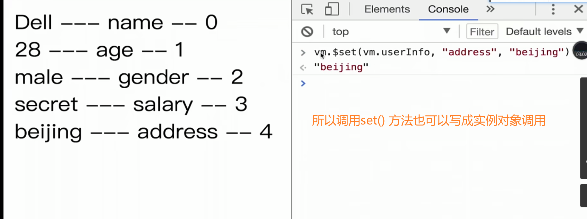

# 第一章 课程介绍

## 1-1


​	

​	

# 第二章 Vue起步

## 2-1

[Vue2-官方文档](https://v2.cn.vuejs.org/v2/guide/)

> 官方文档是最好的学习工具

​	

## 2-2

**安装-兼容性**

Vue **不支持** IE8 及以下版本，因为 Vue 使用了 IE8 无法模拟的 ECMAScript 5 特性。但它支持所有[兼容 ECMAScript 5 的浏览器](https://caniuse.com/#feat=es5)。

​	

{{ }} 是差值表达式


data 的作用 定义一些数据

el是限制 Vue实例 接管/处理 DOM的范围

​	

Vue.js 让我们不需要关注DOM的操作 而是把精力集中到数据的管理之上了

​	

**2-2.html**

```html
<!DOCTYPE html>
<html lang="en">
  <head>
    <meta charset="UTF-8" />
    <meta http-equiv="X-UA-Compatible" content="IE=edge" />
    <meta name="viewport" content="width=device-width, initial-scale=1.0" />
    <title>Document</title>
    <script src="./vue.js"></script>
  </head>
  <body>
    <div id="app">{{content}}</div>
    <!-- <div>{{content}}</div> -->

    <script>
      //   var dom = document.getElementById("app");
      //   dom.innerHTML = "hello world";

      //   setTimeout(function () {
      //     dom.innerHTML = "bye world";
      //   }, 2000);

      var app = new Vue({
        el: "#app",
        data: {
          content: "hello world1",
        },
      });

      setTimeout(function () {
        app.$data.content = "bye world1";
      }, 2000);
    </script>
  </body>
</html>

```

​	

## 2-3

el 你要使用Vue来接管哪一个标签区域


​	

**2-3.html**

```html
<!DOCTYPE html>
<html lang="en">
  <head>
    <meta charset="UTF-8" />
    <meta http-equiv="X-UA-Compatible" content="IE=edge" />
    <meta name="viewport" content="width=device-width, initial-scale=1.0" />
    <title>Document</title>
    <script src="./vue.js"></script>
  </head>
  <body>
    <div id="app">
      <!-- v-model="inputValue"跟input的value属性绑定 -->
      <input type="text" v-model="inputValue" />
      <button v-on:click="handleBtnClick">提交</button>
      <ul>
        <!-- <li>第一课的内容</li> -->
        <li v-for="item in list">{{item}}</li>
      </ul>
    </div>
    <script>
      var app = new Vue({
        el: "#app",
        data: {
          //   list: ["第一课的内容", "第二课的内容", "33333"],
          list: [],
          inputValue: "",
        },
        methods: {
          handleBtnClick: function () {
            // alert("click");
            // alert(this.inputValue);
            this.list.push(this.inputValue);
            this.inputValue = "";
          },
        },
      });
    </script>
  </body>
</html>

```

​	

## 2-4 MVVM模式

> Vue是MVVM设计模式

传统MVP设计模式


P层是核心层（是V和M的中转站） Model层是边缘层 几乎没有

而MVVM设计模式 几乎把注意力都集中在了M层

所以 我们可以这么理解 以前用jQuery进行开发 我们是面向DOM进行开发；而现在用MVVM进行开发 我们是面向数据进行编程


**2-4_MVVM.html**

```html
<!DOCTYPE html>
<html lang="en">
  <head>
    <meta charset="UTF-8" />
    <meta http-equiv="X-UA-Compatible" content="IE=edge" />
    <meta name="viewport" content="width=device-width, initial-scale=1.0" />
    <title>TodoList Jquery</title>
    <script src="https://cdn.bootcdn.net/ajax/libs/jquery/3.4.1/jquery.js"></script>
  </head>
  <body>
    <div>
      <input id="input" type="text" />
      <button id="btn">提交</button>
      <ul id="list"></ul>
    </div>

    <script>
      // M 模型层 V 视图 P控制器
      function Page() {}

      $.extend(Page.prototype, {
        init: function () {
          this.bindEvents();
        },
        bindEvents: function () {
          var btn = $("#btn");
          btn.on("click", $.proxy(this.handleBtnClick, this));
        },
        handleBtnClick: function () {
          //   alert("123");
          var inputElem = $("#input");
          var inputValue = inputElem.val();
          var ulElem = $("#list");
          ulElem.append("<li>" + inputValue + "</li>");
          inputElem.val("");
        },
      });

      var page = new Page();
      page.init();
    </script>
  </body>
</html>

```

​	

## 2-5 组件化


一个组件就是一个小的区域

​	

## 2-6

`Vue.component()` 是Vue提供给我们创建**全局组件**的方法

**2-6_组件化.html**

```html
<!DOCTYPE html>
<html lang="en">
  <head>
    <meta charset="UTF-8" />
    <meta http-equiv="X-UA-Compatible" content="IE=edge" />
    <meta name="viewport" content="width=device-width, initial-scale=1.0" />
    <title>Document</title>
    <script src="./vue.js"></script>
  </head>
  <body>
    <!-- View 层 -->
    <div id="root">
      <!-- v-model="todoValue"跟input的value属性绑定 -->
      <input type="text" v-model="todoValue" />
      <button v-on:click="handleBtnClick">提交</button>
      <ul>
        <!-- <li>第一课的内容</li> -->
        <!-- <li v-for="item in list">{{item}}</li> -->
        <todo-item v-bind:content="item" v-for="item in list"></todo-item>
      </ul>
    </div>

    <script>
      // 全局组件的使用
      // Vue.component("TodoItem", {
      //   props: ["content"],
      //   // template: "<li>todo item</li>",  //这样写死了 每一项都是同样内容：todo item
      //   // template: "<li>" + this.content + "</li>",  //这么写会有问题 要用差值表达式
      //   template: "<li>{{content}}</li>",
      // });

      //局部组件的使用
      var TodoItem = {
        props: ["content"],
        template: "<li>{{content}}</li>",
      };

      // Model 层
      //components 组件的意思
      var app = new Vue({
        el: "#root",
        components: {
          TodoItem: TodoItem,
        },
        data: {
          //   list: ["第一课的内容", "第二课的内容", "33333"],
          list: [],
          todoValue: "",
        },
        methods: {
          handleBtnClick: function () {
            // alert("click");
            // alert(this.todoValue);
            this.list.push(this.todoValue);
            this.todoValue = "";
          },
        },
      });
    </script>
  </body>
</html>

```

​	

## 2-7

通过v-bind进行传值 子(局部)组件记得接收 而后通过$emit向f父组件上一层触发事件 子组件触发事件 父组件进行监听


**2-7.html**

```html
<!DOCTYPE html>
<html lang="en">
  <head>
    <meta charset="UTF-8" />
    <meta http-equiv="X-UA-Compatible" content="IE=edge" />
    <meta name="viewport" content="width=device-width, initial-scale=1.0" />
    <title>Document</title>
    <script src="./vue.js"></script>
  </head>
  <body>
    <!-- View 层 -->
    <div id="root">
      <!-- v-model="todoValue"跟input的value属性绑定 -->
      <input type="text" v-model="todoValue" />
      <button v-on:click="handleBtnClick">提交</button>
      <ul>
        <!-- <li>第一课的内容</li> -->
        <!-- <li v-for="item in list">{{item}}</li> -->
        <todo-item
          v-bind:content="item"
          :index="index"
          v-for="(item,index) in list"
          @delete="handleItemDelete"
        ></todo-item>
      </ul>
    </div>

    <script>
      // 全局组件的使用
      // Vue.component("TodoItem", {
      //   props: ["content"],
      //   // template: "<li>todo item</li>",  //这样写死了 每一项都是同样内容：todo item
      //   // template: "<li>" + this.content + "</li>",  //这么写会有问题 要用差值表达式
      //   template: "<li>{{content}}</li>",
      // });

      //局部组件的使用
      var TodoItem = {
        props: ["content", "index"],
        template: "<li @click='handleItemClick'>{{content}}</li>",
        methods: {
          handleItemClick: function () {
            // alert("click");
            this.$emit("delete", this.index);
          },
        },
      };

      // Model 层
      //components 组件的意思
      var app = new Vue({
        el: "#root",
        components: {
          TodoItem: TodoItem,
        },
        data: {
          //   list: ["第一课的内容", "第二课的内容", "33333"],
          list: [],
          todoValue: "",
        },
        methods: {
          handleBtnClick: function () {
            // alert("click");
            // alert(this.todoValue);
            this.list.push(this.todoValue);
            this.todoValue = "";
          },
          handleItemDelete: function (index) {
            // alert("delete");
            this.list.splice(index, 1);
          },
        },
      });
    </script>
  </body>
</html>

```

​	

## 2-8

通读Vue官方文档-介绍 熟悉基础语法

[Vue2-介绍](https://v2.cn.vuejs.org/v2/guide/index.html)

el 是element的缩写 元素

​	

**响应式**

Vue的魔力在于数据的变更，当我们打开控制台改变变量的值 注意在变量分值改变的同时 VUE 自动更新了我们的HTML 这是因为 VUE 是响应式的 也就是说当我们的数据变更时 VUE会帮你更新所有网页中用到它的地方

​	

注意我们不再和 HTML 直接交互了。一个 Vue 应用会将其挂载到一个 DOM 元素上 (对于这个例子是 `#app`) 然后对其进行完全控制。那个 HTML 是我们的入口，但其余都会发生在新创建的 Vue 实例内部。

attribute 属性

​	

`v-bind` attribute 被称为**指令** 

指令带有前缀 `v-`，以表示它们是 Vue 提供的特殊 attribute

​	

我们不仅可以把数据绑定到 DOM 文本或 attribute，还可以绑定到 DOM **结构**。此外，Vue 也提供一个强大的过渡效果系统，可以在 Vue 插入/更新/移除元素时自动应用[过渡效果](https://v2.cn.vuejs.org/v2/guide/transitions.html)。

​	

注意在 `reverseMessage` 方法中，我们更新了应用的状态，但没有触碰 DOM——所有的 DOM 操作都由 Vue 来处理，你编写的代码只需要关注逻辑层面即可。

Vue 还提供了 `v-model` 指令，它能轻松实现表单输入和应用状态之间的双向绑定。

​	

### [组件化应用构建](https://v2.cn.vuejs.org/v2/guide/index.html#组件化应用构建)

[观看本节视频讲解](https://learning.dcloud.io/#/?vid=12)

组件系统是 Vue 的另一个重要概念，因为它是一种抽象，允许我们使用小型、独立和通常可复用的组件构建大型应用。仔细想想，几乎任意类型的应用界面都可以抽象为一个组件树：


​	

property 属性、性质

```js
Vue.component('todo-item', {
  // todo-item 组件现在接受一个
  // "prop"，类似于一个自定义 attribute。
  // 这个 prop 名为 todo。
  props: ['todo'],
  template: '<li>{{ todo.text }}</li>'
})
```

但是这样会为每个待办项渲染同样的文本，这看起来并不炫酷。我们应该能从父作用域将数据传到子组件才对。让我们来修改一下组件的定义，使之能够接受一个 [prop](https://v2.cn.vuejs.org/v2/guide/components.html#通过-Prop-向子组件传递数据)：


​	尽管这只是一个刻意设计的例子，但是我们已经设法将应用分割成了两个更小的单元。子单元通过 prop 接口与父单元进行了良好的解耦。我们现在可以进一步改进 `<todo-item>` 组件，提供更为复杂的模板和逻辑，而不会影响到父单元。

​	

​	

# 第三章 Vue 基础精讲

## 3-1

在官方文档中 我们经常可以看到 vue对象实例 vm、app

handleClick不能定义在其他地方 只能定义在methods下面

​	

我们可以这么理解 一个vue的项目它实际上是由很多组件所组成的，也可以理解成一个vue项目是由很多实例拼装所组成的

因为组件的话 页面是可以分成很多组件的 实际上每个组件就是一个vue实例 一个项目是由vue实例所组成的也没有错误

​	

以 `$` 为开头的都是vue的实例属性/方法


​	


​	

**3-1.html**

```html
<!DOCTYPE html>
<html lang="en">
  <head>
    <meta charset="UTF-8" />
    <meta http-equiv="X-UA-Compatible" content="IE=edge" />
    <meta name="viewport" content="width=device-width, initial-scale=1.0" />
    <title>Vue实例</title>
    <!-- 两种引入都可以 但是文件必须为超链接形式-->
    <!-- <script src="vue.js"></script> -->
    <script src="./vue.js"></script>
  </head>
  <body>
    <div id="root">
      <div @click="handleClick">{{message}}</div>
      <item></item>
    </div>

    <script>
      Vue.component("item", {
        template: "<div>hello world1</div>",
      });

      var vm = new Vue({
        el: "#root",
        data: {
          message: "hello world",
        },
        methods: {
          handleClick: function () {
            alert("hello");
          },
        },
      });
    </script>
  </body>
</html>

```

​	

## 3-2 Vue实例的生命周期钩子


​	

**3-2-Vue实例的生命周期钩子.html**

```html
<!DOCTYPE html>
<html lang="en">
  <head>
    <meta charset="UTF-8" />
    <meta http-equiv="X-UA-Compatible" content="IE=edge" />
    <meta name="viewport" content="width=device-width, initial-scale=1.0" />
    <title>Vue实例的生命周期函数</title>
    <script src="vue.js"></script>
  </head>
  <body>
    <div id="app">111</div>

    <script>
      // 生命周期函数就是vue实例在某一个时间点会自动执行的函数
      //   Vue的生命周期函数不是放在methods里 而是直接放在Vue的实例里就可以了
      var vm = new Vue({
        el: "#app",
        template: "<div>{{test}}</div>",
        data() {
          // 不加return 会报Warn 无法正常显示
          return {
            test: "hello world",
          };
        },
        //   beforeMount被执行的时候页面还没被渲染
        beforeCreate: function () {
          console.log("beforeCreate");
        },
        //   mounted被执行的时候页面已经渲染了
        created: function () {
          console.log("created");
        },
        beforeMount: function () {
          console.log(this.$el);
          console.log("beforeMount");
        },
        mounted: function () {
          console.log(this.$el);
          console.log("mounted");
        },
        beforeDestroy: function () {
          console.log("beforeDestroy");
        },
        destroyed: function () {
          console.log("destroyed");
        },
        beforeUpdate: function () {
          console.log("beforeUpdate");
        },
        updated: function () {
          console.log("updated");
        },
      });
    </script>
  </body>
</html>

```

​	

**作业**

- 看完  [官方文档-Vue实例](https://v2.cn.vuejs.org/v2/guide/instance.html) 

- [生命周期钩子](https://v2.cn.vuejs.org/v2/api/#%E9%80%89%E9%A1%B9-%E7%94%9F%E5%91%BD%E5%91%A8%E6%9C%9F%E9%92%A9%E5%AD%90)

​	

每个 Vue 应用都是通过用 `Vue` 函数创建一个新的 **Vue 实例**开始的：

虽然没有完全遵循 [MVVM 模型](https://zh.wikipedia.org/wiki/MVVM)，但是 Vue 的设计也受到了它的启发。因此在文档中经常会使用 `vm` (ViewModel 的缩写) 这个变量名表示 Vue 实例。

不过现在，你只需要明白所有的 Vue 组件都是 Vue 实例，并且接受相同的选项对象 (一些根实例特有的选项除外)。

当一个 Vue 实例被创建时，它将 `data` 对象中的所有的 property 加入到 Vue 的**响应式系统**中。当这些 property 的值发生改变时，视图将会产生“响应”，即匹配更新为新的值。

除了数据 property，Vue 实例还暴露了一些有用的实例 property 与方法。它们都有前缀 `$`，以便与用户定义的 property 区分开来。

​	

```js
var data = { a: 1 }
var vm = new Vue({
  el: '#example',
  data: data
})

vm.$data === data // => true
vm.$el === document.getElementById('example') // => true

// $watch 是一个实例方法
vm.$watch('a', function (newValue, oldValue) {
  // 这个回调将在 `vm.a` 改变后调用
})
```

​	

每个 Vue 实例在被创建时都要经过一系列的初始化过程——例如，需要设置数据监听、编译模板、将实例挂载到 DOM 并在数据变化时更新 DOM 等。同时在这个过程中也会运行一些叫做**生命周期钩子**的函数，==这给了用户在不同阶段添加自己的代码的机会。==

生命周期钩子的 `this` 上下文指向调用它的 Vue 实例。

> 不要在选项 property 或回调上使用[箭头函数](https://developer.mozilla.org/zh-CN/docs/Web/JavaScript/Reference/Functions/Arrow_functions)，比如 `created: () => console.log(this.a)` 或 `vm.$watch('a', newValue => this.myMethod())`。因为箭头函数并没有 `this`，`this` 会作为变量一直向上级词法作用域查找，直至找到为止，经常导致 `Uncaught TypeError: Cannot read property of undefined` 或 `Uncaught TypeError: this.myMethod is not a function` 之类的错误。


​	

## 3-3 Vue的模板语法

插值表达式是第一种模板语法

当我们看到一个Vue指令后面跟着一个值的时候，大家要知道这里面的值就不再是一个字符串了 它指的一定是一个 js表达式

v-text和插件表达式{{}}的功能实际上是一样的

​	

**3-3_Vue的模板语法.html**

```html
<!DOCTYPE html>
<html lang="en">
  <head>
    <meta charset="UTF-8" />
    <meta http-equiv="X-UA-Compatible" content="IE=edge" />
    <meta name="viewport" content="width=device-width, initial-scale=1.0" />
    <title>模板语法</title>
    <script src="vue.js"></script>
  </head>
  <body>
    <div id="app">
      <!-- {{}} 差值表达式也是js表达式 -->
      <div>{{name + ' Lee'}}</div>
      <div v-text="name+ ' Lee'"></div>
      <div v-html="name+ ' Lee'"></div>
      <!-- v-text原封不动输出js表达式
            而v-html会解析js表达式里的标签效果 -->
    </div>

    <script>
      var vm = new Vue({
        el: "#app",
        data() {
          return {
            name: "<strong> Dell </strong>",
          };
        },
      });
    </script>
  </body>
</html>

```

​	

## 3-4 计算属性、方法和侦听器


​	

**3-4_计算属性，方法和侦听器.html**

```html
<!DOCTYPE html>
<html lang="en">
  <head>
    <meta charset="UTF-8" />
    <meta http-equiv="X-UA-Compatible" content="IE=edge" />
    <meta name="viewport" content="width=device-width, initial-scale=1.0" />
    <title>计算属性，方法和侦听器</title>
    <script src="vue.js"></script>
  </head>
  <body>
    <!-- computed -->
    <div id="app">{{fullName}} {{age}}</div>

    <!-- methods 因为是fullName后面需要加()-->
    <!-- <div id="app">{{fullName()}} {{age}}</div> -->

    <script>
      var vm = new Vue({
        el: "#app",
        data: {
          firstName: "Dell",
          lastName: "Lee",
          fullName: "Dell Lee",
          age: 28,
        },
        /*
            watch 监听器
            用watch也能实现相关属性值改变
            fullName才随之改变

            但当watch、methods和computed
            三者都能实现其功能时 优先选computed
            因为语法既简洁、性能又高
        */
        watch: {
          firstName: function () {
            console.log("执行一次");
            this.fullName = this.firstName + " " + this.lastName;
          },
          lastName: function () {
            console.log("执行一次");
            this.fullName = this.firstName + " " + this.lastName;
          },
        },

        // 方法
        // methods: {
        //   /*
        //         fullName写在methods方法里也行
        //         但不如在computed中
        //         因为页面只要重新渲染（例如改变age值）
        //         fullName就会重新被执行一次
        //     */
        //   fullName: function () {
        //     console.log("执行一次");
        //     return this.firstName + " " + this.lastName;
        //   },
        // },

        // 计算属性
        // computed: {
        //   fullName: function () {
        //     console.log("执行一次");
        //     // 计算属性：当computed依赖的属性值发生变化时 function会重新调用一次
        //     return this.firstName + " " + this.lastName;
        //   },
        // },
      });
    </script>
  </body>
</html>

```

​	

## 3-5 计算属性的setter和getter

**3-5_计算属性的setter和getter.html**

```html
<!DOCTYPE html>
<html lang="en">
  <head>
    <meta charset="UTF-8" />
    <meta http-equiv="X-UA-Compatible" content="IE=edge" />
    <meta name="viewport" content="width=device-width, initial-scale=1.0" />
    <title>计算属性的setter和getter</title>
    <script src="vue.js"></script>
  </head>
  <body>
    <!-- 
        找fullName data里找不到呢 去计算属性computed里找
        如果找到了就显示在页面上 
    -->
    <div id="app">{{fullName}}</div>

    <script>
      var vm = new Vue({
        el: "#app",
        data: {
          firstName: "Dell",
          lastName: "Lee",
        },
        computed: {
          //   fullName: function () {
          //     return this.firstName + " " + this.lastName;
          //   },

          //   跟上面的写法效果一样
          fullName: {
            get: function () {
              return this.firstName + " " + this.lastName;
            },
            set: function (value) {
              var arr = value.split(" ");
              this.firstName = arr[0];
              this.lastName = arr[1];
              console.log(value);
            },
          },
        },
      });
    </script>
  </body>
</html>

```

​	

## 3-6 Vue中的样式绑定

将js表达式写在标签里，vue属性后的值是js表达式

​	

**3-6_Vue中的样式绑定.html**

```html
<!DOCTYPE html>
<html lang="en">
  <head>
    <meta charset="UTF-8" />
    <meta http-equiv="X-UA-Compatible" content="IE=edge" />
    <meta name="viewport" content="width=device-width, initial-scale=1.0" />
    <title>Vue中的样式绑定</title>
    <script src="vue.js"></script>
    <style>
      .activated {
        color: red;
      }
    </style>
  </head>
  <body>
    <div id="app">
      <!-- <div @click="handleDivClick" :class="{activated: isActivated}"> -->
      <div @click="handleDivClick" :class="[activated,activatedOne]">
        Hello World
      </div>
    </div>

    <div id="app1">
      <!-- <div :style="styleObj" @click="handleDivClick">HELLO WORLD</div> -->
      <!-- :style里是js表达式 要写fontSize  font-size是css的样式 -->
      <div :style="[styleObj,{fontSize:'20px'}]" @click="handleDivClick">
        HELLO WORLD
      </div>
      <!-- 无论通过 :class 或 :style 最后都是通过对象或数组来绑定 -->
    </div>

    <script>
      var vm = new Vue({
        el: "#app",
        data() {
          return {
            isActivated: false,
            activated: "",
            activatedOne: "activated-one",
          };
        },
        methods: {
          handleDivClick: function () {
            // this.isActivated = true;
            // this.isActivated = !this.isActivated;
            // this.activated = "activated";
            // if (this.activated === "activated") {
            //   this.activated = "";
            // } else {
            //   this.activated = "activated";
            // }
            this.activated = this.activated === "activated" ? "" : "activated";
          },
        },
      });

      var vm1 = new Vue({
        el: "#app1",
        data: {
          styleObj: {
            color: "black",
          },
        },
        methods: {
          handleDivClick: function () {
            this.styleObj.color =
              this.styleObj.color === "black" ? "red" : "black";
          },
        },
      });
    </script>
  </body>
</html>

```

​	

## 3-7 Vue中的条件渲染

**3-7_Vue中的条件渲染.html**

```html
<!DOCTYPE html>
<html lang="en">
  <head>
    <meta charset="UTF-8" />
    <meta http-equiv="X-UA-Compatible" content="IE=edge" />
    <meta name="viewport" content="width=device-width, initial-scale=1.0" />
    <title>Vue中的条件渲染</title>
    <script src="vue.js"></script>
  </head>
  <body>
    <div id="app">
      <!-- 
            v-if 和 v-else 后面不添加key值的话
            vue会尽量复用页面上的DOM
            所以切换显示div input标签里的value未变
            因为是同一个input

            设置了key值后 标签唯一 如果两个标签key值不一样
            vue便不会去尝试复用以前的这个input
            虚拟DOM的知识
         -->
      <div v-if="show">用户名: <input type="text" key="username" /></div>
      <div v-else="show">邮箱名: <input type="text" key="password" /></div>

      <!-- 也是要连在一起写 不能被其他标签所分隔 -->
      <!-- <div v-if="show==='a'">This is A</div>
      <div v-else-if="show==='b'">This is B</div>
      <div v-else>This is others</div> -->

      <!-- 
            注意 v-if 和 v-else 要紧贴在一起使用
            否则程序无法正确解析 会报错
          -->
      <!-- <div v-if="show">{{message}}</div>
      <div v-else>Bye World</div> -->

      <!-- <div v-if="show" data-test="v-if">{{message}}</div> -->
      <!-- 频繁切换显示隐藏用 v-show 因为它是调用了style的display:none 没有像v-if直接删除 -->
      <!-- <div v-show="show" data-test="v-show">{{message}}</div> -->
    </div>

    <script>
      var vm = new Vue({
        el: "#app",
        data: {
          show: false,
          message: "Hello World",
        },
      });
    </script>
  </body>
</html>

```

​	


Vue.js 使用了基于 HTML 的模板语法，允许开发者声明式地将 DOM 绑定至底层 Vue 实例的数据。所有 Vue.js 的模板都是合法的 HTML，所以能被遵循规范的浏览器和 HTML 解析器解析。

在底层的实现上，Vue 将模板编译成虚拟 DOM 渲染函数。结合响应系统，Vue 能够智能地计算出最少需要重新渲染多少组件，并把 DOM 操作次数减到最少。

如果你熟悉虚拟 DOM 并且偏爱 JavaScript 的原始力量，你也可以不用模板，[直接写渲染 (render) 函数](https://v2.cn.vuejs.org/v2/guide/render-function.html)，使用可选的 JSX 语法。

通过使用 [v-once 指令](https://v2.cn.vuejs.org/v2/api/#v-once)，你也能执行一次性地插值，当数据改变时，插值处的内容不会更新。但请留心这会影响到该节点上的其它数据绑定：

```html
<span v-once>这个将不会改变: {{ msg }}</span>
```

directive 指令

> 你的站点上动态渲染的任意 HTML 可能会非常危险，因为它很容易导致 [XSS 攻击](https://en.wikipedia.org/wiki/Cross-site_scripting)。请只对可信内容使用 HTML 插值，**绝不要**对用户提供的内容使用插值。

### [Attribute](https://v2.cn.vuejs.org/v2/guide/syntax.html#Attribute)

Mustache 语法不能作用在 HTML attribute 上，遇到这种情况应该使用 [`v-bind` 指令](https://v2.cn.vuejs.org/v2/api/#v-bind)：

```html
<div v-bind:id="dynamicId"></div>
```

对于布尔 attribute (它们只要存在就意味着值为 `true`)，`v-bind` 工作起来略有不同，在这个例子中：

```html
<button v-bind:disabled="isButtonDisabled">Button</button>
```

如果 `isButtonDisabled` 的值是 `null`、`undefined` 或 `false`，则 `disabled` attribute 甚至不会被包含在渲染出来的 `<button>` 元素中。

这些表达式会在所属 Vue 实例的数据作用域下作为 JavaScript 被解析。有个限制就是，每个绑定都只能包含**单个表达式**，所以下面的例子都**不会**生效。

```html
<!-- 这是语句，不是表达式 -->
{{ var a = 1 }}

<!-- 流控制也不会生效，请使用三元表达式 -->
{{ if (ok) { return message } }}
```

### [指令](https://v2.cn.vuejs.org/v2/guide/syntax.html#指令)

[观看本节视频讲解](https://learning.dcloud.io/#/?vid=6)

指令 (Directives) 是带有 `v-` 前缀的特殊 attribute。指令 attribute 的值预期是**单个 JavaScript 表达式** (`v-for` 是例外情况，稍后我们再讨论)。指令的职责是，当表达式的值改变时，将其产生的连带影响，响应式地作用于 DOM。回顾我们在介绍中看到的例子：

```html
<p v-if="seen">现在你看到我了</p>
```

这里，`v-if` 指令将根据表达式 `seen` 的值的真假来插入/移除 `<p>` 元素。

​	

## 3-8 Vue中的列表渲染


​	

**3-8_Vue中的列表渲染.html**

```html
<!DOCTYPE html>
<html lang="en">
  <head>
    <meta charset="UTF-8" />
    <meta http-equiv="X-UA-Compatible" content="IE=edge" />
    <meta name="viewport" content="width=device-width, initial-scale=1.0" />
    <title>Vue中的列表渲染</title>
    <script src="vue.js"></script>
  </head>
  <body>
    <div id="app">
      <!-- key指 键名 -->
      <div v-for="(item,key,index) of userInfo">
        {{item}} --- {{key}} --- {{index}}
      </div>

      <!-- 能用in 但推荐of google一下原因 -->
      <!-- :key="index" 频繁使用index 性能不高 -->
      <!-- 遍历两个标签 方法一 在外围新建一个div 包裹要循环内容 -->

      <!-- <div v-for="(item,index) of list" :key="item.id">
        {{item.text}} ---- {{index}}
      </div>
      <span v-for="(item,index) of list" :key="item.id"> {{item.text}} </span> -->

      <!-- <div v-for="(item,index) of list" :key="item.id">
        <div>{{item.text}} ---- {{index}}</div>
        <span> {{item.text}} </span>
      </div> -->

      <!-- 遍历两个标签 方法二 使用template 模板占位符

        将div 改为 template 模板占位符 渲染页面时便没有最外层标签了
        template 不会被渲染到页面上
       -->
      <!-- <template v-for="(item,index) of list" :key="item.id">
        <div>{{item.text}} ---- {{index}}</div>
        <span> {{item.text}} </span>
      </template> -->
    </div>

    <script>
      // 一共有这7个操作数组的方法
      // push pop shift unshift splice sort reverse
      var vm = new Vue({
        el: "#app",
        data: {
          //   list: ["hello", "dell", "nice", "to", "meet", "you"],
          list: [
            // {
            //   id: "010120201",
            //   text: "hello",
            // },
            // {
            //   id: "010120202",
            //   text: "Dell",
            // },
            // {
            //   id: "010120203",
            //   text: "Lee",
            // },
          ],
          userInfo: {
            name: "Dell",
            age: 28,
            gender: "male",
            salary: "secret",
          },
        },
      });
    </script>
  </body>
</html>

```

​	

## 3-9 Vue中的set方法





​	

**3-9_Vue中的set方法.html**

```html
<!DOCTYPE html>
<html lang="en">
  <head>
    <meta charset="UTF-8" />
    <meta http-equiv="X-UA-Compatible" content="IE=edge" />
    <meta name="viewport" content="width=device-width, initial-scale=1.0" />
    <title>Vue中的set方法</title>
    <script src="vue.js"></script>
  </head>
  <body>
    <div id="app">
      <div v-for="item of userinfo">
        <!-- <div v-for="(item,key,index) of userinfo"> -->
        <!-- {{item}} --- {{key}} --- {{index}} -->
        {{item}}
      </div>
    </div>

    <script>
      var vm = new Vue({
        el: "#app",
        data: {
          userinfo: [1, 2, 3, 4],
          //   {
          //     name: "Dell",
          //     age: 28,
          //     gender: "male",
          //     salary: "secret",
          //   },
        },
      });
    </script>
  </body>
</html>

```

​	

​	

# 第四章 深入理解 Vue组件

## 4-1 组件使用的细节点

细节有三

1. 知识点一：使用is属性解决标签渲染中会出现的小bug
2.  知识点二：component中的data属性必须是带有返回值的函数
3. 知识点三：引用ref操作dom元素以及ref在标签和组件中引用的区别

**4-1_组件使用的细节点.html**

```html
<!DOCTYPE html>
<html lang="en">
  <head>
    <meta charset="UTF-8" />
    <meta http-equiv="X-UA-Compatible" content="IE=edge" />
    <meta name="viewport" content="width=device-width, initial-scale=1.0" />
    <title>4-1 组件使用的细节点</title>
    <script src="vue.js"></script>
  </head>
  <body>
    <!-- 解决标签渲染中会出现的小bug -->

    <div id="root">
      <!-- <table>
        <tbody> -->
      <!-- <tr>
            <td>1</td>
          </tr>
          <tr>
            <td>2</td>
          </tr>
          <tr>
            <td>3</td>
          </tr> -->

      <!-- 
            这便是一个正常的子组件的使用 
            但这样tbody里没有tr会有bug，不知原因请自行google
            tbody没检索到tr标签 会将其里面的标签移到外面
            通过is属性来解决此bug
          -->
      <!-- <row></row>
          <row></row>
          <row></row> -->

      <!-- 规定 tbody里面要有tr 否则会有bug  模板会在tbody外面 -->
      <!-- <tr is="row"></tr>
          <tr is="row"></tr>
          <tr is="row"></tr> -->
      <!-- 
            知识点一：使用is属性解决标签渲染中会出现的小bug
            可以用 is属性来解决 用is表示 这里虽然是一个tr
            但它实际上是 row这么一个组件 这么写既能保证
            tr里面即是我们的组件 又能让它符合H5的这么一个规范
            这样就不会有bug啦
           -->

      <!-- 
            而使用ul组件时，建议也不要直接row
            有时在浏览器上也可能会有问题
            ul支持的是li标签 在li中通过用is='row'来代替row组件
            ol(里是 li)和select(里是 option)标签中也一样

            使用is属性解决模板标签上出现bug的问题
            -->
      <!-- <ul>
            <ol></ol>
          </ul> -->
      <!-- <ul is="row1"></ul> -->

      <!-- <select name="" id="">
            <option value="" ></option>
          </select> -->
      <!-- <select name="" id="" is="row2"></select> -->
      <!-- </tbody>
      </table> -->

      <!-- 有一些复杂情况需要在Vue里操作DOM 可以用ref引入的形式来操作DOM -->
      <!-- <div ref="hello" @click="handleClick">hello world</div> -->
      <!-- 前面获取的是标签的dom元素 如果换成组件呢？(例如item) -->
      <!-- <item ref="hello" @click="handleClick">hello world</item> -->

      <!-- 知识点三：引用ref操作dom元素以及ref在标签和组件中引用的区别 -->
      <!-- ref在标签上引用时 获取是标签的dom元素 
            而在组件上引用时 获取的是该子组件的引用 -->
      <counter ref="one" @change="handleChange"></counter>
      <counter ref="two" @change="handleChange"></counter>
      <div>{{total}}</div>
    </div>

    <script>
      Vue.component("row", {
        /* 
            知识点二：component中的data属性必须是带有返回值的函数
            在Vue实例中 将data定义成一个对象没有问题
            但在全局Vue component中 data必须是函数
            且带有return 返回值

            这样设计是好处是子组件之间没有共享一套数据
            可以传入不同的数据 且不相互影响
        */
        data: function () {
          return {
            content: "this is a row",
            number: 0,
          };
        },
        // template: "<tr><td>this is a row</td></tr>",
        // template: "<tr><td>{{content}}</td></tr>",
      });

      //   Vue.component("row1", {
      //     template: "<ul><ol>this is a row</ol></ul>",
      //   });
      //   Vue.component("row2", {
      //     template: "<select><option>this is a row</option></select>",
      //   });

      Vue.component("counter", {
        template: '<div @click="handleClick">{{number}}</div>',
        data: function () {
          return {
            number: 0,
          };
        },
        methods: {
          handleClick: function () {
            this.number++;
            this.$emit("change");
          },
        },
      });

      var vm = new Vue({
        el: "#root",
        data: {
          total: 0,
        },
        methods: {
          handleClick: function () {
            // alert("click");
            console.log(this.$refs.hello); //获取该组件的dom节点
            console.log(this.$refs.hello.innerHTML); //获取该组件的dom节点的内容
          },
          handleChange: function () {
            // alert("change");
            // console.log(this.$refs.one.number);
            // console.log(this.$refs.two.number);
            this.total = this.$refs.one.number + this.$refs.two.number;
          },
        },
      });
    </script>
  </body>
</html>

```

​	

## 4-2 父子组件的数据传递

vue中有一个`单向数据流`的概念 父组件可以任意向子组件传递参数，而子组件不能随意修改父组件传递过来的参数，否则会有Vue Warn

而为什么会有这个概念呢 因为传递的数据例如是引用型的，例如对象

子组件修改了父组件传递过来的数据，因为是引用，可能不单单是一处，数据其他不需要修改的地方也会发生变更 这是很危险的

​	

**4-2_父子组件的数据传递.html**

```html
<!DOCTYPE html>
<html lang="en">
  <head>
    <meta charset="UTF-8" />
    <meta http-equiv="X-UA-Compatible" content="IE=edge" />
    <meta name="viewport" content="width=device-width, initial-scale=1.0" />
    <title>4-2 父子组件的数据传递</title>
    <script src="vue.js"></script>
  </head>
  <body>
    <div id="root">
      <!-- 父组件通过属性的形式向子组件传递数据 

            这里count的0和1 是字符串
            :count的0和1 是数字

            因为加了: count属性值便是一个js表达式了 不是字符串
        -->
      <!-- count值改成1和2 页面就会显示1和2 -->
      <counter :count="1" @inc="handleIncrease"></counter>
      <counter :count="2" @inc="handleIncrease"></counter>
      <div>{{total}}</div>
    </div>
    <script>
      var counter = {
        /* 
          vue中有一个`单向数据流`的概念 父组件可以任意向子组件传递参数，
          而子组件不能随意修改父组件传递过来的参数，否则会有Vue Warn
          而为什么会有这个概念呢 因为传递的数据例如是引用型的，例如对象
          子组件修改了父组件传递过来的数据，因为是引用，可能不单单是一处，
          数据其他不需要修改的地方也会发生变更 这是很危险的

          如何解决？可以在counter对象中定义一个data属性
          复制一份父组件传递过来的数据 原始数据保持不动
          在子组件使用复制的数据变量即可
        */
        props: ["count"], //props用来接收父组件传递给子组件的数据
        data: function () {
          return {
            number: this.count,
          };
        },
        template: "<div @click='handleClick'>{{number}}</div>",
        methods: {
          handleClick: function () {
            // this.number++;
            this.number = this.number + 2;

            // $emit 向外触发change事件
            // this.$emit("change", 2);
            this.$emit("inc", 2);
          },
        },
      };

      var vm = new Vue({
        el: "#root",
        data: {
          total: 5,
        },
        components: {
          counter: counter, //这里不太理解
        },
        methods: {
          handleIncrease: function (step) {
            // alert("inc");
            // alert(step);
            this.total += step;
            /* 
              父组件通过属性的形式向子组件进行传值
              子组件通过事件触发的方式向父组件进行传值

              这里的emit传递的参数可以被handleIncrease的参数接收
            */
          },
        },
      });
    </script>
  </body>
</html>

```

​	

## 4-3 组件参数校验与非props特性

props特性 

1. 父组件传 子组件接 子组件可以直接用父组件传过来的数据
2. 不会把属性显示在你的dom标签中

---

非props特性

1. 父组件传 子组件不接 那么在子组件中就没法使用父组件传递过来的数据
2. 非props特性的属性值会显示在子组件最外层的html的属性中
3. 非props特性使用场景不多

​	

**4-3_组件参数校验与非props特性.html**

```html
<!DOCTYPE html>
<html lang="en">
  <head>
    <meta charset="UTF-8" />
    <meta http-equiv="X-UA-Compatible" content="IE=edge" />
    <meta name="viewport" content="width=device-width, initial-scale=1.0" />
    <title>4-3 组件参数校验与非props特性</title>
    <script src="vue.js"></script>
  </head>
  <body>
    <div id="root">
      <!-- <child :content="123"></child> -->
      <!-- <child></child> -->

      <!-- content只有4位 校验失败 报Vue Warn -->
      <child content="hell"></child>
    </div>

    <script>
      Vue.component("child", {
        // props: ["content"], //没有约束的写法
        // 父组件传递 子组件声明进行接收 这是props特性
        // props: {
        //   //   content: String, //有约束可以写成对象进行约束
        //   //   content: Number, //要求传递过来是数字就这么写
        //   //   content: [Number, String], //这么写的意思是子组件接收的数据类型要么是数字要么是字符串

        //   //也可以通过对象的形式来约束
        //   content: {
        //     type: String,
        //     // required: false, //required 表示是否一定要接收属性值
        //     // default: "default value", //当标签的innerHTML没有内容时 默认使用default的值
        //     // // validator 校验器
        //     // validator: function (value) {
        //     //   return value.length > 5;
        //     // },
        //   },
        // },
        // template: "<div>{{content}}</div>",
        template: "<div>hello</div>",

        /* 
            非props的特性
            1. 父组件传递 子组件用插值表达式接收不到 因为未声明
            2.父组件设置的属性(例如这里的 content) 在页面dom渲染时会渲染到页面上
        */
      });

      var vm = new Vue({
        el: "#root",
      });
    </script>
  </body>
</html>

```

​	

## 4-4 给组件绑定原生事件

监听原生事件只需要在监听的属性后面添加native修饰符就可以啦

​	

**4-4_给组件绑定原生事件.html**

```html
<!DOCTYPE html>
<html lang="en">
  <head>
    <meta charset="UTF-8" />
    <meta http-equiv="X-UA-Compatible" content="IE=edge" />
    <meta name="viewport" content="width=device-width, initial-scale=1.0" />
    <title>4-4 给组件绑定原生事件</title>
    <script src="vue.js"></script>
  </head>
  <body>
    <div id="root">
      <!-- 
        没加native是监听自定义事件 加了是监听原生事件 父组件的 

        直接在@click后面加 .native 表示我监听的不是自定义事件
        （监听自定义事件需要通过子组件的两层传递）而直接监听原生事件则不用
      -->
      <child @click.native="handleClick"></child>
    </div>

    <script>
      Vue.component("child", {
        template: "<div>Child</div>",
        // template: "<div @click='handleChildClick'>Child</div>",
        // methods: {
        //   handleChildClick: function () {
        //     // alert("child click");
        //     this.$emit("click");
        //     /*
        //     父组件无法直接自定义事件的触发 子组件可以
        //     父组件需要通过$emit监听事件来触发事件

        //     就想监听原生的事件 需要通过子组件两层的传递太麻烦 我们可以这么做
        //     */
        //   },
        // },
      });

      var vm = new Vue({
        el: "#root",
        methods: {
          handleClick: function () {
            alert("click");
          },
        },
      });
    </script>
  </body>
</html>

```

​	

## 4-5 非父子组件间的传值

非父子组件的传值问题，有两种解决方法

1. 使用vue官方提供的vuex框架（有难度）

2. 使用总线机制（通过bus总线来解决非父子组件间复杂的传值问题）


​	

**4-5_非父子组件间的传值.html**

```html
<!DOCTYPE html>
<html lang="en">
  <head>
    <meta charset="UTF-8" />
    <meta http-equiv="X-UA-Compatible" content="IE=edge" />
    <meta name="viewport" content="width=device-width, initial-scale=1.0" />
    <title>4-5 非父子组件间的传值(Bus/总线/发布订阅模式/观察者模式)</title>
    <script src="vue.js"></script>
  </head>
  <body>
    <div id="root">
      <child content="Dell"></child>
      <child content="Lee"></child>
      <child content="Lee1"></child>
    </div>

    <script>
      // bus写在Vue的原型上 每一个Vue实例都会有一个bus
      Vue.prototype.bus = new Vue();

      Vue.component("child", {
        /* 
            因为Vue的单向数据流原因
            我们需要对父组件传递过来的数据进行拷贝
            才能修改其值 否则会Vue Warn
        */
        data: function () {
          return {
            selfContent: this.content,
          };
        },
        props: {
          content: String,
        },
        template: "<div @click='handleClick'>{{selfContent}}</div>",
        methods: {
          handleClick: function () {
            // alert(this.content);
            this.bus.$emit("change", this.selfContent);
          },
        },
        // 生命周期钩子
        mounted: function () {
          var this_ = this;
          // 监听到change 触发事件
          // 这里一次点击会触发两次的原因是有两个模板标签的原型拥有bus属性 所以会导致两次触发事件
          // 如果是三个拥有bus属性的标签就触发三次
          this.bus.$on("change", function (msg) {
            // alert(msg);
            // this.content = msg;  //content无法被修改
            // 原因：这里的content值没有发生变化是因为this作用域因为事件触发发生了改变
            this_.selfContent = msg;

            // 不解的是this作用域怎么发生改变，发生了怎么的改变
            // 这里我们来尝试调试进行查看
            /* 
                目前的理解：
                这里比如我点击了content="Dell"的组件 mounted里的this作用域就
                变成全部指向Dell的作用域吗，所以其他组件content值没法得到修改？

                这个本质属于组件传值的问题，还是不要在这个阶段去纠结这个东西
                现在解决没有很多营养，脑子听过这个名词+基本的代码量就好了
                我个人很讨厌这种bus通信
                代码可维护性太差了
                一般组件通信如果写成这种了，多半是组件设计就有问题

                所以孙传爷实际开发是不允许的吗 传递也只能通过emit一层层传递？(效率低？)
                    允许 前提是你设计的没问题
            */
            console.log(this_);
            console.log(this);
          });
        },
      });

      var vm = new Vue({
        el: "#root",
      });
    </script>
  </body>
</html>

```

​	

## 4-6 在Vue中使用插槽

