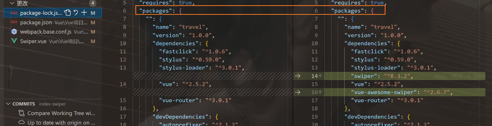
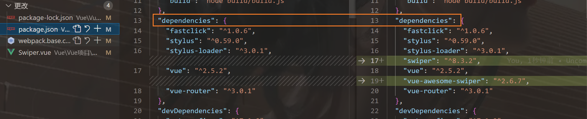
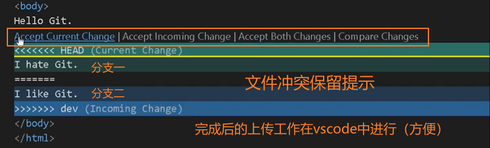
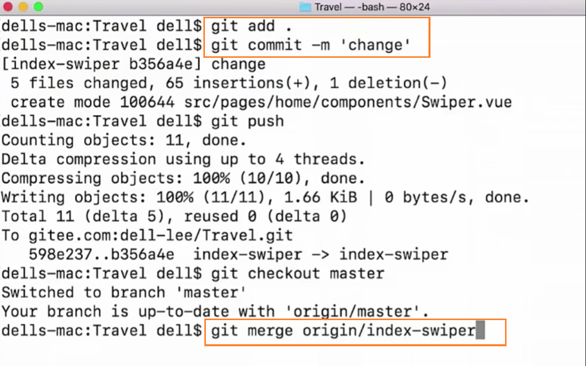
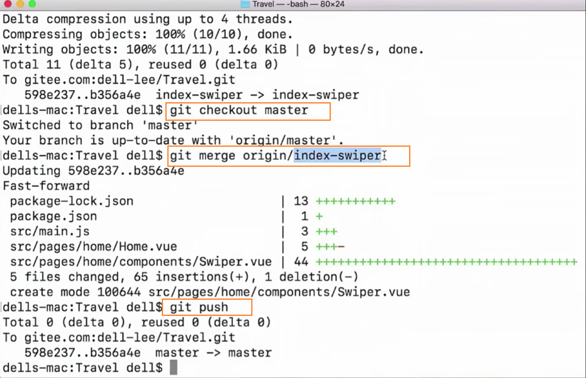

```html
9月10日 【Ben】

遇到的问题
【问题】
1. 【git】在把开发分支合并到主分支（git merge）的时候 遇到文件冲突conflict 
2.复制了src源代码/package文件/bulid文件/config文件到本地备份仓库 但无法运行？
3..icons >>> .swiper-container 像这种 >>> 穿透要学一下 bu'dong

【解决】
1.在vscode有友好提示见下图  可以设置以开发分支为主进行冲突保留或者以主分支为主进行冲突保留 或者干脆都保留的设置
点击完后再到【源代码管理】将刚刚修改完冲突的文件进行暂存 再一起git push

master分支放置的是我们项目功能的一个最新代码 而开发分支（例如 index-swiper）放置的是我们开发的具体功能 开发完成时候的代码 
我们通常实际开发中 会新建一个开发分支进行开发测试 当程序测试没问题后 再合并到主分支 这样才是真正在企业工作的一个流程

2.缺失node_modules相关插件 因为我们项目开发时 会安装一些新的插件 这些插件保存在根目录的node_modules文件夹里
我们同样需要在备份项目仓库进行npm install XXX@#.#.# --save 命令进行插件安装 方能启动项目

3.快去熟悉vscode【merge合并】 进行开发分支代码合并到master分支上 git bash一点也不想用了......

今日小结
1.【vue-去哪儿网】学习了xxx
2.【vue-去哪儿网】7-3看到了第xx集
3.// 函数括号前面缺少空格会报错mmp
4.git checkout index-swiper 切换到index-swiper分支
5.骗子 已安装的插件明明就可以直接安装其他版本进行覆盖 还说要先uninstall才能再安装 (￢︿̫̿￢☆)
6.有时候通过拷贝视频源码的文件过来运行时 要注意有哪些东西是还没创建或引用的 
不然会报错喔 视频进度（进度不完整）和视频源码（进度完整）进度不同 有可能缺少图片、插件 等等
7.项目启动了 不用时要记得ctrl+C 退出项目
8.单纯只是eslint的书写规范问题 项目还是可以跑起来的

明日计划
1.【vue-去哪儿网】学到第xx集
```

​	

参考文章

[Custom elements in iteration require ‘v-bind:key‘ directives vue/valid-v-for](https://blog.csdn.net/weixin_42103983/article/details/108501298?ops_request_misc=%257B%2522request%255Fid%2522%253A%2522166279468916800180680014%2522%252C%2522scm%2522%253A%252220140713.130102334.pc%255Fall.%2522%257D&request_id=166279468916800180680014&biz_id=0&utm_medium=distribute.pc_search_result.none-task-blog-2~all~first_rank_ecpm_v1~pc_rank_34-1-108501298-null-null.142^v47^pc_rank_34_default_2,201^v3^add_ask&utm_term=vue%20Custom%20elements%20in%20iteration%20require%20v-bind%3Akey%20directives&spm=1018.2226.3001.4187)

​	

npm install swiper vue-awesome-swiper@2.6.7 --save





​	

查看上图 swiper的版本太高 import 的路径和swiper插件的目录不符（目录结构发生了变化）所以会报错，但我根据目录结构修改了import路径但还是不行 不知道是不是版本高的问题了

```shell
swiper@3.4.2

npm install swiper swiper@3.4.2 --save-dev
```

​	

【问题一】



​	

代码上传的详细过程





