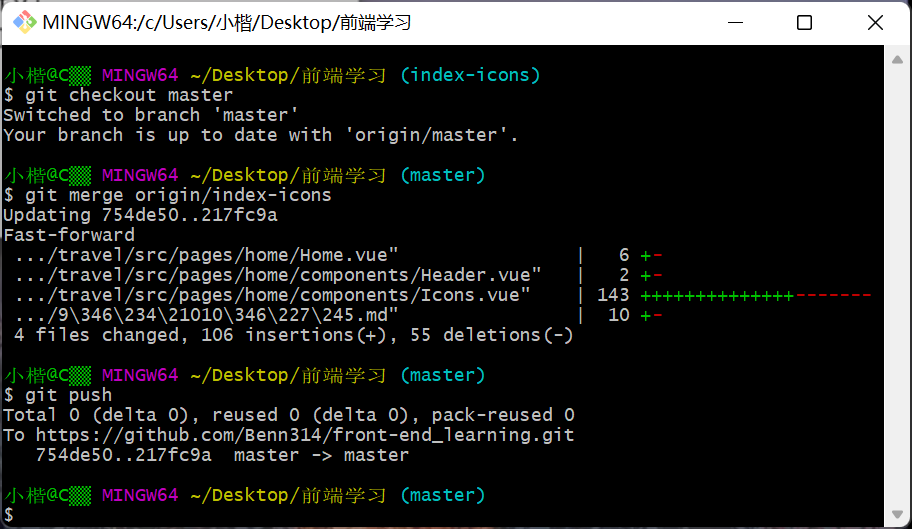

```html
9月11日 【Ben】

遇到的问题
1.overflow 温习一下~
2.相对定位和绝对定位 温习一下~

今日小结
1.【vue-去哪儿网】学习了xxx
2.【vue-去哪儿网】7-6看到了第xx集
3.由于系统屏幕缩放为150% 所以调试的样式和视频里的看到不一样 不过F12打开调试器 屏幕缩放就会变回100% 显示正常
4.http链接地址的乘号× 是用英文字母 x 替代的 例如: 
http://img1.qunarzz.com/sight/source/1505/9f/f585152825459.jpg_r_640x214_5d46e4cc.jpg
5.git checkout 分支名 是用来切换分支的 切换分支前请先git push干净
6. `git checkout .` 放弃所有工作区的修改 
7.我们在切换分支时 可以把项目文件全部关闭 特别是md文件 不然每次都要保存 而且有时md的asset文件会消失不见 图片加载不出
8.npm install axios@0.17.1 --save 安装axios
9.对git merge处理conflict越来越熟悉 记得修改保存冲突文件后 加入暂存区一起git push呀！
10.当我们改动了配置项文件的时候 要重启服务器
11.
Swiper.vue 图片不会自动轮播

Icons.vue 图标会自动轮播 内部设定了几秒后进行下一页 不知道哪里改时间
    <swiper :options="swiperOption">
        ...
    </swiper>

<script>
export default {
  name: 'HomeIcons',
  props: {
    list: Array
  },
  // data函数返回值是真正数据的内容
  data () {
    return {
      swiperOption: {
        autoplay: false	//设置不要自动翻页
      }
    }
  }
}
</script>

12.把通用的属性定义变量在styl文件里 这样方便我们维护和统一修改
13.子组件的名称写成驼峰式 是为了在template标签中解析时 大写字母能解析出 `-`  
14.每一次git merge 都会合并开发分支和主分支的代码 这时如果我们有打开的文件 那么这将是一个新的未保存文件 可以选择覆盖或丢弃
只要没有conflict 丢弃是完全没问题的 否则选择覆盖就好了 覆盖前请先检查源代码是否有缺漏

明日计划
1.【vue-去哪儿网】学到第xx集
```

​	

一次过 赞噜



​	

### Your authorization URL:（GitLens）

[vscode://eamodio.gitlens/did-authenticate?gkstate=373c04be-29d7-45d8-a765-74d37b5ae72a&windowId=1&code=596b485075a8cd465902787ccfb1e224ff4f7ccd&referrer=gitlens](vscode://eamodio.gitlens/did-authenticate?gkstate=373c04be-29d7-45d8-a765-74d37b5ae72a&windowId=1&code=596b485075a8cd465902787ccfb1e224ff4f7ccd&referrer=gitlens)

