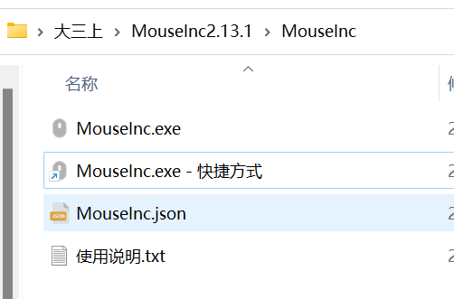

```html
9月12日 【Ben】

遇到的问题
1.  .border-topbottom
    &:before
      border-color: #ccc
    &:after
      border-color: #ccc
  .border-bottom // 加下边线
    &:before
      border-color: #ccc
不懂样式含义 查一下

2.z-index: 1
不懂样式含义 查一下

今日小结
1.【vue-去哪儿网】学习了
2.【vue-去哪儿网】8-3看到了
3.直连是不翻墙上网 global是翻墙上网
4.编辑策略组和编辑规则 是clash软件最强大的地方 可以根据域名后缀匹配你所设定的规则进行科学上网 如果只是简单的翻墙这两个功能就不用编辑
5.npm install better-scroll@1.8.1 --save
6.有点尴尬 better-scroll是鼠标拖拽滚动效果 我以为是滚轮效果... 我就说为什么要把滚轮效果禁用掉嘛
7.在每次写完项目代码时 做git操作请先把所有与项目有关的文件关闭(例如：做笔记的md)，这样才不用去管保存覆盖问题 切换分支时请检查好是否还有文件未上传 文件上传的是否为想要上传的分支
8.如果获取的数据是数组 而我们需要的是标准的dom元素或选择器 那么只需要加数组下标值 `数组名[0]` 便可以
9.在控制台 vue文件用window.onload 修改不了vm实例的属性值 
中
明日计划
1.【vue-去哪儿网】学到第xx集
```

​	

咱就是说 MouseInc 简直不要太好用

- 左侧边调节音量 右侧边调节亮度
- 浏览器中鼠标右键上划回到顶部 下划回到底部
- 顺时针一圈正方形 OCR文字识别并复制
- 逆时针半圈圆 打开计算器
- 右斜上45度 窗口最大化/还原
- 左斜下45度 窗口最小化
- chrome 画P 是无痕模式
- chrome 画R 是扩展程序
- 其余好用功能已有鼠标编程键代替



​	

vscode快速打开/关闭终端 ctrl + `  （反引号）
