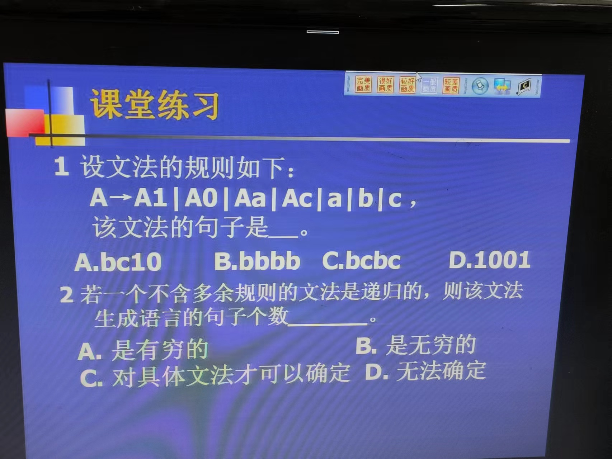

```html
9月5日 【Ben】

遇到的问题
【问题】
1.解决安装vmtools后无法全屏的原因

【解决】
1.① 快捷键 ctrl shift enter
② 工具栏【查看】-【自动调整大小】-将居中改为【自动适应客户机】之前改动到了

今日小结
1.【vue-去哪儿网】学习了xxx
2.【vue-去哪儿网】4-7看到了第xx集
3.我们为什么需要缓存？假设我们有一个性能开销比较大的计算属性 **A**，它需要遍历一个巨大的数组并做大量的计算。然后我们可能有其他的计算属性依赖于 **A**。如果没有缓存，我们将不可避免的多次执行 **A** 的 getter！如果你不希望有缓存，请用方法来替代。
总而言之：为什么需要缓存？ 减少性能消耗
4.找到了之前大二上很喜欢的一个网站主题，原来是基于hexo建站的NexT.Gemini主题
5.在markdown中新建任务清单
① 使用快捷键 ctrl shift X
② 使用语法 - [ ] 
6.当你打开一个terminal时，操作系统会将terminal和shell关联起来，当我们在terminal中输入命令后，shell就负责解释命令。
7.Vue2官方文档 【模板语法】看到了【计算属性和侦听器】(计算属性)
 
明日计划
1.【vue-去哪儿网】从4-7学到5-5
```


# git push前请先git pull

开发过程中 如果要推送代码到远程仓库，请先git pull。养成好习惯。

原因很简单，在你开发过程中，你的同事可能也在改代码然后他提交了没通知你，你直接git push很容易造成代码冲突，代码冲突解决也简单，可万一你手哆嗦点错了或者项目很大结构很复杂点了不该点的，后面结果谁也说不好，所以为了保险起见，每次都先git pull再git push。git pull提示有冲突，很简单，把冲突的文件（是你自己做的那份复制里面的内容到记事本，确保你写的东西不会丢失）之后按它提示的来合并，它合并完之后,再提交

​	

​	

© 2019 欧阳/Ouyang

Powered by [Hexo](https://hexo.io/) v3.8.0

 | 

Theme – [NexT.Gemini](https://theme-next.org/) v7.0.1


[VMware Tools安装](https://blog.csdn.net/love20165104027/article/details/83377758)

解决安装vmtools后无法全屏的原因


---

1、终端（terminal）
终端（termimal），作用是提供一个命令的输入输出环境，在linux下使用组合键ctrl+alt+T打开的就是终端。

2、shell
shell是一个命令行解释器，是linux内核的一个外壳,负责外界与linux内核的交互。shell接收用户或者其他应用程序的命令, 然后将这些命令转化成内核能理解的语言并传给内核, 内核执行命令完成后将结果返回给用户或者应用程序。当你打开一个terminal时，操作系统会将terminal和shell关联起来，当我们在terminal中输入命令后，shell就负责解释命令。

原文链接：https://blog.csdn.net/weixin_38214171/article/details/90050340

---


​	

# 编译原理作业 

课本第八页练习 1-1 1-2 1-3  还有下面两道




任务清单

- [ ] 操作系统学习通作业

- [ ] 

​	

# 嵌入式

固态硬盘

- 固态颗粒  SLC MLC QLC TLC 了解一下


