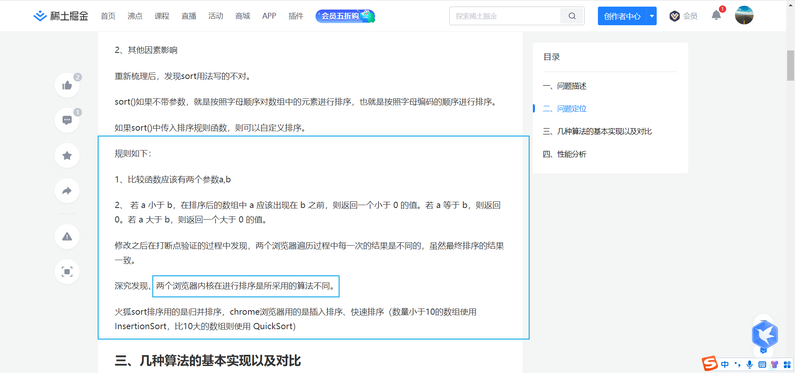
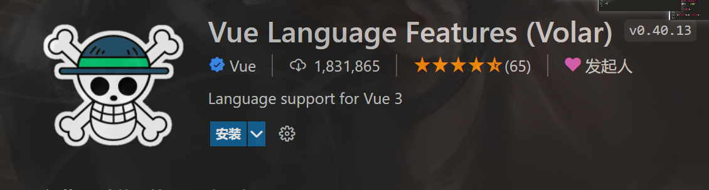
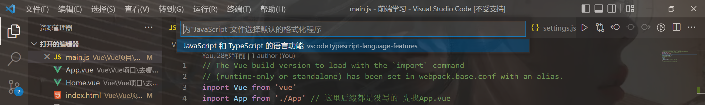
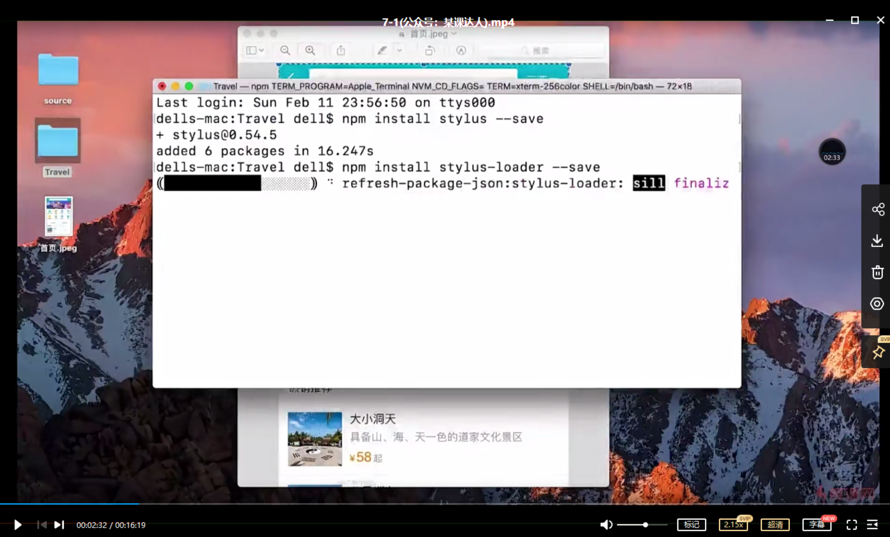

```html
9月8日 【Ben】

遇到的问题
【问题】
1.js数组里面的sort函数的回调函数参数a和b我传参5，4，照视频里面的输出结果应该是a为5，b为4，但是只有在火狐上面的结果是这样，Chrome和edge都是4和5，这个是为什么？
2.书写必须符合elint规定的规范来，不然会疯狂error！
规范有：多了分号 缩进 尾句回车 使用单引号 单行注释要空一个空格 多行注释不能空空格 ……
3.有一些eslint规范真的很烦 官方也给了解决方案 可是你一直视而不见...
4.npm 开启了npm run dev以后怎么退出或关闭？
5.现在是9月9日 00：46 第一个vue项目【去哪儿网】崩了.....。升级了webpack版本 导致了版本的不兼容 死活npm error 艹
6.// 不知道为什么style里的这三个css文件运行会报错 找不到dependency依赖
// 原因 视频源码的css文件的存放路径跟你不同 所谓的dependency依赖 就是没找到这个文件

【解决】
1.如下图 排序规则的问题（浏览器不同排序规则有所不同）但还是不清楚是不是指明规则前会默认先升/降序排列？不过结果是对的就好了，过程其实也没那么重要 别钻牛角jian 先建立前端知识体系
2.关闭保存时自动格式化代码 在设置的format-格式化里关闭
3.You may use special comments to disable some warnings.
Use // eslint-disable-next-line to ignore the next line.
Use /* eslint-disable */ to ignore all warnings in a file.
您可以使用特殊注释来禁用一些警告。
使用// eslint-disable-next-line忽略下一行。
使用/* eslint-disable */忽略文件中的所有警告。
4.ctrl + c，就可以了
Terminate batch job 终止批处理作业
5.npm install fastclick --save
6.npm install stylus --save
7.npm install stylus-loader@3.0.1 --save (查看视频源码的stylus-loader插件版本为3.0.1 所以对此进行安装 版本太高会跟webpack版本不兼容 安装失败)
8.这次学乖了 把前面成功安装的版本在别处进行一个备份 失败了还可以恢复前一版本[累/doge]

今日小结
1.【vue-去哪儿网】学习了项目环境配置、项目代码结构介绍（各文件的作用）、单文件组件与Vue中的路由、多页应用 VS 单页应用、项目代码初始化
2.【vue-去哪儿网】6-2看到了6-5
3.兼容是测试的事情 有bug了再说
4.项目启动在travel中的终端使用npm run dev/start命令
5.ctrl + C 是终止项目运行

明日计划
1.【vue-去哪儿网】学到7-4
```

​	



​	

vscode的插件推荐



​	

因为prettier的格式化对vue不友好 会变单引号为双引号 乱加分号

所以学vue期间被我禁用 有需要可以换回来



​	

视频进度



