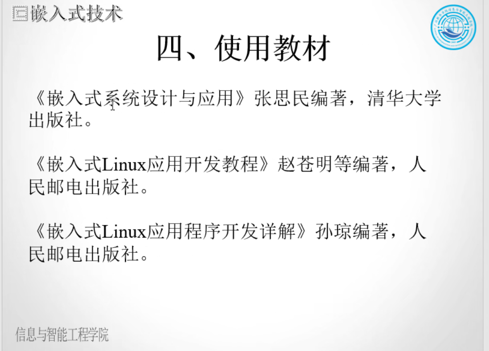

```html
8月29日 【Ben】

遇到的问题
【问题】
1.【雷蛇音频】 7.1 Surround Sound扬声器没有音量输出问题

【解决】
1.要有7.1环绕声 需要先在驱动选定电脑的默认输出设备（只有一个也要先选中才能启动） 然后在音量设置中选定输出设备为 7.1 Surround Sound

今日小结
1.【vue】学习了v-show v-if v-bind 图片切换
2.【vue】P11看到了P14

明日计划
1.【】学到第xx集
```

​	


​	


虚拟机安装包 记得安装

​	

---

> Ubuntu

链接：https://pan.baidu.com/s/1IjGQCM7-s59VSmKinvaWug?pwd=mlst 
提取码：mlst

---

​	


​	

## 什么是 XML？

- XML 指可扩展标记语言（EXtensible Markup Language）。
- XML 是一种很像HTML的标记语言。
- XML 的设计宗旨是传输数据，而不是显示数据。
- XML 标签没有被预定义。您需要自行定义标签。
- XML 被设计为具有自我描述性。
- XML 是 W3C 的推荐标准。

------

## XML 和 HTML 之间的差异

XML 不是 HTML 的替代。

XML 和 HTML 为不同的目的而设计：

- XML 被设计用来传输和存储数据，其焦点是数据的内容。
- HTML 被设计用来显示数据，其焦点是数据的外观。

HTML 旨在显示信息，而 XML 旨在传输信息。

​	

​	

## [DOM 和 JavaScript](https://developer.mozilla.org/zh-CN/docs/Web/API/Document_Object_Model/Introduction#dom_和_javascript)

上面简短的示例和这个参考文档中几乎所有的示例一样，都使用了[JavaScript](https://developer.mozilla.org/zh-CN/docs/Web/JavaScript)。也就是说，它虽然是用 JavaScript 编写的， 却可以通过 DOM 来访问文档和其中的元素。DOM 并不是一个编程语言，但如果没有 DOM， JavaScript 语言也不会有任何网页，XML 页面以及涉及到的元素的概念或模型。在文档中的每个元素— 包括整个文档，文档头部， 文档中的表格，表头，表格中的文本 — 都是文档所属于的文档对象模型（DOM）的一部分，因此它们可以使用 DOM 和一个脚本语言如 JavaScript，来访问和处理。

开始的时候，JavaScript 和 DOM 是交织在一起的，但它们最终演变成了两个独立的实体。JavaScript 可以访问和操作存储在 DOM 中的内容，因此我们可以写成这个近似的等式：

API (web 或 XML 页面) = DOM + JS (脚本语言)

​	


​	



​	


