---

# 红宝书路线

## 红宝书

有些章节并不是第一遍就要通读，例如第18章第一遍可以直接略过(它是独立的内容)
第二有些章节需要简化去阅读，例如第二章
第三 有些章节需要打乱顺序去阅读，第四，，七，九章(阅读vue3/react源码进度也会很快) 第一遍别死磕
第四 有些需要代码负责理解 例如第11章promise 如果能手写一个promise 理解会很快

### 1 倔强青铜

像js历史，位运算 第一遍都不需要深究

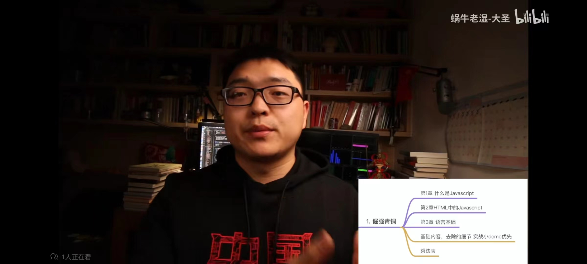

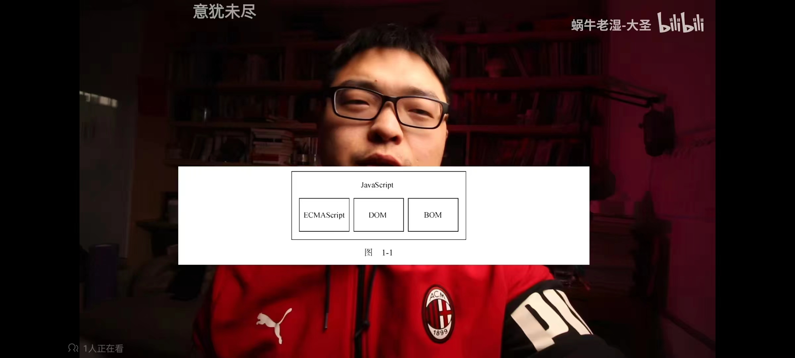

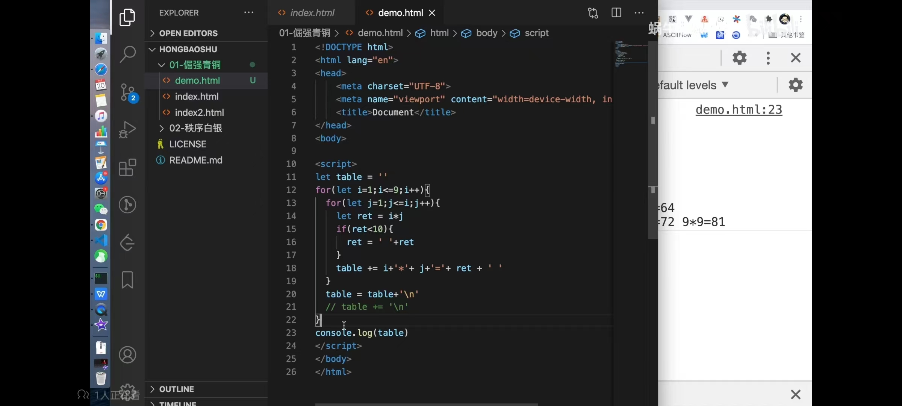

​	

### 2 秩序白银

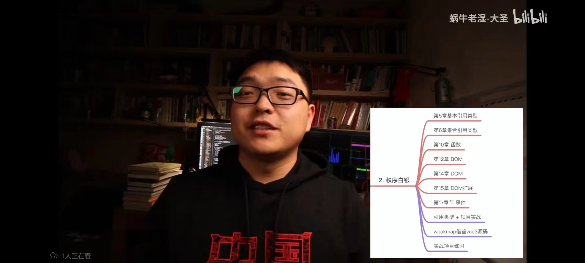

项目驱动-todolist和vue3源码来帮助学习掌握
math函数库记住这个图片就好了

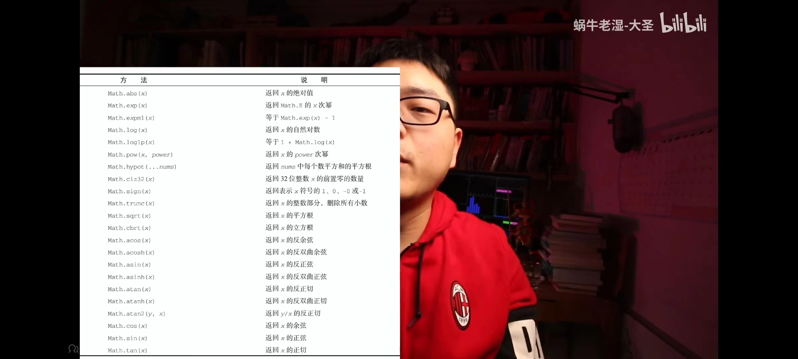

clock实现

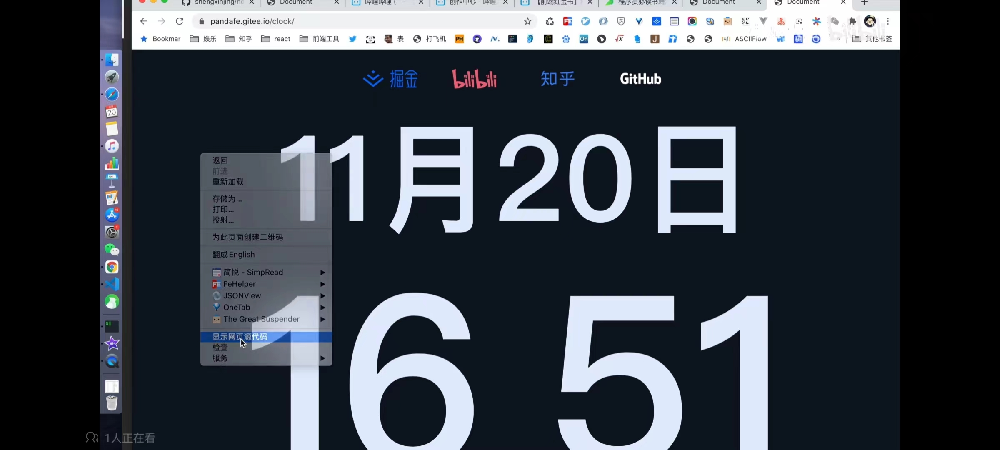

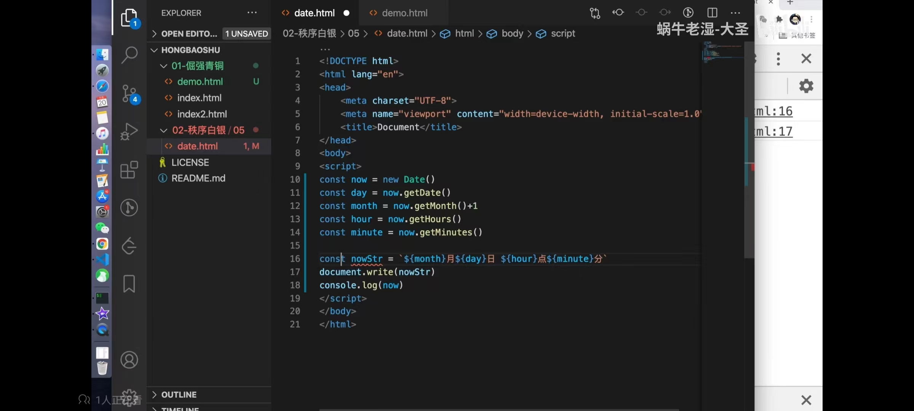

​	

### 3 荣耀黄金

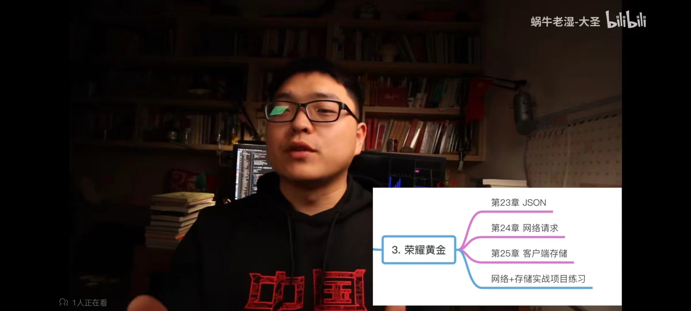

​	

### 4 尊贵铂金

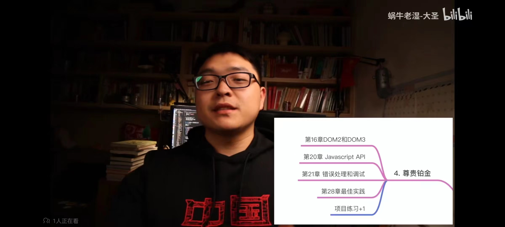

升级todolist demo 通过dom和api

​	

### 5 永恒钻石

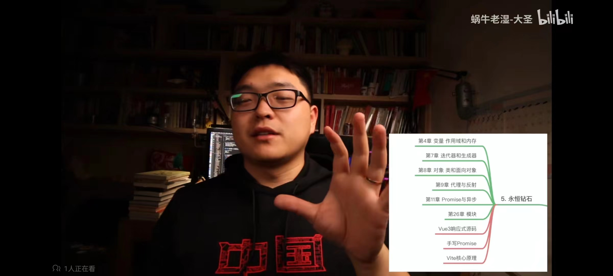

​	

### 6 Other

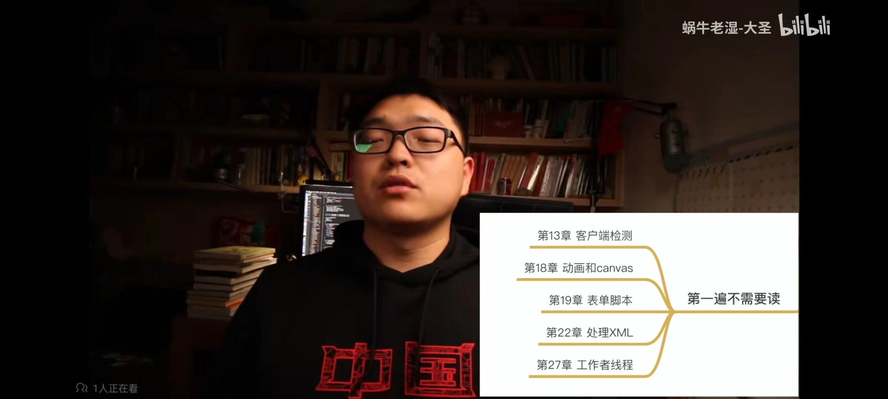

正则可以看这个

set 没有重复数据的Array